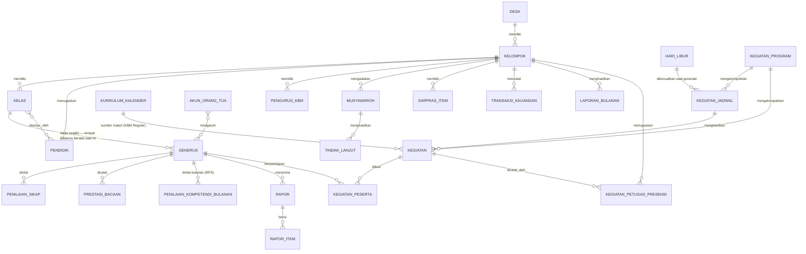
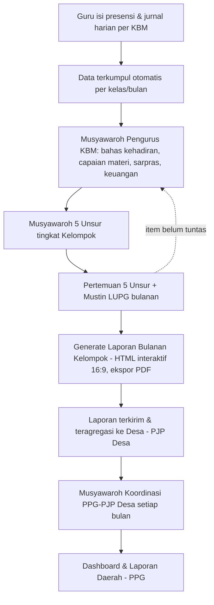

# PRD — Aplikasi Pendataan & Pelaporan Rutin PPG (Penggerak Pembina Generus)

**Nama kerja produk:** SI-PPG (Sistem Informasi Pembinaan Generus) — nama dapat diganti sebelum development dimulai.

**Versi dokumen:** 1.12
**Tanggal:** 12 Agustus 2026
**Disusun berdasarkan:** `PPG/Buku_Panduan_PPG_BS1.md`, contoh laporan `PPG/Laporan/LAP. MUSTIN LUPG_PDJ_JULI 2026.pptx`, kalender materi `PPG/Materi Harian/*.xlsx`, form-form administrasi baku (rapor, daftar hadir, jurnal harian, lembar penghubung, lembar penilaian sikap, lembar prestasi bacaan), dan contoh format rapor asli `PPG/Laporan/LAPORAN HASIL BELAJAR.pdf` + `PPG/Laporan/REKAP PEMBELAJARAN SEMESTER.pdf` (lihat §9.9).

> **Catatan genericity:** Dokumen sumber di atas berasal dari PPG Daerah Bandung Selatan 1 (mayoritas) dan PPG Daerah Jakarta Selatan 1/Kelompok Pondok Jaya (contoh rapor §9.9), dipakai sebagai *studi kasus/acuan konkret*. Namun struktur organisasi (Daerah → Desa → Kelompok/KBM) dan seluruh alur di bawah ini bersifat generik — "Daerah" adalah **nama entitas level tertinggi yang dapat diisi/diganti sesuai Daerah PPG masing-masing** (bukan khusus satu Daerah tertentu), sehingga aplikasi ini bisa dipakai oleh Daerah PPG mana pun tanpa perubahan desain. Fakta bahwa dua Daerah berbeda (Bandung Selatan 1 dan Jakarta Selatan 1) memakai format formulir yang sama persis (kategori A–G, skala penilaian 4 tingkat) memperkuat asumsi ini: formulir tsb tampaknya format baku organisasi tingkat nasional, bukan spesifik satu Daerah.

---

## 1. Latar Belakang

PPG (Penggerak Pembina Generus) di tingkat Daerah mengelola pembinaan generasi penerus (generus) mulai usia PAUD sampai Pra-Nikah (GPN-B, 23–30 tahun belum menikah), berjenjang dari tingkat **Daerah (PPG) → Desa (PJP Desa) → Kelompok (PJP Kelompok/KBM)**. Setiap jenjang wajib melakukan pendataan rutin (sensus, presensi, penilaian, sarpras, keuangan) dan pelaporan rutin (musyawaroh bulanan, laporan Mustin LUPG, rapor semester) sebagaimana diatur dalam Buku Panduan PPG (acuan: Buku Panduan PPG Daerah Bandung Selatan 1, Bab II–V).

Saat ini seluruh proses tersebut dikerjakan **manual berbasis file** (Excel untuk kalender materi/sensus/lembar prestasi, PowerPoint untuk laporan bulanan). Ini menimbulkan masalah:

1. **Data tersebar** — sensus, presensi, jurnal harian, penilaian sikap, dan keuangan masing-masing ada di file/format berbeda, tidak saling terhubung.
2. **Kerja duplikat** — data yang sama (misalnya nama generus, kategori usia) diketik ulang di banyak dokumen (daftar hadir, sensus, rapor, laporan bulanan).
3. **Rekap & grafik manual** — persentase kehadiran, grafik per kategori (ACR/APR/AR/GPN), dan status "29 Karakter" dihitung dan digambar manual tiap bulan di PPTX (lihat Slide 3, 10–14, 15–26 contoh laporan).
4. **Tindak lanjut musyawaroh mudah hilang** — hasil musyawaroh bulan lalu (pokok masalah → keputusan → PIC → status) harus disalin manual ke laporan bulan berikutnya sebagai pembanding (lihat Slide 37–42: "Evaluasi Mustin Mei" vs "Resume Mustin Juni").
5. **Tidak ada visibilitas berjenjang** — PPG Daerah sulit memantau kondisi real-time semua KBM se-desa tanpa menunggu laporan bulanan dikumpulkan manual.
6. **Riwayat/histori sulit ditelusuri** — perkembangan generus per individu (kehadiran, hafalan, sikap, capaian materi) tidak terekam longitudinal, hanya snapshot per semester (rapor kertas).

## 2. Tujuan Produk

1. Menyediakan **satu sumber data** (single source of truth) untuk seluruh data generus, pendidik, pengurus, dan kelompok (KBM) se-Daerah.
2. Mendigitalkan pendataan rutin: sensus, presensi harian, jurnal mengajar, penilaian sikap, prestasi bacaan/hafalan, sarpras, dan keuangan — cukup diinput sekali di sumbernya (level KBM/kelas).
3. **Meng-otomasi rekap & laporan** bulanan/semester (persentase kehadiran, grafik, monitoring 29 karakter, rapor) sehingga tidak perlu disusun ulang manual di PPTX/Excel setiap bulan.
4. Mendukung **alur musyawaroh berjenjang** (Musyawaroh Pengurus KBM → Musyawaroh 5 Unsur → Pertemuan 5 Unsur → Musyawaroh PPG-PJP Desa) dengan notulen terstruktur dan tindak lanjut yang otomatis terbawa (carry-over) ke bulan berikutnya sampai berstatus selesai.
5. Memberi **dashboard berjenjang** (Kelompok → Desa → Daerah) agar PPG bisa memantau kondisi semua KBM tanpa menunggu laporan manual.
6. Tetap menghasilkan **output familiar** (rapor, laporan Mustin dalam format HTML interaktif ala slide 16:9 dengan ekspor PDF, Excel sensus) yang bisa dicetak/dibagikan ke pihak yang belum pakai aplikasi (mis. Kyai/Imam kelompok), dan memberi **orang tua akun sendiri sejak awal** untuk memantau anaknya langsung tanpa menunggu laporan kertas.

## 3. Non-Tujuan (Out of Scope, minimal untuk fase awal)

- Tidak menggantikan kurikulum/konten pembelajaran itu sendiri — aplikasi hanya menjadwalkan & mencatat realisasi materi, bukan membuat kurikulum baru.
- Tidak mengelola pembayaran/keuangan tingkat Daerah secara penuh (hanya pencatatan shodaqoh/kas KBM level sederhana di fase awal).
- Tidak ada modul e-learning/video pembelajaran untuk generus di fase awal.
- Tidak menangani proses pendaftaran/administrasi pernikahan itu sendiri — hanya pencatatan status progres sebagai item monitoring.

## 4. Istilah & Singkatan (Glosarium)

| Istilah | Arti |
|---|---|
| PPG | Penggerak Pembina Generus (tingkat Daerah) |
| KBM | Kelompok Belajar Mengajar (satuan pendidikan di tiap kelompok) |
| Generus | Generasi Penerus (santri/siswa binaan, usia 3–30 tahun belum menikah) |
| 5 Unsur | Kyai, Pengurus, Muballigh/Muballighot, Pakar Pendidik, Orang Tua |
| MT / MS | Muballigh Tugasan / Muballigh Setempat (tenaga pengajar) |
| LUPG | Lima Unsur Pembina Generus |
| Mustin | Musyawaroh Rutin (LUPG tingkat kelompok, bulanan) |
| PAUD-A / PAUD-B | Pendidikan Anak Usia Dini kelompok A (3–4 th) / B (4–5 th) — dua kategori usia terpisah |
| ACR / APR / AR | Anak Cabe Rawit (Dasar 1–6) / Anak Pra Remaja (Menengah 7–9) / Anak Remaja (Lanjutan 10–12) — istilah lapangan untuk kategori usia |
| GPN-A / GPN-B | Generus Pra-Nikah kelompok A (19–22 th, materi Lanjutan 4 s.d. Lanjutan 6) / B (23–30 th, belum menikah) |
| Generus Setempat | Generus yang tinggal berdekatan dengan orang tua — flag klasifikasi, orang tua berperan langsung sebagai kontak konfirmasi hasil KBM |
| Generus Pendatang | Generus yang tinggal jauh dari orang tua karena kuliah/kerja (umumnya jenjang GPN) — flag klasifikasi, orang tua tetap bisa memantau lewat Portal Orang Tua, atau kontak konfirmasi hasil KBM dapat diwakilkan ke PJP/Guru di Kelompok tempat Generus aktif |
| PJP | Penanggung Jawab Program — ada di tingkat Desa (PJP Desa) & Kelompok (PJP Kelompok) |
| Petugas Presensi Kegiatan | Penugasan **per Kegiatan** (bukan akun peran permanen) — ditunjuk oleh tiap Kelompok peserta untuk mencatat kehadiran generus dari kelompoknya sendiri pada Kegiatan tingkat Desa/Daerah (§9.12); bisa diberikan ke Generus, bukan hanya pengurus |
| Sarpras | Sarana dan Prasarana |
| Kegiatan Insidental | Kegiatan yang dicatat satu per satu, tanpa pola berulang tetap (mis. jadwalnya kadang satu hari kadang beberapa hari) — pola pencatatan Kegiatan sejak Fase 1, tetap tersedia di Fase 2 (§9.12) |
| Jadwal Kegiatan Berulang | Definisi pola Kegiatan **Rutin** (Fase 2) yang otomatis menghasilkan banyak kejadian Kegiatan sekaligus — **Rutin Harian** (hari tertentu tiap minggu, mis. Senin–Kamis) atau **Rutin Bulanan** (kombinasi hari + minggu-ke tertentu tiap bulan, mis. "Sabtu minggu ke-2 & ke-4"), berbeda dari Kegiatan Insidental (§9.12) |
| Munaqosah | Ujian kenaikan/kelulusan materi |
| Turba | Turun ke Bawah (kunjungan lapangan) |
| 29 Karakter | Standar karakter/akhlak generus yang dimonitor per jenjang **di laporan Mustin LUPG tingkat Kelompok** (Slide 15–26, §9.13) — beda dari kategori kompetensi per-individu di Rapor (§9.9), keduanya sama-sama soal karakter/akhlak tapi di level agregasi & formulir yang berbeda |
| RPS | Rekap Pembelajaran Semester — formulir pencatatan bulanan capaian Kompetensi Dasar per Generus (nilai huruf A–D), cikal bakal Rapor semester (§9.9) |
| Kompetensi Dasar | Item capaian materi terkecil yang dinilai di RPS/Rapor (mis. "Melafalkan Bacaan Idgham Bighunnah"), dikelompokkan dalam Materi → Kategori (mis. Alim → Bacaan → ...) |
| Skala Penilaian RPS/Rapor | 4 tingkat: **A/Berbakat (91–100)**, **B/Menguasai (81–90)**, **C/Berkembang (71–80)**, **D/Perlu Peningkatan (61–70)** — RPS memakai huruf per bulan, Rapor menampilkan label yang sama sebagai checklist akhir semester |

## 5. Struktur Organisasi & Hierarki Data

```
Daerah (PPG) — nama Daerah dikonfigurasi saat setup, mis. "Jakarta Selatan 1"
  └─ Desa (PJP Desa) ── beberapa Desa
       └─ Kelompok / KBM (PJP Kelompok) ── beberapa Kelompok per Desa
            └─ Kelas (per jenjang usia: PAUD-A, PAUD-B, Dasar 1-6/ACR, Menengah 7-9/APR, Lanjutan 10-12/AR, GPN-A, GPN-B)
                 └─ Generus — anggota satu kelas, satu KBM
```

Hierarki ini menjadi **tulang punggung akses data**: laporan & dashboard di level atas adalah agregasi dari level di bawahnya (lihat §9.15 & §11).

**Catatan penomoran & materi:** Menengah dan Lanjutan memakai penomoran kelas berkelanjutan mengikuti jenjang sekolah formal (Dasar 1-6 setara SD, Menengah 7-9 setara SMP, Lanjutan 10-12 setara SMA) agar selaras dengan struktur file `Materi Harian/*.xlsx`. Lanjutan 10-12 memakai materi kalender "Lanjutan 1 s.d. Lanjutan 3"; GPN-A memakai materi kalender "Lanjutan 4 s.d. Lanjutan 6" (lanjutan langsung dari materi Lanjutan 10-12, tanpa kelas/jenjang baru). GPN-B tidak punya materi kalender formal tersendiri.

**Catatan Generus Pendatang:** Generus — baik **Setempat** maupun **Pendatang** — tercatat pada **satu Kelompok/Kelas saja**: tempat mereka secara fisik berada & mengaji **saat ini**. Kelompok tsb yang menjadi penanggung jawab tunggal pembinaan & sensus (§9.2); **tidak ada perbedaan mekanisme pembinaan** antara keduanya — presensi, jurnal, penilaian, dan pemantauan berjalan dengan cara yang sama, di Kelompok manapun mereka berada. **Status Domisili (Setempat/Pendatang) tidak menentukan Kelompok penanggung jawab** — perannya murni **flag untuk mengklasifikasikan siapa kontak yang bisa dikonfirmasi terkait hasil KBM** Generus tsb: **Setempat** → orang tua berperan langsung sebagai kontak (tinggal berdekatan); **Pendatang** (umumnya jenjang GPN, karena kuliah/kerja jauh dari orang tua) → orang tua tetap bisa memantau dari jarak jauh lewat Portal Orang Tua (§9.18), atau kontak konfirmasi lokal dapat diwakilkan ke **PJP atau Guru** di Kelompok tempat Generus tsb aktif. Detail field & dampaknya ke sensus, presensi, dan program monitoring (Turba) ada di §9.1, §9.2, dan §9.12.

**Catatan Kelas vs Jenjang:** diagram di atas menyederhanakan "Kelas" sebagai satu baris per jenjang usia — itu tetap benar untuk **pembinaan/KBM/presensi** (basis tunggal Generus, §9.4/§9.12), karena keterbatasannya tetap per-jenjang. Tapi secara administratif, satu Kelas **fisik** di lapangan bisa menampung >1 jenjang sekaligus (mis. "Kelas ACR A" mengajarkan Dasar 1 & Dasar 2 bersamaan) kalau jumlah Guru/Muballigh Tugasan/Muballigh Setempat di Kelompok tsb terbatas. Master Data menyediakan keduanya secara terpisah: **Jenjang** (katalog usia global, dipakai KBM/presensi seperti biasa) dan **Kelas** (pengelompokan administratif per Kelompok yang bisa menggabungkan beberapa Jenjang, dipakai untuk pelaporan) — lihat §9.1.

**Catatan Kegiatan lintas-tingkat:** berbeda dari hierarki data master di atas (yang bersifat tetap — satu Generus selalu berada di satu Kelompok), **Kegiatan** (§9.12) bersifat lintas-tingkat: satu Kegiatan diselenggarakan pada salah satu dari tiga tingkat (Kelompok/Desa/Daerah), dan pesertanya adalah gabungan Generus dari seluruh Kelompok/Desa yang berada **di bawah** tingkat penyelenggara tsb (mis. Kegiatan tingkat Desa diikuti generus dari beberapa Kelompok se-Desa) — lihat aturan lengkap peserta, petugas presensi, dan frekuensi di §9.12.

## 6. Pengguna & Peran (Roles)

> **Sumber acuan lengkap:** tabel di bawah adalah ringkasan. Pemetaan lengkap tiap jabatan Buku Panduan ↔ role sistem ↔ permission ↔ fase pembangunan ada di `docs/Struktur-Organisasi-dan-Role.md` §"Matriks Peran (Role) per Tingkat" — dokumen itu yang jadi sumber kebenaran detail teknis (role slug, nama permission, aturan multi-akun per lokasi); PRD ini hanya menyalin levelnya untuk konteks produk.

**Keputusan produk:** setiap jabatan pada struktur organisasi (Buku Panduan PPG, Bab II) mendapat akun akses sendiri — tidak ada jabatan yang "hanya data tanpa login", termasuk unsur penasehat (Wanbin/Kyai) dan konsultan (Pakar Pendidik), karena keduanya punya kewenangan/kontribusi nyata dalam alur musyawarah dan pembinaan (lihat detail di dokumen acuan di atas).

### Tingkat Daerah — PPG

| Peran | Hak Akses Utama |
|---|---|
| **Admin Daerah (Ketua/Wakil Ketua PPG)** | Akses penuh semua data se-daerah; kelola master kurikulum & kalender materi; lihat dashboard semua desa/kelompok; setuju/tolak laporan |
| **Wanbin Daerah (Kyai/Wakil Kyai)** | Memimpin & mengesahkan Musyawarah Koordinasi PPG-PJP Desa tingkat Daerah; lihat struktur organisasi & dashboard |
| **Sekretaris PPG** | Notulen musyawarah Daerah; database mubaligh & generus lintas-desa (read-only) |
| **Bendahara PPG** | Rekap Shodaqoh PPG dari Keuangan KBM se-Daerah |
| **Bidang Kurikulum** | Kelola master kurikulum, kalender materi, kompetensi (RPS/Rapor) |
| **Bidang Tenaga Pendidik (Tendik)** | Kelola data & distribusi pendidik se-Daerah |
| **Bidang Penggalang Dana** | Rekap penggalangan dana lintas-desa |
| **Bidang Sarpras** | Rekap ketersediaan sarpras se-Daerah untuk perencanaan pengadaan |
| **Bidang KMM, ORAS, Keputrian, Kemandirian, Tahfidz, BK (Daerah)** | Kelola & pantau program pembinaan sesuai bidangnya masing-masing di seluruh Daerah (dicatat generik lewat modul Kegiatan §9.12 kecuali Tahfidz yang memakai Prestasi Bacaan/Hafalan §9.7; akses BK Daerah ke rekam kasus dibatasi lihat §11.1) |

### Tingkat Desa — PPD

| Peran | Hak Akses Utama |
|---|---|
| **PJP Desa (Koordinator PPD)** | Kelola data semua KBM di desanya; rekap & kirim laporan bulanan desa ke PPG; kelola jadwal diklat/monev desa |
| **Wanbin Desa (Kyai/Wakil Kyai)** | Memimpin Musyawarah 5 Unsur/Pertemuan 5 Unsur tingkat Desa |
| **Sekretaris PPD** | Notulen musyawarah desa, database generus (read-only) |
| **Bendahara PPD** | Rekap Keuangan KBM se-Desa |
| **Seksi KBM Reguler** | Monitoring kepatuhan standar KBM se-desa; dashboard agregasi lintas-Kelompok |
| **Seksi KBM Akselerasi** | Kelola KBM Akselerasi tingkat Desa |
| **Seksi Tahfidz, KMM, Keputrian (Desa)** | Kelola & pantau program pembinaan sesuai seksinya di tingkat Desa |

### Tingkat Kelompok — PPK

| Peran | Hak Akses Utama |
|---|---|
| **PJP Kelompok / Kepala KBM (Koordinator PPK)** | Kelola data kelompoknya: sensus, sarpras, keuangan, notulen musyawaroh KBM/5 Unsur; generate laporan Mustin bulanan |
| **Wanbin Kelompok (Kyai/Wakil Kyai)** | Memimpin Musyawarah Pengurus KBM/Mustin LUPG tingkat Kelompok |
| **Sekretaris KBM** | Input presensi, database santri, notulen musyawaroh |
| **Bendahara KBM** | Input keuangan/shodaqoh, laporan keuangan |
| **Bagian Pembantu Umum** | Sarana pembelajaran harian, kondisi sarpras kelompok |
| **Bagian BK/Konselor** | Input catatan konseling/rekam kasus (akses terbatas/rahasia) |
| **Bagian KMM (Kelompok)** | Kegiatan muda-mudi tingkat kelompok |
| **Guru** | Input jurnal harian mengajar, presensi kelas, penilaian sikap & prestasi bacaan, lembar penghubung mingguan |
| **Wali Kelas** | Peran tambahan di atas akun Guru — administrasi kelas (rekap, koordinasi ke orang tua/sekretaris) |

### Lintas Tingkat

| Peran | Hak Akses Utama |
|---|---|
| **Pakar Pendidik** | Akses konsultatif read-only ke kurikulum & data generus untuk masukan metode pengajaran/pendidikan |
| **Petugas Presensi Kegiatan** | Mencatat presensi generus dari kelompoknya sendiri pada satu Kegiatan tingkat Desa/Daerah tertentu — penugasan **per Kegiatan** (bukan role permanen), ditunjuk oleh PJP Kelompok/Sekretaris KBM, dapat diberikan ke Generus (§9.12) |
| **Orang Tua** | Lihat data & rapor anaknya, isi lembar penilaian sikap orang tua, lembar penghubung, terima notifikasi presensi/kegiatan anak |

Semua peran login dengan akun terverifikasi; data yang sensitif (rekam kasus/konseling) hanya terlihat oleh Bagian BK, PJP Kelompok, dan Admin Daerah — tidak oleh guru kelas lain (lihat §11.1, dan catatan pembatasan Bidang BK Daerah di dokumen acuan matriks role).

## 7. Ruang Lingkup Fitur (Ringkasan Modul)

| # | Modul | Frekuensi Input | Sumber Acuan Dokumen |
|---|---|---|---|
| 1 | Master Data (Daerah/Desa/Kelompok/Kelas/Generus/Pendidik/Pengurus) | Saat onboarding, update berkala | Bab II–IV Buku Panduan |
| 2 | Sensus Generus & Pendidik | Bulanan/Semester | Slide 3 contoh laporan |
| 3 | Kalender & Realisasi Materi Harian | Harian | `Materi Harian/*.xlsx` |
| 4 | Presensi Harian (Generus & Guru) | Harian | Format "Daftar Hadir Siswa dan Guru" |
| 5 | Jurnal Harian Mengajar | Harian | Format "Jurnal Harian" |
| 6 | Penilaian Sikap (diri/ortu/guru) | Berkala (mis. bulanan) | Format "Lembar Penilaian Sikap" |
| 7 | Prestasi Bacaan / Hafalan | Per pertemuan | `Lembar Prestasi Bacaan.xlsx` |
| 8 | Lembar Penghubung Mingguan | Mingguan | Format "Lembar Penghubung" |
| 9 | Penilaian Kompetensi Bulanan (RPS) & Rapor / Laporan Hasil Belajar | Bulanan (RPS) / Semester (Rapor) | `LAPORAN HASIL BELAJAR.pdf`, `REKAP PEMBELAJARAN SEMESTER.pdf` |
| 10 | Sarana & Prasarana (14 item) | Berkala | Slide 27 contoh laporan |
| 11 | Keuangan KBM & Shodaqoh PPG | Bulanan | Bab IV.B.3 & Slide 29 |
| 12 | Kegiatan (Tambahan/Penguatan/Program Khusus: GOMA, GMKM, dsb.) — tingkat Kelompok/Desa/Daerah | Kelompok: rutin terjadwal tahunan; Desa/Daerah: umumnya bulanan (ACR 1–2×/tahun) — **generate otomatis via Jadwal Kegiatan Berulang sejak Fase 2**, §9.12 | Slide 28, 30–34 |
| 13 | Monitoring 29 Karakter | Bulanan per kelas | Slide 15–26 |
| 14 | Musyawaroh & Notulen (KBM → 5 Unsur → Pertemuan 5 Unsur → PPG-PJP Desa) | Bulanan | Bab IV.C.2 & Slide 37–42 |
| 15 | Dokumentasi Foto Kegiatan | Insidentil | Slide 43–46 |
| 16 | Generator Laporan Otomatis (Mustin LUPG bulanan, format HTML interaktif 16:9, ekspor PDF) | Bulanan | Seluruh contoh laporan |
| 17 | Dashboard Berjenjang & Reminder | Real-time | — (kebutuhan baru) |
| 18 | Portal Orang Tua (akun, lihat rapor/presensi anak, isi penilaian & lembar penghubung) | Real-time/mingguan | — (kebutuhan baru) |
| 19 | Mekanisme Offline (idempotent sync, resolusi konflik, cache lokal) | Berkelanjutan | — (kebutuhan baru) |

MVP mencakup modul **1–5, 12, 14 (dasar), 16 (dasar), 17 (dasar), 18 (dasar), 19 (dasar)** — lihat roadmap §14.

## 8. Model Data Inti (Ringkas)



Entitas kunci tambahan: `KURIKULUM_KALENDER` (master kalender materi per Paket/Kelas, **berbasis rentang tanggal kalender literal** — direvisi dari struktur awal "10 Bulan x 5 hari" sekuensial, lihat §9.3) yang menjadi **sumber generate `KEGIATAN`** (KBM Reguler, lewat `KEGIATAN_JADWAL` berpola "Rutin dari Kurikulum") — bukan lagi direferensikan oleh entitas `JURNAL_HARIAN`/`PRESENSI` terpisah, keduanya sudah tidak ada sejak konvergensi Kurikulum-Kegiatan-Presensi (lihat [Visi-Konvergensi-Kurikulum-Kegiatan-Presensi.md](Visi-Konvergensi-Kurikulum-Kegiatan-Presensi.md)); realisasi materi & presensi KBM kini melekat langsung ke `KEGIATAN`/`KEGIATAN_PESERTA`.

`KOMPETENSI_MASTER` (taksonomi Kategori → Materi → Kompetensi Dasar, keyed per **jenjang** sama seperti `KURIKULUM_KALENDER`, bukan per Kelas individual — lihat §9.9) menjadi acuan bagi `PENILAIAN_KOMPETENSI_BULANAN` (RPS) dan `RAPOR_ITEM`, masing-masing menyimpan nilai (huruf A–D untuk RPS, label 4-tingkat untuk `RAPOR_ITEM`) per Generus per Kompetensi Dasar.

`AKUN_ORANG_TUA` sengaja dimodelkan **many-to-many** terhadap `GENERUS` (bukan 1:N) agar mendukung dua kasus nyata sekaligus: (1) satu orang tua punya beberapa anak generus — satu akun, banyak anak tertaut; dan (2) satu anak generus punya lebih dari satu wali yang perlu akses (mis. ayah dan ibu dengan nomor HP masing-masing) — beberapa akun, satu anak tertaut. Detail alur provisioning & login ada di §9.18.

`GENERUS` punya **satu referensi ke `KELAS`** (`kelas_id`, wajib diisi) — kelas/Kelompok tempat Generus benar-benar berada & mengaji **saat ini**, menjadi basis tunggal untuk presensi, jurnal, pembinaan, **dan** sensus/akuntabilitas (§5, §9.2), berlaku sama untuk Generus Setempat maupun Pendatang. `status_domisili` (Setempat/Pendatang) **tidak memengaruhi** kelas/Kelompok ini — perannya murni mengklasifikasikan siapa kontak yang bisa dikonfirmasi terkait hasil KBM Generus: **Setempat** → orang tua langsung; **Pendatang** → orang tua (tetap bisa memantau jarak jauh lewat Portal Orang Tua, §9.18) atau diwakilkan ke PJP/Guru di Kelompok tempat Generus aktif (§5). Detail di §9.1, §9.2, §9.12.

`KEGIATAN` diselenggarakan pada salah satu dari tiga tingkat (`tingkat` enum Kelompok/Desa/Daerah), dengan `penyelenggara_id` **polimorfik** mengikuti tingkat tsb (merujuk `kelompok_id`, `desa_id`, atau `daerah_id` — bukan FK tunggal ke satu tabel). `KEGIATAN_PESERTA` mencatat generus mana saja yang menjadi peserta suatu Kegiatan — lintas Kelompok bila penyelenggaranya Desa, lintas Desa bila penyelenggaranya Daerah. `KEGIATAN_PETUGAS_PRESENSI` mencatat siapa (Generus atau pengurus) yang ditugaskan **oleh tiap Kelompok peserta** untuk mencatat kehadiran generus dari kelompoknya sendiri pada Kegiatan tsb — satu Kegiatan tingkat Desa/Daerah bisa punya banyak Petugas Presensi, satu per Kelompok peserta, bukan satu petugas tunggal untuk semua peserta. Detail aturan tingkat, peserta, dan frekuensi ada di §9.12.

`KEGIATAN_JADWAL` (Fase 2) adalah definisi pola **Kegiatan Rutin** — satu baris `kegiatan_jadwal` menghasilkan banyak baris `kegiatan` sekaligus (relasi satu-ke-banyak "menghasilkan" di atas) sesuai pola hari/minggu yang didefinisikan, tanpa perlu dibuat manual satu-satu seperti Kegiatan Insidental. Baik `kegiatan_jadwal` maupun `kegiatan` (untuk yang Insidental) bisa dipersempit cakupan pesertanya lewat penargetan Jenjang/Kelas atau individu Generus tertentu — lihat detail lengkap di §9.12.

`HARI_LIBUR` (Fase 2) adalah daftar tunggal berlaku Daerah yang dikecualikan otomatis saat `KEGIATAN_JADWAL` di-generate menjadi `KEGIATAN` — **termasuk untuk pola "Rutin dari Kurikulum"** sejak konvergensi (§9.3): `KURIKULUM_KALENDER` sendiri tidak punya mekanisme libur sendiri, satu-satunya sumber kebenaran hari libur tetap `HARI_LIBUR` ini, dipakai bersama oleh seluruh jenis `KEGIATAN_JADWAL`. `KEGIATAN_PROGRAM` (Fase 2) adalah label pengelompokan opsional lintas-tingkat murni untuk kebutuhan rekap gabungan, tidak memengaruhi validasi cakupan/aturan bisnis `KEGIATAN_JADWAL`/`KEGIATAN` yang ditandainya — lihat §9.12.

## 9. Detail Modul

### 9.1 Master Data
- CRUD Daerah/Desa/Kelompok/Jenjang/Kelas/Generus/Pendidik/Pengurus (seluruh jabatan struktur organisasi §5/§6, termasuk 5 Unsur). **Jenjang** (katalog usia global: PAUD-A/PAUD-B/Dasar 1-6 [ACR]/Menengah 7-9 [APR]/Lanjutan 10-12 [AR]/GPN-A/GPN-B) dan **Kelas** (pengelompokan administratif per Kelompok, bisa gabung >1 Jenjang — §5) dikelola sebagai dua master data terpisah.
- Setiap Generus punya profil: nama, tgl lahir, jenis kelamin, **Jenjang** (dipilih langsung — Kelas/Kelompok tempat KBM diikuti di-derive otomatis dari Kelompok + Jenjang, §5), nama & kontak orang tua, status aktif.
- **Status Domisili Generus** — field wajib (`Setempat` / `Pendatang`), **tidak memengaruhi Kelompok/Kelas tempat Generus dibina** (selalu `kelas_id`, lihat §8) — murni flag untuk mengklasifikasikan siapa kontak yang bisa dikonfirmasi terkait hasil KBM Generus tsb:
  - **Setempat**: orang tua tinggal berdekatan, berperan langsung sebagai kontak konfirmasi.
  - **Pendatang**: umumnya jenjang GPN karena kuliah/kerja jauh dari orang tua — orang tua tetap bisa memantau lewat Portal Orang Tua (§9.18), atau kontak konfirmasi lokal diwakilkan ke PJP/Guru di Kelompok tempat Generus aktif (§5).
  - Perubahan status Setempat ↔ Pendatang dicatat sebagai histori (mis. anak baru lulus SMA lalu kuliah ke luar kota → status berubah, dan sebaliknya saat lulus kuliah pulang kampung).
- Riwayat kenaikan kelas per semester (agar histori tidak hilang saat naik kelas — beda dari Excel yang datanya "tertimpa" tiap tahun).
- Impor massal dari Excel (lihat §12) untuk migrasi data existing.
- **Akun peran internal** — seluruh jabatan pada §6 (Admin Daerah, Wanbin, Sekretaris, Bendahara, Bidang/Seksi/Bagian per tingkat, PJP Kelompok/PJP Desa, Guru, Wali Kelas, BK, Pakar Pendidik, dst. — daftar lengkap & role slug di `docs/Struktur-Organisasi-dan-Role.md`) dibuat **manual oleh Admin Daerah atau PJP** di level terkait sesuai struktur kepengurusan (bukan self-registration) — berbeda dari Portal Orang Tua (§9.18) yang provisioning-nya otomatis mengikuti pendaftaran Generus. Satu akun bisa memegang lebih dari satu role sekaligus (mis. Guru yang juga Wali Kelas, §6).
- **Akun Petugas Presensi Kegiatan** (§6, §9.12) berbeda dari akun peran internal di atas — penugasannya **per Kegiatan**, diberikan oleh PJP Kelompok/Sekretaris KBM ke salah satu Generus atau pengurus dari kelompoknya, dengan hak akses terbatas hanya untuk mencatat presensi Kegiatan tsb bagi generus dari kelompoknya sendiri (bukan akses penuh seperti Guru/Sekretaris).
- **Matriks Role & Permission** — halaman read-only khusus Admin Daerah yang menampilkan tabel role × permission, dibaca langsung dari database (bukan hardcode) supaya selalu mencerminkan kondisi sebenarnya termasuk perubahan Fase 2+. Motivasinya eksplisit: mencegah role kehilangan atau kelebihan hak akses tanpa disadari — kelas bug yang ditemukan berulang kali selama pengembangan Fase 1 (detail di SRS-Fase-1 §5.4).

### 9.2 Sensus Generus & Pendidik
- Rekap otomatis jumlah generus per kategori (PAUD-A, PAUD-B, ACR, APR, AR, GPN-A, GPN-B) dan pendidik (MT/MS), dipecah per jenis kelamin — **dihitung otomatis dari Master Data**, bukan diketik ulang tiap bulan seperti di Slide 3.
- Sensus dihitung berdasarkan `kelas_id` (Kelompok tempat Generus berada & mengaji **saat ini**) — **Generus Pendatang tercatat & jadi tanggung jawab Kelompok tempat mereka aktif saat ini**, sama seperti Generus Setempat, konsisten dengan Bab IV.C.2 yang mewajibkan Kelompok melaporkan seluruh generusnya, bukan hanya yang hadir.
- Rekap tambahan: pecahan Setempat vs Pendatang per kategori (khususnya GPN-A/GPN-B, yang di contoh laporan memang berjumlah besar — lihat Slide 3) — semata untuk mengetahui berapa generus yang kontak konfirmasi hasil KBM-nya lewat orang tua langsung vs jarak jauh/wakil, bukan pemecahan tanggung jawab Kelompok.
- Rasio pendidik:generus dihitung otomatis dari seluruh Generus (semuanya punya `kelas_id`, karena itulah yang butuh pengajar langsung).
- Snapshot sensus tersimpan per bulan untuk tren perbandingan (naik/turun jumlah, seperti dicatat manual di Slide "Evaluasi Mustin": *"Sensus generus berkurang"*).

### 9.3 Kalender Kurikulum & KBM Reguler sebagai Kegiatan

> **Direvisi (Konvergensi Kurikulum-Kegiatan-Presensi, lihat [Visi-Konvergensi-Kurikulum-Kegiatan-Presensi.md](Visi-Konvergensi-Kurikulum-Kegiatan-Presensi.md))** — §9.3/§9.4/§9.5 versi awal (kalender berbasis "hari sekolah" sekuensial + Presensi Harian & Jurnal Harian sebagai pencatatan terpisah dari §9.12) **digantikan** oleh alur di bawah. KBM reguler kini adalah salah satu *jenis* Kegiatan (§9.12), bukan modul terpisah "di luar KBM harian" seperti definisi awal — lihat perubahan definisi eksplisit di §9.12.

- Kalender materi diimpor/dikelola Admin Daerah per Paket/Kelas (PAUD-A s.d. GPN-A), kini disusun **per rentang tanggal kalender literal** (boleh multi-hari, mis. "Senin–Rabu pekan ini") — bukan lagi posisi urutan "hari sekolah ke-N" seperti struktur asli `Materi Harian/*.xlsx`. Setiap baris berjenis **Materi** (daftar item: Tilawati/Qur'an, Pegon/Tulis, Hafalan, Akhlaq+ORAS, BCM, dst.) atau **Munaqosah** (ujian kenaikan/kelulusan materi — murni penjadwalan kejadian di tahap ini, struktur penilaian sungguhan menyusul Fase 3 §9.9).
- PJP Kelompok mendefinisikan **Kegiatan Kelas** (mis. "Kegiatan Kelas ACR A") sebagai Jadwal Kegiatan Berulang bertarget satu Kelas, dengan pola "Rutin dari Kurikulum" (§9.12) — sistem meng-generate satu kejadian Kegiatan per tanggal yang match breakdown Kurikulum jenjang Kelas tsb, otomatis melewati Kalender Hari Libur (§9.12) yang sama dipakai Kegiatan lain.
- Guru mengonfirmasi realisasi per kejadian ("terlaksana sesuai jadwal" / "tidak terlaksana" + alasan / "materi pengganti") **bersamaan** dengan mencatat presensi kejadian tsb — satu form, bukan dua modul terpisah seperti sebelumnya.
- Laporan capaian materi & kehadiran per kelas per bulan, termasuk agregasi lintas-Kelompok dalam satu Desa/Daerah (rollup otomatis mengikuti struktur organisasi, bukan tagging manual), tersedia otomatis untuk musyawarah KBM.

### 9.4 Presensi & Realisasi KBM Reguler (bagian dari Kegiatan, §9.12)

Presensi & realisasi harian KBM kini dicatat sebagai bagian dari Kegiatan hasil §9.3 — **bukan lagi tabel/halaman tersendiri**. Guru yang mengajar Kelas tsb berwenang mencatat presensi & realisasi hariannya sendiri (carve-out otorisasi khusus KBM — berbeda dari Kegiatan Tambahan biasa yang presensinya dibatasi ke PJP Kelompok/Sekretaris KBM/Petugas Presensi yang ditunjuk, §9.12). Sistem tetap menghitung otomatis: rekap bulanan, persentase kehadiran per generus/kelas/kategori (ACR/APR/AR/GPN), dan grafik tren — data ini tetap jadi input utama **Musyawaroh Pengurus KBM** (Bab IV.C.2) dan notifikasi alpha Portal Orang Tua.

### 9.5 (Digabung ke §9.3/§9.4 — lihat catatan revisi)

Jurnal Harian Mengajar versi awal (entri "sesi mengajar" terpisah per hari: tanggal, materi, presensi, catatan guru, approval PJP Kelompok) sudah tidak ada sebagai modul tersendiri — realisasi materi kini melekat langsung ke kejadian Kegiatan (§9.3/§9.4). Approval terpisah oleh PJP Kelompok juga tidak dibawa ke desain baru — PJP Kelompok tetap bisa mencatat/mengoreksi langsung karena juga berwenang atas presensi Kegiatan Kelompok.

### 9.6 Penilaian Sikap
- Tiga varian form sesuai dokumen asli: **Penilaian Diri (siswa)**, **Penilaian Orang Tua**, **Penilaian Guru**, masing-masing dengan skala SL/SR/KK/TP per indikator Sikap Spiritual (Faqih) & Sikap Sosial (Berakhlakul Karimah), sesuai daftar indikator di Bab V.D.5.
- Rekap otomatis per generus & per kelas menjadi bahan monitoring **29 Karakter** (§9.13).

### 9.7 Prestasi Bacaan / Hafalan
- Mengikuti struktur `Lembar Prestasi Bacaan.xlsx`: tanggal, surat, ayat, nilai, paraf — dicatat per generus per pertemuan.
- Progres hafalan/bacaan per generus terlihat sebagai grafik/histori, bukan hanya baris di Excel.

### 9.8 Lembar Penghubung Mingguan
- Guru mengisi materi minggu itu + penilaian & catatan; orang tua (akun aktif sejak Fase 1) memberi tanda terima/tindak lanjut langsung di aplikasi — versi digital dari format kertas "Lembar Penghubung".

### 9.9 Penilaian Kompetensi Bulanan (RPS) & Rapor / Laporan Hasil Belajar Semester

Struktur bagian ini mengacu langsung ke dua dokumen contoh asli: **REKAP PEMBELAJARAN SEMESTER (RPS)** — proses pencatatan bulanan — dan **LAPORAN HASIL BELAJAR** — output rapor akhir semester yang dibagikan ke orang tua. Keduanya adalah satu alur data yang sama (RPS = input berjalan, Rapor = snapshot akhir), bukan dua modul independen.

**Master Kompetensi (`KOMPETENSI_MASTER`)** — taksonomi 3 tingkat sesuai dokumen asli, keyed per **jenjang** (sama seperti `KURIKULUM_KALENDER` §9.3, bukan per Kelas individual):
- **Kategori** — mis. *Tata Krama/Akhlaq*, *Alim (Berilmu Agama)*, *Faqih (Faham Agama)*, *Praktikum Ibadah*, *Kemandirian*. Daftar kategori & isinya **dikonfigurasi per jenjang**, bukan hard-code — tiap Kelas (PAUD-A s.d. GPN) punya cakupan berbeda, persis seperti Kalender Materi §9.3.
- **Materi** — sub-kategori, mis. "Bacaan", "Menulis Huruf Arab", "Hafalan Surat", "Hafalan Doa Harian", "Faham Surga Neraka", "Faham Al-Qur'an & Al-Hadist".
- **Kompetensi Dasar** — item spesifik yang dinilai, mis. "Melafalkan Bacaan Idgham Bighunnah".
- Diimpor sebagai master data awal per jenjang dari dokumen RPS/Rapor existing (lihat §12), dapat ditambah/disunting manual oleh Admin Daerah untuk kebutuhan lokal.

**Penilaian Bulanan (RPS)** — guru menilai capaian tiap Kompetensi Dasar per Generus, per bulan berjalan, dengan skala huruf **A (Berbakat, 91–100) / B (Menguasai, 81–90) / C (Berkembang, 71–80) / D (Perlu Peningkatan, 61–70)** — identik skala pada dokumen asli.
- Tidak semua Kompetensi Dasar dinilai tiap bulan — guru menandai kompetensi mana yang "aktif" dinilai bulan tsb mengikuti urutan pengajaran riil (pola "tangga" pada RPS asli: kompetensi awal dinilai duluan, kompetensi berikutnya menyusul bulan-bulan setelahnya). Ini murni progres pencatatan guru, **bukan** jadwal kaku bawaan sistem — beda dari Kalender Materi Harian (§9.3) yang jadwalnya sudah baku per hari.
- Kategori **Alim > Bacaan** sebagian bisa memakai log per-pertemuan Prestasi Bacaan (§9.7) sebagai referensi saat guru mengisi nilai bulanan — RPS tetap menyimpan satu nilai ringkas per Kompetensi Dasar per bulan (bukan log per pertemuan), keduanya tidak saling menggantikan.
- Rekap bulanan (matriks Kompetensi Dasar × Bulan, identik tata letak RPS asli) tersedia otomatis dari data ini, menggantikan pengisian manual kolom per bulan di Excel/kertas.

**Rapor / Laporan Hasil Belajar Semester** — di-generate otomatis di akhir semester per Generus:
- Rating final per Kompetensi Dasar (ditampilkan sebagai checklist 4 kolom — Perlu Peningkatan/Berkembang/Menguasai/Berbakat, identik tata letak dokumen asli) **diambil dari nilai bulanan RPS terakhir pada semester berjalan** untuk kompetensi tsb; guru dapat meninjau & override manual sebelum rapor dipublikasikan.
- **Rekap Kehadiran** (Section F dokumen asli: jumlah pertemuan, hadir, sakit, izin, tanpa keterangan, persentase) dihitung otomatis dari modul Presensi (§9.4) — agregat semester, **tidak diinput ulang**. Angka bulanan yang tampil di tabel "Uraian Absensi" RPS memakai sumber data yang sama, sehingga otomatis konsisten antara RPS dan Rapor tanpa risiko selisih.
- **Perkembangan Karakter** (Section G) — catatan naratif bebas oleh Guru Kelas, field teks per Generus per semester.
- **Kegiatan Ekstrakurikuler** (mis. Persinas ASAD, Futsal/Sepak Bola pada dokumen asli) dimodelkan sebagai Kompetensi Dasar tambahan di kategori "Kemandirian/Ekstrakurikuler" — **bukan struktur terpisah** — sekaligus tertaut ke data kehadiran kegiatan yang sama dengan Modul Kegiatan (§9.12, lihat mapping Slide 35 "Kehadiran ASAD & Sepakbola" di §13), sehingga rating ekstrakurikuler di rapor konsisten dengan rekap kehadiran kegiatan tingkat Kelompok.
- **Approval**: Pembina Generus & Guru Kelas menyetujui rapor secara digital (pola sama seperti approval Jurnal Harian, §9.5) sebelum dipublikasikan ke Orang Tua. Orang Tua melihat & memberi tanda terima di Portal (§9.18) — bukan tanda tangan basah; garis tanda tangan tetap disediakan di template cetak (kosong) untuk kebutuhan pihak yang masih perlu bukti fisik (mis. Kyai/Imam kelompok).
- Orang tua melihat rapor anaknya langsung di akun masing-masing begitu dipublikasikan guru; tetap bisa diekspor PDF (print-CSS §18.2) untuk dicetak/dibagikan ke pihak yang belum digital.

**Contoh Output (Mockup)** — ilustrasi tata letak yang harus direplikasi aplikasi (halaman web + cetak PDF via print-CSS §18.2, sama prinsipnya dengan §9.16), meniru persis format `LAPORAN HASIL BELAJAR.pdf` dan `REKAP PEMBELAJARAN SEMESTER.pdf`. Nama & nilai di bawah adalah contoh ilustratif, bukan data asli; baris kategori/materi hanya cuplikan representatif (daftar lengkap tiap jenjang mengikuti Master Kompetensi hasil impor, lihat §12).

*Rapor — Laporan Hasil Belajar (output akhir semester, per Generus):*

```
LAPORAN HASIL BELAJAR — PENGAJIAN CABERAWIT KELOMPOK <nama kelompok>
Nama     : Fulanah binti Fulan
Semester : II (Januari–Juni)
Level    : Kelas 5 SD
```

**A. TATA KRAMA / AKHLAQ**

| No | Kompetensi/Kemampuan Dasar | Perlu Peningkatan | Berkembang | Menguasai | Berbakat |
|---|---|:---:|:---:|:---:|:---:|
| | **AKHLAQ** | | | | |
| 1 | Kepada Pribadi | | | | ✓ |
| 2 | Kepada Keluarga | | | | ✓ |
| | **ADAB / TATA KRAMA** | | | | |
| 1 | Tata Krama Ta'dhim Dan Berbuat Baik Kepada Orang Tua | | | | ✓ |
| 2 | Tata Krama Menghormati & Menyayangi Saudara | | ✓ | | |
| … | *(baris berikutnya mengikuti Master Kompetensi kategori ini)* | | | | |

*(Kategori B. Alim, C. Faqih, D. Praktikum Ibadah, E. Kemandirian + Ekstrakurikuler mengikuti pola tabel yang sama — Kategori → Materi → daftar Kompetensi Dasar, masing-masing satu ✓ di salah satu dari 4 kolom.)*

**F. JUMLAH KEHADIRAN**

| No | Ketidakhadiran | Jumlah Hari |
|---|---|---|
| 1 | Jumlah Pertemuan Pengajian | 83 Hari |
| 2 | Hadir | 81 Hari |
| 3 | Sakit | - |
| 4 | Izin | 2 Hari |
| 5 | Tanpa keterangan | - |
| 6 | **Prosentase Kehadiran** | **98%** |

**G. PERKEMBANGAN KARAKTER**
> (Catatan naratif bebas Guru Kelas — contoh: "Tetap pertahankan kehadirannya dan supaya lebih sering murojaah lagi bacaannya di rumah.")

```
Pembina Generus          Guru Kelas – 5 SD          Orang Tua / Wali
[approval digital]       [approval digital]         [tanda terima Portal Ortu §9.18]
```

*RPS — Rekap Pembelajaran Semester (proses bulanan yang menghasilkan Rapor di atas):*

```
GENERUS JENJANG KELAS 5 SD (USIA 11 TAHUN)
NAMA GENERUS: Fulanah binti Fulan
PERIODE JANUARI–JUNI, SEMESTER 2
```

| Kategori | Materi | Target Materi | Jan | Feb | Mar | Apr | Mei | Jun |
|---|---|---|:---:|:---:|:---:|:---:|:---:|:---:|
| Akhlaqul Karimah | Akhlaq | 1. Kepada Pribadi | A | A | A | | | |
| Akhlaqul Karimah | Akhlaq | 2. Kepada Keluarga | | A | A | A | | |
| Akhlaqul Karimah | Adab/Tata Krama | 1. Tata Krama Ta'dhim... | | | A | A | A | |
| Alim | Membaca | 7. Bacaan Al-Qur'an Juz 3 dan 4 | | | | B | B | B |
| … | … | *(pola "tangga": tiap kompetensi aktif dinilai pada rentang bulan tertentu, sel di luar itu kosong/abu-abu)* | | | | | | |

| No | Uraian Absensi | Jan | Feb | Mar | Apr | Mei | Jun |
|---|---|:---:|:---:|:---:|:---:|:---:|:---:|
| 1 | Jumlah Pertemuan | 16 | 16 | 5 | 16 | 13 | 17 |
| 2 | Hadir | 16 | 16 | 5 | 15 | 13 | 17 |
| 6 | Prosentase Kehadiran | 94% | 100% | 100% | 94% | 100% | 100% |

Legenda skala (dicetak di footer halaman, sama seperti dokumen asli): **A: Berbakat (91–100) · B: Menguasai (81–90) · C: Berkembang (71–80) · D: Perlu Peningkatan (61–70)**.

### 9.10 Sarana & Prasarana
- Checklist 14 item standar (sesuai Slide 27: ruang kelas, alat peraga tilawati, papan tulis, sitroh, sound system, mic, meja belajar, meja mimbar, alat bantu menunjuk, rak buku, proyektor, layar, laptop, seragam) + kondisi & catatan, diisi berkala oleh PJP Kelompok.
- PPG/PJP Desa bisa melihat rekap ketersediaan sarpras se-desa/daerah untuk perencanaan pengadaan (Bidang Sarpras, Bab II.B.4.7).

### 9.11 Keuangan KBM & Shodaqoh
- Pencatatan sederhana pemasukan (shodaqoh orang tua/aghniya, sumber lain) dan pengeluaran KBM, dengan rekap saldo bulanan — dasar bagi "Laporan Keuangan" (Bab IV.B.3-4) dan slide "Shodaqoh PPG".

### 9.12 Kegiatan (Tambahan, Penguatan, Program Khusus)
- Catatan kegiatan tambahan generus (nama kegiatan, peserta/kategori, tanggal, tempat, status terlaksana/belum) — menggantikan tabel manual Slide 28.
- **Tingkat penyelenggaraan** — tiap Kegiatan punya field `tingkat` (Kelompok / Desa / Daerah) yang menentukan siapa penyelenggara sekaligus cakupan pesertanya:
  - **Kelompok** — diselenggarakan & diikuti generus dari Kelompok itu sendiri saja, ruang lingkupnya setara satu Kelompok. **Mencakup KBM reguler sejak konvergensi §9.3** (jenis Kegiatan "Rutin dari Kurikulum", target satu Kelas) — bukan lagi eksklusif "kegiatan tambahan di luar KBM harian" seperti definisi awal; KBM reguler dan kegiatan tambahan (pengajian, GOMA, GMKM, dst.) sama-sama Kegiatan tingkat Kelompok, dibedakan lewat Jenis Kegiatan (§9.12 master data) dan ada-tidaknya sumber Kurikulum.
  - **Desa** — diselenggarakan PJP Desa; peserta adalah gabungan generus dari **beberapa Kelompok yang berada di Desa yang sama**, bukan satu Kelompok saja.
  - **Daerah** — diselenggarakan Admin Daerah (PPG); peserta adalah gabungan generus dari **beberapa Desa** sekaligus (lintas Kelompok, lintas Desa, dalam satu Daerah).
  - Field `penyelenggara_id` bersifat **polimorfik** mengikuti `tingkat` (merujuk `kelompok_id`, `desa_id`, atau `daerah_id`) — lihat §8.
- **Presensi lintas-Kelompok** — karena peserta Kegiatan tingkat Desa/Daerah berasal dari banyak Kelompok sekaligus, tidak ada satu petugas presensi tunggal untuk seluruh peserta. Sebagai gantinya, **tiap Kelompok yang berpartisipasi menunjuk Petugas Presensi**-nya sendiri (§6) — biasanya salah satu Generus/siswa yang ditugaskan PJP Kelompok/Sekretaris KBM — untuk mencatat kehadiran generus **dari kelompoknya masing-masing** di Kegiatan tsb. Rekap kehadiran Kegiatan tingkat Desa/Daerah adalah gabungan dari catatan seluruh Petugas Presensi per Kelompok peserta.
- **Frekuensi berbeda per tingkat & jenjang usia:**
  - Kegiatan tingkat **Kelompok** umumnya **rutin sepanjang tahun dan sudah diplot jadwalnya di awal** (kalender kegiatan tahunan Kelompok), bukan insidentil.
  - Kegiatan tingkat **Desa/Daerah** untuk jenjang **APR, AR, GPN-A, GPN-B** umumnya **bulanan**; untuk jenjang **ACR**, kegiatan tingkat Desa/Daerah jauh lebih jarang — biasanya **1–2 tahun sekali**. Sistem tidak memaksakan satu frekuensi baku untuk semua kombinasi tingkat+jenjang — tiap Kegiatan tetap dicatat per kejadian, namun kalender/reminder Kegiatan (§9.17) memperhitungkan pola frekuensi ini agar tidak salah menandai Kegiatan ACR yang memang jarang sebagai "belum terlaksana".
- **Mekanisme Kegiatan Berulang (Fase 2):** Fase 1 hanya mendukung pencatatan Kegiatan satu per satu (satu baris = satu kejadian pada satu tanggal, dibuat manual tiap kali — cukup untuk kegiatan yang jadwalnya memang tidak berpola). Fase 2 menambah kemampuan mendefinisikan **Jadwal Kegiatan Berulang** — satu definisi yang otomatis menghasilkan banyak Kegiatan sekaligus mengikuti pola tertentu, agar PJP Kelompok/Desa/Daerah tidak perlu membuat entri satu-satu untuk kegiatan yang polanya sudah pasti berulang sepanjang tahun (mis. pengajian rutin Senin–Kamis) — realisasi konkret dari kalimat "sudah diplot jadwalnya di awal" pada poin Frekuensi di atas.
  - **Frekuensi Pelaksanaan** — tiap Kegiatan kini eksplisit bertipe salah satu dari:
    - **Insidental** — pola Fase 1 apa adanya: satu Kegiatan dibuat langsung untuk satu kejadian. Tetap dipakai untuk kegiatan yang jadwalnya tidak pasti/tidak berpola (mis. kegiatan tingkat Daerah yang pelaksanaannya kadang satu hari, kadang beberapa hari berturut-turut, tanpa pola tetap).
    - **Rutin** — didefinisikan sekali lewat Jadwal Kegiatan Berulang, sistem meng-generate seluruh kejadian secara otomatis untuk satu rentang tanggal (umumnya mengikuti tahun kalender pendidikan berjalan). Dua sub-pola:
      - **Rutin Harian** — berulang pada hari-hari tertentu dalam seminggu (mis. Senin s.d. Kamis), tiap minggu, sepanjang rentang tanggal.
      - **Rutin Bulanan** — berulang pada kombinasi hari-dalam-minggu **dan** minggu-ke-berapa-dalam-bulan (mis. "Sabtu minggu ke-2 dan ke-4"), tiap bulan, sepanjang rentang tanggal.
      - **Rutin dari Kurikulum** *(baru, konvergensi §9.3)* — khusus KBM reguler: tanggal kejadian mengikuti breakdown Kalender Kurikulum jenjang Kelas target (bukan pola hari/minggu manual), wajib target tepat satu Kelas. Tiap kejadian membawa materi & bisa diisi realisasinya (sesuai jadwal/tidak terlaksana/pengganti) bersamaan dengan presensi.
    - Satu kejadian yang sama pada satu tanggal bisa punya **lebih dari satu sesi** (mis. "2× tiap hari Sabtu yang terjadwal") — dicatat sebagai kejadian Kegiatan terpisah pada tanggal yang sama, masing-masing punya presensinya sendiri.
    - Mengedit Jadwal yang sudah berjalan (mis. memperpanjang rentang tanggal atau mengubah pola hari) hanya memengaruhi kejadian **mendatang yang belum tercatat presensinya** — kejadian yang sudah lewat atau sudah punya data presensi tidak pernah dihapus/diubah otomatis, histori tetap utuh.
  - **Deskripsi Kegiatan** — field teks bebas tambahan (di luar Nama) untuk menjelaskan detail/tujuan Kegiatan, berlaku untuk Kegiatan Insidental maupun tiap Jadwal Kegiatan Berulang.
  - **Peserta Kegiatan (Penargetan)** — selain cakupan otomatis berdasar `tingkat` (semua generus dalam Kelompok/Desa/Daerah penyelenggara, perilaku default sejak Fase 1), Kegiatan (Insidental maupun tiap Jadwal Kegiatan Berulang) kini bisa dipersempit ke:
    - **Jenjang/Kelas tertentu** — satu atau beberapa Kelas (bisa dipilih lewat kategori Jenjang sebagai jalan pintas, mis. centang "PAUD-A" & "ACR" otomatis mencentang seluruh Kelas berjenjang tsb dalam cakupan `tingkat`) — dipakai untuk kegiatan yang hanya berlaku bagi kelompok usia tertentu (mis. pengajian APR & AR saja, bukan seluruh jenjang).
    - **Orang tertentu** — daftar Generus spesifik, dipilih lewat pencarian gabungan (nama + jenis kelamin, bisa dijalankan berulang kali untuk menambah pilihan secara kumulatif) — dipakai saat pesertanya bukan satu jenjang utuh (mis. campuran generus terpilih lintas kelas).
    - Bila tidak ada penargetan khusus dipilih, perilaku tetap seperti Fase 1 (seluruh generus dalam cakupan `tingkat`) — penargetan bersifat opsional, bukan wajib diisi.
  - **Contoh penerapan gabungan pola-pola di atas** (acuan implementasi & pengujian):
    - Pengajian Senin–Kamis untuk jenjang PAUD & ACR sepanjang tahun kalender pendidikan → satu Jadwal Rutin Harian, tingkat Kelompok, target Jenjang/Kelas (PAUD-A, PAUD-B, ACR).
    - Pengajian Senin & Rabu tingkat Kelompok **dan** pengajian 2× tiap Sabtu minggu ke-2 & ke-4 tingkat Desa, keduanya untuk jenjang APR & AR sepanjang tahun → dua Jadwal terpisah (Rutin Harian tingkat Kelompok; Rutin Bulanan tingkat Desa dengan 2 sesi per kejadian), masing-masing bertarget Jenjang/Kelas APR & AR.
    - Pengajian Senin & Rabu tingkat Kelompok **dan** pengajian tingkat Daerah 1× tiap Sabtu minggu ke-2, keduanya untuk jenjang GPN-A & GPN-B → dua Jadwal terpisah (Rutin Harian Kelompok; Rutin Bulanan Daerah 1 sesi), bertarget Jenjang/Kelas GPN-A & GPN-B.
    - Kegiatan GPN-B tingkat Daerah yang waktunya tidak pasti (kadang satu hari, kadang beberapa hari berturut-turut) → tetap Kegiatan Insidental (bukan Jadwal), dibuat manual tiap kali terjadi, bertarget Jenjang/Kelas GPN-B; bila berlangsung beberapa hari berturut-turut, tiap hari dicatat sebagai Kegiatan terpisah (satu tanggal = satu kejadian presensi, konsisten pola presensi-per-pertemuan di seluruh sistem) — bukan satu Kegiatan dengan rentang tanggal.
  - **Penanganan Kasus Tambahan (Fase 2):**
    - **Kalender Hari Libur** — Admin Daerah mengelola satu daftar hari libur berlaku Daerah (Idul Fitri, libur semester, tanggal merah nasional, dsb., bisa berupa rentang tanggal). Generate otomatis (baik Rutin Harian maupun Bulanan) **melewati** tanggal yang termasuk hari libur — tidak ada Kegiatan yang dibuat pada tanggal tsb. Menambahkan hari libur baru **setelah** Jadwal sudah menghasilkan kejadian juga otomatis membatalkan (menandai Tidak Terlaksana, bukan menghapus) kejadian mendatang yang belum ada presensinya dan jatuh di rentang libur tsb — kejadian yang sudah lewat atau sudah tercatat presensinya tidak disentuh.
      - **Sinkronisasi otomatis dari Google Calendar (opsional, pelengkap):** hari libur **nasional** (bukan libur internal organisasi seperti libur semester) bisa ditarik otomatis dari kalender publik libur nasional Indonesia milik Google, dijadwalkan berkala (bulanan) tanpa perlu diketik ulang manual tiap tahun. Hasil sinkronisasi tetap **bisa disunting/dihapus** oleh Admin Daerah seperti entri manual biasa — begitu satu entri disunting, sinkronisasi berikutnya tidak lagi menimpanya. Sinkronisasi ini murni pelengkap; bila API tidak tersedia atau belum dikonfigurasi, Kalender Hari Libur tetap berfungsi penuh secara manual seperti semula.
    - **Pola Rutin Interval Mingguan** — sub-pola tambahan (selain Harian & Bulanan) untuk kegiatan "tiap N minggu sekali" yang tidak selalu jatuh di minggu-ke yang sama tiap bulan (mis. tiap 2 minggu sekali dari tanggal tertentu, lepas dari batas bulan kalender).
    - **Minggu Terakhir dalam Bulan** — pilihan tambahan di pola Rutin Bulanan untuk "minggu terakhir", di luar minggu ke-1 s.d. ke-5 eksplisit — dihitung otomatis per bulan (bisa jatuh di minggu ke-4 atau ke-5 tergantung bulan tsb), untuk kasus seperti "Sabtu minggu terakhir tiap bulan" yang tidak mau digantung ke satu nomor minggu tetap.
    - **Rotasi Tempat** — Jadwal Kegiatan Berulang bisa didefinisikan dengan daftar tempat bergantian (mis. tuan rumah bergilir antar Kelompok se-Desa) alih-alih satu tempat tetap; tiap kejadian yang di-generate berurutan otomatis mendapat tempat berikutnya dalam daftar, berulang dari awal setelah daftar habis.
    - **Pengelompokan sebagai Program** — Jadwal Kegiatan Berulang dan/atau Kegiatan Insidental yang secara konsep merupakan satu program yang sama walau tersebar di beberapa tingkat penyelenggara berbeda (mis. Case 2 & 3 di atas: pengajian Kelompok + pengajian Desa/Daerah untuk jenjang yang sama) bisa ditandai dengan label Program yang sama, semata untuk kebutuhan rekap kehadiran gabungan lintas-tingkat — tidak memengaruhi aturan cakupan/validasi tiap Jadwal/Kegiatan yang tetap berlaku sendiri-sendiri.
    - **Peringatan Tabrakan Jadwal** — sistem memberi peringatan (bukan blokir) saat menyimpan Jadwal baru yang polanya tumpang tindih (hari & rentang tanggal sama) dengan Jadwal aktif lain di tingkat/penyelenggara yang sama, mengingat sistem tidak mencatat jam sehingga tidak bisa memastikan dua Jadwal di hari sama benar-benar bentrok waktu atau tidak.
- Modul progres untuk **program berkelanjutan** yang butuh status per individu/kelompok, mengikuti pola yang tampak di laporan:
  - **Turba ke rumah GPN** — catatan temuan + PIC + status monitoring sampai tuntas (Slide 30). Ditujukan khususnya untuk GPN **Pendatang** yang tidak bisa dipantau langsung karena tinggal jauh dari orang tua — kunjungan mengacu ke rumah keluarga lewat kontak orang tua di profil Generus (§9.1), sebagai kanal tambahan di luar Portal Orang Tua (§9.18) dan PJP/Guru setempat (§5).
  - **Progres pernikahan sesama JM** untuk generus (Slide 31).
  - **GOMA** (Gerakan Orang Tua Menasihati Anak) (Slide 32).
  - **GMKM** (Gerakan Mengajari Keputrian Memasak) (Slide 33).
  - **Gerakan tertib sholat 5 waktu** untuk ACR usia 10 th (Slide 34).
  - Kehadiran kegiatan ekstra (ASAD, sepak bola/futsal) per kategori dengan persentase otomatis (Slide 35).
- Semua program di atas dimodelkan sebagai **tipe "Program Monitoring"** generik (nama program, target/peserta, item temuan, PIC, status, tenggat) agar mudah menambah program baru tanpa ubah struktur data — bukan fitur hard-coded per nama program.

### 9.13 Monitoring 29 Karakter
- Per kelas/kategori (PAUD-A, PAUD-B, ACR 1–6, APR 7–9, AR 10–12, GPN-A/B), dicatat status capaian 29 indikator karakter per generus, direkap otomatis jadi status per kelas (menggantikan slide manual 15–26).

### 9.14 Musyawaroh & Notulen Berjenjang
- Struktur bertingkat sesuai Bab IV.C.2: **Musyawaroh Pengurus KBM → Musyawaroh 5 Unsur → Pertemuan 5 Unsur**, serta **Musyawaroh Koordinasi PPG-PJP Desa** (setiap bulan) dan **Mustin LUPG** (bulanan tingkat kelompok, lihat contoh laporan).
- Setiap notulen berisi baris **Pokok Masalah/Pembahasan → Keputusan/Rencana Mengatasi → PIC → Keterangan (status)**, identik dengan tabel di Slide 37–42.
- **Fitur kunci**: item yang berstatus "belum terlaksana" otomatis muncul lagi sebagai item bahasan bulan berikutnya (carry-over), dengan histori status dari bulan ke bulan — menghilangkan kebutuhan copy-paste manual "Evaluasi Bulan Lalu" ke "Resume Bulan Ini" yang saat ini dilakukan di PPTX.
- Presensi peserta musyawaroh & absensi Mustin (KK hadir vs sensus KK, persentase) dicatat di sini (Slide 36).

### 9.15 Dokumentasi Foto Kegiatan
- Upload foto per kegiatan (tag ke kegiatan/program terkait di §9.12) untuk dipakai otomatis di generator laporan (menggantikan susun manual di Slide 43–46).
- **Kompresi/resize otomatis saat upload** (idealnya di sisi klien sebelum terkirim — sekaligus membantu koneksi lemah §11.3), maksimum sisi terpanjang **1600px**. Perlu karena kuota disk shared hosting umumnya terbatas, sementara foto kegiatan menumpuk tiap bulan × tiap Kelompok.

### 9.16 Generator Laporan Otomatis
- **Format output: halaman HTML bergaya "slide" rasio 16:9**, satu "slide" per bagian — mereplikasi tata letak contoh laporan PPTX (cover, daftar pengurus, sensus, dst.) tapi dirender sebagai halaman web, bukan file PPTX. Navigasi antar slide seperti presentasi (panah/geser/klik nomor slide), bisa dipresentasikan langsung dari browser saat Musyawaroh 5 Unsur/Pertemuan 5 Unsur/Mustin tanpa perlu buka aplikasi office.
- **Kelebihan dibanding PPTX statis** — karena berbasis HTML, tiap slide bisa **interaktif**:
  - Grafik kehadiran/tren (§9.4) bisa di-hover untuk detail angka per titik, filter rentang bulan, atau toggle kategori (ACR/APR/AR/GPN) tanpa perlu slide terpisah per kategori.
  - Tabel sensus/daftar nama generus (§9.2) bisa diklik untuk drill-down ke profil Generus (§9.1) langsung dari laporan.
  - Tabel evaluasi/resume musyawaroh (§9.14) menampilkan status carry-over yang bisa diklik untuk lihat histori tindak lanjut dari bulan-bulan sebelumnya, bukan sekadar teks statis.
  - Foto kegiatan (§9.15) tampil sebagai galeri yang bisa di-zoom, bukan gambar tertanam kaku di slide.
- Tombol "Generate Laporan Bulanan" per Kelompok menyusun seluruh slide di atas secara otomatis (mengikuti struktur nyata contoh PPTX, lihat §13 untuk mapping detail per slide):
  cover, daftar pengurus, sensus, daftar nama generus per kategori, grafik persentase & tren kehadiran, status 29 karakter per kelas, sarpras, kegiatan tambahan, progres program monitoring, shodaqoh, absensi Mustin, tabel evaluasi bulan lalu + resume bulan ini (carry-over otomatis), foto kegiatan.
- **Ekspor ke PDF (jalur utama): print stylesheet + `window.print()`.** Template yang sama dipakai untuk layar maupun cetak — tombol "Cetak / Simpan sebagai PDF" memicu dialog cetak bawaan browser, pengguna memilih "Save as PDF". Grafik `<canvas>` (Chart.js/ApexCharts) ikut tercetak native karena yang mencetak adalah browser yang sama, bukan proses render terpisah. Detail teknis & jalur fallback (untuk kebutuhan PDF tergenerate otomatis di server) ada di §18.2. Ekspor PPTX **tidak** disediakan sebagai target format baru; file PPTX lama tetap diperlakukan sebagai arsip/referensi migrasi (§12), bukan format yang terus di-generate.
- **Siklus status laporan: `draft` → `final` (terkunci).** Saat pertama kali di-generate, laporan berstatus `draft` — datanya *live* (ikut berubah bila ada koreksi presensi/nilai di belakang layar). Begitu dipakai/dipresentasikan di Musyawaroh 5 Unsur/Pertemuan 5 Unsur/Mustin, PJP Kelompok **memfinalisasi** laporan — status jadi `final` dan seluruh angkanya **dibekukan sebagai snapshot** (disalin, bukan lagi hasil query live), meniru pola snapshot bulanan yang sudah dipakai di Sensus (§9.2). Ini memastikan laporan Juli yang dilihat PJP Desa bulan depan **identik** dengan yang dibahas saat Mustin Juli, walau ada koreksi data setelahnya.
- **Revisi pasca-final** membuat **versi baru** (v2, v3, dst.) tercatat di audit trail (§11.5) — bukan menimpa versi `final` sebelumnya, yang tetap tersimpan sebagai arsip yang bisa diakses ulang.
- **Alur setuju/tolak (§6):** laporan Kelompok yang sudah `final` teragregasi otomatis ke laporan Desa; PJP Desa mereview lalu submit ke PPG; Admin Daerah bisa **Setuju** (mengunci status jadi `disetujui`) atau **Tolak/Minta Revisi** (kembalikan status ke `draft` disertai catatan, Kelompok/Desa merevisi lalu memfinalisasi ulang sebagai versi baru).
- Carry-over musyawaroh (§9.14) mengacu ke laporan berstatus **`final`** bulan sebelumnya sebagai acuan status "belum terlaksana" — bukan ke data live yang berpotensi berubah, sehingga tindak lanjut punya rujukan yang stabil.
- Laporan Desa (PJP Desa) & Daerah (PPG) adalah **agregasi otomatis** dari laporan-laporan di bawahnya yang sudah `final` (format HTML slide yang sama), bukan input ulang — laporan Desa mengagregasi laporan Kelompok, laporan Daerah mengagregasi laporan Desa (bukan langsung dari Kelompok). Kedua jenjang agregasi ini aktif sejak **Fase 2** (§14). Selain angka teragregasi, PJP Desa bisa menelusuri (drill-down) laporan individual tiap Kelompok di desanya, dan Admin Daerah bisa menelusuri laporan individual tiap Desa maupun tiap Kelompok di daerahnya — bukan cuma melihat hasil rangkumannya.

### 9.17 Dashboard & Reminder
- Dashboard per level (Kelompok/Desa/Daerah): ringkasan kehadiran bulan berjalan, sensus terbaru, status musyawaroh, program yang belum ditindaklanjuti, sarpras kritis.
- Reminder otomatis (**in-app sebagai jalur utama**; WhatsApp/email sebagai tambahan opsional — lihat risiko kanal WA di §16) menjelang tenggat: musyawaroh bulanan, presensi belum diisi hari ini, laporan bulanan belum di-generate H-3 sebelum jadwal Musyawaroh PPG-PJP Desa.

### 9.18 Portal Orang Tua
- **Diimplementasikan sejak Fase 1 (MVP)**, bukan fitur tambahan belakangan — setiap Generus yang didaftarkan di Master Data (§9.1) otomatis tertaut ke akun orang tua/wali (lihat model data `AKUN_ORANG_TUA` many-to-many `GENERUS` di §8).
- Fitur inti yang tersedia sejak awal:
  - Lihat presensi & jurnal materi harian anak (real-time, dari §9.4/§9.5).
  - Lihat rapor semester (§9.9) begitu dipublikasikan guru.
  - Isi **Lembar Penilaian Sikap — versi Orang Tua** (§9.6) dan **Lembar Penghubung Mingguan** (§9.8) langsung dari akun sendiri (menggantikan buku kertas bolak-balik).
  - Terima notifikasi (**in-app sebagai jalur utama**, WhatsApp sebagai tambahan opsional — lihat §16) untuk: anak alpha/tidak hadir, jadwal kegiatan tambahan/penguatan (§9.12), pengumuman dari Kelompok/Desa/Daerah.
- **Keamanan data**: nomor HP (orang tua maupun staf internal) disimpan **terenkripsi at-rest** di database, bukan plain text — pencocokan nomor HP untuk login & deteksi duplikasi (di bawah ini) dilakukan lewat blind index (hash), bukan lewat nilai aslinya (lihat detail teknis di SRS §17.2/§17.6).
- **Provisioning akun** (saat data Generus diinput di §9.1, satu per satu maupun impor massal §12), sistem mengecek nomor HP orang tua yang diinput:
  - **Nomor HP baru** (belum pernah dipakai sebagai username akun orang tua) → sistem membuat **akun baru**: username = nomor HP tsb, password awal = string acak 8 karakter yang di-generate otomatis, disampaikan ke orang tua oleh Guru/Sekretaris KBM saat pendaftaran — **dicetak di kertas pendaftaran sebagai kanal utama** (nol dependensi eksternal), dengan pengiriman otomatis via WhatsApp hanya sebagai otomasi lanjutan opsional (lihat risiko kanal WA di §16).
  - **Nomor HP sudah terdaftar** (kasus beberapa anak dengan orang tua yang sama, termasuk lintas Kelas/KBM bila keluarga pindah kelompok) → sistem **tidak membuat akun/password baru**; Generus baru cukup **ditautkan ke akun yang sudah ada**, tidak ada kredensial tambahan yang perlu disampaikan.
  - Bila satu Generus perlu ditautkan ke dua wali sekaligus (mis. ayah dan ibu punya nomor HP masing-masing), Sekretaris KBM bisa menambahkan nomor HP kedua di profil Generus (§9.1) — sistem akan membuat/menautkan akun kedua dengan alur yang sama, keduanya punya akses independen ke anak yang sama.
  - Sistem **mewajibkan ganti password** pada login pertama (tidak bisa dilewati) sebelum orang tua dapat mengakses data anaknya — berlaku untuk akun baru maupun akun lama yang belum pernah login.
- **Setelah login**, jika akun tertaut ke lebih dari satu anak, orang tua melihat **pemilih anak** (nama + kelas + KBM masing-masing) di bagian atas portal untuk berpindah tampilan antar anak; ringkasan notifikasi (alpha, kegiatan, dsb.) digabung untuk semua anak yang tertaut dalam satu feed, ditandai nama anak yang bersangkutan di tiap notifikasi.
- Guru/Sekretaris KBM bisa mereset password orang tua (mis. lupa password) melalui panel admin Kelompok — reset menghasilkan string acak 8 karakter baru dan berlaku untuk akun tsb beserta seluruh anak yang tertaut, lalu memaksa ganti password lagi di login berikutnya.
- Orang tua yang belum sempat login/ganti password tetap bisa menerima rapor/lembar penghubung dalam bentuk PDF/WhatsApp sebagai fallback — bukan syarat wajib pakai aplikasi sejak hari pertama, tapi akun tersedia dan didorong dipakai sejak Fase 1.
- Data yang terlihat orang tua **dibatasi hanya untuk anak-anak yang tertaut ke akunnya**; catatan konseling/rekam kasus (BK) tidak ditampilkan di portal ini (tetap privat sesuai §11.1).

### 9.19 Mekanisme Offline (Detail Teknis)

Melengkapi kebutuhan §11.3 dengan spesifikasi perilaku — bagian ini paling rawan bug di Fase 1 karena presensi & jurnal harian (§9.4/§9.5) sering diisi di lokasi dengan sinyal lemah:

- **Idempotent sync via UUID klien**: setiap entri presensi/jurnal yang dibuat saat offline diberi **UUID yang digenerate di sisi klien** (bukan menunggu ID auto-increment dari server). Saat sinkron, server memakai UUID ini sebagai kunci upsert — retry akibat sinyal putus-nyambung tidak akan membuat entri dobel.
- **Resolusi konflik**: bila dua pengguna (mis. Guru dan Sekretaris) sama-sama mengisi presensi kelas yang sama secara offline lalu sinkron nyaris bersamaan, sistem memakai **last-write-wins per field** (bukan per entri utuh) berdasarkan timestamp — dan pengguna yang datanya "kalah" diberi notifikasi in-app ("data X sudah diperbarui oleh Y, cek kembali") agar perubahannya tidak diam-diam hilang tanpa disadari.
- **Cakupan cache offline**: bukan cuma form kosong — daftar generus per kelas & kalender materi (§9.3) ikut di-cache di IndexedDB saat perangkat online, supaya form presensi/jurnal tetap bisa diisi lengkap walau benar-benar tanpa sinyal saat itu.
- **Dikecualikan dari offline (Fase 1)**: upload foto kegiatan (§9.15) — ukuran file besar dan kompleksitas sinkron file jauh lebih tinggi dibanding data form teks; untuk fase awal, upload foto mensyaratkan koneksi aktif.

## 10. Alur Kerja Utama (End-to-End)



## 11. Kebutuhan Non-Fungsional

1. **Akses berjenjang & keamanan** — role-based access control ketat sesuai §6; data rekam kasus/konseling dibatasi; akun dengan password generik (mis. Portal Orang Tua, §9.18) **wajib dipaksa ganti password saat login pertama** dan tidak boleh punya hak akses lebih dari data anaknya sendiri, agar pola password default yang mudah ditebak tidak jadi celah keamanan.
2. **Mobile-first / responsif** — input presensi & jurnal harian sering dilakukan di lokasi/masjid dengan HP, bukan laptop.
3. **Dukungan offline/koneksi lemah** — form presensi & jurnal bisa diisi offline dan sinkron saat ada sinyal (banyak KBM di lokasi dengan konektivitas terbatas).
4. **Ekspor familiar** — laporan bulanan disajikan sebagai HTML interaktif format slide 16:9 (§9.16) dengan tombol "Cetak/Simpan sebagai PDF" (print stylesheet + `window.print()`, lihat §18.2) untuk kebutuhan cetak; data tabular (sensus, dsb.) tetap bisa diekspor ke **Excel** — agar tetap bisa dicetak/dibagikan ke pihak yang belum digital (Kyai, orang tua). PPTX tidak lagi jadi target ekspor aplikasi (lihat §9.16).
5. **Audit trail** — setiap perubahan data (khususnya nilai, presensi, keuangan) tercatat siapa & kapan mengubah.
6. **Bahasa** — antarmuka Bahasa Indonesia sepenuhnya, mengikuti istilah asli organisasi (jangan diterjemahkan/diubah ke istilah umum).
7. **Skalabilitas struktur** — desain harus mendukung penambahan Desa/Kelompok baru tanpa perubahan skema. *(Dikonfirmasi: aplikasi ini untuk satu Daerah saja, tidak perlu desain multi-tenant lintas Daerah — lihat §18.4.)*
8. **Rendering laporan slide 16:9** — meski format dasarnya landscape (mengikuti kebiasaan visual PPTX), tampilan di HP tetap harus bisa dibaca (scroll/zoom per slide, bukan dipaksa landscape-only); saat dicetak/disimpan sebagai PDF via print stylesheet (§18.2), tiap slide menjadi satu halaman cetak dengan page-break rapi (`@page`/`page-break-after`) dan resolusi grafik/foto cukup untuk dicetak fisik.
9. **Keamanan infrastruktur dasar** — HTTPS aktif sejak hari pertama (mis. Let's Encrypt gratis di cPanel) dan backup database otomatis harian, mengingat aplikasi menyimpan data sensitif (rekam kasus/konseling §9.1, data anak) — lihat §18 untuk detail implementasi di shared hosting.

## 12. Migrasi & Import Data Awal

- **Generus & Pendidik**: import dari file sensus/PPTX existing dan Excel per KBM.
- **Kalender Materi**: import dari 14 file `Materi Harian/*.xlsx` (00–15, per Paket/Kelas) sebagai master kurikulum awal — struktur "10 sheet Bulan x baris hari" **dikonversi manual jadi rentang tanggal kalender** (tahun ajaran nyata) saat impor, dipetakan ke tabel `KURIKULUM_KALENDER(jenjang, tanggal_mulai, tanggal_selesai, jenis, item_materi)` (§9.3, direvisi pasca-konvergensi — bukan lagi `hari_ke` sekuensial).
- **Master Kompetensi (RPS/Rapor)**: import taksonomi Kategori → Materi → Kompetensi Dasar per jenjang dari struktur `LAPORAN HASIL BELAJAR.pdf`/`REKAP PEMBELAJARAN SEMESTER.pdf` existing (di-entry manual sekali sebagai seed data per jenjang, karena sumbernya PDF hasil scan, bukan file terstruktur seperti Excel) ke tabel `KOMPETENSI_MASTER` (§9.9).
- **Histori laporan lama** (PPTX, rapor kertas/PDF hasil scan) tidak perlu diimpor otomatis (sulit diparse konsisten karena tata letak bervariasi/hasil scan) — cukup diarsipkan sebagai lampiran/referensi.

## 13. Mapping Laporan Otomatis ↔ Slide Contoh (Acuan Detail Implementasi)

| Slide pada contoh | Sumber data di aplikasi |
|---|---|
| 1 — Cover (Bulan, Kelompok) | Metadata laporan (kelompok, periode) |
| 2 — Nama Pengurus LUPG | Master Data Pengurus (§9.1) |
| 3 — Sensus Generus & Pendidik | Modul Sensus (§9.2), dihitung otomatis dari Master Data |
| 4–9 — Daftar nama generus per kategori | Query Master Data by kategori/kelas |
| 10–11 — % Kehadiran per kegiatan/generus | Modul Presensi (§9.4), agregat & chart otomatis |
| 12–14 — Grafik kehadiran per kategori & tren | Presensi historis multi-bulan (§9.4) |
| 15–26 — Target 29 Karakter per jenjang | Modul Monitoring 29 Karakter (§9.13) |
| 27 — Sarana Prasarana | Modul Sarpras (§9.10) |
| 28 — Kegiatan Tambahan | Modul Kegiatan (§9.12) |
| 29 — Shodaqoh PPG | Modul Keuangan (§9.11) |
| 30 — Progres Turba ke Rumah GPN | Program Monitoring: Turba (§9.12) |
| 31 — Progres Pernikahan sesama JM | Program Monitoring: Pernikahan (§9.12) |
| 32 — GOMA | Program Monitoring: GOMA (§9.12) |
| 33 — GMKM | Program Monitoring: GMKM (§9.12) |
| 34 — Gerakan tertib sholat 5 waktu | Program Monitoring: Sholat 5 Waktu (§9.12) |
| 35 — Kehadiran ASAD & Sepakbola | Modul Kegiatan + Presensi kegiatan (§9.4/§9.12) |
| 36 — Absensi Mustin LUPG | Modul Musyawaroh: presensi peserta (§9.14) |
| 37–42 — Evaluasi bulan lalu & Resume bulan ini | Modul Musyawaroh: carry-over status (§9.14) |
| 43–46 — Foto Kegiatan | Modul Dokumentasi Foto (§9.15) |

## 14. Roadmap / Fase Pengembangan

> **Role baru per fase:** roadmap di bawah juga menandai kapan tiap role baru (§6, detail di `docs/Struktur-Organisasi-dan-Role.md`) mulai punya akun/permission aktif — dibuatnya boleh lebih awal (akun bisa disiapkan tanpa menunggu modulnya jadi), tapi hak akses barunya baru benar-benar berfungsi begitu modul terkait dibangun di fase yang ditandai.

**Fase 1 — MVP (fondasi data harian, 1 Kelompok pilot)**
- Master Data (§9.1) termasuk provisioning akun orang tua/wali sejak awal, Sensus (§9.2 dasar), Presensi Harian (§9.4) **dengan mode offline dasar (§9.19)**, Jurnal Harian + Kalender Materi (§9.3/§9.5), Musyawaroh & Notulen dasar tanpa carry-over otomatis (§9.14), **Kegiatan & Program Monitoring generik (§9.12)** — tingkat Kelompok/Desa/Daerah, role Petugas Presensi Kegiatan, tanpa notifikasi jadwal otomatis ke Portal Orang Tua (menyusul Fase 2), Dashboard Kelompok sederhana (§9.17), ekspor cetak sederhana (print stylesheet + `window.print()`, §18.2), **Portal Orang Tua dasar (§9.18): akun aktif, lihat presensi & jurnal materi harian anak real-time, notifikasi alpha/tidak hadir**.
- **Role baru aktif:** `wanbin-daerah`/`wanbin-desa`/`wanbin-kelompok` (musyawarah, permission sudah ada), `bidang-kurikulum`/`bidang-tendik` (permission `kurikulum.*`/`pendidik.manage` sudah ada), `sekretaris-ppg`/`sekretaris-desa` (sebagian — `musyawaroh.manage`), `bk-kbm` (fitur catatan sederhana, lihat §11.1), `pakar-pendidik` (akses konsultatif read-only).

**Fase 2 — Pelaporan Otomatis & Multi-Kelompok**
- Generator Laporan Bulanan lengkap (§9.16) sesuai mapping §13, carry-over status musyawaroh otomatis, **agregasi berjenjang Desa & Daerah** (PJP Desa men-generate Laporan Desa dari Laporan Kelompok; Admin Daerah men-generate Laporan Daerah dari Laporan Desa) **termasuk penelusuran (drill-down) laporan individual jenjang di bawahnya** (PJP Desa ke tiap Kelompok; Admin Daerah ke tiap Desa maupun tiap Kelompok), Sarpras (§9.10), Dokumentasi Foto Kegiatan (§9.15), notifikasi Portal Orang Tua untuk jadwal kegiatan tambahan (§9.18, sekarang atas data Kegiatan §9.12 yang sudah aktif sejak Fase 1), **Jadwal Kegiatan Berulang & penargetan peserta granular (§9.12)** — frekuensi Rutin (Harian/Bulanan, generate otomatis) vs Insidental, serta penargetan peserta by Jenjang/Kelas atau individu, menggantikan pencatatan Kegiatan satu-per-satu manual di Fase 1 untuk kegiatan yang polanya sudah pasti berulang.
- **Role baru aktif:** `bidang-sarpras-daerah` (rekap `sarpras.view` se-Daerah), `pembantu-umum-kbm` (`sarpras.manage` per Kelompok), `seksi-kbm-reguler-desa` (`dashboard-desa.view`, agregasi lintas-Kelompok).

**Fase 3 — Penilaian, Rapor & Keuangan**
- Penilaian Sikap (§9.6), Prestasi Bacaan (§9.7), Lembar Penghubung (§9.8), **Penilaian Kompetensi Bulanan (RPS) & Rapor Semester (§9.9)** — termasuk import Master Kompetensi awal (§12), Keuangan/Shodaqoh (§9.11), Monitoring 29 Karakter (§9.13). **Portal Orang Tua lanjutan (§9.18)** ikut terbuka begitu modul-modul ini tersedia: lihat rapor anak, isi Lembar Penilaian Sikap Orang Tua, isi Lembar Penghubung Mingguan.
- **Role baru aktif:** `bendahara-ppg`/`bendahara-desa`/`bendahara-kbm`/`bidang-penggalang-dana` (`keuangan.manage`, modul §9.11), `wali-kelas` (`kelas.manage`, peran tambahan di atas Guru), `bidang-tahfidz-daerah`/`seksi-tahfidz-desa`/`seksi-kbm-akselerasi-desa` (memakai Prestasi Bacaan/Hafalan §9.7 & Kegiatan §9.12).

**Fase 4 — Agregasi Daerah**
- **Dashboard Daerah (PPG) penuh** — ringkasan real-time lintas-Desa (kehadiran, sensus, sarpras kritis, dst., §9.17) setara Dashboard Desa (Fase 2); reminder otomatis lintas level. *(Agregasi & penelusuran Laporan Daerah sendiri sudah dimajukan ke Fase 2 — lihat §9.16, §14 Fase 2 — bukan lagi bagian fase ini.)*
- **Role baru aktif (sisa):** `bidang-kmm-daerah`/`bidang-oras`/`bidang-keputrian-daerah`/`bidang-kemandirian`/`bidang-bk-daerah`, `seksi-kmm-desa`/`seksi-keputrian-desa`, `kmm-kbm` — seluruhnya memakai modul Kegiatan (§9.12) generik yang sudah ada sejak Fase 1, ditambah `konseling.view` terbatas untuk `bidang-bk-daerah` (lihat catatan privasi di `docs/Struktur-Organisasi-dan-Role.md`).

## 15. Metrik Keberhasilan

1. Waktu penyusunan laporan Mustin LUPG bulanan berkurang signifikan (target: dari ±beberapa hari kerja manual menjadi cukup klik "Generate" + review).
2. 100% KBM pilot mengisi presensi & jurnal harian di aplikasi (bukan lagi kertas/Excel terpisah) dalam 2 bulan setelah go-live.
3. Item tindak lanjut musyawaroh yang "belum terlaksana" tidak lagi hilang antar bulan (tercatat & muncul kembali otomatis hingga status "selesai").
4. PPG Daerah bisa melihat status sensus/kehadiran/sarpras semua Kelompok tanpa menunggu laporan bulanan dikirim manual.

## 16. Risiko & Mitigasi

| Risiko | Mitigasi |
|---|---|
| Resistensi pengguna (guru/pengurus senior) yang terbiasa kertas/PPTX/Excel | Fase pilot 1 Kelompok, UI sederhana, tata letak laporan HTML tetap meniru visual slide PPTX yang sudah familiar (§9.16), plus ekspor PDF/Excel untuk yang masih ingin mencetak |
| Konektivitas lemah di lokasi KBM | Dukungan mode offline untuk presensi & jurnal harian (§11.3) |
| Data sensitif (rekam kasus/konseling, keuangan) bocor ke pihak tak berwenang | RBAC ketat + audit trail (§11.1, §11.5) |
| Variasi kebutuhan tiap Kelompok (program lokal seperti GOMA/GMKM terus bertambah) | Model "Program Monitoring" generik (§9.12), bukan hard-code per nama program |
| Beban ganda saat migrasi (isi manual + aplikasi bersamaan) | Jadwalkan cutover jelas per Kelompok saat pilot, bukan paralel permanen |
| Gateway WhatsApp tidak resmi (Fonnte/Wablas) berisiko nomor pengirim diblokir Meta — fatal bila jadi satu-satunya kanal kredensial (§9.18) & notifikasi harian (§9.17); WhatsApp Cloud API resmi aman tapi berbayar per percakapan & butuh verifikasi bisnis yang bisa rumit untuk organisasi nonprofit informal | Kredensial: cetak kertas pendaftaran sebagai **kanal utama** (§17.3), WA hanya otomasi lanjutan opsional. Notifikasi: in-app (PWA) sebagai **jalur utama** yang gratis & tidak bergantung pihak ketiga; WA/email sebagai tambahan, bukan satu-satunya kanal |

## 17. Pertanyaan Terbuka (untuk didiskusikan sebelum desain teknis)

1. ~~Web vs mobile native~~ — *sudah diputuskan*: web app (Laravel + TALL stack) dengan PWA agar bisa "di-install" di HP tanpa app store, lihat §18.
2. Siapa yang akan menjadi Kelompok pilot Fase 1?
3. ~~Kredensial & kanal penyampaian akun Orang Tua~~ — *sudah diputuskan sepenuhnya*: username = nomor HP orang tua, password awal = string acak 8 karakter per akun, wajib ganti di login pertama (§9.18); kanal penyampaian awal = **dicetak di kertas pendaftaran** (kanal utama — nol dependensi, sekali jalan), dengan pengiriman otomatis via WhatsApp sebagai **otomasi lanjutan opsional** setelah gateway WA tersedia. Go-live Fase 1 **tidak boleh tersandera** setup gateway WA (lihat risiko kanal WA di §16).
4. Apakah data existing (sensus, generus per KBM) sudah terkumpul rapi di satu tempat, atau perlu proses pembersihan data dulu sebelum impor?

## 18. Rekomendasi Arsitektur & Stack Teknologi

**Kendala penentu:** Fase 1 (§14) akan di-deploy di **shared hosting (cPanel)** — tidak ada Node.js, Docker, Chrome headless, atau proses *long-running*. Semua pilihan di bawah disaring dengan batasan ini sebagai prioritas utama; jalur migrasi ke infrastruktur yang lebih leluasa (VPS) dijelaskan di §18.6.

**Catatan versi PHP:** Laravel 13 mensyaratkan minimum **PHP 8.3** (naik dari PHP 8.2 di Laravel 11/12). Sebelum development dimulai, **wajib dikonfirmasi** bahwa paket hosting cPanel yang dipakai untuk Kelompok pilot sudah menyediakan PHP 8.3+ via EasyApache/CloudLinux (mayoritas penyedia shared hosting umumnya sudah menyediakan ini per pertengahan 2026, tapi bukan jaminan universal) — bila belum tersedia, opsi mitigasinya adalah menunda upgrade ke Laravel 13 dan tetap di Laravel 12 (masih didukung PHP 8.2–8.5, bug fix s.d. Agustus 2026) sampai paket hosting diperbarui.

### 18.1 Ringkasan Stack

| Lapisan | Pilihan | Kaitan ke PRD |
|---|---|---|
| Backend | **Laravel 13 (PHP 8.3+)** | Berjalan di shared hosting (upload + arahkan document root ke `/public`); Eloquent cocok untuk hierarki Daerah→Desa→Kelompok→Kelas→Generus (§5, §8) |
| Frontend | **Livewire 3 + Alpine.js + Tailwind CSS** (TALL stack) | Satu bahasa/framework, mempercepat MVP untuk tim kecil; Tailwind memudahkan mobile-first (§11.2) |
| Database | **MySQL/MariaDB** | Default di semua shared hosting; relasional cocok untuk sensus, presensi, agregasi berjenjang (§8) |
| RBAC | **spatie/laravel-permission** | Role-based access control sesuai §6, §11.1 |
| Audit trail | **spatie/laravel-activitylog** (atau `owen-it/laravel-auditing`) | Memenuhi §11.5 |
| Offline/PWA | Service worker + manifest, **IndexedDB via Dexie.js** | Memenuhi §11.3; draft presensi/jurnal tersimpan lokal saat offline, sinkron saat online |
| Ekspor PDF (jalur utama) | **Print stylesheet + `window.print()`** browser bawaan | Memenuhi §9.16/§11.4; satu template dipakai untuk layar & cetak, tanpa dependency baru sama sekali — lihat §18.2 |
| Ekspor PDF (fallback, dibangun bila dibutuhkan) | **dompdf** (via `laravel-dompdf`) + `canvas.toDataURL()` dari klien | Untuk kebutuhan PDF tergenerate otomatis di server (mis. auto-kirim WhatsApp); Browsershot/Chrome headless **tidak tersedia** di shared hosting — lihat §18.2 |
| Ekspor Excel | **Maatwebsite/Laravel-Excel** (PhpSpreadsheet) | Untuk data tabular sensus, dsb. (§9.2, §11.4) |
| Grafik (tampilan live & sumber untuk PDF) | **Chart.js / ApexCharts** di sisi klien saja — **satu implementasi** | Interaktivitas laporan §9.16 (hover, filter, drill-down); untuk fallback PDF, canvas yang sama diambil via `toDataURL()`, tidak ada chart renderer kedua di server (lihat §18.2) |
| Scheduler | Cron cPanel (1x/menit) → `php artisan schedule:run` | Memenuhi §9.17 (reminder), tanpa perlu daemon |
| Queue | Database queue driver, `queue:work --stop-when-empty` dipanggil dari scheduler | Shared hosting tidak izinkan proses queue worker permanen |
| Notifikasi WhatsApp (tambahan opsional, bukan jalur utama) | WhatsApp Cloud API resmi / gateway (Fonnte, Wablas) via HTTP | Pelengkap notifikasi in-app §9.17/§9.18; **bukan** satu-satunya kanal kredensial atau notifikasi — lihat risiko di §16 |
| Multi-tenant per Daerah | **Tidak diperlukan** — dikonfirmasi hanya untuk satu Daerah, selamanya | Menyederhanakan §11.7; lihat §18.4 |

**Perubahan dari draf awal rekomendasi:** *PHPOffice/PHPPresentation* (untuk ekspor PPTX) **dihapus dari stack** — sejak laporan bulanan diputuskan berformat HTML interaktif 16:9 + ekspor PDF saja (§9.16), tidak ada lagi kebutuhan generate file PPTX, sehingga satu dependency paling berisiko (layout PPTX kompleks dengan grafik & foto) hilang sepenuhnya dari scope.

### 18.2 Ekspor ke PDF: Print-CSS sebagai Jalur Utama, dompdf sebagai Fallback

**Masalah yang sebenarnya lebih besar dari sekadar grafik:** dompdf punya dukungan CSS terbatas (flexbox/grid sering bermasalah, layout modern gampang rusak). Kalau dompdf dijadikan jalur ekspor utama, template slide HTML interaktif (§9.16) **tidak bisa dipakai ulang begitu saja** — tim harus menulis dan memelihara **dua template laporan lengkap** (versi HTML interaktif untuk 46 slide, dan versi dompdf-compatible terpisah), bukan cuma dua versi chart. Ini beban maintenance yang jauh lebih besar daripada masalah grafik saja.

**Jalur utama (Fase 1–2): print stylesheet + `window.print()`.** Satu template yang sama dipakai untuk layar maupun cetak — tidak ada template kedua yang perlu dipelihara:
- CSS `@media print` dengan `@page { size: landscape; }` mengatur rasio 16:9 per halaman, `page-break-after: always` per slide.
- Tombol "Cetak / Simpan sebagai PDF" memanggil `window.print()` bawaan browser — pengguna memilih "Save as PDF" di dialog cetak.
- Grafik Chart.js/ApexCharts (`<canvas>`) ikut tercetak **native**, tanpa trik render apa pun — karena yang mencetak adalah browser yang sama yang sedang menampilkan grafik itu, bukan proses render terpisah di server. Jadi masalah "dompdf tidak menjalankan JavaScript" **tidak relevan sama sekali** di jalur ini.
- **Kekurangan yang disadari dan diterima:** hasil cetak bisa sedikit bervariasi antar browser (Chrome vs Firefox vs Safari), dan pengguna perlu satu langkah manual ("Save as PDF" di dialog). Ini dinilai jauh lebih murah dibanding memelihara dua template laporan penuh.

**Fallback (dibangun hanya bila terbukti dibutuhkan): dompdf + `canvas.toDataURL()` dari klien.** Skenario yang butuh ini spesifik: PDF yang harus **digenerate otomatis di server tanpa interaksi pengguna** (mis. dikirim otomatis via WhatsApp setelah laporan difinalisasi, §9.16). Untuk kasus ini, karena ekspor tetap dipicu pengguna dari browser (bukan proses server terjadwal — reminder H-3 di §9.17 hanya mengingatkan, bukan men-generate), grafik Chart.js **sudah ter-render di browser saat tombol ekspor ditekan**:
1. Ambil gambarnya via `canvas.toDataURL('image/png')` di sisi klien.
2. Kirim PNG tsb ke backend bersama request ekspor.
3. Backend (dompdf) menempelkan PNG sebagai `` ke template PDF.

**Kelebihan dibanding opsi JpGraph yang sebelumnya dipertimbangkan:** hanya **satu implementasi chart** (Chart.js/ApexCharts saja) — grafik di PDF dijamin identik piksel-per-piksel dengan tampilan live, nol dependency baru, nol panggilan jaringan eksternal. `JpGraph` **dihapus sepenuhnya dari stack**; pertimbangan lisensi QPL yang abu-abu dan status maintenance-nya yang tidak lagi aktif jadi tidak relevan.

Template dompdf untuk fallback ini **tidak perlu dibangun di Fase 1–2** — cukup dikerjakan kalau kebutuhan PDF-tergenerate-otomatis benar-benar muncul di lapangan, sehingga tidak membebani MVP dengan pemeliharaan template kedua sejak awal.

### 18.3 Cron, Queue & Notifikasi di Shared Hosting

- Satu cron job cPanel per menit menjalankan `php artisan schedule:run` — dari situ Laravel Scheduler yang mengatur jadwal reminder (§9.17), generate laporan berkala, dsb.
- Karena proses daemon (`queue:work` permanen) umumnya tidak diizinkan di shared hosting, gunakan **database queue driver** dan jadwalkan `queue:work --stop-when-empty` lewat scheduler yang sama — proses jalan singkat lalu berhenti sendiri, bukan daemon.
- Notifikasi WhatsApp (§9.17, §9.18), bila diaktifkan sebagai pelengkap notifikasi in-app, dilakukan via HTTP call ke WhatsApp Cloud API resmi atau gateway pihak ketiga (Fonnte/Wablas) — tidak butuh proses/daemon terpisah, cocok untuk shared hosting. **Kredensial awal Portal Orang Tua tidak bergantung pada kanal ini** — jalur utamanya dicetak di kertas pendaftaran (§17.3), WA hanya opsi otomasi lanjutan (risiko kanal dijelaskan di §16).

### 18.4 Multi-Tenant per Daerah — Tidak Diperlukan

**Dikonfirmasi: aplikasi ini dibangun untuk satu Daerah saja, tidak akan ada multi-Daerah.** Ini menyederhanakan arsitektur secara berarti — package tenancy (mis. `stancl/tenancy`) **tidak perlu dipertimbangkan sama sekali**, bukan sekadar ditunda. `DAERAH` cukup dimodelkan sebagai satu baris konfigurasi/metadata (nama, alamat sekretariat, visi-misi — lihat Bab II.A Buku Panduan), bukan unit isolasi multi-tenant. Hierarki Desa→Kelompok→Kelas→Generus (§5, §8) tetap dipakai apa adanya untuk mengorganisir data dalam satu Daerah tsb, cukup dengan relasi foreign key biasa (`desa_id`, `kelompok_id`) tanpa lapisan isolasi tambahan.

Dampak lain dari kepastian ini: §11.7 (Skalabilitas struktur) di-scope ulang jadi murni "mendukung penambahan Desa/Kelompok baru", bukan lagi soal replikasi ke Daerah lain.

### 18.5 Keamanan Dasar

- **HTTPS wajib sejak hari pertama** (Let's Encrypt gratis tersedia di kebanyakan cPanel) — non-negotiable mengingat data yang disimpan mencakup rekam kasus/konseling dan data anak (§9.1, §11.1, §11.9).
- **Backup database otomatis harian** diaktifkan sejak awal deployment, bukan ditambahkan belakangan.
- **Backup tidak boleh hanya tersimpan di server yang sama** — backup otomatis bawaan cPanel umumnya disimpan di server itu sendiri, sehingga ikut hilang bila server bermasalah (kena hack, disk rusak, akun hosting bermasalah). Tambahkan satu langkah agar backup benar-benar aman: dump database harian (via cron) juga dikirim/disalin **keluar server** (mis. email terenkripsi ke admin, atau sinkron ke penyimpanan cloud terpisah); minimal, jadikan unduhan manual mingguan oleh admin sebagai prosedur tertulis lapisan kedua selama otomasi belum ada.

### 18.6 Jalur Migrasi ke Depan

Kelebihan stack ini: saat aplikasi tumbuh (Fase 3–4, jumlah Desa/Kelompok/Generus bertambah, kebutuhan queue worker sungguhan atau traffic lebih tinggi), migrasi ke VPS murah bisa dilakukan **tanpa menulis ulang kode** — aplikasi Laravel yang sama berjalan di VPS dengan tambahan queue worker permanen, Redis, dan backup terjadwal yang lebih canggih. Shared hosting di Fase 1 dengan demikian berfungsi sebagai batu loncatan yang realistis secara biaya, bukan jebakan arsitektur yang perlu di-rewrite nantinya.

---

**Riwayat Revisi:**

| Versi | Tanggal | Perubahan |
|-------|---------|-----------|
| 0.2 | 29 Juli 2026 | Draft awal, digeneralisasi dari studi kasus PPG Daerah Bandung Selatan 1 |
| 0.3 | 30 Juli 2026 | Restrukturisasi jenjang usia — Menengah 1-3→Menengah 7-9 (APR), Lanjutan 1-6→Lanjutan 10-12 (AR, materi Lanjutan 1 s.d. 3), GPN-A memakai materi Lanjutan 4 s.d. 6, GPN-B dirinci 23–30 th belum menikah (§4, §5, §9.1–§9.3, §9.13); hapus istilah "Generus (santri)" (§5); ganti istilah organisasi PPD/PPK→PJP Desa/PJP Kelompok (§4, §5, §6, §9) dan KBM: Kelompok Belajar Mengaji→Kelompok Belajar Mengajar (§4) |
| 0.4 | 30 Juli 2026 | Sederhanakan model Generus Setempat/Perantauan — hapus konsep & field "Kelompok Asal" (`kelompok_asal`); tanggung jawab pembinaan & sensus kini selalu mengikuti Kelompok/Kelas tempat Generus berada secara fisik saat ini (`kelas_id`, wajib) untuk kedua status; Status Domisili jadi murni flag klasifikasi kontak konfirmasi hasil KBM (orang tua langsung utk Setempat; orang tua jarak jauh via Portal Orang Tua atau wakil PJP/Guru setempat utk Perantauan) (§4, §5, §8, §9.1, §9.2, §9.12) |
| 0.5 | 30 Juli 2026 | Tuangkan format rapor asli (`LAPORAN HASIL BELAJAR.pdf`, `REKAP PEMBELAJARAN SEMESTER.pdf`, contoh dari PPG Daerah Jakarta Selatan 1) ke §9.9 — ganti deskripsi generik lama (Tidak Tercapai/Tercapai/Terlampaui per mapel) dengan struktur asli: Master Kompetensi 3-tingkat (Kategori→Materi→Kompetensi Dasar) per jenjang, Penilaian Bulanan RPS skala huruf A–D, Rapor semester sebagai snapshot dari RPS + rekap kehadiran (§9.4) + catatan karakter + ekstrakurikuler tertaut §9.12; tambah entitas `KOMPETENSI_MASTER`/`PENILAIAN_KOMPETENSI_BULANAN`/`RAPOR_ITEM` ke model data (§8), istilah RPS/Kompetensi Dasar/Skala Penilaian ke glosarium (§4), langkah impor Master Kompetensi ke §12, dan referensi §7/§14 |
| 0.6 | 30 Juli 2026 | Tambah "Contoh Output (Mockup)" di §9.9 — ilustrasi tata letak tabel Rapor (kategori A & F) dan matriks bulanan RPS + rekap absensi, mengikuti persis tata letak `LAPORAN HASIL BELAJAR.pdf`/`REKAP PEMBELAJARAN SEMESTER.pdf` (data ilustratif, bukan data asli), sebagai acuan konkret untuk tim UI/UX & implementasi generator laporan (§9.16) saat Fase 3 mulai dikerjakan |
| 0.7 | 30 Juli 2026 | Modul Kegiatan (§9.12): tambah tingkat penyelenggaraan (Kelompok/Desa/Daerah) dengan aturan cakupan peserta lintas-Kelompok (Desa) & lintas-Desa (Daerah); tambah frekuensi berbeda per tingkat & jenjang usia (Kelompok rutin terjadwal tahunan; Desa/Daerah umumnya bulanan kecuali ACR 1–2×/tahun); tambah role baru **Petugas Presensi Kegiatan** — penugasan per Kegiatan oleh tiap Kelompok peserta, dapat diberikan ke Generus — beserta entitas `KEGIATAN`/`KEGIATAN_PESERTA`/`KEGIATAN_PETUGAS_PRESENSI` di model data (§4, §5, §6, §7, §8, §9.1, §9.12) |
| 0.9 | 30 Juli 2026 | Update stack backend §18.1: Laravel 11→**Laravel 13**, PHP minimum 8.2→**8.3** (Laravel 13 dirilis 17 Maret 2026); tambah catatan konfirmasi ketersediaan PHP 8.3 di paket shared hosting cPanel sebelum development dimulai, dengan opsi mitigasi tetap di Laravel 12 bila belum tersedia (§18) |
| 1.0 | 31 Juli 2026 | Tambah catatan keamanan di §9.18: nomor HP (orang tua & staf internal) disimpan **terenkripsi at-rest**, bukan plain text; pencocokan untuk login & dedup akun kini via blind index (hash), bukan nilai asli — detail skema & implikasi teknis di SRS-Fase-1.md §17.2/§17.6 |
| 1.1 | 31 Juli 2026 | **Pecah jenjang PAUD menjadi PAUD-A (usia 3–4 tahun, baru) dan PAUD-B (usia 4–5 tahun, sebelumnya PAUD)** — pola sama seperti GPN-A/GPN-B; update glosarium (§4), struktur organisasi (§5), profil Generus (§9.1), rekap sensus (§9.2), impor kalender kurikulum (§9.3), Monitoring 29 Karakter (§9.13) — detail skema di SRS-Fase-1.md §4.1/§6.1/§17.1 |
| 1.2 | 31 Juli 2026 | **Ganti istilah "Perantauan" → "Pendatang"** di glosarium (§4), struktur organisasi (§5), profil Generus (§9.1), sensus (§9.2), dan Monitoring 29 Karakter/Turba (§9.13) — rename istilah & nilai enum saja, aturan bisnis flag Status Domisili tidak berubah; entri Riwayat Revisi versi 0.4 sengaja tidak diubah karena mendeskripsikan kondisi historis |
| 1.3 | 31 Juli 2026 | **PJP Desa kini bisa kelola Master Data Generus & Pendidik lintas-Kelompok di Desanya di Fase 1** (sebelumnya ditunda ke Fase 2 oleh SRS §1.1) — realisasi §6 "Kelola data semua KBM di desanya" yang sejak awal sudah jadi bagian visi role ini; dashboard/agregasi Desa (§14 Fase 2) tidak berubah, tetap Fase 2. Detail teknis di SRS-Fase-1.md §1.1/§4.2, UCIC UC-05/UC-06 |
| 1.4 | 31 Juli 2026 | **Jenjang usia (§9.1, glosarium §4) kini master data sendiri**, bukan lagi daftar tetap hardcode — menambah/mengubah jenjang ke depan cukup ubah data, tidak perlu rilis baru. Tidak mengubah 16 kategori jenjang yang sudah ada (PAUD-A s.d. GPN-B). Detail teknis di SRS-Fase-1.md §17.1, UCIC UC-04 |
| 1.5 | 1 Agustus 2026 | **Tambah Mekanisme Kegiatan Berulang ke §9.12, dijadwalkan Fase 2 (§14)** — Kegiatan kini eksplisit bertipe Insidental (pola Fase 1 apa adanya) atau Rutin (Jadwal Kegiatan Berulang: Rutin Harian by hari-dalam-minggu, atau Rutin Bulanan by hari + minggu-ke-dalam-bulan, dengan dukungan multi-sesi per kejadian); tambah field Deskripsi Kegiatan; tambah penargetan peserta granular (Jenjang/Kelas tertentu, atau individu Generus lewat filter nama+gender) sebagai alternatif cakupan otomatis by tingkat yang sudah ada sejak Fase 1 — lihat contoh penerapan gabungan pola di §9.12. Tambah istilah "Kegiatan Insidental"/"Jadwal Kegiatan Berulang" ke glosarium (§4), entitas `KEGIATAN_JADWAL` ke model data (§8); update ringkasan modul (§7) & roadmap Fase 2 (§14). Detail teknis lengkap menyusul di SRS-Fase-2.md, UCIC-Fase-2.md, UIUX-Reference-Fase-2.md |
| 1.6 | 1 Agustus 2026 | **Tambah penanganan 6 kasus tambahan ke Mekanisme Kegiatan Berulang (§9.12, Fase 2)**, hasil tinjauan celah pasca-v1.5: (1) Kalender Hari Libur berlaku Daerah yang dikecualikan otomatis saat generate + pembatalan otomatis kejadian mendatang bila libur baru ditambahkan; (2) sub-pola Rutin Interval Mingguan ("tiap N minggu sekali", lepas dari batas bulan kalender); (3) opsi "minggu terakhir dalam bulan" di pola Rutin Bulanan; (4) Rotasi Tempat bergantian antar kejadian; (5) Pengelompokan Program lintas-tingkat untuk rekap gabungan; (6) peringatan (bukan blokir) saat Jadwal baru tumpang tindih pola dengan Jadwal aktif lain. Tambah entitas `HARI_LIBUR`/`KEGIATAN_PROGRAM` ke model data (§8). Detail teknis lengkap di SRS-Fase-2.md v1.1, UCIC-Fase-2.md v1.1, UIUX-Reference-Fase-2.md v1.1 |
| 1.7 | 1 Agustus 2026 | **Tambah sinkronisasi otomatis Kalender Hari Libur dari kalender publik libur nasional Google Calendar (§9.12, Fase 2)** — pelengkap opsional untuk hari libur nasional (bukan libur internal organisasi seperti libur semester, yang tetap diisi manual), berjalan berkala, hasilnya tetap bisa disunting/dihapus Admin Daerah tanpa risiko tertimpa sinkronisasi berikutnya, dan sistem tetap berfungsi penuh secara manual bila integrasi ini tidak dikonfigurasi. Detail teknis lengkap di SRS-Fase-2.md v1.2, UCIC-Fase-2.md v1.2, UIUX-Reference-Fase-2.md v1.2 |
| 1.8 | 1 Agustus 2026 | **Tambah halaman Matriks Role & Permission ke §9.1** (Admin Daerah, read-only, dibaca langsung dari database) — alat bantu audit hak akses, dibangun setelah ditemukan beberapa role kehilangan/kelebihan permission tanpa disadari selama pengembangan Fase 1 (termasuk PJP Desa yang sempat keliru diberi akses Dashboard — lihat SRS-Fase-1.md v1.12, UCIC-Fase-1.md v1.10) |
| 1.9 | 2 Agustus 2026 | **Setiap jabatan struktur organisasi (Bab II Buku Panduan) kini punya akun/role sendiri** — sebelumnya sebagian besar (10 Bidang Daerah, Sekretaris/Bendahara PPG & PPD, 5 Seksi Desa, Wanbin & Pakar Pendidik semua tingkat) diserap ke `admin-daerah`/`pjp-desa` atau dianggap data "Pengurus 5 Unsur" tanpa login; keputusan produk baru: semuanya dapat akun, karena Wanbin/Kyai punya kewenangan nyata (memimpin & mengesahkan musyawarah) dan Pakar Pendidik bukan cuma konsultan eksternal pasif. **§6 dirombak total** (tabel per tingkat Daerah/Desa/Kelompok/Lintas-tingkat, dari 9 jadi 33 peran), **§9.1** dan **§14** diupdate (roadmap kini menandai role baru per fase). Detail lengkap role slug/permission/fase & alasan tiap keputusan ada di `docs/Struktur-Organisasi-dan-Role.md` §"Matriks Peran (Role) per Tingkat" — dokumen itu sumber kebenaran teknisnya, PRD ini hanya ringkasan level produk. Detail teknis implementasi menyusul di SRS-Fase-1.md/SRS-Fase-2.md, UCIC-Fase-1.md/UCIC-Fase-2.md, UIUX-Reference-Fase-1.md/UIUX-Reference-Fase-2.md |
| 1.10 | 4 Agustus 2026 | **Konvergensi Kurikulum-Kegiatan-Presensi** (lihat [Visi-Konvergensi-Kurikulum-Kegiatan-Presensi.md](Visi-Konvergensi-Kurikulum-Kegiatan-Presensi.md)) — perubahan arsitektur besar terhadap §9.3/§9.4/§9.5, dikerjakan langsung karena belum ada Fase yang deploy ke lapangan. **§9.3 dirombak** jadi "Kalender Kurikulum & KBM Reguler sebagai Kegiatan": kalender materi kini per rentang tanggal literal (bukan "hari sekolah" sekuensial), KBM per Kelas digenerate sebagai Kegiatan lewat pola baru "Rutin dari Kurikulum" (§9.12). **§9.4/§9.5 digabung** ke alur Kegiatan — Presensi Harian & Jurnal Harian Mengajar tidak lagi modul/tabel terpisah, presensi+realisasi KBM dicatat bersamaan lewat form Kegiatan, Guru pengajar dapat carve-out otorisasi khusus. **§9.12 direvisi**: definisi Kegiatan Kelompok tidak lagi eksklusif "di luar KBM harian" — KBM reguler kini salah satu jenisnya; tambah sub-pola "Rutin dari Kurikulum" ke daftar Frekuensi Pelaksanaan. **§8 model data**: `KURIKULUM_KALENDER` jadi sumber generate `KEGIATAN` (bukan lagi direferensikan `JURNAL_HARIAN`/`PRESENSI` yang sudah tidak ada), `HARI_LIBUR` dikonfirmasi berlaku juga untuk pola Kurikulum. **§12** update format impor Kalender Materi ke kolom tanggal eksplisit. Rollup laporan KBM lintas-Kelompok kini otomatis (mengikuti struktur organisasi), Kegiatan Tambahan independen tetap pakai `KEGIATAN_PROGRAM` opt-in. Detail teknis lengkap di SRS-Fase-1.md v2.0, SRS-Fase-2.md v1.6 |
| 1.11 | 6 Agustus 2026 | **Kelas kini bisa menggabungkan >1 Jenjang, Jenjang jadi master data terpisah** (§5, §9.1) — diagram hierarki §5 ditambah catatan: "Kelas" per-jenjang tetap basis KBM/presensi seperti biasa, tapi secara administratif satu Kelas fisik bisa menaungi >1 Jenjang sekaligus (mis. "Kelas ACR A" = Dasar 1 & 2) kalau Guru/MT/MS terbatas — dipakai untuk pelaporan, tidak memengaruhi KBM/presensi. §9.1: CRUD Master Data kini eksplisit Jenjang (katalog global) & Kelas (pengelompokan administratif) sebagai dua entitas terpisah; profil Generus pilih Jenjang langsung, Kelas/Kelompok tempat KBM di-derive otomatis. Detail teknis di SRS-Fase-1.md v2.1, UCIC-Fase-1.md v1.14, UIUX-Reference-Fase-1.md v1.13 |
| 1.12 | 12 Agustus 2026 | **Agregasi Laporan Daerah dimajukan dari Fase 4 ke Fase 2** (§9.16, §14) — permintaan fitur baru: Admin Daerah kini bisa men-generate Laporan Daerah sebagai agregasi otomatis dari Laporan Desa yang sudah `final`/`disetujui` (pola sama seperti agregasi Desa dari Laporan Kelompok, bukan input ulang), plus menelusuri (drill-down) laporan individual tiap Desa maupun tiap Kelompok di daerahnya; PJP Desa juga mendapat kemampuan serupa untuk menelusuri laporan individual tiap Kelompok di desanya (sebelumnya hanya terlihat lewat antrian approval). Laporan Daerah adalah jenjang teratas — tidak ada approval di atasnya, begitu difinalisasi berstatus akhir. **Dashboard Daerah penuh** (ringkasan real-time terpisah dari siklus laporan bulanan) tetap di Fase 4, tidak berubah. Detail teknis di SRS-Fase-2.md v1.7, UCIC-Fase-2.md v1.5, UIUX-Reference-Fase-2.md v1.6 |
