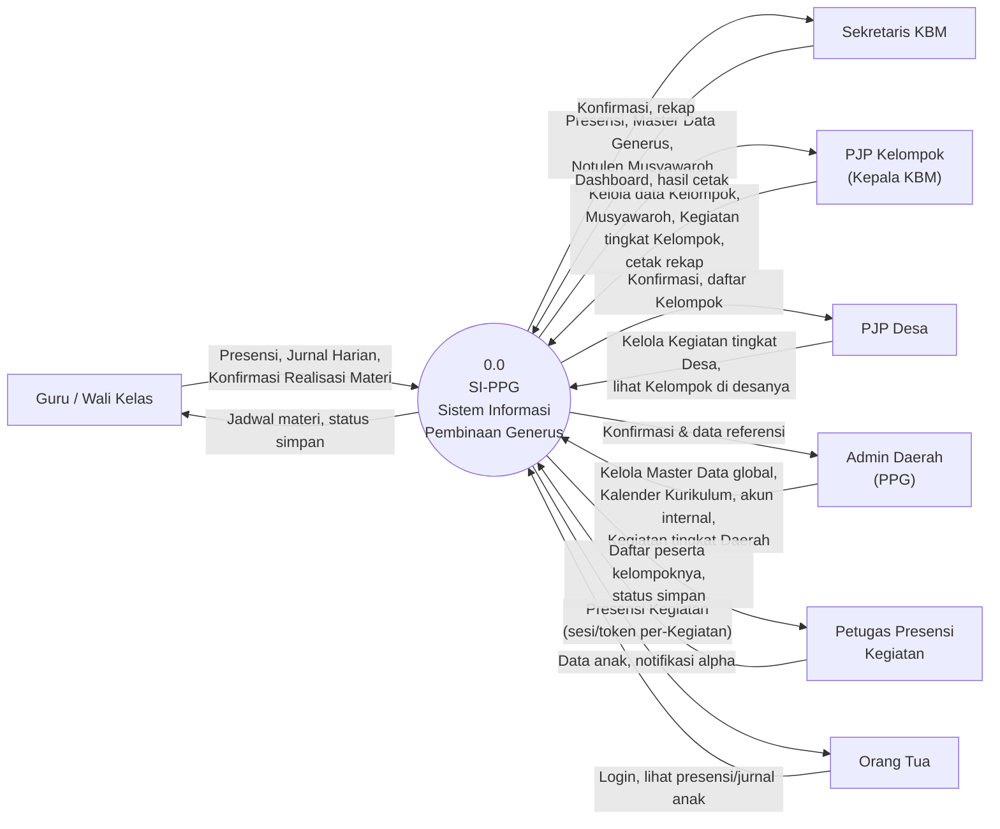
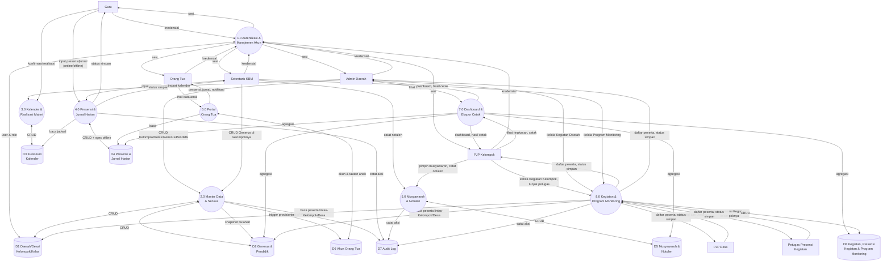
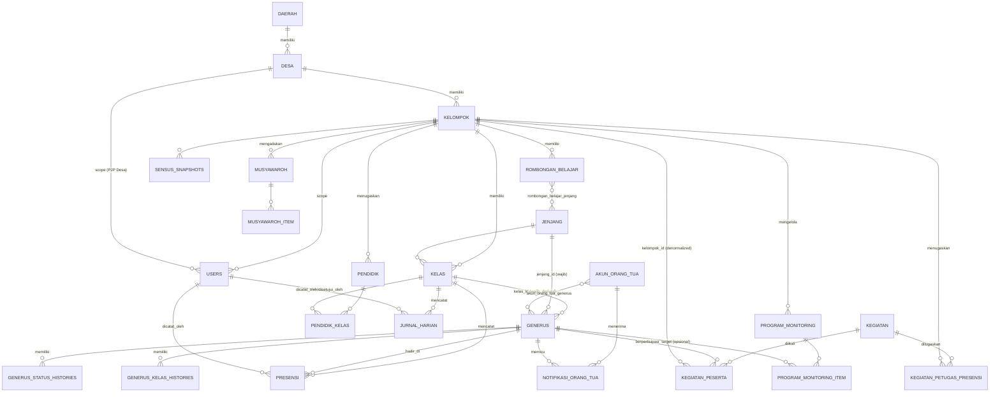

# Software Requirements Specification (SRS)
# SI-PPG — Fase 1: Fondasi Pendataan Harian & Portal Orang Tua

**Nama Sistem:** SI-PPG — Sistem Informasi Pembinaan Generus
**Versi Dokumen:** 2.1
**Tanggal:** 2 Agustus 2026
**Status:** Draft
**Klasifikasi:** Internal — Terbatas
**Dokumen Sumber:** [PRD-Aplikasi-Pendataan-Pelaporan-PPG.md](PRD-Aplikasi-Pendataan-Pelaporan-PPG.md)
**Dokumen Terkait:** [UCIC-Fase-1.md](UCIC-Fase-1.md), [Struktur-Proyek-Fase-1.md](Struktur-Proyek-Fase-1.md)

> **Catatan Ruang Lingkup:** Dokumen ini adalah spesifikasi teknis untuk **Fase 1 (MVP)** sebagaimana didefinisikan pada PRD §14. Modul-modul Fase 2–4 PRD (Generator Laporan Otomatis penuh/§9.16, Sarana Prasarana/§9.10, Keuangan/§9.11, Penilaian Sikap/§9.6, Prestasi Bacaan/§9.7, Lembar Penghubung/§9.8, Rapor/§9.9, Monitoring 29 Karakter/§9.13, agregasi Desa/Daerah penuh) **tidak dibahas** di sini dan akan memiliki dokumen SRS/UCIC tersendiri saat fase tersebut mulai dikerjakan. **Pengecualian:** Kegiatan & Program Monitoring (§9.12 PRD) **dipindahkan ke Fase 1** (PRD v0.8, §14) dan dibahas penuh di §18.

---

## Daftar Isi

1. [Deskripsi & Ruang Lingkup](#1-deskripsi--ruang-lingkup)
2. [Platform & Arsitektur](#2-platform--arsitektur)
3. [Alur Autentikasi](#3-alur-autentikasi)
4. [Alur Hierarki Organisasi & Akses](#4-alur-hierarki-organisasi--akses)
5. [Manajemen Role & Pengguna](#5-manajemen-role--pengguna)
6. [Master Data](#6-master-data)
7. [Sensus Generus & Pendidik](#7-sensus-generus--pendidik)
8. [Kalender & Realisasi Materi Harian](#8-kalender--realisasi-materi-harian)
9. [Presensi Harian](#9-presensi-harian)
10. [Jurnal Harian Mengajar](#10-jurnal-harian-mengajar)
11. [Musyawaroh & Notulen (Dasar)](#11-musyawaroh--notulen-dasar)
12. [Portal Orang Tua](#12-portal-orang-tua)
13. [Mekanisme Offline](#13-mekanisme-offline)
14. [Dashboard](#14-dashboard)
15. [Ekspor Cetak (Print-CSS)](#15-ekspor-cetak-print-css)
16. [Endpoint API](#16-endpoint-api)
17. [Skema Database](#17-skema-database)
18. [Kegiatan (Tambahan, Penguatan, Program Khusus)](#18-kegiatan-tambahan-penguatan-program-khusus)
19. [Roadmap Sprint](#19-roadmap-sprint)

---

## 1. Deskripsi & Ruang Lingkup

Fase 1 adalah rilis fondasi SI-PPG sebagaimana ditetapkan pada [PRD §14](PRD-Aplikasi-Pendataan-Pelaporan-PPG.md#14-roadmap--fase-pengembangan). Rilis ini menggantikan pendataan harian yang saat ini dikerjakan manual (Excel untuk kalender materi & sensus, kertas untuk presensi/jurnal/notulen) dengan sembilan modul inti:

| Modul | Cakupan | Acuan PRD |
|-------|---------|-----------|
| **Auth** | Login, ganti password, reset password oleh admin (dua guard: internal & orang tua) | §9.1, §9.18, §11.1 |
| **Master Data** | CRUD Generus (termasuk status domisili Setempat/Pendatang), Pendidik, Kelas, Kelompok, Desa; provisioning akun internal & orang tua | §9.1, §5, §8 |
| **Sensus** | Rekap otomatis jumlah generus & pendidik per kategori, snapshot bulanan | §9.2 |
| **Kalender Kurikulum** | Breakdown materi per jenjang berbasis rentang tanggal kalender, dikelola Admin Daerah | §9.3 |
| **KBM Reguler sebagai Kegiatan** | KBM per Kelas digenerate sebagai Kegiatan dari breakdown Kurikulum; presensi & realisasi dicatat Guru pengajar | §9.3–§9.5 (digabung pasca-konvergensi) |
| **Musyawaroh & Notulen (Dasar)** | Notulen Musyawaroh Pengurus KBM / 5 Unsur / Pertemuan 5 Unsur / Mustin — **tanpa carry-over otomatis** (Fase 2) | §9.14 |
| **Kegiatan & Program Monitoring** | Kegiatan tingkat Kelompok/Desa/Daerah dengan presensi peserta lintas-Kelompok/Desa, Petugas Presensi per Kelompok, Program Monitoring generik (Turba, GOMA, GMKM, dsb.) | §9.12 |
| **Portal Orang Tua (Dasar)** | Akun otomatis per Generus, lihat presensi & jurnal anak real-time, notifikasi alpha | §9.18 |
| **Mekanisme Offline** | Idempotent sync presensi/jurnal, resolusi konflik, cache lokal | §9.19 |
| **Dashboard** | Ringkasan kehadiran, sensus, status musyawaroh tingkat Kelompok | §9.17 (dasar) |
| **Ekspor Cetak** | Cetak/simpan PDF halaman rekap via print stylesheet browser | §18.2 |

Dokumen ini menggunakan [PRD-Aplikasi-Pendataan-Pelaporan-PPG.md](PRD-Aplikasi-Pendataan-Pelaporan-PPG.md) sebagai satu-satunya sumber kebutuhan bisnis; setiap keputusan teknis konkret yang dibuat di sini (skema tabel, kontrak endpoint, aturan validasi) **menurunkan**, bukan mengubah, kebutuhan yang sudah disepakati di PRD. Bagian yang memerlukan keputusan teknis baru (belum eksplisit di PRD) ditandai dengan **catatan "Keputusan Teknis"**.

### 1.1 Asumsi & Batasan

- **Tidak ada Generator Laporan Otomatis penuh** (46-slide HTML interaktif, grafik, carry-over musyawaroh) — itu adalah Fase 2 (PRD §14, §9.16). Fase 1 hanya menyediakan halaman rekap sederhana per modul yang bisa dicetak (§15).
- **Tidak ada modul Sarpras, Keuangan, Penilaian Sikap, Prestasi Bacaan, Lembar Penghubung, Rapor, Monitoring 29 Karakter** — seluruhnya Fase 2–3 (PRD §14). **Kegiatan/Program Monitoring (§9.12) sudah masuk Fase 1** — lihat §18.
- **Tidak ada dashboard/agregasi Desa/Daerah** — dashboard Fase 1 hanya level Kelompok; PJP Desa **belum punya fitur dashboard/agregasi sendiri** sampai Fase 2 (PRD §14 Fase 2, detail teknis di SRS-Fase-2 §7 & UCIC-Fase-2 UC-36 `Dashboard\DashboardDesa`). Ini terpisah dari Master Data: sejak revisi 1.9, PJP Desa **sudah bisa mengelola Generus & Pendidik lintas-Kelompok dalam Desa miliknya** (§4.2, §6.2, §6.3) — bukan lagi sekadar melihat daftar Kelompok read-only. Karena tidak punya Dashboard, PJP Desa **mendarat di halaman Kelola Struktur Organisasi** (`/master-data/struktur-organisasi`, §3.1/§3.3) setelah login/ganti password, bukan di `/dashboard` — mencegah `DashboardKelompok` memilih Kelompok sembarangan untuk role yang tidak punya `kelompok_id` (lihat §5.1, permission `dashboard.view` sengaja tidak diberikan ke role ini).
- **Tidak ada reset password self-service via email.** Reset password baik untuk akun internal maupun Portal Orang Tua dilakukan **manual oleh Admin Daerah/PJP** (konsisten dengan pola yang sudah ditetapkan PRD §9.18 untuk Portal Orang Tua — diperluas ke seluruh akun internal agar satu mekanisme saja yang perlu dipelihara). Email bersifat opsional pada profil user, tidak dipakai untuk alur keamanan apa pun di Fase 1.
- **Tidak ada multi-Daerah** (PRD §18.4, dikonfirmasi) — `daerah` cukup satu baris konfigurasi.
- Notifikasi WhatsApp bersifat **tambahan opsional**, bukan jalur utama (PRD §16, §17.3) — Fase 1 cukup notifikasi in-app.
- **Dokumentasi Foto Kegiatan (§9.15 PRD) tetap Fase 2** meski Modul Kegiatan sendiri (§9.12, §18) sudah Fase 1 — mencatat Kegiatan & presensinya tidak memerlukan upload foto; galeri foto per Kegiatan menyusul terpisah.
- **Ketersediaan PHP 8.3 di hosting cPanel target belum diverifikasi lapangan** (PRD §18) — Sprint 1 (§19) harus mengonfirmasi ini di awal sebelum setup proyek; bila paket hosting Kelompok pilot belum menyediakan PHP 8.3, mitigasinya adalah menahan versi di Laravel 12 (masih didukung PHP 8.2–8.5) sampai hosting diperbarui, tanpa mengubah desain arsitektur lain di dokumen ini.

### 1.2 Diagram Alur Data (DFD)

#### 1.2.1 Diagram Konteks (Level 0)



Sistem SI-PPG diperlakukan sebagai satu proses tunggal (Proses 0.0) yang berinteraksi dengan tujuh entitas eksternal sesuai peran pada PRD §6: **Guru/Wali Kelas** (input harian di kelas), **Sekretaris KBM** (input presensi & administrasi kelompok), **PJP Kelompok** (kelola kelompok, musyawaroh & Kegiatan tingkat Kelompok), **PJP Desa** (kelola Kegiatan tingkat Desa, lihat Kelompok di desanya — PRD §9.12), **Admin Daerah** (master data global, kurikulum & Kegiatan tingkat Daerah), **Petugas Presensi Kegiatan** (akses terbatas per-Kegiatan untuk mencatat kehadiran generus kelompoknya, §18.2), dan **Orang Tua** (portal read-mostly). PJP Desa & Petugas Presensi Kegiatan adalah entitas baru sejak Modul Kegiatan masuk Fase 1 (§18) — sebelumnya PJP Desa hanya tersirat di Master Data (§6.1), tanpa flow DFD tersendiri.

#### 1.2.2 Diagram Level 1 (Dekomposisi Proses)



Delapan proses Level 1 berpadanan dengan dua belas modul pada §1 (Auth pada 1.0; Master Data+Sensus digabung 2.0; Portal Orang Tua pada 6.0; Dashboard+Ekspor Cetak digabung 7.0; Kegiatan & Program Monitoring pada 8.0, §18). Delapan data store berpadanan dengan pengelompokan tabel pada §17 (D1↔§17.1, D2↔§17.2, D3↔§17.3, D4↔§17.4, D5↔§17.5, D6↔§17.6, D7↔§17.7, D8↔§17.8).

---

## 2. Platform & Arsitektur

| Aspek | Pilihan | Acuan PRD |
|-------|---------|-----------|
| **Backend** | Laravel 13 (PHP 8.3+) | §18.1 — naik dari Laravel 11/PHP 8.2+ sejak PRD v0.9; konfirmasi ketersediaan PHP 8.3 di hosting cPanel target sebelum Sprint 1 (§1.1) |
| **Frontend** | Livewire 3 + Alpine.js + Tailwind CSS (TALL stack), server-rendered | §18.1 |
| **Database** | MySQL 8 / MariaDB | §18.1 |
| **RBAC** | `spatie/laravel-permission` | §18.1 |
| **Audit Trail** | `spatie/laravel-activitylog` (tabel `activity_log` bawaan paket) | §18.1, §11.5 |
| **Offline/PWA** | Service worker + manifest, IndexedDB via Dexie.js | §18.1, §11.3, §9.19 |
| **Ekspor Cetak** | Print stylesheet + `window.print()` (jalur utama, tanpa dependency baru) | §18.1, §18.2 |
| **Hosting** | Shared hosting (cPanel) — tanpa Node.js/Docker/proses *long-running* | §18 |
| **Multi-tenant** | Tidak diperlukan — satu Daerah saja | §18.4 |

### 2.1 Arsitektur Hybrid: Livewire + Lapisan API Minimal

**Keputusan Teknis:** Sebagian besar UI dibangun dengan Livewire (server-rendered, state dikelola di server, tidak ada panggilan JSON eksplisit dari sisi klien untuk interaksi biasa). Namun mekanisme offline (§9.19 PRD) **mengharuskan** adanya lapisan REST JSON tersendiri, karena data yang dibuat di IndexedDB saat offline harus disinkronkan lewat panggilan HTTP eksplisit setelah perangkat online kembali — Livewire tidak punya jalur bawaan untuk ini.

Karena itu, sistem memakai dua jalur akses yang hidup berdampingan pada satu backend Laravel yang sama:

1. **Web routes (`routes/web.php`), Livewire, session-based (cookie)** — dipakai untuk seluruh halaman UI: login, master data, sensus, kalender, musyawaroh, dashboard, portal orang tua, Kegiatan. Autentikasi via Laravel session standar (bukan JWT), dua guard terpisah (§3).
2. **API routes (`routes/api.php`), JSON, token-based (Laravel Sanctum)** — **hanya** dipakai untuk endpoint sinkronisasi offline (§13, `/api/v1/sync/*`). Token Sanctum diterbitkan otomatis saat login berhasil (disimpan di IndexedDB bersama draft offline), dipakai khusus untuk memanggil endpoint sync dari service worker/background sync.
3. **Tautan token per-Kegiatan (tanpa guard, tanpa akun)** — khusus Petugas Presensi Kegiatan yang ditugaskan ke seorang Generus (§18.2), yang di Fase 1 tidak memiliki akun `users` sama sekali. Bukan guard ketiga secara formal di `spatie/laravel-permission` — melainkan middleware terpisah yang memvalidasi UUID `kegiatan_petugas_presensi.token` langsung dari URL, dibatasi ke satu Kegiatan & satu Kelompok saja, kedaluwarsa otomatis (§18.2).

Kontrak endpoint pada §16 didokumentasikan sebagai REST JSON murni untuk memudahkan penelusuran dan pengujian, **meski implementasi UI utamanya lewat Livewire** — setiap endpoint tetap punya representasi Livewire component yang setara (disebutkan di catatan tiap endpoint bila relevan).

### 2.2 Keamanan Dasar

| Aspek | Detail | Acuan PRD |
|-------|--------|-----------|
| Password | Hashed Bcrypt/Argon2id (bawaan Laravel) | — |
| Sesi | Laravel session (cookie, HttpOnly, Secure) untuk web; Sanctum Personal Access Token untuk `/api/v1/sync/*` | §2.1 |
| Password generik | Wajib diganti di login pertama, berlaku untuk **seluruh akun** (internal & orang tua) — tidak bisa dilewati | §11.1, §9.18 |
| Rate limiting | Endpoint login dibatasi (mis. 5 percobaan/10 menit per username/IP) | — (praktik standar) |
| Audit log | Seluruh aksi create/update/delete/validate dicatat via `spatie/laravel-activitylog` | §11.5 |
| HTTPS | Wajib sejak hari pertama (Let's Encrypt) | §18.5 |
| Data sensitif | Catatan konseling/rekam kasus (`bk-kbm`, §5.1) — visibilitas dibatasi hanya `bk-kbm` (baca+tulis), `pjp-kelompok` & `admin-daerah` (baca saja), PRD §11.1. **Koreksi v1.13:** modul ini sekarang masuk Fase 1-2 (fitur sederhana, teks bebas) mengikuti revisi model-role — bukan lagi "di luar ruang lingkup Fase 1" seperti pernyataan lama di sini | §5.1, PRD §11.1 |

---

## 3. Alur Autentikasi

Sistem memakai **dua guard Laravel terpisah** sesuai dua jenis akun berbeda pada PRD:

- **Guard `web`** — akun internal (Admin Daerah, PJP Kelompok, Sekretaris KBM, Guru/Wali Kelas), tabel `users` (§17.2).
- **Guard `orangtua`** — akun Portal Orang Tua, tabel `akun_orang_tua` (§17.6), login memakai nomor HP sebagai username (PRD §9.18).

### 3.1 Login (Guard `web`)

```
[User Internal] → Input username + password di halaman Login
               → Backend validasi kredensial (hash bcrypt)
               → Cek status akun aktif
               → Cek flag must_change_password
                    ├── true  → Redirect paksa ke halaman "Ganti Password" (tidak bisa diakses halaman lain)
                    └── false → Buat session Laravel, redirect sesuai role (User::landingRouteName()):
                                  - PJP Desa → Kelola Struktur Organisasi (belum punya Dashboard di Fase 1, §1.1)
                                  - Role lain (Admin Daerah, PJP Kelompok, Sekretaris KBM, Guru) → Dashboard Kelompok
```

### 3.2 Login (Guard `orangtua`)

```
[Orang Tua] → Input nomor HP + password di halaman Login Portal Orang Tua
           → Backend cari akun via blind index nomor_hp_hash (HMAC-SHA256), nomor_hp asli tersimpan terenkripsi (§17.6)
           → Backend validasi kredensial (hash bcrypt)
           → Cek status akun aktif
           → Cek flag must_change_password (SELALU true untuk akun baru — PRD §9.18)
                ├── true  → Redirect paksa ke halaman "Ganti Password" (tidak bisa dilewati)
                └── false → Buat session, redirect ke Portal Orang Tua
                            (jika akun tertaut >1 Generus, tampilkan Pemilih Anak — PRD §9.18)
```

### 3.3 Ganti Password (Kedua Guard)

```
[User] → Input password lama + password baru + konfirmasi
      → Validasi: password baru ≥ 8 karakter, tidak sama dengan password lama
      → Simpan hash baru, must_change_password = false
      → Catat di activity_log [AUDIT]
      → Redirect ke Portal (guard orangtua) atau sesuai role (guard web, lihat §3.1 — PJP Desa ke Kelola Struktur Organisasi, role lain ke Dashboard)
```

### 3.4 Reset Password oleh Admin (Kedua Guard, Tidak Ada Self-Service)

**Keputusan Teknis:** Fase 1 tidak menyediakan "Lupa Password" berbasis email untuk akun manapun — konsisten dengan pola yang sudah ditetapkan PRD §9.18 untuk Portal Orang Tua ("Guru/Sekretaris KBM bisa mereset password orang tua"), diperluas agar berlaku sama untuk akun internal (direset oleh Admin Daerah/PJP tingkat atasnya). Ini menghindari perlu membangun & memelihara dua mekanisme reset berbeda.

```
[Admin/PJP] → Buka halaman Kelola Pengguna → pilih akun
                    → Klik "Reset Password"
                    → Sistem generate password acak 8 karakter baru
                    → Tampilkan/salin password baru ke Admin (untuk disampaikan manual ke user)
                    → must_change_password = true
                    → Seluruh session aktif akun tsb di-invalidate (force logout)
                    → Catat di activity_log [AUDIT]
```

**Aturan Bisnis (berlaku §3.1–§3.4):**
- Password minimal 8 karakter; password generik hasil provisioning/reset selalu string acak 8 karakter (PRD §9.18).
- `must_change_password` tidak dapat dilewati — middleware memblokir akses ke rute lain manapun (kecuali logout) selama flag ini `true`.
- Reset password oleh admin merevoke seluruh sesi aktif akun tsb.

---

## 4. Alur Hierarki Organisasi & Akses

### 4.1 Struktur Organisasi

```
Daerah (PPG) — satu baris konfigurasi, tidak multi-tenant (PRD §18.4)
  └─ Desa (PJP Desa)
       └─ Kelompok / KBM (PJP Kelompok)
            └─ Kelas (PAUD-A, PAUD-B, Dasar 1-6/ACR, Menengah 7-9/APR, Lanjutan 10-12/AR, GPN-A, GPN-B)
                 └─ Generus — kelas_id (wajib, tempat Generus berada saat ini, PRD §8) + status_domisili (flag klasifikasi kontak konfirmasi hasil KBM)
```

### 4.2 Scope Akses per Role

Tabel di bawah merangkum 5 role yang sudah ada sejak awal Fase 1. Role baru hasil ekspansi role-model (Wanbin, Sekretaris/Bidang Daerah & Desa, BK Kelompok, Pakar Pendidik) memakai scope data yang sama dengan role existing setingkat (Daerah/Desa/Kelompok) — daftar lengkap role beserta permission masing-masing ada di §5.1, tidak diduplikasi di sini.

| Role | Scope Data | Bisa Kelola |
|------|-----------|-------------|
| Admin Daerah | Seluruh Daerah | Semua Master Data, Kalender Kurikulum (global), akun internal semua level, **Kegiatan tingkat Daerah (§18)** |
| PJP Desa | Desa miliknya, lintas-Kelompok (fitur agregasi dashboard *baru aktif Fase 2* — lihat §1.1) | Master Data Generus/Pendidik di seluruh Kelompok dalam desanya; **mengelola Kegiatan tingkat Desa (§18)** |
| PJP Kelompok / Kepala KBM | Kelompok miliknya | Master Data Generus/Pendidik di kelompoknya, Musyawaroh, akun internal kelompoknya (Sekretaris, Guru), Dashboard, Ekspor Cetak, **Kegiatan tingkat Kelompok, tunjuk Petugas Presensi Kegiatan kelompoknya untuk Kegiatan Desa/Daerah (§18)** |
| Sekretaris KBM | Kelompok miliknya | Master Data Generus, Presensi, Notulen Musyawaroh, **Program Monitoring kelompoknya, tunjuk Petugas Presensi Kegiatan (§18)** |
| Guru / Wali Kelas | Kelas yang diampu | Presensi kelasnya, Jurnal Harian kelasnya, konfirmasi realisasi materi |
| Petugas Presensi Kegiatan | Satu Kegiatan × satu Kelompok (penugasan per-Kegiatan, §18.2) | Presensi peserta kelompoknya di Kegiatan tsb — tidak ada akses lain |
| Orang Tua | Generus yang tertaut ke akunnya saja | Tidak ada (read-mostly; lihat §12) |

**Aturan Bisnis:**
- Setiap query data (Generus, Pendidik, Presensi, Jurnal, Musyawaroh) di-scope otomatis berdasar `kelompok_id` milik user yang login, kecuali: Admin Daerah (scope global, seluruh Daerah) dan PJP Desa (scope seluruh Kelompok yang `desa_id`-nya sama dengan Desa miliknya, bukan satu `kelompok_id` tunggal) — diimplementasikan sebagai Eloquent Global Scope, bukan filter manual di tiap controller/component, untuk mencegah kebocoran data lintas Kelompok/Desa akibat lupa filter.
- Karena tidak ada multi-tenant (§18.4 PRD), scoping ini murni berbasis foreign key (`kelompok_id`/`desa_id`), bukan isolasi database/skema terpisah.

---

## 5. Manajemen Role & Pengguna

### 5.1 Daftar Role (Guard `web`)

| Role (`spatie/laravel-permission`) | Level Scope | Kewenangan Fase 1 |
|-------------------------------------|-------------|--------------------|
| `admin-daerah` | Daerah | Akses penuh Master Data & Kalender Kurikulum; kelola akun internal semua level; kelola Kegiatan tingkat Daerah (§18) |
| `wanbin-daerah` **(baru)** | Daerah | `musyawaroh.manage` (scope Daerah — memimpin & mengesahkan Musyawarah Koordinasi PPG-PJP Desa), `struktur-organisasi.view`, `dashboard.view` — ketiganya permission yang sudah ada; multi-akun per Daerah (Kyai + Wakil Kyai, tidak dibatasi jumlah — beda dari `pjp-desa`/`pjp-kelompok`, lihat §5.2) |
| `sekretaris-ppg` **(baru)** | Daerah | Fase 1 aktif sebagian: `struktur-organisasi.view`, `musyawaroh.manage` (scope Daerah, notulen musyawarah Daerah) — permission baru `generus.view`/`pendidik.view` (read-only lintas-desa) baru aktif penuh Fase 3, mengikuti Roadmap PRD §14; multi-akun per Daerah (2 urusan: Adm. Umum & Datinfo, bisa 2 akun) |
| `bidang-kurikulum` **(baru)** | Daerah | `kurikulum.manage`, `kurikulum.view` — permission sudah ada, dipisah dari cakupan `admin-daerah` |
| `bidang-tendik` **(baru)** | Daerah | `pendidik.manage` (scope Daerah-wide) — permission sudah ada, dipisah dari cakupan `admin-daerah` |
| `pjp-desa` | Desa | Lihat daftar Kelompok di desanya (fitur dashboard agregasi Fase 2 — role ini **tidak** punya permission `dashboard.view`, landing page-nya Kelola Struktur Organisasi, §1.1/§3.1); kelola Kegiatan tingkat Desa (§18); **maks. 1 akun aktif per `desa_id`** (Koordinator PPD — lihat §5.2) |
| `wanbin-desa` **(baru)** | Desa | `musyawaroh.manage` (scope Desa — memimpin Musyawarah 5 Unsur/Pertemuan 5 Unsur tingkat Desa), `dashboard.view` — permission sudah ada; multi-akun per Desa |
| `sekretaris-desa` **(baru)** | Desa | Fase 1 aktif penuh: `musyawaroh.manage` (scope Desa) + `generus.view` (read-only se-Desa, reuse `P-MDATA-02`/UC-05 yang sudah Desa-scope sejak v1.3 — beda dari `sekretaris-ppg` yang Daerah-wide, karena itu ditunda Fase 3); multi-akun per Desa |
| `pjp-kelompok` | Kelompok | Kelola Master Data Generus/Pendidik kelompoknya, Musyawaroh, Dashboard, Ekspor Cetak, kelola akun Sekretaris/Guru/Wanbin Kelompok/BK di kelompoknya; kelola Kegiatan tingkat Kelompok & tunjuk Petugas Presensi Kegiatan (§18); **+`konseling.view`** (baru — baca saja catatan konseling kelompoknya, PRD §11.1, lihat baris `bk-kbm`); **maks. 1 akun aktif per `kelompok_id`** (Koordinator PPK — lihat §5.2) |
| `sekretaris-kbm` | Kelompok | Master Data Generus, Presensi, Notulen Musyawaroh; kelola Program Monitoring & tunjuk Petugas Presensi Kegiatan (§18) |
| `wanbin-kelompok` **(baru)** | Kelompok | `musyawaroh.manage` (scope Kelompok — memimpin Musyawarah Pengurus KBM/Mustin LUPG, lihat §11), `dashboard.view` — permission sudah ada; multi-akun per Kelompok |
| `bk-kbm` **(baru)** | Kelompok | `konseling.manage` (baru — satu-satunya yang menulis/mengedit catatan konseling sederhana, fitur teks bebas Fase 1-2; PJP Kelompok baca-saja via `konseling.view`, Admin Daerah otomatis semua permission, PRD §11.1); multi-akun per Kelompok |
| `guru` | Kelas | Presensi & Jurnal Harian kelas yang diampu, konfirmasi realisasi materi |
| `pakar-pendidik` **(baru)** | Daerah (akses konsultatif lintas-Kelompok, unsur LUPG — lihat catatan scope di §5.2) | `kurikulum.view` (sudah ada), `generus.view` (baru, read-only) — akses konsultatif, bukan hak kelola |

Sembilan role bertanda **(baru)** di atas ditambahkan mengikuti keputusan produk "setiap jabatan struktur organisasi punya akun sendiri" (PRD v1.9 §6; detail permission/multi-akun/fase lengkap ada di `Struktur-Organisasi-dan-Role.md` §"Matriks Peran (Role) per Tingkat"). Role yang di dokumen matriks tsb ditandai Fase 2 (`bidang-sarpras-daerah`, `pembantu-umum-kbm`, `seksi-kbm-reguler-desa`) ada di [SRS-Fase-2.md](SRS-Fase-2.md) §5/§7, bukan di sini; role bertanda Fase 3-4 (mis. `bendahara-*`, `wali-kelas`, `bidang-oras`, dst.) **belum** punya SRS tersendiri — tetap dilacak hanya di PRD §14 dan dokumen matriks sampai fasenya mulai dikerjakan.

Guard `orangtua` tidak memakai role `spatie/laravel-permission` — cukup satu jenis akun dengan permission tetap (read-mostly, lihat §12).

**Petugas Presensi Kegiatan bukan role permanen di tabel di atas** — lihat §5.3.

### 5.2 Provisioning Akun Internal

Sesuai PRD §9.1: **akun peran internal dibuat manual oleh Admin Daerah atau PJP Kelompok** di level terkait (bukan self-registration).

| Field | Tipe | Wajib | Keterangan |
|-------|------|-------|------------|
| Nama Lengkap | String | Ya | |
| Username | String | Ya | Unik, tidak dapat diubah user biasa |
| Nomor HP | String | Tidak | Kontak, tidak dipakai untuk login (beda dari guard `orangtua`) |
| Role | Enum | Ya | Salah satu dari §5.1 |
| Kelompok/Desa scope | FK | Ya (kecuali Admin Daerah) | Menentukan scope akses (§4.2) |
| Password awal | — | — | String acak 8 karakter, digenerate otomatis sama seperti Portal Orang Tua (PRD §9.18), disampaikan manual oleh yang membuat akun |
| Status aktif | Boolean | Ya | Default `true`; dapat dinonaktifkan Admin |

**Aturan Bisnis:**
- PJP Kelompok dapat membuat akun `sekretaris-kbm`, `guru`, `wanbin-kelompok`, dan `bk-kbm` di kelompoknya sendiri — role baru level Kelompok (§5.1) mengikuti pola yang sama seperti `sekretaris-kbm`/`guru`; PJP Kelompok tetap tidak dapat membuat akun setingkat atau lebih tinggi dari dirinya (`pjp-kelompok`, atau role level Desa/Daerah mana pun).
- PJP Desa dapat membuat akun `wanbin-desa` dan `sekretaris-desa` di desanya sendiri (role baru level Desa, §5.1) — pola yang sama dengan kewenangan Master Data Generus/Pendidik lintas-Kelompok yang sudah dimiliki PJP Desa sejak v1.3 (§1.1/§4.2); PJP Desa tetap tidak dapat membuat akun `pjp-desa` lain atau role level Daerah mana pun.
- Admin Daerah dapat membuat akun role apa pun di scope mana pun — termasuk seluruh role baru level Daerah (`wanbin-daerah`, `sekretaris-ppg`, `bidang-kurikulum`, `bidang-tendik`) dan `pakar-pendidik`. **Pakar Pendidik di-scope Daerah, dibuat oleh Admin Daerah** (bukan PJP Kelompok) karena aksesnya lintas-Kelompok/konsultatif, tidak melekat ke satu Kelompok tertentu (§5.1) — **dikonfirmasi** (bukan lagi judgment call terbuka): `Struktur-Organisasi-dan-Role.md` §D sudah diperjelas, Pakar Pendidik masuk "Unsur personel PPG" tingkat Daerah, konsisten dengan `generus.view`-nya yang lintas-Kelompok se-Daerah (UCIC-Fase-1 UC-05).
- **Keunikan akun Koordinator (`pjp-desa`/`pjp-kelompok`) — sudah diimplementasikan:** kedua role ini berperan sebagai *Koordinator* tunggal per lokasi (`Struktur-Organisasi-dan-Role.md`, Catatan Implementasi #1) dan dibatasi **maksimal 1 akun aktif** per `desa_id`/`kelompok_id` — berbeda dari seluruh role baru di §5.1 (Wanbin, Sekretaris, Bidang) yang eksplisit boleh multi-akun per lokasi yang sama. `Admin\KelolaPengguna::koordinatorDuplikat()` menolak penyimpanan (create, atau reaktivasi via `toggleActive()`) `pjp-desa`/`pjp-kelompok` baru bila `desa_id`/`kelompok_id` yang sama sudah punya satu akun **aktif** ber-role sama, dipanggil dari `simpan()` dan ditutupi `KelolaPenggunaRoleExpansionTest`; PJP yang ingin mengganti Koordinator harus menonaktifkan akun lama terlebih dahulu. Validasi ini di level aplikasi saja, belum ada unique constraint di DB.

### 5.3 Petugas Presensi Kegiatan (Penugasan, Bukan Role Permanen)

Berbeda dari §5.1–§5.2, **Petugas Presensi Kegiatan tidak punya role `spatie/laravel-permission` sendiri dan tidak selalu punya akun `users`** — penugasannya melekat ke satu kombinasi (Kegiatan, Kelompok) saja, dibuat oleh PJP Kelompok/Sekretaris KBM Kelompok peserta (PRD §6, §9.12):

- **Bila ditugaskan ke akun internal existing** (Sekretaris/Guru) — cukup permission tambahan `kegiatan-presensi.manage` yang di-scope ke (kegiatan_id, kelompok_id) penugasannya, dicek di atas sesi `web` biasa (bukan role/guard baru).
- **Bila ditugaskan ke seorang Generus** (kasus umum sesuai PRD §6 — "peserta/siswa tertentu") — Generus **tidak** diberi akun `users` baru. Sebagai gantinya sistem generate tautan token sekali pakai per penugasan; detail mekanisme, masa berlaku, dan pembatasan akses ada di §18.2.

Detail lengkap skema data & aturan bisnis penugasan ada di §18.1–§18.2.

### 5.4 Matriks Role & Permission (Read-Only)

Halaman audit untuk Admin Daerah — tabel role × permission, dibaca **langsung dari database** (`Role::with('permissions')`, `spatie/laravel-permission`), bukan dari konstanta `RolePermissionSeeder::PERMISSIONS`/`ROLE_PERMISSIONS`. Ini penting: perubahan role/permission tetap dilakukan lewat seeder (kode) seperti biasa, tapi halaman ini **otomatis ikut berubah** begitu seeder dijalankan ulang — termasuk role/permission baru yang ditambahkan Fase 2+ (mis. `pjp-desa` mendapat `dashboard-desa.view` di Fase 2, UCIC-Fase-2 UC-36 — permission yang sama juga diberikan ke `seksi-kbm-reguler-desa`, tidak eksklusif, lihat SRS-Fase-2.md §7.1) — tanpa perlu ada perubahan kode di halaman Matriks itu sendiri.

**Motivasi:** selama pengembangan Fase 1 ditemukan beberapa kelas bug yang sama — role kehilangan permission yang seharusnya dimiliki, atau mendapat permission yang tidak sesuai desain — yang baru ketahuan setelah user melapor gejalanya (mis. error "This action is unauthorized"), bukan dari inspeksi proaktif. Detail insiden yang mendasari fitur ini ada di UC-26 (Aturan Bisnis).

Permission `roles.view` — hanya diberikan ke `admin-daerah` (lewat `RolePermissionSeeder::PERMISSIONS`, bukan permission per-role manual), konsisten dengan pola `import.run`/`kurikulum.manage` yang juga admin-daerah-only.

---

## 6. Master Data

### 6.1 Entitas Wilayah & Struktur

| Entitas | Field Utama | Keterangan |
|---------|-------------|------------|
| `daerah` | nama, alamat_sekretariat, visi, misi | Satu baris (§18.4 PRD) |
| `desa` | nama, daerah_id (FK) | |
| `kelompok` | nama, desa_id (FK), alamat | = KBM |
| `jenjang` | kode, label, urutan, kategori_usia | Master data global (PAUD-A/PAUD-B/Dasar1-6/Menengah7-9/Lanjutan10-12/GPN-A/GPN-B) — dikelola lewat halaman Master Data > Struktur Organisasi > tab **Jenjang**, tidak terikat Kelompok manapun |
| `kelas` | kelompok_id (FK), jenjang_id (FK), status_aktif | **Bukan layar Master Data tersendiri** — 1 baris auto-provisioned per Kelompok×Jenjang saat Kelompok dibuat (§6.1 Kelompok), murni junction internal yang dipakai pipeline KBM/Kegiatan/presensi (§9, §18) dan basis `generus.kelas_id`. `nama` adalah accessor turunan dari `jenjang.label`, bukan kolom tersimpan |
| `rombongan_belajar` | nama, kelompok_id (FK), status_aktif, jenjang (many-to-many via `rombongan_belajar_jenjang`) | **Kelas sungguhan** di lapangan — dikelola lewat Master Data > Struktur Organisasi > tab **Kelas**. Satu Rombongan Belajar bisa menggabungkan >1 Jenjang sekaligus (mis. "Kelas ACR A" = Dasar 1 & Dasar 2) karena keterbatasan Guru/MT/MS di Kelompok tsb. Dipakai untuk pelaporan — **tidak** memengaruhi generate Kegiatan KBM/materi/presensi, yang tetap per-Jenjang lewat `kelas` |

### 6.2 Generus

| Field | Tipe | Wajib | Keterangan | Acuan PRD |
|-------|------|-------|------------|-----------|
| Nama | String | Ya | | §9.1 |
| Tanggal Lahir | Date | Ya | | §9.1 |
| Jenis Kelamin | Enum | Ya | Laki-laki / Perempuan | §9.1 |
| **jenjang_id** | FK → `jenjang` | **Wajib** | Jenjang pedagogis Generus saat ini — dipilih langsung di form (bukan lewat `kelas`), basis sensus/rollup per-Jenjang (§7) agar akurat walau Kelasnya gabungan (lihat `rombongan_belajar`, §6.1) | §7, §9.1 |
| **kelas_id** | FK → `kelas` | **Wajib** | **Di-derive otomatis** dari (Kelompok terpilih + `jenjang_id`) saat simpan — bukan dipilih manual lagi. Tetap jadi basis tunggal generate Kegiatan KBM, materi, dan presensi (§8, §9, §18); sama untuk Setempat maupun Pendatang | §8, §9.1 |
| Nama Orang Tua | String | Ya | | §9.1 |
| Nomor HP Orang Tua | String | Ya | Dipakai sebagai username akun Portal Orang Tua — lihat §12.2 | §9.18 |
| Status Aktif | Boolean | Ya | | §9.1 |
| **Status Domisili** | Enum | Ya | `setempat` / `perantauan` — **tidak memengaruhi `kelas_id`**; murni flag klasifikasi siapa kontak yang bisa dikonfirmasi terkait hasil KBM (orang tua langsung utk Setempat; orang tua jarak jauh via Portal atau PJP/Guru setempat utk Pendatang) | §9.1, §8 |

**Aturan Bisnis:**
- `jenjang_id` dan `kelas_id` selalu wajib diisi untuk semua Generus (Setempat maupun Pendatang) — tidak ada kondisi di mana kedua field ini boleh kosong.
- Form Tambah/Edit Generus meminta admin memilih Kelompok lalu **Jenjang** (bukan Kelas) — `kelas_id` di-derive otomatis dari pasangan (kelompok_id, jenjang_id) lewat tabel `kelas` yang auto-provisioned (§6.1); hanya Jenjang yang `status_aktif=true` di Kelompok tsb yang bisa dipilih untuk penempatan baru.
- "Naik Kelas" (kenaikan jenjang) mengikuti pola yang sama — admin memilih Jenjang baru dalam Kelompok yang sama, `kelas_id` ikut ter-derive.
- Perubahan status Setempat ↔ Pendatang dicatat sebagai riwayat (`generus_status_histories`, §17.2) — bukan menimpa field, agar histori kapan seorang generus mulai/berhenti merantau tetap terlacak.
- Riwayat kenaikan kelas per semester tersimpan di `generus_kelas_histories` (§17.2), tidak menimpa data lama.
- Menyimpan Generus baru **memicu provisioning akun Portal Orang Tua** — lihat §12.2.

### 6.3 Pendidik

| Field | Tipe | Wajib | Keterangan |
|-------|------|-------|------------|
| Nama | String | Ya | |
| Jenis | Enum | Ya | MT (Muballigh Tugasan) / MS (Muballigh Setempat) |
| Kelompok | FK | Ya | |
| Kelas yang Diampu | FK (many-to-many) | Tidak | Bisa lebih dari satu kelas |

### 6.4 Impor Massal

CRUD manual + impor massal dari Excel (format existing organisasi) untuk migrasi data awal, sesuai PRD §12. Detail kontrak endpoint di §16.

---

## 7. Sensus Generus & Pendidik

Sesuai PRD §9.2 — **dihitung otomatis dari Master Data**, tidak diinput manual.

| Aspek | Perilaku |
|-------|----------|
| Basis perhitungan | `kelas_id` (Kelompok tempat Generus berada & mengaji saat ini) — Generus Pendatang terhitung di Kelompok tempat mereka aktif saat ini, sama seperti Generus Setempat |
| Pemecahan | Per kategori usia (PAUD-A/PAUD-B/ACR/APR/AR/GPN-A/GPN-B), per jenis kelamin, per status domisili (Setempat/Pendatang — semata untuk mengetahui pecahan kontak konfirmasi, bukan pemecahan tanggung jawab Kelompok) |
| Rasio pendidik:generus | Dihitung dari seluruh Generus (semuanya punya `kelas_id`, karena itulah yang butuh pengajar langsung) |
| Snapshot | Dijalankan otomatis via scheduled job (Laravel Scheduler, tanggal 1 tiap bulan) — menyimpan hasil hitung ke tabel `sensus_snapshots` (§17.2) agar bisa dibandingkan antar bulan tanpa perlu hitung ulang data historis |

---

## 8. Kalender Kurikulum

> **Direvisi pasca-konvergensi** (lihat [Visi-Konvergensi-Kurikulum-Kegiatan-Presensi.md](Visi-Konvergensi-Kurikulum-Kegiatan-Presensi.md)) — §8/§9/§10 versi awal Fase 1 (kalender berbasis `hari_ke` + Presensi/Jurnal Harian sebagai sistem terpisah dari Kegiatan) **digantikan total** oleh isi di bawah ini. KBM reguler kini digenerate sebagai `Kegiatan` (§18) langsung dari breakdown Kurikulum, bukan dicatat lewat tabel `presensi`/`jurnal_harian` yang sudah dihapus.

Kalender materi kini disusun **per rentang tanggal kalender literal** (bukan lagi urutan hari mengajar `hari_ke`), sesuai PRD §9.3 versi revisi.

| Field (`kurikulum_kalender`) | Tipe | Keterangan |
|-------------------------------|------|------------|
| jenjang | String | Soft-reference ke `jenjang.kode` (§17.1) — kolom string biasa, bukan FK |
| tanggal_mulai, tanggal_selesai | Date | Rentang tanggal kalender berlakunya baris ini (boleh satu hari, boleh beberapa hari berturut-turut mis. "Senin–Rabu pekan ini") — rentang antar baris di jenjang yang sama tidak boleh tumpang tindih |
| jenis | Enum | `MATERI` (breakdown materi biasa) / `MUNAQOSAH` (ujian kenaikan/kelulusan materi — murni penjadwalan kejadian, belum ada struktur penilaian; menyusul Fase 3 §9.9) |
| item_materi | JSON, nullable | Daftar item materi (array baris teks) — wajib untuk `jenis=MATERI`, opsional untuk `MUNAQOSAH` |
| keterangan | Text, nullable | Catatan bebas |
| dibuat_oleh | FK → users | Admin Daerah/Bidang Kurikulum yang membuat baris ini |

Dikelola lewat halaman **Kelola Kurikulum** (CRUD + impor massal Excel dengan template kolom eksplisit: Tanggal Mulai, Tanggal Selesai, Jenis, Item Materi, Keterangan — satu sheet per jenjang), menggantikan `ImporKalender` versi lama yang memakai template "10 sheet Bulan × hari sekolah". Hari libur **tidak** dimodelkan di tabel ini — tabel `hari_libur` (§18) yang jadi satu-satunya sumber kebenaran, dipakai bersama oleh generate KBM maupun Kegiatan Jadwal Berulang biasa.

**Generate KBM sebagai Kegiatan:** PJP Kelompok mendefinisikan Jadwal Kegiatan Berulang (§18) dengan `frekuensi_tipe=KURIKULUM`, target tepat satu Kelas. Sistem menghasilkan satu `Kegiatan` per tanggal yang match breakdown Kurikulum jenjang Kelas tsb (dalam rentang Jadwal, dikurangi hari libur), tiap kejadian membawa **snapshot** `item_materi` saat itu (kolom `kegiatan.materi`) — lihat §18.1 untuk skema lengkap & §17.3 untuk detail migrasi skema.

---

## 9. KBM Reguler sebagai Kegiatan

> **Direvisi pasca-konvergensi.** Presensi Harian versi awal Fase 1 (tabel `presensi` terpisah, per `kelas_id`+`tanggal`) **dihapus** — KBM reguler kini adalah salah satu *jenis* `Kegiatan` (tingkat KELOMPOK, target satu Kelas, `kurikulum_kalender_id` terisi), digenerate otomatis dari §8. Presensinya adalah baris `kegiatan_peserta` biasa (skema penuh di §17.8/§18.1), bukan tabel tersendiri.

**Siapa yang mencatat:** Guru yang mengajar Kelas target Kegiatan tsb (dicek lewat `pendidik_kelas`) berwenang mencatat presensi & realisasi hariannya sendiri — **carve-out khusus** dari aturan Kegiatan Tambahan biasa (§18.1) yang justru sengaja melarang Guru mencatat presensi Kegiatan tingkat Kelompok (supaya Guru/BK-KBM tidak ikut campur di Kegiatan Tambahan yang bukan urusannya). PJP Kelompok/Sekretaris KBM (`kegiatan.manage`) tetap bisa mencatat/mengoreksi sebagai fallback.

**Aturan Bisnis:**
- Satu baris `kegiatan_peserta` per (kegiatan_id, generus_id) — kombinasi unik, pola idempotent sama seperti Presensi Harian versi awal (UPSERT bukan insert berulang).
- `kegiatan_peserta.kelas_id` didenormalisasi dari `generus.kelas_id` saat presensi dicatat — dasar breakdown laporan per-kelas (§18.1, §14).
- Rekap bulanan & persentase kehadiran dihitung on-the-fly (tidak perlu tabel agregat terpisah).
- Data ini tetap sumber untuk notifikasi alpha Portal Orang Tua (§12.3) dan bahan Musyawaroh Pengurus KBM (§11) — event `PresensiAlphaDicatat` kini membawa `KegiatanPeserta`, bukan `Presensi`.

---

## 10. Realisasi Materi & Approval

> **Direvisi pasca-konvergensi.** Jurnal Harian Mengajar versi awal Fase 1 (tabel `jurnal_harian` terpisah) **dihapus** — realisasi materi kini melekat langsung pada baris `Kegiatan` hasil-Kurikulum (§8/§18.1), bukan entri jurnal tersendiri.

| Field (`kegiatan`, hanya relevan bila `kurikulum_kalender_id` tidak null) | Tipe | Keterangan |
|---|---|---|
| realisasi_status | Enum, nullable | `SESUAI_JADWAL` / `TIDAK_TERLAKSANA` (+catatan wajib) / `PENGGANTI` (+catatan) — persis pola Jurnal Harian versi awal |
| realisasi_catatan | Text, nullable | Wajib diisi kecuali `SESUAI_JADWAL` |
| materi | JSON, nullable | Snapshot `item_materi` dari `kurikulum_kalender` saat Kegiatan digenerate (§8) — ditampilkan di form presensi sebagai referensi guru |

**Aturan Bisnis:**
- Satu Kegiatan KBM = satu kesempatan isi realisasi (melekat ke kejadian, bukan baris terpisah per tanggal) — diisi bersamaan dengan presensi lewat form yang sama (§18.1).
- Tidak ada approval terpisah oleh PJP Kelompok seperti Jurnal Harian versi awal (kolom `disetujui_oleh`/`disetujui_pada` tidak dibawa ke skema baru) — PJP Kelompok tetap bisa mengoreksi langsung karena juga berwenang mencatat presensi Kegiatan Kelompok (§9).

---

## 11. Musyawaroh & Notulen (Dasar)

Sesuai PRD §9.14 — **versi dasar, tanpa carry-over otomatis** (fitur carry-over adalah Fase 2).

| Field (`musyawaroh`) | Tipe | Keterangan |
|-------------------------|------|------------|
| kelompok_id | FK | |
| jenis | Enum | `pengurus_kbm` / `lima_unsur` / `pertemuan_lima_unsur` / `mustin_lupg` |
| tanggal | Date | |
| jumlah_hadir | Int, nullable | Untuk Absensi Mustin (PRD §9.14, Slide 36) |

| Field (`musyawaroh_item`) | Tipe | Keterangan |
|-----------------------------|------|------------|
| musyawaroh_id | FK | |
| pokok_masalah | Text | |
| keputusan | Text | |
| pic | String | |
| keterangan | Text | Status bebas teks — **belum** ada mekanisme carry-over status otomatis ke bulan berikutnya di Fase 1 |

**Aturan Bisnis:**
- Item notulen bulan lalu **tidak** otomatis muncul kembali di notulen bulan ini (berbeda dari desain Fase 2 PRD §9.14) — PJP Kelompok yang menyalin manual bila diperlukan, sama seperti proses lama, hanya kini tersimpan digital dan bisa dicetak (§15).

**Kepemimpinan Musyawarah (role, §5.1):** sejak setiap jabatan struktur organisasi punya akun sendiri, `wanbin-kelompok` (Kyai/Wakil Kyai Kelompok) kini memegang `musyawaroh.manage` di scope Kelompok yang sama dengan `pjp-kelompok`/`sekretaris-kbm` — mencerminkan kewenangan riil Kyai yang "memimpin & mengesahkan" Musyawarah Pengurus KBM/5 Unsur/Mustin LUPG (Buku Panduan, dikutip di `Struktur-Organisasi-dan-Role.md` §"Matriks Peran"), bukan sekadar penasehat pasif seperti asumsi model role lama. Tabel `musyawaroh`/`musyawaroh_item` di atas **tidak** membedakan siapa yang "memimpin" vs "mencatat" secara skema (tidak ada kolom `dipimpin_oleh` terpisah) — user manapun dengan `musyawaroh.manage` di kelompok tsb (Wanbin Kelompok, PJP Kelompok, atau Sekretaris KBM) dapat membuat/mengubah notulen yang sama; membedakan peran pimpinan vs pencatat secara formal di skema data bukan kebutuhan Fase 1 (§1.1). Pola yang sama berlaku berjenjang: `wanbin-desa` memimpin Musyawarah 5 Unsur/Pertemuan 5 Unsur tingkat Desa, `wanbin-daerah` memimpin Musyawarah Koordinasi PPG-PJP Desa tingkat Daerah — keduanya di luar cakupan tabel `musyawaroh` Fase 1 yang hanya scope Kelompok (`kelompok_id` wajib); musyawarah berjenjang Desa/Daerah menyusul saat modul terkait dibangun.

---

## 12. Portal Orang Tua

Sesuai PRD §9.18 — **versi dasar**. Fitur lanjutan (lihat rapor, isi Lembar Penilaian Sikap Orang Tua, isi Lembar Penghubung Mingguan) menyusul di Fase 3 begitu modul sumbernya (§9.6/§9.8/§9.9 PRD) tersedia.

### 12.1 Fitur Fase 1

- Lihat presensi & jurnal materi harian anak, real-time (§9, §10).
- Terima notifikasi in-app untuk anak berstatus Alpha.
- Pemilih anak bila akun tertaut >1 Generus.

### 12.2 Provisioning Akun (Detail dari PRD §9.18)

```
Generus baru disimpan (§6.2), nomor HP Orang Tua = X
   │
   ├── X belum pernah jadi username akun orang tua manapun
   │     → Buat akun_orang_tua baru: username=X, password=acak 8 karakter,
   │       must_change_password=true
   │     → Tautkan ke Generus via akun_orang_tua_generus (pivot)
   │
   └── X sudah terdaftar sebagai akun orang tua (kasus kakak-adik, PRD §9.18)
         → TIDAK buat akun/password baru
         → Cukup tambah baris di akun_orang_tua_generus (tautkan Generus baru ke akun existing)
```

Bila satu Generus perlu ditautkan ke wali kedua (mis. ayah & ibu, nomor HP berbeda), Sekretaris KBM menambahkan nomor HP kedua di profil Generus — memicu alur yang sama untuk nomor kedua tsb (akun baru atau tautan ke akun existing, independen dari akun pertama).

### 12.3 Notifikasi Alpha

```
Presensi disimpan dengan status = Alpha
   → Job (queued) cek akun_orang_tua yang tertaut ke generus_id tsb
   → Buat notifikasi in-app: "{Nama Generus} tidak hadir pada {tanggal}"
   → (Opsional, tidak wajib Fase 1) kirim juga via WhatsApp jika gateway sudah dikonfigurasi — lihat PRD §16 risiko kanal WA
```

---

## 13. Mekanisme Offline

Sesuai PRD §9.19. Ini satu-satunya bagian sistem yang genuinely memakai JSON API (§2.1).

### 13.1 Cakupan Cache Lokal (IndexedDB via Dexie.js)

> **Direvisi pasca-konvergensi** — cache & endpoint sync kini menyasar `Kegiatan`/`KegiatanPeserta` KBM (§9/§10), bukan lagi `presensi`/`jurnal_harian` yang sudah dihapus. Mekanisme idempotensi & resolusi konflik per-field tidak berubah.

| Data | Kapan di-cache | Alasan |
|------|-----------------|--------|
| Daftar Generus per kelas yang diampu | Saat online, setiap buka form presensi Kegiatan KBM | Wajib — tanpa ini form tidak bisa diisi offline |
| Kejadian Kegiatan KBM terjadwal ±7 hari (kelas terkait), termasuk `materi` & `realisasi_status` | Saat online | Sumber "materi terjadwal" & status realisasi untuk diisi offline (§9/§10) |
| Draft presensi & realisasi yang dibuat offline | Sejak dibuat, sampai berhasil sync | Antrian sinkronisasi |

**Dikecualikan dari cache/offline:** upload foto — tidak relevan di Fase 1 karena modul Dokumentasi Foto Kegiatan adalah Fase 2 (PRD §9.15).

### 13.2 Sinkronisasi (Idempotent)

Setiap entri presensi/realisasi yang dibuat offline diberi `client_uuid` (UUID v4) **di sisi klien saat dibuat**, bukan menunggu ID dari server.

**Endpoint:** `POST /api/v1/sync/presensi` dan `POST /api/v1/sync/realisasi-kegiatan` (kontrak detail §16)

```
Perangkat online kembali
   → Service worker kirim seluruh draft (batch) ke endpoint sync, masing-masing membawa client_uuid
   → Backend: UPSERT berdasar (kegiatan_id, generus_id) untuk presensi / kegiatan_id untuk realisasi
     — bila baris sudah ada, update; bila belum, insert
   → Retry akibat sinyal putus-nyambung TIDAK menghasilkan duplikat (upsert idempotent)
```

### 13.3 Resolusi Konflik

Bila dua pengguna (mis. Guru dan PJP Kelompok) mengisi presensi Kegiatan yang sama secara offline dan sinkron nyaris bersamaan:

```
Server terima 2 payload untuk (kegiatan_id, generus_id) yang sama, client_uuid berbeda
   → Bandingkan updated_at (timestamp lokal saat entri dibuat/diedit di klien)
   → Last-write-wins PER FIELD (bukan per baris utuh)
   → Pengguna yang datanya "kalah" menerima notifikasi in-app:
     "Presensi {Nama Generus} sudah diperbarui oleh {user lain}, silakan cek kembali"
```

---

## 14. Dashboard

Sesuai PRD §9.17 — **versi dasar, level Kelompok saja** (agregasi Desa/Daerah adalah Fase 2/4).

| Widget | Sumber Data |
|--------|-------------|
| Ringkasan kehadiran bulan berjalan | §9 (agregat) |
| Sensus terbaru | §7 (snapshot bulan berjalan) |
| Status musyawaroh bulan ini | §11 (sudah/belum ada notulen bulan berjalan) |
| Reminder: presensi belum diisi hari ini | §9 (kelas tanpa entri presensi hari ini) |
| Kegiatan mendatang (Kelompok/Desa/Daerah yang diikuti kelompoknya) | §18.1 — termasuk status penugasan Petugas Presensi (sudah/belum ditunjuk) |

*Tidak ada widget Sarpras di Fase 1 — modul sumbernya masih Fase 2. Widget Kegiatan sudah tersedia sejak Fase 1, lihat §18.*

---

## 15. Ekspor Cetak (Print-CSS)

Sesuai PRD §18.2 — jalur utama ekspor, **tanpa dependency baru**.

- Setiap halaman rekap (Presensi bulanan, Sensus snapshot, Notulen Musyawaroh) punya tombol "Cetak / Simpan sebagai PDF".
- CSS `@media print` + `@page { size: landscape; }` mengatur layout cetak; `page-break-after` bila rekap lebih dari satu halaman.
- Memanggil `window.print()` bawaan browser — pengguna memilih "Save as PDF" di dialog cetak.
- **Tidak ada** generate PDF di server (dompdf/fallback) di Fase 1 — itu baru dibangun bila kebutuhan PDF-tergenerate-otomatis benar-benar muncul (PRD §18.2), belum relevan untuk rekap sederhana Fase 1.

---

## 16. Endpoint API

Sebagian besar berupa Livewire component (tidak diekspos sebagai JSON API — lihat §2.1); yang didaftar dengan tanda **[JSON]** adalah endpoint REST sungguhan di `routes/api.php`.

```
Auth (web, session)
  POST   /login                          (guard: web)
  POST   /login-orangtua                 (guard: orangtua)
  POST   /logout
  POST   /ganti-password
  Livewire: Admin\KelolaPengguna → resetPassword($userId)
  Livewire: Admin\MatriksRolePermission (read-only, Admin Daerah — UC-26)

Master Data (Livewire)
  Livewire: MasterData\KelolaDesa, MasterData\KelolaKelompok, MasterData\KelolaKelas, MasterData\KelolaGenerus, MasterData\KelolaPendidik
  Livewire: MasterData\ImporMassal (upload Excel)

Sensus (read-only, Livewire)
  Livewire: Sensus\SensusDashboard (baca sensus_snapshots)

Kalender Kurikulum (Livewire) — §8, direvisi pasca-konvergensi
  Livewire: Kurikulum\KelolaKurikulum (Admin Daerah — CRUD + impor massal Excel)
  Livewire: Kurikulum\RekapKbmLintasKelompok (rollup Kelompok→Desa/Daerah)

KBM Reguler & Realisasi (Livewire) — §9/§10, menggantikan Presensi/Jurnal Harian lama
  Livewire: Kegiatan\FormJadwalKegiatan (frekuensi_tipe=KURIKULUM, generate Kegiatan per Kelas dari Kurikulum)
  Livewire: Kegiatan\InputPresensiKegiatan($kegiatan, $kelompok) → aksi simpan() mencatat presensi + realisasi (Guru pengajar Kelas tsb berwenang, §9)

Sinkronisasi Offline — [JSON] (Sanctum token), §13, direvisi pasca-konvergensi
  POST   /api/v1/sync/presensi           ← body: array of {client_uuid, kegiatan_id, generus_id, kelompok_id, kelas_id, status, updated_at}
  POST   /api/v1/sync/realisasi-kegiatan ← body: array of {client_uuid, kegiatan_id, realisasi_status, realisasi_catatan, updated_at}
  GET    /api/v1/sync/bootstrap?kelasId= ← data awal untuk cache offline: daftar generus + kejadian Kegiatan KBM ±7 hari kelas tsb

Musyawaroh & Notulen (Livewire)
  Livewire: Musyawaroh\KelolaMusyawaroh($kelompokId, $jenis)
  Livewire: Musyawaroh\KelolaNotulenItem

Portal Orang Tua (Livewire, guard orangtua)
  Livewire: PortalOrangTua\Dashboard (pemilih anak jika >1)
  Livewire: PortalOrangTua\LihatPresensi, PortalOrangTua\LihatJurnal
  Livewire: PortalOrangTua\NotifikasiFeed

Dashboard & Ekspor Cetak (Livewire)
  Livewire: Dashboard\DashboardKelompok
  (Ekspor cetak = tombol print-CSS di tiap halaman rekap, tanpa endpoint backend terpisah)

Kegiatan & Program Monitoring (Livewire, §18)
  Livewire: Kegiatan\KelolaKegiatan($tingkat, $penyelenggaraId)
  Livewire: Kegiatan\KelolaPetugasPresensi($kegiatanId)
  Livewire: Kegiatan\InputPresensiKegiatan($kegiatanId, $kelompokId)   ← dipakai baik oleh sesi web (petugas dari akun internal) maupun rute token (petugas Generus)
  Livewire: Kegiatan\KelolaProgramMonitoring($kelompokId)
  Livewire: Kegiatan\RekapKegiatan($kegiatanId)                        ← cetak, print-CSS

  Web route khusus tanpa guard (§2.1, §18.2):
  GET /kegiatan/presensi/{token}   ← memvalidasi kegiatan_petugas_presensi.token, render InputPresensiKegiatan dalam mode terbatas
```

---

## 17. Skema Database

### 17.1 Tabel Wilayah & Struktur

```sql
CREATE TABLE daerah (
    id                  BIGINT UNSIGNED AUTO_INCREMENT PRIMARY KEY,
    nama                VARCHAR(255) NOT NULL,
    alamat_sekretariat  TEXT,
    visi                TEXT,
    misi                TEXT,
    created_at          TIMESTAMP DEFAULT CURRENT_TIMESTAMP,
    updated_at          TIMESTAMP DEFAULT CURRENT_TIMESTAMP ON UPDATE CURRENT_TIMESTAMP
) ENGINE=InnoDB DEFAULT CHARSET=utf8mb4;
-- Hanya satu baris (§18.4 PRD) — tidak multi-tenant.

CREATE TABLE desa (
    id          BIGINT UNSIGNED AUTO_INCREMENT PRIMARY KEY,
    daerah_id   BIGINT UNSIGNED NOT NULL REFERENCES daerah(id),
    nama        VARCHAR(255) NOT NULL,
    created_at  TIMESTAMP DEFAULT CURRENT_TIMESTAMP,
    updated_at  TIMESTAMP DEFAULT CURRENT_TIMESTAMP ON UPDATE CURRENT_TIMESTAMP
) ENGINE=InnoDB DEFAULT CHARSET=utf8mb4;

CREATE TABLE kelompok (
    id          BIGINT UNSIGNED AUTO_INCREMENT PRIMARY KEY,
    desa_id     BIGINT UNSIGNED NOT NULL REFERENCES desa(id),
    nama        VARCHAR(255) NOT NULL,
    alamat      TEXT,
    created_at  TIMESTAMP DEFAULT CURRENT_TIMESTAMP,
    updated_at  TIMESTAMP DEFAULT CURRENT_TIMESTAMP ON UPDATE CURRENT_TIMESTAMP
) ENGINE=InnoDB DEFAULT CHARSET=utf8mb4;

-- Master data jenjang usia (§4.1) — tabel sendiri, bukan ENUM, agar menambah/
-- mengubah jenjang cukup ubah baris data, tanpa migration schema.
CREATE TABLE jenjang (
    id             BIGINT UNSIGNED AUTO_INCREMENT PRIMARY KEY,
    kode           VARCHAR(20) UNIQUE NOT NULL,  -- 'PAUD_A', 'DASAR_1', ... — dipakai di seluruh business logic
    label          VARCHAR(50) NOT NULL,         -- 'PAUD A (usia 3-4 tahun)', 'Dasar 1 (ACR)', ...
    urutan         SMALLINT UNSIGNED NOT NULL,   -- urutan tampil di <select>, 1..16
    kategori_usia  VARCHAR(10) NOT NULL,         -- 'PAUD-A'/'PAUD-B'/'ACR'/'APR'/'AR'/'GPN-A'/'GPN-B'
    created_at TIMESTAMP DEFAULT CURRENT_TIMESTAMP,
    updated_at TIMESTAMP DEFAULT CURRENT_TIMESTAMP ON UPDATE CURRENT_TIMESTAMP
) ENGINE=InnoDB DEFAULT CHARSET=utf8mb4;

-- Junction internal Kelompok×Jenjang, BUKAN layar Master Data — auto-provisioned 1
-- baris per Jenjang saat Kelompok dibuat (lihat KelolaKelompok::simpan). Basis
-- generate Kegiatan KBM/materi/presensi (§9, §18) dan generus.kelas_id (§17.2).
CREATE TABLE kelas (
    id            BIGINT UNSIGNED AUTO_INCREMENT PRIMARY KEY,
    kelompok_id   BIGINT UNSIGNED NOT NULL REFERENCES kelompok(id),
    jenjang_id    BIGINT UNSIGNED NOT NULL REFERENCES jenjang(id),
    status_aktif  BOOLEAN NOT NULL DEFAULT TRUE,  -- "Kelompok X tidak menyelenggarakan Jenjang Y tahun ini"
    created_at    TIMESTAMP DEFAULT CURRENT_TIMESTAMP,
    updated_at    TIMESTAMP DEFAULT CURRENT_TIMESTAMP ON UPDATE CURRENT_TIMESTAMP,
    deleted_at    TIMESTAMP NULL,
    UNIQUE KEY uq_kelas_kelompok_jenjang (kelompok_id, jenjang_id)
) ENGINE=InnoDB DEFAULT CHARSET=utf8mb4;
-- `nama` bukan kolom tersimpan — accessor turunan dari jenjang.label (App\Models\Kelas::nama).

-- Kelas sungguhan di lapangan (§6.1) — bisa menggabungkan >1 Jenjang. Dikelola lewat
-- Master Data > Struktur Organisasi > tab Kelas. Tidak dipakai pipeline KBM/presensi.
CREATE TABLE rombongan_belajar (
    id           BIGINT UNSIGNED AUTO_INCREMENT PRIMARY KEY,
    kelompok_id  BIGINT UNSIGNED NOT NULL REFERENCES kelompok(id),
    nama         VARCHAR(100) NOT NULL,           -- mis. "Kelas ACR A" — bebas diisi admin
    status_aktif BOOLEAN NOT NULL DEFAULT TRUE,
    created_at   TIMESTAMP DEFAULT CURRENT_TIMESTAMP,
    updated_at   TIMESTAMP DEFAULT CURRENT_TIMESTAMP ON UPDATE CURRENT_TIMESTAMP,
    deleted_at   TIMESTAMP NULL
) ENGINE=InnoDB DEFAULT CHARSET=utf8mb4;

CREATE TABLE rombongan_belajar_jenjang (   -- many-to-many, 1 Rombel bisa >1 Jenjang
    rombongan_belajar_id  BIGINT UNSIGNED NOT NULL REFERENCES rombongan_belajar(id) ON DELETE CASCADE,
    jenjang_id             BIGINT UNSIGNED NOT NULL REFERENCES jenjang(id) ON DELETE CASCADE,
    PRIMARY KEY (rombongan_belajar_id, jenjang_id)
) ENGINE=InnoDB DEFAULT CHARSET=utf8mb4;

CREATE INDEX idx_desa_daerah ON desa(daerah_id);
CREATE INDEX idx_kelompok_desa ON kelompok(desa_id);
CREATE INDEX idx_kelas_kelompok ON kelas(kelompok_id);
CREATE INDEX idx_rombongan_belajar_kelompok ON rombongan_belajar(kelompok_id);
```

**Catatan:** `kurikulum_kalender.jenjang` (§17.3) dan `sensus_snapshots.jenjang` (di bawah) **sengaja tetap kolom string** (soft-reference ke `jenjang.kode`), bukan FK — keduanya sudah `VARCHAR` bukan `ENUM` sejak awal, jadi tidak pernah butuh migration schema saat jenjang berubah. Cuma `kelas.jenjang` yang dulunya `ENUM` (constraint DB, dipilih lewat UI cascading Kelola Kelas) yang benar-benar dikonversi ke FK.

### 17.2 Tabel Generus & Pendidik

```sql
CREATE TABLE generus (
    id                    BIGINT UNSIGNED AUTO_INCREMENT PRIMARY KEY,
    nama                  VARCHAR(255) NOT NULL,
    tanggal_lahir         DATE NOT NULL,
    jenis_kelamin         ENUM('LAKI','PEREMPUAN') NOT NULL,
    kelas_id              BIGINT UNSIGNED NOT NULL REFERENCES kelas(id),    -- wajib, di-derive dari (kelompok, jenjang_id) — basis Kegiatan KBM/presensi, PRD §8
    jenjang_id            BIGINT UNSIGNED NOT NULL REFERENCES jenjang(id), -- wajib, Jenjang individual Generus — basis sensus/rollup per-Jenjang, §7
    nama_orang_tua        VARCHAR(255) NOT NULL,
    nomor_hp_orang_tua    TEXT NOT NULL,                                      -- terenkripsi at-rest (AES-256-CBC via APP_KEY), lihat §17.6
    status_domisili       ENUM('SETEMPAT','PENDATANG') NOT NULL DEFAULT 'SETEMPAT',
    status_aktif          BOOLEAN NOT NULL DEFAULT TRUE,
    created_at            TIMESTAMP DEFAULT CURRENT_TIMESTAMP,
    updated_at            TIMESTAMP DEFAULT CURRENT_TIMESTAMP ON UPDATE CURRENT_TIMESTAMP
) ENGINE=InnoDB DEFAULT CHARSET=utf8mb4;

CREATE INDEX idx_generus_kelas ON generus(kelas_id);

-- Riwayat perubahan status domisili (PRD §6.2) — bukan menimpa field di atas
CREATE TABLE generus_status_histories (
    id              BIGINT UNSIGNED AUTO_INCREMENT PRIMARY KEY,
    generus_id      BIGINT UNSIGNED NOT NULL REFERENCES generus(id),
    status_domisili ENUM('SETEMPAT','PENDATANG') NOT NULL,
    berlaku_sejak   DATE NOT NULL,
    dicatat_oleh    BIGINT UNSIGNED REFERENCES users(id),
    created_at      TIMESTAMP DEFAULT CURRENT_TIMESTAMP
) ENGINE=InnoDB DEFAULT CHARSET=utf8mb4;

-- Riwayat kenaikan kelas per semester (PRD §6.2)
CREATE TABLE generus_kelas_histories (
    id            BIGINT UNSIGNED AUTO_INCREMENT PRIMARY KEY,
    generus_id    BIGINT UNSIGNED NOT NULL REFERENCES generus(id),
    kelas_id      BIGINT UNSIGNED NOT NULL REFERENCES kelas(id),
    semester      VARCHAR(20) NOT NULL, -- mis. '2026-Ganjil'
    dicatat_oleh  BIGINT UNSIGNED REFERENCES users(id),
    created_at    TIMESTAMP DEFAULT CURRENT_TIMESTAMP
) ENGINE=InnoDB DEFAULT CHARSET=utf8mb4;

CREATE TABLE pendidik (
    id           BIGINT UNSIGNED AUTO_INCREMENT PRIMARY KEY,
    kelompok_id  BIGINT UNSIGNED NOT NULL REFERENCES kelompok(id),
    nama         VARCHAR(255) NOT NULL,
    jenis        ENUM('MT','MS') NOT NULL,
    created_at   TIMESTAMP DEFAULT CURRENT_TIMESTAMP,
    updated_at   TIMESTAMP DEFAULT CURRENT_TIMESTAMP ON UPDATE CURRENT_TIMESTAMP
) ENGINE=InnoDB DEFAULT CHARSET=utf8mb4;

CREATE TABLE pendidik_kelas (   -- many-to-many
    pendidik_id  BIGINT UNSIGNED NOT NULL REFERENCES pendidik(id) ON DELETE CASCADE,
    kelas_id     BIGINT UNSIGNED NOT NULL REFERENCES kelas(id) ON DELETE CASCADE,
    PRIMARY KEY (pendidik_id, kelas_id)
) ENGINE=InnoDB DEFAULT CHARSET=utf8mb4;

-- Snapshot sensus bulanan (§7)
CREATE TABLE sensus_snapshots (
    id                  BIGINT UNSIGNED AUTO_INCREMENT PRIMARY KEY,
    kelompok_id         BIGINT UNSIGNED NOT NULL REFERENCES kelompok(id),
    periode             VARCHAR(7) NOT NULL, -- 'YYYY-MM'
    jenjang             VARCHAR(20) NOT NULL,
    status_domisili     ENUM('SETEMPAT','PENDATANG') NOT NULL,
    jenis_kelamin       ENUM('LAKI','PEREMPUAN') NOT NULL,
    jumlah              INT NOT NULL DEFAULT 0,
    created_at          TIMESTAMP DEFAULT CURRENT_TIMESTAMP,
    UNIQUE KEY uq_sensus (kelompok_id, periode, jenjang, status_domisili, jenis_kelamin)
) ENGINE=InnoDB DEFAULT CHARSET=utf8mb4;
```

### 17.3 Tabel Kurikulum Kalender

> **Direvisi pasca-konvergensi** — `kurikulum_kalender` berbasis rentang tanggal literal (bukan `hari_ke`); tabel `presensi`/`jurnal_harian` **dihapus**, digantikan kolom tambahan di `kegiatan`/`kegiatan_peserta` (§17.8).

```sql
CREATE TABLE kurikulum_kalender (
    id             BIGINT UNSIGNED AUTO_INCREMENT PRIMARY KEY,
    jenjang        VARCHAR(20) NOT NULL,       -- soft-reference ke jenjang.kode
    tanggal_mulai  DATE NOT NULL,
    tanggal_selesai DATE NOT NULL,             -- boleh sama dengan tanggal_mulai (satu hari)
    jenis          ENUM('MATERI','MUNAQOSAH') NOT NULL DEFAULT 'MATERI',
    item_materi    JSON NULL,                  -- array baris materi; wajib utk MATERI
    keterangan     TEXT NULL,
    dibuat_oleh    BIGINT UNSIGNED NOT NULL REFERENCES users(id),
    created_at     TIMESTAMP DEFAULT CURRENT_TIMESTAMP,
    updated_at     TIMESTAMP DEFAULT CURRENT_TIMESTAMP ON UPDATE CURRENT_TIMESTAMP
) ENGINE=InnoDB DEFAULT CHARSET=utf8mb4;

CREATE INDEX idx_kurikulum_kalender_rentang ON kurikulum_kalender(jenjang, tanggal_mulai, tanggal_selesai);
```

### 17.4 Tabel Presensi & Jurnal Harian — dihapus, lihat §17.8

`presensi` dan `jurnal_harian` tidak lagi ada sebagai tabel tersendiri. KBM reguler (§9/§10) dicatat lewat `kegiatan`/`kegiatan_peserta` (§17.8) — kolom `kegiatan.kurikulum_kalender_id`/`materi`/`realisasi_status`/`realisasi_catatan` menggantikan `jurnal_harian`, dan baris `kegiatan_peserta.status_presensi` menggantikan `presensi`.

### 17.5 Tabel Musyawaroh & Notulen

```sql
CREATE TABLE musyawaroh (
    id             BIGINT UNSIGNED AUTO_INCREMENT PRIMARY KEY,
    kelompok_id    BIGINT UNSIGNED NOT NULL REFERENCES kelompok(id),
    jenis          ENUM('PENGURUS_KBM','LIMA_UNSUR','PERTEMUAN_LIMA_UNSUR','MUSTIN_LUPG') NOT NULL,
    tanggal        DATE NOT NULL,
    jumlah_hadir   INT NULL,
    created_at     TIMESTAMP DEFAULT CURRENT_TIMESTAMP
) ENGINE=InnoDB DEFAULT CHARSET=utf8mb4;

CREATE TABLE musyawaroh_item (
    id              BIGINT UNSIGNED AUTO_INCREMENT PRIMARY KEY,
    musyawaroh_id   BIGINT UNSIGNED NOT NULL REFERENCES musyawaroh(id) ON DELETE CASCADE,
    pokok_masalah   TEXT NOT NULL,
    keputusan       TEXT,
    pic             VARCHAR(255),
    keterangan      TEXT, -- status bebas teks, TIDAK ada carry-over otomatis di Fase 1
    created_at      TIMESTAMP DEFAULT CURRENT_TIMESTAMP,
    updated_at      TIMESTAMP DEFAULT CURRENT_TIMESTAMP ON UPDATE CURRENT_TIMESTAMP
) ENGINE=InnoDB DEFAULT CHARSET=utf8mb4;

CREATE INDEX idx_musyawaroh_kelompok ON musyawaroh(kelompok_id);
```

### 17.6 Tabel Akun (Internal & Orang Tua)

```sql
-- Akun internal (guard 'web'); role & permission dikelola via spatie/laravel-permission
-- (tabel roles, permissions, model_has_roles, model_has_permissions, role_has_permissions
--  dibuat otomatis oleh migration paket tsb, tidak didefinisikan ulang di sini)
CREATE TABLE users (
    id                     BIGINT UNSIGNED AUTO_INCREMENT PRIMARY KEY,
    nama                   VARCHAR(255) NOT NULL,
    username               VARCHAR(100) UNIQUE NOT NULL,
    email                  VARCHAR(255) NULL, -- opsional, tidak dipakai untuk auth (§1.1)
    password               VARCHAR(255) NOT NULL,
    nomor_hp               TEXT NULL, -- terenkripsi at-rest (AES-256-CBC via APP_KEY)
    kelompok_id            BIGINT UNSIGNED NULL REFERENCES kelompok(id), -- scope (§4.2)
    desa_id                BIGINT UNSIGNED NULL REFERENCES desa(id),     -- scope PJP Desa
    must_change_password   BOOLEAN NOT NULL DEFAULT TRUE,
    is_active              BOOLEAN NOT NULL DEFAULT TRUE,
    created_at             TIMESTAMP DEFAULT CURRENT_TIMESTAMP,
    updated_at             TIMESTAMP DEFAULT CURRENT_TIMESTAMP ON UPDATE CURRENT_TIMESTAMP
) ENGINE=InnoDB DEFAULT CHARSET=utf8mb4;

-- Akun Portal Orang Tua (guard 'orangtua') — terpisah dari `users`, sesuai PRD §8 (AKUN_ORANG_TUA)
CREATE TABLE akun_orang_tua (
    id                     BIGINT UNSIGNED AUTO_INCREMENT PRIMARY KEY,
    nomor_hp               TEXT NOT NULL, -- username login, terenkripsi at-rest (AES-256-CBC via APP_KEY)
    nomor_hp_hash          CHAR(64) UNIQUE NOT NULL, -- blind index (HMAC-SHA256 dari nomor_hp) untuk lookup login & dedup exact-match
    password               VARCHAR(255) NOT NULL,
    must_change_password   BOOLEAN NOT NULL DEFAULT TRUE,
    is_active              BOOLEAN NOT NULL DEFAULT TRUE,
    created_at             TIMESTAMP DEFAULT CURRENT_TIMESTAMP,
    updated_at             TIMESTAMP DEFAULT CURRENT_TIMESTAMP ON UPDATE CURRENT_TIMESTAMP
) ENGINE=InnoDB DEFAULT CHARSET=utf8mb4;

-- Many-to-many akun_orang_tua <-> generus (PRD §8: satu akun banyak anak; satu anak banyak wali)
CREATE TABLE akun_orang_tua_generus (
    akun_orang_tua_id  BIGINT UNSIGNED NOT NULL REFERENCES akun_orang_tua(id) ON DELETE CASCADE,
    generus_id         BIGINT UNSIGNED NOT NULL REFERENCES generus(id) ON DELETE CASCADE,
    PRIMARY KEY (akun_orang_tua_id, generus_id)
) ENGINE=InnoDB DEFAULT CHARSET=utf8mb4;

-- Notifikasi in-app (Portal Orang Tua, §12.3)
CREATE TABLE notifikasi_orang_tua (
    id                  BIGINT UNSIGNED AUTO_INCREMENT PRIMARY KEY,
    akun_orang_tua_id   BIGINT UNSIGNED NOT NULL REFERENCES akun_orang_tua(id),
    generus_id          BIGINT UNSIGNED NOT NULL REFERENCES generus(id),
    tipe                ENUM('ALPHA') NOT NULL DEFAULT 'ALPHA',
    pesan               VARCHAR(500) NOT NULL,
    dibaca_pada         TIMESTAMP NULL,
    created_at          TIMESTAMP DEFAULT CURRENT_TIMESTAMP
) ENGINE=InnoDB DEFAULT CHARSET=utf8mb4;
```

### 17.7 Audit Log

```sql
-- Tabel activity_log dibuat otomatis oleh migration paket spatie/laravel-activitylog
-- (log_name, description, subject_type, subject_id, causer_type, causer_id, properties JSON, created_at)
-- Tidak didefinisikan ulang di sini — lihat dokumentasi paket untuk skema lengkap.
```

### 17.8 Tabel Kegiatan, Presensi Kegiatan & Program Monitoring

Detail aturan bisnis & konteks lengkap tabel-tabel ini ada di §18.

```sql
CREATE TABLE kegiatan (
    id                    BIGINT UNSIGNED AUTO_INCREMENT PRIMARY KEY,
    nama                  VARCHAR(255) NOT NULL,
    tingkat               ENUM('KELOMPOK','DESA','DAERAH') NOT NULL,
    penyelenggara_type    ENUM('kelompok','desa','daerah') NOT NULL,   -- selalu sama dengan tingkat (lowercase)
    penyelenggara_id      BIGINT UNSIGNED NOT NULL,                     -- FK polimorfik ke kelompok/desa/daerah.id, tidak ada FK constraint DB (§18.1)
    jenis                 ENUM('TAMBAHAN','PENGUATAN','PROGRAM_KHUSUS','EKSTRAKURIKULER') NOT NULL, -- Fase 2 mengganti kolom ini jadi jenis_kegiatan_id, lihat SRS-Fase-2
    tanggal               DATE NOT NULL,
    tempat                VARCHAR(255),
    status                ENUM('TERJADWAL','TERLAKSANA','TIDAK_TERLAKSANA') NOT NULL DEFAULT 'TERJADWAL',
    dibuat_oleh           BIGINT UNSIGNED NOT NULL REFERENCES users(id),
    -- Kolom KBM-sebagai-Kegiatan (§9/§10, direvisi pasca-konvergensi) — null untuk Kegiatan non-KBM:
    kurikulum_kalender_id BIGINT UNSIGNED NULL REFERENCES kurikulum_kalender(id),
    materi                JSON NULL,        -- snapshot item_materi saat generate
    realisasi_status      ENUM('SESUAI_JADWAL','TIDAK_TERLAKSANA','PENGGANTI') NULL,
    realisasi_catatan     TEXT NULL,
    field_updated_at      JSON NULL,        -- konflik offline per-field, §13.3
    created_at            TIMESTAMP DEFAULT CURRENT_TIMESTAMP,
    updated_at            TIMESTAMP DEFAULT CURRENT_TIMESTAMP ON UPDATE CURRENT_TIMESTAMP
) ENGINE=InnoDB DEFAULT CHARSET=utf8mb4;

CREATE INDEX idx_kegiatan_penyelenggara ON kegiatan(penyelenggara_type, penyelenggara_id);
CREATE INDEX idx_kegiatan_tanggal ON kegiatan(tanggal);

CREATE TABLE kegiatan_peserta (
    id              BIGINT UNSIGNED AUTO_INCREMENT PRIMARY KEY,
    kegiatan_id     BIGINT UNSIGNED NOT NULL REFERENCES kegiatan(id) ON DELETE CASCADE,
    generus_id      BIGINT UNSIGNED NOT NULL REFERENCES generus(id),
    kelompok_id     BIGINT UNSIGNED NOT NULL REFERENCES kelompok(id),  -- denormalized: Kelompok asal peserta saat Kegiatan berlangsung
    kelas_id        BIGINT UNSIGNED NULL REFERENCES kelas(id),          -- denormalized dari generus.kelas_id — dasar breakdown laporan per-kelas (§9)
    status_presensi ENUM('HADIR','IZIN','SAKIT','ALPHA') NOT NULL DEFAULT 'HADIR',
    dicatat_oleh    BIGINT UNSIGNED NULL REFERENCES users(id),          -- null bila dicatat via token Generus (§18.2)
    client_uuid     CHAR(36) NULL UNIQUE,                               -- kunci idempotent sync offline, §13
    field_updated_at JSON NULL,                                         -- konflik offline per-field, §13.3
    created_at      TIMESTAMP DEFAULT CURRENT_TIMESTAMP,
    updated_at      TIMESTAMP DEFAULT CURRENT_TIMESTAMP ON UPDATE CURRENT_TIMESTAMP,
    UNIQUE KEY uq_kegiatan_peserta (kegiatan_id, generus_id)
) ENGINE=InnoDB DEFAULT CHARSET=utf8mb4;

CREATE INDEX idx_kegiatan_peserta_kelompok ON kegiatan_peserta(kelompok_id);

CREATE TABLE kegiatan_petugas_presensi (
    id                  BIGINT UNSIGNED AUTO_INCREMENT PRIMARY KEY,
    kegiatan_id         BIGINT UNSIGNED NOT NULL REFERENCES kegiatan(id) ON DELETE CASCADE,
    kelompok_id         BIGINT UNSIGNED NOT NULL REFERENCES kelompok(id),  -- Kelompok yang diwakili petugas ini
    user_id             BIGINT UNSIGNED NULL REFERENCES users(id),         -- diisi bila petugas = akun internal existing
    generus_id          BIGINT UNSIGNED NULL REFERENCES generus(id),       -- diisi bila petugas = Generus (tanpa akun users)
    token               CHAR(36) NULL UNIQUE,                              -- UUID v4, hanya bila generus_id diisi
    token_kedaluwarsa   TIMESTAMP NULL,                                    -- kegiatan.tanggal + 1 hari
    ditugaskan_oleh     BIGINT UNSIGNED NOT NULL REFERENCES users(id),
    created_at          TIMESTAMP DEFAULT CURRENT_TIMESTAMP,
    UNIQUE KEY uq_kegiatan_petugas (kegiatan_id, kelompok_id, user_id, generus_id)
) ENGINE=InnoDB DEFAULT CHARSET=utf8mb4;
-- CHECK (tepat satu dari user_id/generus_id terisi) — divalidasi di aplikasi, MySQL/MariaDB CHECK constraint tidak dapat diandalkan lintas versi

CREATE TABLE program_monitoring (
    id              BIGINT UNSIGNED AUTO_INCREMENT PRIMARY KEY,
    kelompok_id     BIGINT UNSIGNED NOT NULL REFERENCES kelompok(id),
    nama_program    VARCHAR(255) NOT NULL,  -- bebas teks, bukan enum tetap (PRD §9.12: generik, bukan hard-code)
    target_peserta  TEXT,
    tenggat         DATE NULL,
    status          ENUM('BELUM_MULAI','BERJALAN','SELESAI') NOT NULL DEFAULT 'BELUM_MULAI',
    dibuat_oleh     BIGINT UNSIGNED NOT NULL REFERENCES users(id),
    created_at      TIMESTAMP DEFAULT CURRENT_TIMESTAMP,
    updated_at      TIMESTAMP DEFAULT CURRENT_TIMESTAMP ON UPDATE CURRENT_TIMESTAMP
) ENGINE=InnoDB DEFAULT CHARSET=utf8mb4;

CREATE TABLE program_monitoring_item (
    id                      BIGINT UNSIGNED AUTO_INCREMENT PRIMARY KEY,
    program_monitoring_id   BIGINT UNSIGNED NOT NULL REFERENCES program_monitoring(id) ON DELETE CASCADE,
    generus_id              BIGINT UNSIGNED NULL REFERENCES generus(id),  -- diisi bila item spesifik per individu (mis. Turba per Generus GPN)
    temuan                  TEXT,
    pic                     VARCHAR(255),
    status_item             ENUM('BELUM','PROSES','SELESAI') NOT NULL DEFAULT 'BELUM',
    tenggat_item            DATE NULL,
    created_at              TIMESTAMP DEFAULT CURRENT_TIMESTAMP,
    updated_at              TIMESTAMP DEFAULT CURRENT_TIMESTAMP ON UPDATE CURRENT_TIMESTAMP
) ENGINE=InnoDB DEFAULT CHARSET=utf8mb4;

CREATE INDEX idx_program_monitoring_kelompok ON program_monitoring(kelompok_id);
```

### 17.9 Diagram Relasi Antar-Tabel (ERD)



`kegiatan.penyelenggara_id` bersifat polimorfik (§18.1) — tidak digambar sebagai relasi FK tegas di ERD ini karena bisa merujuk `KELOMPOK`, `DESA`, atau `DAERAH` tergantung `tingkat`.

---

## 18. Kegiatan (Tambahan, Penguatan, Program Khusus)

Sesuai PRD §9.12 (dipindahkan ke Fase 1 sejak PRD v0.8, §14). Modul ini mencakup dua sub-bagian dengan model data berbeda: **Kegiatan** — event terjadwal dengan presensi peserta lintas-tingkat — dan **Program Monitoring** — progres program berkelanjutan, generik per tipe, tidak berbasis event/tanggal tunggal.

### 18.1 Kegiatan (Event + Presensi)

Setiap Kegiatan diselenggarakan pada salah satu dari tiga tingkat (Kelompok/Desa/Daerah), sesuai PRD §5, §9.12.

| Field (`kegiatan`) | Tipe | Keterangan |
|---|---|---|
| nama | String | |
| tingkat | Enum | `KELOMPOK` / `DESA` / `DAERAH` — menentukan siapa penyelenggara sekaligus cakupan peserta |
| penyelenggara_id | FK polimorfik | Merujuk `kelompok_id`, `desa_id`, atau `daerah_id` sesuai `tingkat` — bukan FK tunggal ke satu tabel (PRD §8) |
| jenis | Enum | `TAMBAHAN` / `PENGUATAN` / `PROGRAM_KHUSUS` / `EKSTRAKURIKULER` (mis. ASAD, futsal — Slide 35 PRD §13) |
| tanggal | Date | |
| tempat | String | |
| status | Enum | `TERJADWAL` / `TERLAKSANA` / `TIDAK_TERLAKSANA` |
| dibuat_oleh | FK → users | |

| Field (`kegiatan_peserta`) | Tipe | Keterangan |
|---|---|---|
| kegiatan_id | FK | |
| generus_id | FK | Peserta bisa dari Kelompok manapun yang tercakup tingkat penyelenggara |
| kelompok_id | FK (denormalized) | Kelompok asal peserta saat Kegiatan berlangsung — mempercepat agregasi rekap per Kelompok tanpa join berlapis ke `generus.kelas_id` |
| status_presensi | Enum | `HADIR`/`IZIN`/`SAKIT`/`ALPHA` — pola sama dengan Presensi Harian versi awal (§9) |
| kelas_id | FK (denormalized), nullable | Kelas asal peserta — dasar breakdown laporan per-kelas (§9, §14), diisi otomatis dari `generus.kelas_id` saat presensi dicatat |
| dicatat_oleh | FK → users, nullable | Petugas Presensi Kelompok tsb (§18.2); null bila dicatat lewat akses token Generus |

> **KBM sebagai Kegiatan (§9/§10, pasca-konvergensi):** untuk Kegiatan hasil generate dari Kurikulum (§8), `kegiatan` juga membawa `kurikulum_kalender_id` (FK, jejak sumber), `materi` (JSON, snapshot), `realisasi_status`/`realisasi_catatan` (§10). Otorisasi presensi Kegiatan tingkat KELOMPOK punya **carve-out**: selain `kegiatan.manage` (PJP Kelompok/Sekretaris KBM), Guru yang mengajar Kelas target Kegiatan tsb (dicek via `pendidik_kelas`) juga berwenang — khusus untuk Kegiatan ber-`kurikulum_kalender_id`, tidak berlaku untuk Kegiatan Tambahan biasa.

| Field (`kegiatan_petugas_presensi`) | Tipe | Keterangan |
|---|---|---|
| kegiatan_id | FK | |
| kelompok_id | FK | Kelompok yang diwakili petugas ini |
| user_id | FK → users, nullable | Diisi bila petugas adalah akun internal existing (Sekretaris/Guru) |
| generus_id | FK → generus, nullable | Diisi bila petugas adalah Generus yang ditugaskan (PRD §6) — **tepat satu dari `user_id`/`generus_id` yang terisi** |
| ditugaskan_oleh | FK → users | PJP Kelompok/Sekretaris KBM Kelompok tsb |

**Aturan Bisnis:**
- Satu baris `kegiatan_peserta` per (kegiatan_id, generus_id) — kombinasi unik, pola idempotent sama seperti Presensi Harian (§9, UPSERT bukan insert berulang).
- Cakupan peserta valid mengikuti `tingkat`: `KELOMPOK` → hanya generus dari kelompok penyelenggara; `DESA` → generus dari kelompok manapun yang `desa_id`-nya sama dengan penyelenggara; `DAERAH` → seluruh generus di Daerah. Divalidasi di level aplikasi (bukan FK constraint DB, karena `penyelenggara_id` polimorfik).
- **Petugas Presensi per Kelompok** — untuk Kegiatan `tingkat = DESA` atau `DAERAH`, setiap Kelompok yang pesertanya ikut serta idealnya punya minimal satu baris `kegiatan_petugas_presensi` sebelum Kegiatan berlangsung; petugas tsb **hanya** boleh mengubah `status_presensi` untuk peserta dengan `kelompok_id` yang sama dengan penugasannya — dicek di setiap simpan (server-side), bukan sekadar disembunyikan di UI. Untuk Kegiatan `tingkat = KELOMPOK`, tidak perlu penugasan terpisah — PJP Kelompok/Sekretaris KBM kelompok itu sendiri yang mencatat, sama seperti Presensi Harian.
- Frekuensi berbeda per tingkat & jenjang (PRD §9.12: Kelompok rutin terjadwal tahunan; Desa/Daerah umumnya bulanan, kecuali ACR 1–2×/tahun) **tidak** dipaksakan sebagai constraint database — murni panduan operasional yang ditampilkan sebagai info/reminder di UI (Dashboard §14), karena kalender kegiatan aktual tiap Kelompok/Desa/Daerah bisa sedikit berbeda dari pola umum.
- Rekap kehadiran Kegiatan Desa/Daerah = agregat `kegiatan_peserta` dikelompokkan per `kelompok_id` (peserta), dihitung on-the-fly sama seperti Presensi Harian (§9) — tidak perlu tabel agregat terpisah di Fase 1.

### 18.2 Petugas Presensi Kegiatan (Role & Penugasan)

Petugas Presensi **bukan** role permanen di §5.1 — lihat §5.3. Karena Generus tidak memiliki akun login di Fase 1 (hanya orang tua yang punya akun Portal, §12), menugaskan seorang Generus sebagai Petugas Presensi **tidak** memberinya akun `users`.

**Keputusan Teknis:** Sistem menyediakan **akses token per-Kegiatan** (mirip "tautan tamu" terproteksi, bukan guard baru — lihat §2.1): PJP Kelompok/Sekretaris KBM men-generate tautan unik (`kegiatan_petugas_presensi.token`, UUID v4) yang dibagikan manual (WhatsApp/cetak, pola sama seperti penyampaian kredensial Portal Orang Tua, PRD §9.18) ke Generus yang ditugaskan. Tautan ini membuka form Presensi Kegiatan **terbatas** — hanya untuk Kegiatan & Kelompok yang ditugaskan, tanpa login akun penuh — berlaku sampai `kegiatan.tanggal + 1 hari`, lalu kedaluwarsa otomatis.

Bila petugas yang ditunjuk adalah akun internal existing (Sekretaris/Guru), cukup dipakai sesi login `web` biasa dengan permission `kegiatan-presensi.manage` yang di-scope ke kombinasi (kegiatan_id, kelompok_id) penugasannya — tidak perlu token.

**Aturan Bisnis:**
- Akses via token **hanya** bisa: (1) lihat daftar generus kelompoknya di Kegiatan tsb, (2) input/ubah `status_presensi` mereka. Tidak ada akses ke halaman lain (Master Data, Presensi Harian, dsb.) — middleware token terpisah dari guard `web`/`orangtua`, tidak mewarisi permission apa pun.
- Token kedaluwarsa dicek di setiap request; akses ditolak dengan pesan jelas ("Tautan ini sudah tidak berlaku") setelah lewat `token_kedaluwarsa`, bukan pesan generik 404.
- Satu Kelompok bisa punya lebih dari satu Petugas Presensi untuk Kegiatan yang sama (mis. cadangan) — tidak dibatasi satu petugas per Kelompok per Kegiatan di skema data, meski praktiknya biasanya satu.

### 18.3 Program Monitoring (Generik)

Sesuai PRD §9.12 — tipe generik untuk program berkelanjutan (Turba ke Rumah GPN, Progres Pernikahan sesama JM, GOMA, GMKM, Gerakan Tertib Sholat 5 Waktu), **bukan** hard-code per nama program (PRD §16 — mitigasi risiko variasi program lokal antar-Kelompok).

Field tabel `program_monitoring`/`program_monitoring_item` ada di §17.8.

**Aturan Bisnis:**
- Menambah program baru (mis. program lokal Kelompok tertentu) **tidak memerlukan migrasi skema baru** — cukup baris baru di `program_monitoring` dengan `nama_program` bebas teks.
- Program selalu dikelola di **tingkat Kelompok** (`kelompok_id` wajib) — PRD §9.12 tidak menyebut Program Monitoring di tingkat Desa/Daerah, berbeda dari Kegiatan (§18.1) yang eksplisit lintas-tingkat.
- **Tidak ada carry-over otomatis** ke bulan berikutnya untuk item yang belum selesai di Fase 1 — sama seperti Musyawaroh & Notulen (§11); PJP Kelompok/Sekretaris memantau manual dari `program_monitoring_item.status_item`.

---

## 19. Roadmap Sprint

| Sprint | Durasi | Deliverable |
|--------|--------|-------------|
| Sprint 1 | 1 minggu | Konfirmasi PHP 8.3 tersedia di hosting cPanel target (§1.1); Setup Laravel 13 + Livewire 3 + Tailwind, konfigurasi shared hosting, schema DB inti (§17.1, §17.6), dua guard auth (`web`/`orangtua`), RBAC dasar (`spatie/laravel-permission`) |
| Sprint 2 | 1 minggu | Master Data: CRUD Kelompok/Kelas/Generus (termasuk status domisili & riwayat), Pendidik; impor massal Excel |
| Sprint 3 | 1 minggu | Provisioning akun internal (manual oleh admin) & akun Portal Orang Tua otomatis (dedup nomor HP), alur ganti password wajib & reset oleh admin |
| Sprint 4 | 1 minggu | Sensus otomatis + snapshot bulanan (scheduled job) |
| Sprint 5 | 1 minggu | Import Kalender Kurikulum (Excel), UI konfirmasi realisasi materi harian |
| Sprint 6 | 1 minggu | Presensi Harian (online) + rekap otomatis |
| Sprint 7 | 1 minggu | Jurnal Harian Mengajar + approval PJP Kelompok |
| Sprint 8–9 | 2 minggu | Mekanisme Offline: service worker, IndexedDB (Dexie.js), endpoint sync (`/api/v1/sync/*`, Sanctum), idempotent upsert, resolusi konflik last-write-wins |
| Sprint 10 | 1 minggu | Musyawaroh & Notulen (dasar, tanpa carry-over) |
| Sprint 11 | 1 minggu | Portal Orang Tua: dashboard, pemilih anak, lihat presensi/jurnal, notifikasi alpha in-app |
| Sprint 12 | 1 minggu | Dashboard Kelompok, Ekspor Cetak (print-CSS seluruh halaman rekap) |
| Sprint 13–14 | 2 minggu | **Kegiatan & Program Monitoring (§18)**: CRUD Kegiatan 3 tingkat, penugasan Petugas Presensi (akun internal & token Generus), Input Presensi Kegiatan (sesi web & rute token), Program Monitoring generik, widget Dashboard, rekap cetak |
| Sprint 15 | 1 minggu | Audit trail (`spatie/laravel-activitylog`), HTTPS + backup off-server, hardening keamanan |
| Sprint 16 | 1 minggu | UAT bersama Kelompok pilot, bug fixing, soft launch |

---

**Riwayat Revisi:**

| Versi | Tanggal | Perubahan |
|-------|---------|-----------|
| 1.0 | 29 Juli 2026 | Dokumen awal SRS Fase 1, diturunkan dari PRD-Aplikasi-Pendataan-Pelaporan-PPG.md |
| 1.1 | 30 Juli 2026 | Tambah kolom `dicatat_oleh` di `generus_kelas_histories` (§17.2) agar konsisten dengan `generus_status_histories` — siapa yang mencatat kenaikan kelas kini ikut terlacak |
| 1.1 | 30 Juli 2026 | Restrukturisasi enum `kelas.jenjang` (§4.1, §6.1, §17.1) — Menengah 1-3→Menengah 7-9, Lanjutan 1-6→Lanjutan 10-12; ganti istilah PPD/PPK→PJP Desa/PJP Kelompok di seluruh dokumen, termasuk role slug `koordinator-ppd`/`koordinator-ppk`→`pjp-desa`/`pjp-kelompok` (§5.1) |
| 1.2 | 30 Juli 2026 | Hapus field `kelompok_asal_id` — `kelas_aktif_id` (opsional) diganti `kelas_id` (wajib) sebagai basis tunggal presensi, jurnal, pembinaan & sensus untuk Generus Setempat maupun Perantauan; Status Domisili jadi murni flag klasifikasi kontak konfirmasi hasil KBM, tidak lagi memengaruhi kelompok penanggung jawab (§4.1, §6.2, §7, §17.1–§17.2) |
| 1.3 | 30 Juli 2026 | **Modul Kegiatan & Program Monitoring (PRD §9.12) dipindahkan dari Fase 2 ke Fase 1** — tambah §18 (Kegiatan tingkat Kelompok/Desa/Daerah, Petugas Presensi Kegiatan per Kelompok via akun internal atau token Generus, Program Monitoring generik), §17.8 (skema tabel `kegiatan`/`kegiatan_peserta`/`kegiatan_petugas_presensi`/`program_monitoring`/`program_monitoring_item`, ERD lama digeser ke §17.9), akses token sebagai jalur ketiga di §2.1, aktor PJP Desa & Petugas Presensi Kegiatan di DFD §1.2, role scope di §4.2/§5.1/§5.3, widget Dashboard §14, endpoint Livewire §16; Roadmap Sprint digeser jadi §19 dengan Sprint 13–14 baru |
| 1.4 | 30 Juli 2026 | Selaraskan §16 Endpoint API dengan nama `Component:` resmi di UCIC — tambah namespace penuh ke seluruh entri Livewire (mis. `PortalDashboard`→`PortalOrangTua\Dashboard`, `KelolaMusyawaroh`→`Musyawaroh\KelolaMusyawaroh`, dst.); tambah `MasterData\KelolaDesa` yang sebelumnya hilang dari daftar; ganti `ImporKalenderKurikulum`→`Kurikulum\ImporKalender`; hapus `ApprovalJurnalHarian` yang keliru ditulis sebagai component terpisah — approval adalah aksi `setujui()` di dalam `Presensi\InputJurnalHarian` (UC-13); lihat [Struktur-Proyek-Fase-1.md](Struktur-Proyek-Fase-1.md#11-catatan-konsistensi-dokumen) untuk detail temuannya |
| 1.5 | 30 Juli 2026 | Update stack backend §2 & Sprint 1 (§19): Laravel 11→**Laravel 13**, PHP minimum 8.2→**8.3** (Laravel 13 rilis 17 Maret 2026, terverifikasi dari laravel.com/docs/13.x/releases); tambah asumsi/mitigasi ketersediaan PHP 8.3 di hosting cPanel target ke §1.1 — pola `bootstrap/app.php` tanpa `Kernel.php` (sejak Laravel 11) tidak berubah di Laravel 13, jadi §2.1/§18 lain tidak perlu diubah |
| 1.6 | 31 Juli 2026 | **Enkripsi nomor HP at-rest** (PII): `generus.nomor_hp_orang_tua`, `users.nomor_hp`, `akun_orang_tua.nomor_hp` diubah dari `VARCHAR(20)` plain text menjadi `TEXT` terenkripsi (AES-256-CBC via `APP_KEY`) — §17.2, §17.6; tambah kolom `akun_orang_tua.nomor_hp_hash` (blind index HMAC-SHA256) untuk menggantikan lookup exact-match langsung ke `nomor_hp` pada login (§3.2) & dedup provisioning akun, karena enkripsi acak (random IV) membuat pencocokan langsung tidak mungkin; index `idx_generus_nomor_hp` dihapus karena tidak lagi dipakai untuk query |
| 1.7 | 31 Juli 2026 | **Pecah jenjang `PAUD` menjadi `PAUD_A` (usia 3-4 tahun, baru) dan `PAUD_B` (usia 4-5 tahun, sebelumnya `PAUD`)** — pola sama seperti `GPN_A`/`GPN_B`, kini 16 opsi jenjang (§4.1, §6.1, §17.1); `PAUD-A`/`PAUD-B` diperlakukan sebagai dua kategori usia sensus terpisah (§7), bukan digabung ke satu kategori "PAUD" |
| 1.8 | 31 Juli 2026 | **Ganti istilah `Perantauan` → `Pendatang`** di seluruh dokumen (enum `status_domisili`, §4.1, §6.2, §7, §17.1–§17.2) — cuma rename istilah/nilai enum (`PERANTAUAN`→`PENDATANG` di tabel `generus`, `generus_status_histories`, `sensus_snapshots`), tidak mengubah makna atau aturan bisnis flag ini; entri Riwayat Revisi versi sebelumnya yang menyebut "Perantauan" sengaja **tidak diubah** karena mendeskripsikan kondisi historis saat revisi itu ditulis |
| 1.9 | 31 Juli 2026 | **Majukan scope PJP Desa dari Fase 2 ke Fase 1** (§1.1, §4.2) — PJP Desa kini bisa mengelola Master Data Generus & Pendidik di **seluruh Kelompok dalam Desa miliknya** (bukan lagi cuma lihat daftar Kelompok read-only); dashboard/agregasi Desa **tetap Fase 2**, tidak ikut dimajukan. Scoping diimplementasikan lewat `BelongsToKelompok` trait & global scope `Generus` — dibatasi ke Kelompok yang `desa_id`-nya sama dengan Desa milik user, bukan bypass penuh seperti Admin Daerah |
| 1.10 | 31 Juli 2026 | **Jenjang jadi tabel master data sendiri** (§4.1, §6.1, §17.1) — `kelas.jenjang` (dulunya `ENUM` 16 nilai) diganti `kelas.jenjang_id` (FK ke tabel baru `jenjang`: kode, label, urutan, kategori_usia); menambah/mengubah jenjang ke depan cukup ubah baris data, tanpa migration schema. `kurikulum_kalender.jenjang` & `sensus_snapshots.jenjang` **sengaja tetap kolom string** (soft-reference ke `jenjang.kode`), tidak ikut jadi FK — keduanya sudah `VARCHAR` sejak awal. Sekaligus menghilangkan duplikasi logika `kategoriUsia` (dulu di-hardcode 3 tempat: `Kelas`, `SensusDashboard`, `DashboardKelompok`) — kini kolom `jenjang.kategori_usia` jadi satu-satunya sumber |
| 1.11 | 31 Juli 2026 | **Rename halaman "Kelola Struktur Wilayah" → "Kelola Struktur Organisasi"** (selaraskan dengan istilah §4.1 yang sudah ada — halaman ini mencakup Kelas yang bukan entitas wilayah/tempat) — route `master-data.wilayah`→`master-data.struktur-organisasi`, permission `wilayah.manage`/`wilayah.view`→`struktur-organisasi.manage`/`struktur-organisasi.view`, file `master-data/wilayah.blade.php`→`master-data/struktur-organisasi.blade.php` |
| 1.12 | 1 Agustus 2026 | **PJP Desa dipastikan tidak punya `dashboard.view` di Fase 1** (§1.1, §5.1) — cabut permission yang sempat keliru diberikan; §3.1/§3.3 redirect pasca-auth kini eksplisit role-aware (`User::landingRouteName()`), PJP Desa mendarat di Kelola Struktur Organisasi, bukan Dashboard. **Tambah §5.4 Matriks Role & Permission (Read-Only)** — halaman audit Admin Daerah baru, permission `roles.view`, dibaca live dari database; tambah entri `Admin\MatriksRolePermission` ke §16 |
| 1.13 | 2 Agustus 2026 | **Tambah 9 role baru Fase 1 ke §5.1** (`wanbin-daerah`/`wanbin-desa`/`wanbin-kelompok`, `sekretaris-ppg`/`sekretaris-desa` — aktif sebagian, `bidang-kurikulum`, `bidang-tendik`, `bk-kbm`, `pakar-pendidik`) mengikuti keputusan produk PRD v1.9 §6 "setiap jabatan struktur organisasi punya akun sendiri" — detail permission/multi-akun/fase lengkap ada di `Struktur-Organisasi-dan-Role.md` §"Matriks Peran (Role) per Tingkat". Perluas aturan pembuatan akun §5.2 (PJP Desa kini bisa buat `wanbin-desa`/`sekretaris-desa`; PJP Kelompok kini bisa buat `wanbin-kelompok`/`bk-kbm`); tambah catatan celah validasi keunikan Koordinator `pjp-desa`/`pjp-kelompok` (seharusnya maks. 1 akun aktif per lokasi — belum diimplementasikan di `KelolaPengguna.php`, dikonfirmasi tidak ada validasi keunikan role+lokasi apa pun saat ini); tambah catatan kepemimpinan musyawarah oleh `wanbin-kelompok`/`wanbin-desa`/`wanbin-daerah` di §11; tambah cross-ref singkat di §4.2. Role Fase 2 (`bidang-sarpras-daerah`, `pembantu-umum-kbm`, `seksi-kbm-reguler-desa`) ada di SRS-Fase-2.md v1.4; role Fase 3-4 (mis. `bendahara-*`, `wali-kelas`, `bidang-oras`, dst.) **belum** punya SRS tersendiri — tetap dilacak hanya di PRD §14/`Struktur-Organisasi-dan-Role.md` sampai fasenya dikerjakan |
| 1.14 | 2 Agustus 2026 | **Rekonsiliasi pasca-integrasi role baru** (menyusul revisi paralel di UCIC-Fase-1.md v1.11, SRS-Fase-2.md v1.5, UIUX-Reference-Fase-1.md v1.11) — 5 perbaikan: (1) **Scope Pakar Pendidik dikonfirmasi Daerah** (§5.1, §5.2) — bukan lagi judgment call terbuka, dokumen matriks sudah diperjelas. (2) **`pjp-kelompok` ditambah `konseling.view`** (§5.1) — baca-saja atas catatan konseling `bk-kbm`, sesuai PRD §11.1 (BK menulis, PJP Kelompok & Admin Daerah baca); `bk-kbm` di §5.1 diperjelas jadi satu-satunya penulis. (3) **`sekretaris-desa` — `generus.view` dikonfirmasi aktif penuh Fase 1** (§5.1), bukan lagi "sebagian tanpa kepastian fase", karena reuse langsung P-MDATA-02 yang scope Desa-nya sudah ada sejak v1.3. (4) **§11 (Kebutuhan Non-Fungsional) — perbaiki kontradiksi internal**: baris "Data sensitif" lama menyatakan modul BK "di luar ruang lingkup Fase 1 (Fase 3)", padahal §5.1 sejak v1.13 sudah menambah `bk-kbm` berstatus Fase 1-2 — diperbaiki jadi konsisten. (5) Perbaiki 2 referensi silang basi "UCIC-Fase-2 UC-35"/"UC-34" → **UC-36** (§1.1, §5.4) mengikuti renumbering UCIC-Fase-2.md v1.4 |
| 2.0 | 4 Agustus 2026 | **Konvergensi Kurikulum-Kegiatan-Presensi** (lihat [Visi-Konvergensi-Kurikulum-Kegiatan-Presensi.md](Visi-Konvergensi-Kurikulum-Kegiatan-Presensi.md)) — perubahan arsitektur besar, dikerjakan langsung karena belum ada Fase yang deploy ke lapangan: **§8 Kalender Kurikulum** direstrukturisasi total dari `hari_ke` (urutan mengajar) jadi rentang tanggal kalender literal (`tanggal_mulai`/`tanggal_selesai`, `jenis` MATERI/MUNAQOSAH), dikelola lewat `Kurikulum\KelolaKurikulum` (CRUD + impor massal template baru) menggantikan `ImporKalender`. **§9 Presensi Harian → "KBM Reguler sebagai Kegiatan"** dan **§10 Jurnal Harian Mengajar → "Realisasi Materi & Approval"** — tabel `presensi`/`jurnal_harian` **dihapus**, KBM reguler kini adalah `Kegiatan` (tingkat KELOMPOK, target satu Kelas, `kurikulum_kalender_id` terisi) digenerate via `KegiatanJadwal` `frekuensi_tipe=KURIKULUM` (SRS-Fase-2 §2), presensinya `kegiatan_peserta` biasa; Guru pengajar Kelas tsb dapat carve-out otorisasi presensi Kegiatan tingkat Kelompok (§18.1) yang sebelumnya sengaja dilarang untuk Kegiatan Tambahan. **§13 Offline & §16 Endpoint API** diperbarui: endpoint sync menyasar `Kegiatan`/`KegiatanPeserta` (`/api/v1/sync/presensi`, `/api/v1/sync/realisasi-kegiatan` — gantikan `/sync/jurnal-harian`), bukan lagi `presensi`/`jurnal_harian`. **§17.3/§17.4/§17.8** — skema `kurikulum_kalender` diperbarui, `presensi`/`jurnal_harian` dihapus, `kegiatan` dapat kolom `kurikulum_kalender_id`/`materi`/`realisasi_status`/`realisasi_catatan`/`field_updated_at`, `kegiatan_peserta` dapat kolom `kelas_id`/`client_uuid`/`field_updated_at`. Permission `presensi.manage`/`jurnal.manage`/`jurnal.approve` dihapus dari `RolePermissionSeeder`. Rollup laporan Kelompok→Desa/Daerah untuk KBM (breakdown per-kelas) kini otomatis lewat `Kurikulum\RekapKbmLintasKelompok` — Kegiatan Tambahan independen lintas-tingkat tetap pakai `kegiatan_program_id` opt-in (tidak berubah) |
| 2.1 | 6 Agustus 2026 | **"Kelas" jadi entitas gabungan-Jenjang (`rombongan_belajar`), Jenjang jadi Master Data independen** (§6.1, §6.2, §17.1, §17.2, §17.9) — tab "Kelas" di Master Data > Struktur Organisasi (dulu CRUD `kelas`, kini digabung ke tab **Jenjang** memakai komponen Referensi generik) diganti isinya jadi CRUD tabel baru `rombongan_belajar` (+ pivot `rombongan_belajar_jenjang`, many-to-many): Kelas sungguhan di lapangan yang bisa menggabungkan **>1 Jenjang sekaligus** (mis. "Kelas ACR A" = Dasar 1 & Dasar 2) karena keterbatasan Guru/MT/MS — dipakai untuk pelaporan saja, **tidak** menyentuh pipeline generate Kegiatan KBM/materi/presensi (§9, §18) yang tetap 100% per-Jenjang lewat tabel `kelas` lama (tidak diubah). Tabel `kelas` sendiri dibetulkan di dokumen ini supaya sesuai kode aktual (kolom `nama` sudah jadi accessor sejak v1.10, `status_aktif` & `deleted_at` belum pernah didokumentasikan). **`generus` dapat kolom `jenjang_id`** (wajib, FK ke `jenjang`) — Jenjang individual Generus, terpisah dari `kelas_id`, agar sensus/rollup per-Jenjang (§7) tetap akurat walau Kelasnya gabungan; form Tambah/Edit Generus & alur "Naik Kelas" kini memilih Jenjang langsung, `kelas_id` di-derive otomatis dari (Kelompok, Jenjang). `rombongan_belajar` auto-provisioned 1 baris per Jenjang saat Kelompok dibuat (pola sama seperti `kelas`) sebagai starting point yang bisa digabung admin belakangan |
