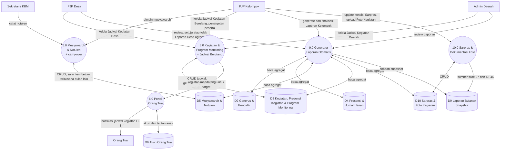
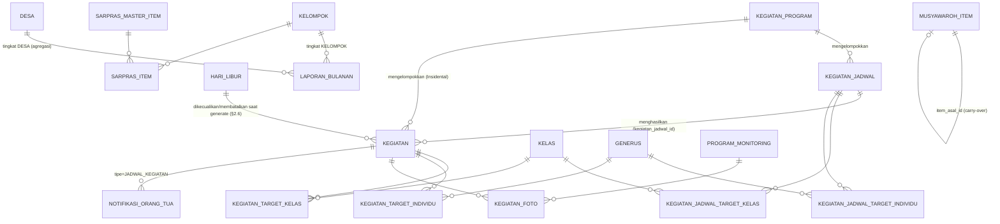

# Software Requirements Specification (SRS)
# SI-PPG — Fase 2: Pelaporan Otomatis & Multi-Kelompok

**Nama Sistem:** SI-PPG — Sistem Informasi Pembinaan Generus
**Versi Dokumen:** 1.7
**Tanggal:** 12 Agustus 2026
**Status:** Draft
**Klasifikasi:** Internal — Terbatas
**Dokumen Sumber:** [PRD-Aplikasi-Pendataan-Pelaporan-PPG.md](PRD-Aplikasi-Pendataan-Pelaporan-PPG.md) (khususnya §14 Fase 2)
**Dokumen Terkait:** [SRS-Fase-1.md](SRS-Fase-1.md), [UCIC-Fase-2.md](UCIC-Fase-2.md), [UIUX-Reference-Fase-2.md](UIUX-Reference-Fase-2.md)

> **Catatan Ruang Lingkup:** Dokumen ini **melengkapi**, bukan menggantikan, [SRS-Fase-1.md](SRS-Fase-1.md) — seluruh platform, arsitektur, autentikasi, RBAC dasar, dan modul Fase 1 (Master Data, Sensus, Kalender & Realisasi Materi, Presensi & Jurnal Harian, Musyawaroh dasar, Kegiatan & Program Monitoring, Portal Orang Tua dasar, Mekanisme Offline, Dashboard Kelompok, Ekspor Cetak) tetap berlaku apa adanya kecuali disebutkan eksplisit sebagai perluasan di sini. Dokumen ini hanya membahas modul yang **ditambahkan atau diperluas** di Fase 2 sesuai PRD §14: Jadwal Kegiatan Berulang & penargetan peserta (§9.12), Generator Laporan Otomatis termasuk agregasi berjenjang Desa **& Daerah** (§9.16), carry-over Musyawaroh otomatis (§9.14), Sarana & Prasarana (§9.10), Dokumentasi Foto Kegiatan (§9.15), Dashboard/agregasi Desa (§9.17), dan notifikasi Portal Orang Tua untuk jadwal Kegiatan (§9.18). Modul Fase 3–4 (Penilaian Sikap, Prestasi Bacaan, Lembar Penghubung, Rapor, Keuangan, Monitoring 29 Karakter, **Dashboard Daerah penuh**) **tidak dibahas** di sini — agregasi *laporan* Daerah dimajukan ke Fase 2 (PRD v1.12 §14), lihat §3.5; Dashboard Daerah tetap Fase 4.

---

## Daftar Isi

1. [Deskripsi & Ruang Lingkup](#1-deskripsi--ruang-lingkup)
2. [Kegiatan: Jadwal Berulang & Penargetan Peserta](#2-kegiatan-jadwal-berulang--penargetan-peserta)
3. [Generator Laporan Otomatis](#3-generator-laporan-otomatis)
4. [Musyawaroh: Carry-over Otomatis](#4-musyawaroh-carry-over-otomatis)
5. [Sarana & Prasarana](#5-sarana--prasarana)
6. [Dokumentasi Foto Kegiatan](#6-dokumentasi-foto-kegiatan)
7. [Dashboard & Agregasi Desa](#7-dashboard--agregasi-desa)
8. [Portal Orang Tua: Notifikasi Jadwal Kegiatan](#8-portal-orang-tua-notifikasi-jadwal-kegiatan)
9. [Endpoint API (Tambahan Fase 2)](#9-endpoint-api-tambahan-fase-2)
10. [Skema Database (Tambahan Fase 2)](#10-skema-database-tambahan-fase-2)
11. [Roadmap Sprint](#11-roadmap-sprint)

---

## 1. Deskripsi & Ruang Lingkup

Fase 2 adalah rilis kedua SI-PPG sebagaimana ditetapkan pada [PRD §14](PRD-Aplikasi-Pendataan-Pelaporan-PPG.md#14-roadmap--fase-pengembangan). Fokus utamanya dua hal: **(1)** mengotomasi kerja yang di Fase 1 masih manual berulang — jadwal Kegiatan yang harus dibuat satu-satu, notulen musyawaroh yang harus disalin manual tiap bulan, laporan bulanan yang disusun manual di PPTX — dan **(2)** membuka visibilitas berjenjang ke tingkat Desa yang di Fase 1 masih terbatas ke Kelompok saja.

| Modul | Cakupan | Acuan PRD |
|-------|---------|-----------|
| **Kegiatan: Jadwal Berulang & Penargetan** | Frekuensi Rutin (Harian/Bulanan, generate otomatis) vs Insidental; penargetan peserta by Jenjang/Kelas atau individu | §9.12 |
| **Generator Laporan Otomatis** | Laporan HTML interaktif 16:9 (46 slide), ekspor PDF print-CSS, siklus draft→final→disetujui, agregasi berjenjang Desa & Daerah, penelusuran (drill-down) laporan individual jenjang di bawahnya | §9.16, §13 |
| **Musyawaroh: Carry-over Otomatis** | Item notulen "belum terlaksana" otomatis muncul lagi bulan berikutnya | §9.14 |
| **Sarana & Prasarana** | Checklist 14 item baku + kondisi, per Kelompok | §9.10 |
| **Dokumentasi Foto Kegiatan** | Upload foto per Kegiatan/Program Monitoring, kompresi otomatis | §9.15 |
| **Dashboard & Agregasi Desa** | Ringkasan lintas-Kelompok untuk PJP Desa | §9.17 |
| **Portal Orang Tua: Notifikasi Jadwal Kegiatan** | Reminder H-1 kegiatan tambahan/penguatan ke orang tua generus target | §9.18 |

### 1.1 Asumsi & Batasan

- **Tidak ada perubahan arsitektur** dari Fase 1 (SRS-Fase-1 §2) — tetap Laravel 13 + Livewire 3 + Tailwind di shared hosting cPanel, dua guard (`web`/`orangtua`), RBAC `spatie/laravel-permission`, audit trail `spatie/laravel-activitylog`. Fase 2 murni menambah tabel, Livewire component, dan job terjadwal baru di atas fondasi yang sama.
- **Laporan Daerah (agregasi PPG) kini ada sejak Fase 2** (dimajukan dari rencana awal Fase 4, PRD v1.12 §14) — Fase 2 menghasilkan laporan tingkat Kelompok, agregasi tingkat Desa, **dan agregasi tingkat Daerah** (§3.5), termasuk penelusuran (drill-down) laporan individual jenjang di bawahnya untuk PJP Desa & Admin Daerah. Yang **tetap** Fase 4 adalah **Dashboard Daerah penuh** (ringkasan real-time lintas-Desa di luar siklus laporan bulanan, §9.17) — beda dari Dashboard Desa (§7) yang sudah aktif Fase 2.
- **Belum ada Sarpras/Keuangan/Penilaian Sikap/dst di laporan otomatis kecuali Sarpras** — mapping 46-slide (PRD §13) mengasumsikan seluruh modul sumbernya sudah ada; slide yang sumbernya masih Fase 3 (mis. jika suatu saat ditambah) tetap tidak tersedia sampai modul sumbernya ada. Untuk Fase 2, seluruh 46 slide pada mapping PRD §13 **sudah punya sumber data** (Sensus, Presensi, 29 Karakter — catatan: 29 Karakter §9.13 sendiri masih Fase 3, sehingga slide 15–26 pada laporan Fase 2 tampil sebagai "Belum tersedia — modul Monitoring 29 Karakter menyusul Fase 3", bukan dikosongkan diam-diam).
- **Fallback ekspor PDF via dompdf tetap tidak dibangun di Fase 2** (SRS-Fase-1 §15, PRD §18.2) — jalur utama tetap print stylesheet + `window.print()`, konsisten dengan Fase 1.
- **Dashboard Daerah tidak dibangun di Fase 2** — hanya perluasan Dashboard Kelompok (Fase 1, SRS-Fase-1 §14) menjadi juga tersedia untuk PJP Desa dalam bentuk agregasi lintas-Kelompok di Desanya (§7).
- **Kompresi foto (§6) dilakukan di sisi klien sebelum upload** (PRD §9.15) — mensyaratkan JavaScript `<canvas>` resize di browser; tidak ada pemrosesan gambar di server (menghindari dependency image-processing tambahan di shared hosting).
- **Kalender Hari Libur (§2.6) berlaku satu untuk seluruh Daerah, tidak per Kelompok/Desa** — konsisten dengan keputusan tidak ada multi-tenant (PRD §18.4); Kelompok yang secara lokal tetap masuk meski tanggal tsb hari libur nasional (jarang, tapi mungkin) tetap bisa dicatat manual sebagai Kegiatan Insidental terpisah, di luar Jadwal yang otomatis mengecualikan tanggal tsb.
- **Rotasi Tempat (§2.7) dan Pengelompokan Program (§2.8) murni fitur pencatatan/pelaporan** — tidak ada validasi tambahan di luar yang sudah ada (cakupan tingkat tetap divalidasi per Jadwal/Kegiatan individual, bukan per Program).
- **Peringatan tabrakan jadwal (§2.3) bersifat non-blocking** — sistem tidak punya konsep jam/waktu (SRS-Fase-1 §17.8 & §10.1 dokumen ini, `kegiatan` hanya punya `tanggal`), sehingga tidak bisa memastikan dua Jadwal di hari yang sama benar-benar bentrok waktu; keputusan akhir tetap di tangan pembuat Jadwal.

### 1.2 Perluasan Diagram Alur Data (DFD)

Diagram konteks (Level 0, SRS-Fase-1 §1.2.1) tidak berubah — tidak ada entitas eksternal baru di Fase 2, seluruh proses baru tetap dijalankan oleh aktor yang sama (Guru, Sekretaris KBM, PJP Kelompok, PJP Desa, Admin Daerah, Petugas Presensi Kegiatan, Orang Tua).

Diagram Level 1 (SRS-Fase-1 §1.2.2) mendapat tambahan dua proses baru dan perluasan dua proses existing:



Proses `2.0 Master Data & Sensus`, `3.0 Kalender & Realisasi Materi`, `4.0 Presensi & Jurnal Harian`, `6.0 Portal Orang Tua`, `7.0 Dashboard & Ekspor Cetak` tidak berubah strukturnya — hanya `6.0`/`7.0` yang mendapat sumber data tambahan (notifikasi jadwal Kegiatan; agregasi Desa) sebagaimana dijelaskan di §7–§8.

---

## 2. Kegiatan: Jadwal Berulang & Penargetan Peserta

Sesuai PRD §9.12 (bagian "Mekanisme Kegiatan Berulang"). Modul ini **memperluas**, bukan menggantikan, modul Kegiatan Fase 1 (SRS-Fase-1 §18) — tabel `kegiatan`, `kegiatan_peserta`, `kegiatan_petugas_presensi` tetap ada dan tetap dipakai persis seperti Fase 1 untuk Kegiatan Insidental.

### 2.1 Konsep: Kegiatan Insidental vs Kegiatan Rutin

| Aspek | Insidental (Fase 1, tidak berubah) | Rutin (Fase 2, baru) |
|-------|-------------------------------------|------------------------|
| Cara dibuat | Satu baris `kegiatan` dibuat langsung, manual, tiap kejadian | Satu baris `kegiatan_jadwal` (pola) menghasilkan **banyak** baris `kegiatan` sekaligus (generate otomatis) |
| Dipakai untuk | Jadwal tidak pasti/tidak berpola (mis. Case 4 PRD §9.12: kadang 1 hari, kadang beberapa hari) | Jadwal yang sudah pasti berulang (mis. pengajian rutin mingguan/bulanan) |
| Sub-tipe | — | **Rutin Harian** (hari tertentu tiap minggu) atau **Rutin Bulanan** (hari + minggu-ke tertentu tiap bulan) |

Kedua tipe menghasilkan baris `kegiatan` yang **identik strukturnya** (SRS-Fase-1 §17.8, diperluas §10 dokumen ini) — perbedaannya hanya di *bagaimana* baris itu dibuat. Setelah ter-generate, sebuah kejadian Kegiatan hasil Jadwal Rutin diperlakukan sama persis dengan Kegiatan Insidental untuk keperluan presensi, rekap, dan laporan (UCIC UC-22/UC-23 SRS-Fase-1 §18.2 tidak berubah).

### 2.2 Jadwal Kegiatan Berulang (`kegiatan_jadwal`)

| Field | Tipe | Keterangan |
|---|---|---|
| nama | String | |
| deskripsi | Text, nullable | Baru di Fase 2 — juga ditambahkan ke `kegiatan` Insidental (§2.5) |
| tingkat | Enum | `KELOMPOK`/`DESA`/`DAERAH` — sama aturan cakupan penyelenggara & peserta seperti Kegiatan Insidental (SRS-Fase-1 §18.1) |
| penyelenggara_id | FK polimorfik | Sama pola dengan `kegiatan.penyelenggara_id` |
| jenis | Enum | `TAMBAHAN`/`PENGUATAN`/`PROGRAM_KHUSUS`/`EKSTRAKURIKULER` |
| frekuensi_tipe | Enum | `HARIAN` / `BULANAN` / `MINGGUAN_INTERVAL` / `KURIKULUM` — lihat definisi tiap sub-pola di Aturan Bisnis bawah dan §2.9 untuk `KURIKULUM` |
| hari_dalam_minggu | JSON array | Nilai dari `SENIN`..`MINGGU`, minimal 1 elemen — dipakai ketiga sub-pola |
| minggu_ke_dalam_bulan | JSON array, nullable | Nilai integer 1–5 **atau** literal `TERAKHIR` — **wajib diisi** jika `frekuensi_tipe = BULANAN`, **harus NULL** jika `HARIAN`/`MINGGUAN_INTERVAL` |
| interval_minggu | SmallInt, nullable | Kelipatan minggu, mis. `2` = tiap 2 minggu sekali — **wajib diisi (≥2)** jika `frekuensi_tipe = MINGGUAN_INTERVAL`, **harus NULL** untuk sub-pola lain |
| jumlah_sesi_per_kemunculan | SmallInt | Default 1 — jumlah kejadian `kegiatan` yang dibuat pada tanggal yang sama tiap kali pola cocok (mendukung kasus "2× tiap Sabtu terjadwal") |
| tanggal_mulai | Date | |
| tanggal_selesai | Date | Wajib diisi (tidak ada Jadwal tanpa batas akhir) — umumnya mengikuti akhir tahun kalender pendidikan berjalan |
| tempat | String, nullable | Tempat tetap untuk seluruh kejadian — dipakai hanya bila `rotasi_tempat` NULL (§2.7) |
| rotasi_tempat | JSON array, nullable | Daftar tempat bergantian antar kejadian (§2.7) — bila diisi, mengesampingkan `tempat` statis |
| target_tipe | Enum | `SEMUA` / `JENJANG_KELAS` / `INDIVIDU` — lihat §2.4 |
| kegiatan_program_id | FK, nullable | Label pengelompokan opsional lintas-tingkat untuk rekap gabungan (§2.8) — tidak memengaruhi validasi cakupan |
| status | Enum | `AKTIF` / `NONAKTIF` — `NONAKTIF` menghentikan regenerasi kejadian mendatang (§2.3) tanpa menghapus kejadian yang sudah ter-generate |
| dibuat_oleh | FK → users | |

**Aturan Bisnis:**
- Field `tingkat` & `penyelenggara_id` terkunci sesuai role pembuat, identik aturan `kegiatan` Insidental (SRS-Fase-1 §18.1, UCIC UC-21) — PJP Kelompok hanya `KELOMPOK`, PJP Desa hanya `DESA`, Admin Daerah hanya `DAERAH`.
- `minggu_ke_dalam_bulan` dan `hari_dalam_minggu` **dikombinasikan sebagai cartesian product** — mis. `hari=[SABTU]` + `minggu_ke=[2,4]` menghasilkan Kegiatan pada Sabtu-ke-2 **dan** Sabtu-ke-4 tiap bulan (dua tanggal berbeda per bulan), bukan salah satu saja.
- **Definisi "minggu ke-N dalam bulan":** dihitung dari kemunculan hari-dalam-minggu tsb secara berurutan mulai tanggal 1 bulan itu (bukan nomor pekan ISO-8601) — mis. bila 1 Agustus 2026 jatuh hari Sabtu, maka Sabtu tsb adalah "minggu ke-1", Sabtu berikutnya (8 Agustus) "minggu ke-2", dst. Bila bulan tsb tidak punya kemunculan ke-N (mis. minggu ke-5 di bulan pendek), bulan itu dilewati tanpa error untuk nilai integer eksplisit.
- **Definisi `TERAKHIR`:** merujuk ke kemunculan hari-dalam-minggu **terakhir** dalam bulan tsb — dihitung ulang tiap bulan (bisa jatuh di minggu ke-4 atau ke-5 tergantung jumlah hari bulan itu), berbeda dari nilai integer tetap yang bisa "kosong" di bulan pendek. Dipakai untuk pola seperti "Sabtu minggu terakhir tiap bulan" yang tidak mau digantung ke satu nomor minggu.
- **Definisi `MINGGUAN_INTERVAL`:** minggu aktif dihitung dari kelipatan `interval_minggu` sejak minggu yang memuat `tanggal_mulai` (dianggap minggu ke-0, Senin sebagai awal minggu/ISO-8601) — lepas dari batas bulan kalender, berbeda dari `BULANAN` yang selalu reset tiap bulan. Mis. `tanggal_mulai` = 3 Agustus 2026 (Senin), `interval_minggu = 2` → minggu aktif adalah minggu yang memuat 3 Agustus, lalu minggu yang memuat 17 & 31 Agustus, dst. (loncat 2 minggu); pada tiap minggu aktif, Kegiatan terjadi di hari-hari pada `hari_dalam_minggu`.

### 2.3 Generate & Regenerasi Kejadian

**Keputusan Teknis:** Kejadian (`kegiatan`) di-generate **sekaligus di muka** untuk seluruh rentang `tanggal_mulai`..`tanggal_selesai` saat Jadwal disimpan — **bukan** oleh job harian yang mengecek "apakah hari ini cocok pola". Alasan: rentang Jadwal (umumnya satu tahun kalender pendidikan) sudah diketahui penuh sejak awal (konsisten dengan PRD §9.12: "Kelompok ... sudah diplot jadwalnya di awal"), sehingga generate di muka memberi kepastian jumlah & tanggal kejadian yang bisa langsung ditinjau (preview) sebelum disimpan, dan menyederhanakan implementasi (tidak perlu scheduled job baru khusus untuk ini — beda dari reminder H-1 di §8 yang memang harus harian).

```
Simpan Jadwal Kegiatan Berulang (baru)
  → Validasi: tanggal_selesai > tanggal_mulai; minggu_ke_dalam_bulan/interval_minggu sesuai frekuensi_tipe (§2.2)
  → Cek tabrakan (non-blocking): cari kegiatan_jadwal berstatus AKTIF lain dengan
    (tingkat, penyelenggara_id) sama, hari_dalam_minggu beririsan, dan rentang tanggal beririsan
    → jika ada, siapkan peringatan untuk ditampilkan di preview (tidak menghalangi proses lanjut)
  → Ekspansi pola → daftar {tanggal, sesi_ke} sepanjang tanggal_mulai..tanggal_selesai:
      untuk tiap tanggal dalam rentang:
        jika tanggal termasuk rentang HARI_LIBUR manapun (§2.6) → lewati tanggal ini sepenuhnya,
          catat sebagai "dilewati karena libur" untuk ditampilkan di preview, lanjut ke tanggal berikutnya
        jika frekuensi_tipe = HARIAN dan nama_hari(tanggal) ∈ hari_dalam_minggu → cocok
        jika frekuensi_tipe = BULANAN dan nama_hari(tanggal) ∈ hari_dalam_minggu:
            jika minggu_ke_dalam_bulan berisi angka N dan minggu_ke(tanggal) = N → cocok
            jika minggu_ke_dalam_bulan berisi TERAKHIR dan tanggal = kemunculan terakhir
              hari tsb dalam bulan itu → cocok
        jika frekuensi_tipe = MINGGUAN_INTERVAL dan nama_hari(tanggal) ∈ hari_dalam_minggu
            dan nomor_minggu(tanggal, acuan=tanggal_mulai) MOD interval_minggu = 0 → cocok
        jika cocok: tambahkan (tanggal, sesi_ke) untuk sesi_ke = 1..jumlah_sesi_per_kemunculan
  → Tampilkan preview: jumlah total kejadian yang akan dibuat, jumlah tanggal dilewati karena
    hari libur, peringatan tabrakan (bila ada), + rentang tanggal (UCIC UC-28)
  → Setelah dikonfirmasi: INSERT satu baris kegiatan per (tanggal, sesi_ke), field disalin dari Jadwal
    (nama, deskripsi, tingkat, penyelenggara_id, jenis, kegiatan_program_id), status awal TERJADWAL,
    kegiatan_jadwal_id = id Jadwal ini, target disalin (§2.4), tempat ditentukan sesuai §2.7
    (statis atau hasil rotasi_tempat)
```

**Regenerasi saat Jadwal diedit** (mis. perpanjang `tanggal_selesai`, ubah `hari_dalam_minggu`/`minggu_ke_dalam_bulan`, ubah target):

```
Simpan perubahan Jadwal (existing)
  → Hitung ulang daftar {tanggal, sesi_ke} sesuai pola BARU (termasuk pengecekan HARI_LIBUR, §2.6),
    hanya untuk tanggal >= hari ini
  → Kejadian existing dengan kegiatan_jadwal_id ini DAN tanggal >= hari ini
    DAN belum punya baris kegiatan_peserta (belum ada presensi tercatat sama sekali)
      → dihapus, lalu di-generate ulang sesuai pola baru
  → Kejadian existing dengan tanggal < hari ini, ATAU sudah punya kegiatan_peserta
      → TIDAK PERNAH disentuh — histori presensi yang sudah tercatat selalu aman
  → Kejadian baru yang cocok pola & belum pernah ada → di-generate (INSERT)
```

Proses **terpisah** dipicu khusus saat `hari_libur` ditambah/diubah (bukan saat Jadwal diedit) — lihat §2.6 & UCIC-Fase-2 UC-39: kejadian mendatang yang belum ada presensi dan bertabrakan dengan libur baru ditandai `TIDAK_TERLAKSANA`, bukan dihapus+regenerasi seperti alur di atas.

**Aturan Bisnis:**
- Kombinasi `(kegiatan_jadwal_id, tanggal, sesi_ke)` **unik** — mencegah generate ganda bila proses generate dijalankan berulang secara tidak sengaja (idempotent by design, pola sama seperti `client_uuid` di Presensi Harian, SRS-Fase-1 §13.2).
- Menonaktifkan Jadwal (`status = NONAKTIF`) tidak menghapus kejadian mendatang yang sudah ter-generate — hanya mencegah regenerasi/perpanjangan lebih lanjut; PJP yang ingin membatalkan kejadian mendatang tertentu tetap harus menghapusnya satu-satu dari daftar Kegiatan (setara UC-21 SRS-Fase-1 §18.1) atau menandainya `TIDAK_TERLAKSANA`.
- Batas praktis: satu Jadwal maksimal menghasilkan **370 kejadian** per generate/regenerasi (kira-kira 1 tahun kalender pendidikan harian) — mencegah rentang tanggal yang salah input (mis. lupa mengisi tahun) menghasilkan puluhan ribu baris; ditolak dengan pesan jelas jika terlampaui, minta persempit rentang tanggal.

### 2.4 Penargetan Peserta

Berlaku untuk **kedua** jenis Kegiatan (Insidental maupun tiap Jadwal Rutin) — field `target_tipe` ada di `kegiatan_jadwal` (§2.2) **dan** ditambahkan ke `kegiatan` (§2.5) untuk Kegiatan Insidental.

| `target_tipe` | Perilaku |
|---|---|
| `SEMUA` (default) | Perilaku Fase 1 apa adanya — seluruh generus aktif dalam cakupan `tingkat` (SRS-Fase-1 §18.1) menjadi calon peserta, tidak ada tabel target tambahan yang dipakai. |
| `JENJANG_KELAS` | Calon peserta dipersempit ke generus yang `kelas_id`-nya termasuk daftar Kelas terpilih (`kegiatan_target_kelas`/`kegiatan_jadwal_target_kelas`, §10). UI menyediakan jalan pintas "pilih per Jenjang" yang otomatis mencentang seluruh Kelas berjenjang tsb dalam cakupan `tingkat` — hasil pilihan tetap disimpan sebagai daftar `kelas_id` konkret (bukan filter `jenjang_id` dinamis), sehingga menambah Kelas baru di jenjang yang sama di kemudian hari **tidak** otomatis ikut tertarget (harus ditambahkan manual) — konsisten dengan pola "snapshot di titik pembuatan" yang sudah dipakai di `kegiatan_peserta.kelompok_id` (SRS-Fase-1 §18.1). |
| `INDIVIDU` | Calon peserta dipersempit ke daftar Generus spesifik (`kegiatan_target_individu`/`kegiatan_jadwal_target_individu`, §10), dipilih lewat pencarian gabungan nama + jenis kelamin yang bisa dijalankan berulang untuk menambah pilihan secara kumulatif (UCIC UC-21 diperluas). |

**Aturan Bisnis:**
- Kelas/Generus yang dipilih sebagai target **wajib berada dalam cakupan `tingkat`** Kegiatan/Jadwal — mis. Kegiatan tingkat Kelompok hanya boleh menargetkan Kelas/Generus dari Kelompok itu sendiri; Kegiatan tingkat Desa boleh lintas-Kelompok tapi harus tetap dalam Desa yang sama. Divalidasi di level aplikasi saat menyimpan (pola sama dengan validasi cakupan peserta `tingkat` di SRS-Fase-1 §18.1).
- Untuk Kegiatan hasil generate dari Jadwal Rutin, target **disalin (snapshot)** dari `kegiatan_jadwal_target_kelas`/`kegiatan_jadwal_target_individu` ke `kegiatan_target_kelas`/`kegiatan_target_individu` pada tiap kejadian saat generate (§2.3) — bukan dirujuk secara dinamis ke Jadwal. Konsekuensinya: mengedit target di Jadwal **tidak** mengubah target kejadian yang sudah ter-generate di masa lalu; hanya kejadian yang ikut diregenerasi (§2.3, tanggal ≥ hari ini & belum ada presensi) yang mendapat target baru.
- **Dampak ke Grid Presensi (UC-23, SRS-Fase-1 §18.2):** daftar calon peserta yang ditampilkan Petugas Presensi kini mengikuti `target_tipe` Kegiatan tsb, bukan lagi selalu "seluruh generus aktif kelompok" — untuk `target_tipe = SEMUA` perilakunya identik Fase 1; untuk `JENJANG_KELAS`/`INDIVIDU`, daftar dipersempit ke target, **tetap** difilter tambahan ke `kelompok_id` penugasan Petugas Presensi tsb (dua lapis filter: target Kegiatan ∩ Kelompok penugasan).

### 2.5 Perluasan Tabel `kegiatan` (Insidental)

Field baru pada `kegiatan` (skema lengkap di §10) yang berlaku juga untuk Kegiatan Insidental, bukan cuma hasil generate:

| Field baru | Keterangan |
|---|---|
| deskripsi | Text, nullable — sama seperti `kegiatan_jadwal.deskripsi` |
| kegiatan_jadwal_id | FK, nullable — NULL untuk Kegiatan Insidental; terisi untuk kejadian hasil generate Jadwal Rutin |
| sesi_ke | SmallInt, default 1 — untuk Kegiatan Insidental yang juga perlu multi-sesi manual (jarang, tapi tidak dilarang) |
| target_tipe | Enum, default `SEMUA` — dipilih langsung saat membuat Kegiatan Insidental (UC-21 diperluas, UCIC-Fase-2 UC-29 catatan) |
| kegiatan_program_id | FK, nullable — label pengelompokan opsional (§2.8), sama field dengan `kegiatan_jadwal.kegiatan_program_id` |
| catatan_status | Text, nullable — diisi otomatis sistem saat kejadian dibatalkan karena Hari Libur (§2.6, UCIC-Fase-2 UC-39); kosong untuk kejadian yang statusnya diubah manual oleh pengguna |

### 2.6 Kalender Hari Libur & Pembatalan Otomatis

Melengkapi celah yang diidentifikasi pasca-v1.0: generate Jadwal Kegiatan Berulang (§2.3) sebelumnya tidak punya cara mengecualikan hari libur. Satu kalender berlaku **untuk seluruh Daerah** (bukan per Kelompok/Desa, konsisten §18.4 PRD — tidak ada multi-tenant), dikelola Admin Daerah.

| Field (`hari_libur`) | Tipe | Keterangan |
|---|---|---|
| nama | String | mis. "Libur Idul Fitri 1448 H", "Tahun Baru Masehi" |
| tanggal_mulai | Date | |
| tanggal_selesai | Date | Sama dengan `tanggal_mulai` untuk libur satu hari; bisa rentang untuk libur panjang |
| sumber | Enum | `MANUAL` (default) / `OTOMATIS_GOOGLE` — lihat §2.6.1 |
| google_event_id | String, nullable, unik | Hanya terisi bila `sumber = OTOMATIS_GOOGLE` — ID event dari Google Calendar API, kunci upsert sinkronisasi |
| disunting_manual | Boolean | Default `false`; jadi `true` begitu baris `OTOMATIS_GOOGLE` diedit manual oleh Admin Daerah — melindungi dari tertimpa sinkronisasi berikutnya |
| dihapus_pada | Timestamp, nullable | Soft-delete khusus baris `OTOMATIS_GOOGLE` (§2.6.1) — baris `MANUAL` tetap hard-delete seperti semula |
| dibuat_oleh | FK → users, nullable | Admin Daerah untuk baris `MANUAL`; NULL untuk baris hasil sinkronisasi otomatis |

**Aturan Bisnis:**
- Generate/regenerasi Jadwal Kegiatan Berulang (§2.3) selalu mengecek `hari_libur` (memfilter `dihapus_pada IS NULL`) — tanggal yang termasuk rentang hari libur manapun **tidak** menghasilkan kejadian `kegiatan` sama sekali (dilewati, bukan dibuat lalu langsung ditandai `TIDAK_TERLAKSANA`).
- **Sinkronisasi retroaktif:** menambah atau mengubah `hari_libur` **setelah** ada Jadwal yang sudah menghasilkan kejadian memicu proses latar belakang (UCIC-Fase-2 UC-39) yang mencari seluruh `kegiatan` dengan `kegiatan_jadwal_id` terisi, `tanggal` di dalam rentang hari libur (baru/berubah) tsb, **dan** `tanggal >= hari ini`, **dan** belum ada baris `kegiatan_peserta` — kejadian tsb ditandai `status = TIDAK_TERLAKSANA` dengan `catatan_status = "Dibatalkan otomatis — Hari Libur: {nama}"` (bukan dihapus, agar riwayat tetap terlihat kenapa tidak terlaksana). Kejadian yang sudah lewat atau sudah ada presensinya tidak disentuh — prinsip yang sama dengan regenerasi biasa (§2.3). Berlaku sama baik `hari_libur` tsb dibuat manual maupun hasil sinkronisasi Google (§2.6.1).
- Kegiatan **Insidental** yang dibuat manual pada tanggal yang kebetulan hari libur **tidak diblokir** — hanya ditampilkan peringatan non-blocking saat disimpan ("Tanggal ini termasuk Hari Libur: {nama}"), karena kadang memang ada kegiatan khusus yang sengaja diadakan saat libur (mis. kegiatan Ramadhan).
- Menghapus `hari_libur` bersumber `MANUAL` **tidak** otomatis mengembalikan kejadian yang sudah ditandai `TIDAK_TERLAKSANA` — pembuat Jadwal yang menilai apakah perlu regenerasi manual. Menghapus baris bersumber `OTOMATIS_GOOGLE` mengikuti aturan soft-delete §2.6.1, dengan konsekuensi kejadian yang sama (tidak dikembalikan otomatis).

#### 2.6.1 Sinkronisasi Otomatis dari Google Calendar (Opsional, Pelengkap)

**Keputusan Teknis:** Hari libur **nasional** Indonesia bisa disinkronkan otomatis dari kalender publik Google (`id.indonesian#holiday@group.v.calendar.google.com`), dibaca lewat Google Calendar API v3 (`events.list`) memakai **API key sederhana** (bukan OAuth) — kalender ini publik dan read-only, sehingga tidak perlu alur otorisasi per-akun. Ini murni **pelengkap opsional**: libur internal organisasi (libur semester PPG, dsb.) tetap harus diisi manual (§2.6) karena tidak tercakup di kalender publik Google, dan seluruh mekanisme Kalender Hari Libur tetap berfungsi penuh tanpa integrasi ini bila API key belum dikonfigurasi.

```
Job terjadwal bulanan (Laravel Scheduler, pola sama snapshot Sensus SRS-Fase-1 §7)
  → jika GOOGLE_CALENDAR_API_KEY belum dikonfigurasi di .env → lewati proses ini sepenuhnya (no-op, tanpa error)
  → panggil Google Calendar API events.list untuk kalender publik libur nasional Indonesia,
    rentang waktu = tahun berjalan + tahun depan
  → untuk tiap event hasil panggilan (google_event_id, nama, tanggal):
      jika belum ada baris hari_libur dengan google_event_id ini
        → INSERT baru (sumber=OTOMATIS_GOOGLE, disunting_manual=false)
      jika sudah ada DAN disunting_manual=false DAN dihapus_pada IS NULL
        → UPDATE nama/tanggal bila berubah dari sisi Google (jarang, tapi tanggal berbasis
          kalender bulan seperti Idul Fitri kadang dikonfirmasi ulang mendekati hari-H)
      jika sudah ada DAN (disunting_manual=true ATAU dihapus_pada terisi)
        → lewati baris ini, tidak disentuh sama sekali
  → tiap baris baru/berubah yang lolos di atas memicu sinkronisasi retroaktif yang sama
    seperti UC-39 (kejadian mendatang yang bertabrakan & belum ada presensi otomatis dibatalkan)
  → kegagalan panggilan API (kuota habis, jaringan bermasalah) dicatat di log, TIDAK menghentikan
    proses lain — dicoba lagi di siklus bulan berikutnya, tanpa alert khusus (fitur pelengkap,
    bukan kritikal — prinsip sama dengan risiko kanal WhatsApp, PRD §16)
```

**Aturan Bisnis:**
- Mengedit (nama/tanggal) baris `hari_libur` bersumber `OTOMATIS_GOOGLE` melalui UC-38 otomatis men-set `disunting_manual = true` — melindungi perubahan Admin Daerah dari tertimpa sinkronisasi bulan berikutnya.
- Menghapus baris bersumber `OTOMATIS_GOOGLE` melakukan **soft-delete** (`dihapus_pada` diisi timestamp saat itu, baris disembunyikan dari daftar aktif & dari pengecekan generate §2.3) — mencegah baris tsb "hidup lagi" saat sinkronisasi berikutnya menemukan `google_event_id` yang sama. Baris bersumber `MANUAL` tetap **hard-delete** seperti UC-38 semula (tidak ada `google_event_id` yang perlu dijaga agar tidak muncul lagi).
- Tidak ada halaman "Kelola Integrasi Google" terpisah di Fase 2 — konfigurasi API key murni di level environment (`.env`), bukan UI, sesuai prinsip minimal-scope (SRS-Fase-1 §18.3 pola cron/scheduler tanpa daemon tambahan).
- Kalender publik Google hanya mencakup libur **nasional** — tidak ada jaminan/klaim kelengkapan untuk kebutuhan spesifik organisasi; Admin Daerah tetap bertanggung jawab melengkapi libur internal secara manual.

### 2.7 Rotasi Tempat

Alternatif dari `tempat` statis (§2.2) untuk Jadwal yang lokasinya bergantian tiap kejadian (mis. tuan rumah bergilir antar Kelompok se-Desa).

**Aturan Bisnis:**
- `rotasi_tempat` adalah array string terurut (mis. `["KBM Melati", "KBM Kenanga", "KBM Mawar"]`). Bila diisi, field `tempat` statis **diabaikan** untuk kejadian hasil generate.
- Kejadian diurutkan `tanggal ASC, sesi_ke ASC`; kejadian ke-i (dihitung dari 0, hanya kejadian yang benar-benar dibuat — tidak termasuk tanggal yang dilewati karena hari libur, §2.6) mendapat `rotasi_tempat[i MOD panjang_rotasi]` sebagai tempatnya, berulang dari awal daftar setelah habis.
- Regenerasi (§2.3) menghitung ulang indeks rotasi dari urutan penuh kejadian aktif Jadwal tsb — bukan counter tersimpan terpisah, agar selalu konsisten dengan urutan tanggal aktual.
- Tidak berlaku untuk Kegiatan Insidental (§2.5) — Insidental hanya punya `tempat` tunggal per kejadian karena memang dibuat satu-satu secara manual.

### 2.8 Pengelompokan Program (Opsional)

Label pengelompokan lintas-tingkat murni untuk kebutuhan rekap gabungan — mis. Case 2/3 PRD §9.12: pengajian tingkat Kelompok + Desa/Daerah untuk jenjang yang sama, secara konsep satu program walau dua/tiga Jadwal berbeda.

| Field (`kegiatan_program`) | Tipe | Keterangan |
|---|---|---|
| nama | String | mis. "Pengajian APR & AR" |
| tingkat_tertinggi | Enum | `KELOMPOK`/`DESA`/`DAERAH` — cakupan gabungan tertinggi, diisi manual oleh pembuat sebagai metadata informatif (bukan dihitung otomatis dari anggotanya) |
| dibuat_oleh | FK → users | |

**Aturan Bisnis:**
- Satu `kegiatan_jadwal` atau `kegiatan` (Insidental) bisa ditandai dengan **paling banyak satu** `kegiatan_program_id` — pengelompokan flat satu tingkat, bukan hierarki program bertingkat.
- Menandai `kegiatan_program_id` **tidak mengubah** validasi cakupan tingkat/penyelenggara masing-masing Jadwal/Kegiatan yang ditandainya — tiap Jadwal/Kegiatan tetap divalidasi sendiri-sendiri sesuai §2.2/SRS-Fase-1 §18.1.
- Siapa pun yang berwenang membuat Jadwal/Kegiatan di tingkat manapun bisa membuat & memakai label Program — tidak ada pembatasan role tambahan di luar `kegiatan-jadwal.manage`/`kegiatan.manage` yang sudah ada.
- Dipakai sebagai filter di halaman Rekap Program (UCIC-Fase-2 UC-40) — menjumlahkan kehadiran seluruh kejadian `kegiatan` (dari Jadwal manapun maupun Insidental) yang berbagi `kegiatan_program_id` yang sama dalam satu periode, dikelompokkan per tingkat/penyelenggara asal.

### 2.9 Rutin dari Kurikulum (`frekuensi_tipe = KURIKULUM`)

> **Ditambahkan pasca-konvergensi** (lihat [Visi-Konvergensi-Kurikulum-Kegiatan-Presensi.md](Visi-Konvergensi-Kurikulum-Kegiatan-Presensi.md) §5, SRS-Fase-1 §8/§9). Sub-pola keempat, khusus untuk KBM Reguler yang tanggalnya mengikuti breakdown Kalender Kurikulum (SRS-Fase-1 §8) — bukan pola hari/minggu manual seperti §2.2.

**Aturan Bisnis:**
- Wajib `target_tipe = JENJANG_KELAS` dengan **tepat satu** Kelas dipilih (§2.4) — supaya jenjang sumber breakdown Kurikulum tidak ambigu (satu Kelas = satu jenjang).
- `hari_dalam_minggu`/`minggu_ke_dalam_bulan`/`interval_minggu` tidak dipakai untuk sub-pola ini (`hari_dalam_minggu` disimpan array kosong).
- Ekspansi tanggal (§2.3) untuk `KURIKULUM` berbeda dari 3 sub-pola lain: alih-alih menghitung dari `hari_dalam_minggu`, sistem mengambil seluruh baris `kurikulum_kalender` untuk jenjang Kelas target yang beririsan dengan `tanggal_mulai`..`tanggal_selesai` Jadwal, lalu mengekspansi tiap rentang baris (`tanggal_mulai`..`tanggal_selesai` breakdown Kurikulum, bisa multi-hari) jadi tanggal individual. Filter hari libur (§2.6) tetap berlaku sama seperti sub-pola lain.
- Tiap kejadian `kegiatan` yang dihasilkan mendapat **snapshot** `materi` (dari `item_materi` baris Kurikulum yang match tanggal tsb) dan `kurikulum_kalender_id` (jejak sumber) — lihat SRS-Fase-1 §9/§10/§17.8. `realisasi_status` default `SESUAI_JADWAL` saat generate.
- Presensi kejadian `KURIKULUM` dicatat lewat alur yang sama dengan Kegiatan lain (UC-23), dengan **carve-out otorisasi** untuk Guru pengajar Kelas tsb (SRS-Fase-1 §18.1) — berbeda dari Kegiatan Tambahan biasa yang melarang Guru.
- Rollup laporan lintas-Kelompok untuk Kegiatan `KURIKULUM` (breakdown per Kelas→Kelompok→Desa/Daerah) tersedia otomatis lewat halaman Rekap KBM Lintas Kelompok (`Kurikulum\RekapKbmLintasKelompok`) — **berbeda** dari §2.8: rollup ini otomatis mengikuti struktur organisasi (tidak perlu tagging `kegiatan_program_id`), karena sinyal keterkaitannya sudah jelas (jenjang + `kurikulum_kalender_id` yang sama).

---

## 3. Generator Laporan Otomatis

Sesuai PRD §9.16 & mapping 46-slide di [PRD §13](PRD-Aplikasi-Pendataan-Pelaporan-PPG.md#13-mapping-laporan-otomatis--slide-contoh-acuan-detail-implementasi).

### 3.1 Model Status & Versi

```
DRAFT ──(finalisasi, PJP Kelompok)──> FINAL ──(submit + review Desa/Daerah)──┐
  ▲                                                                            │
  │                                                    ┌───(Setuju)───> DISETUJUI
  └──(Tolak/Minta Revisi, kembali ke draft, versi baru)┘
```

| Field (`laporan_bulanan`) | Tipe | Keterangan |
|---|---|---|
| kelompok_id | FK, nullable | Terisi untuk laporan tingkat Kelompok |
| desa_id | FK, nullable | Terisi untuk laporan tingkat Desa (hasil agregasi, §3.4) |
| daerah_id | FK, nullable | Terisi untuk laporan tingkat Daerah (hasil agregasi, §3.5) — tepat satu dari `kelompok_id`/`desa_id`/`daerah_id` terisi sesuai `tingkat` |
| tingkat | Enum | `KELOMPOK` / `DESA` / `DAERAH` |
| periode | String | Format `YYYY-MM` |
| versi | SmallInt | Mulai dari 1; revisi pasca-final membuat baris baru dengan `versi` bertambah (PRD §9.16), bukan menimpa |
| status | Enum | `DRAFT` / `FINAL` / `DISETUJUI` / `REVISI_DIMINTA` — laporan tingkat `DAERAH` tidak pernah mencapai `DISETUJUI`/`REVISI_DIMINTA` (§3.5, tidak ada approver di atas Daerah), berhenti di `FINAL` sebagai status akhir |
| snapshot_data | JSON, nullable | NULL selama `DRAFT` (data live query, §3.2); terisi begitu difinalisasi — struktur mengikuti mapping slide PRD §13 (§3.3) |
| catatan_revisi | Text, nullable | Diisi Admin Daerah/PJP Desa saat menolak (`REVISI_DIMINTA`) — tidak berlaku untuk laporan tingkat `DAERAH` |
| difinalisasi_oleh / difinalisasi_pada | FK/Timestamp, nullable | |
| disetujui_oleh / disetujui_pada | FK/Timestamp, nullable | |
| dibuat_oleh | FK → users | |

**Aturan Bisnis:**
- Selama `status = DRAFT`, seluruh angka di laporan (sensus, kehadiran, dst.) dihitung **live** dari tabel sumbernya masing-masing (Presensi, Sensus, Kegiatan, Sarpras, Musyawaroh) — konsisten PRD §9.16 "datanya live, ikut berubah bila ada koreksi di belakang layar".
- Finalisasi (`DRAFT` → `FINAL`) menyalin seluruh angka hasil hitung saat itu ke `snapshot_data` sebagai **beku** — perubahan data sumber setelahnya **tidak** memengaruhi laporan yang sudah final, konsisten PRD §9.16.
- Revisi pasca-final (Admin Daerah/PJP Desa klik "Tolak/Minta Revisi") mengembalikan laporan ke status `REVISI_DIMINTA` dengan `catatan_revisi` terisi — PJP Kelompok/Desa merevisi data sumber, lalu **memfinalisasi ulang sebagai baris baru** (`versi` + 1), baris versi sebelumnya tetap tersimpan sebagai arsip (tidak dihapus/ditimpa).
- Laporan Kelompok yang `FINAL` otomatis masuk antrian review PJP Desa; laporan Desa (agregasi, §3.4) yang `FINAL` masuk antrian review Admin Daerah — lihat UCIC-Fase-2 UC-32.
- Laporan Daerah (agregasi, §3.5) **tidak masuk antrian review siapa pun** — Daerah adalah jenjang teratas struktur organisasi (PRD §18.4, satu Daerah saja), sehingga begitu Admin Daerah memfinalisasi (`DRAFT` → `FINAL`), status tersebut sudah final secara definitif, tidak ada langkah `DISETUJUI`/`REVISI_DIMINTA` lanjutan. Admin Daerah tetap bisa membuat revisi pasca-final (versi baru) atas inisiatif sendiri bila diperlukan, dengan pola `versi` +1 yang sama seperti jenjang lain.
- PJP Desa & Admin Daerah bisa **menelusuri (drill-down)** laporan individual jenjang di bawah scope-nya kapan saja (bukan cuma yang sedang menunggu review) — PJP Desa ke tiap Kelompok di desanya, Admin Daerah ke tiap Desa maupun tiap Kelompok di daerahnya — lihat UCIC-Fase-2 UC-32.

### 3.2 Sumber Data per Bagian Laporan

Tidak ada tabel agregat baru untuk sumber data — laporan murni membaca ulang tabel yang sudah ada, sesuai mapping PRD §13:

| Bagian Laporan | Sumber (Fase & Modul) |
|---|---|
| Sensus generus & pendidik | Fase 1, §17.2 SRS-Fase-1 (`sensus_snapshots`) |
| % kehadiran & grafik tren | Fase 1, §17.4 SRS-Fase-1 (`presensi`) |
| Target 29 Karakter | **Fase 3** — belum ada sumber; slide tampil "Belum tersedia" (§1.1) |
| Sarana Prasarana | Fase 2, §5 dokumen ini (`sarpras_item`) |
| Kegiatan Tambahan | Fase 1 diperluas Fase 2, §2 dokumen ini (`kegiatan`, kini juga hasil Jadwal Rutin) |
| Progres Program Monitoring (Turba, GOMA, GMKM, dst.) | Fase 1, §17.8 SRS-Fase-1 (`program_monitoring`) |
| Shodaqoh PPG | **Fase 3** — belum ada sumber; slide tampil "Belum tersedia" |
| Absensi Mustin, Evaluasi & Resume Musyawaroh | Fase 1 diperluas Fase 2, §4 dokumen ini (`musyawaroh`, `musyawaroh_item` + carry-over) |
| Foto Kegiatan | Fase 2, §6 dokumen ini (`kegiatan_foto`) |

### 3.3 Struktur `snapshot_data` (JSON)

**Keputusan Teknis:** Disimpan sebagai satu dokumen JSON per laporan (bukan tabel relasional per slide) — laporan yang sudah `FINAL` bersifat baca-saja/arsip, tidak pernah di-query relasional lagi setelah dibekukan, sehingga JSON tunggal lebih sederhana daripada memelihara puluhan tabel snapshot granular per slide.

```json
{
  "cover": { "kelompok": "string", "periode": "YYYY-MM" },
  "pengurus": [ { "nama": "string", "jabatan": "string" } ],
  "sensus": { "per_kategori": [ { "jenjang": "string", "laki": 0, "perempuan": 0, "setempat": 0, "pendatang": 0 } ] },
  "kehadiran": { "persentase_bulan_ini": 0, "tren_6_bulan": [ { "periode": "YYYY-MM", "persentase": 0 } ] },
  "karakter_29": { "tersedia": false },
  "sarpras": [ { "item": "string", "kondisi": "string" } ],
  "kegiatan": [ { "nama": "string", "tanggal": "YYYY-MM-DD", "status": "string", "persentase_kehadiran": 0 } ],
  "program_monitoring": [ { "nama_program": "string", "ringkasan_status": { "belum": 0, "proses": 0, "selesai": 0 } } ],
  "shodaqoh": { "tersedia": false },
  "musyawaroh": { "absensi_mustin": { "hadir": 0, "total_kk": 0 }, "evaluasi_bulan_lalu": [ "..." ], "resume_bulan_ini": [ "..." ] },
  "foto": [ { "path_file": "string", "kegiatan": "string" } ]
}
```

Struktur di atas adalah kerangka minimal wajib per bagian; field yang sumbernya belum tersedia (§3.2) diisi `{ "tersedia": false }` — halaman slide bersangkutan menampilkan pesan "Belum tersedia — modul menyusul di Fase 3" alih-alih tabel/grafik kosong yang bisa disalahartikan sebagai data nol.

### 3.4 Agregasi Laporan Desa

Laporan tingkat Desa **tidak diinput ulang** — otomatis merangkum seluruh laporan Kelompok berstatus `FINAL` (atau `DISETUJUI`) di Desa tsb untuk periode yang sama:

```
PJP Desa buka "Generate Laporan Desa" untuk periode X
  → Sistem cari seluruh laporan_bulanan WHERE tingkat=KELOMPOK, periode=X,
    kelompok.desa_id = desa milik PJP Desa, status IN (FINAL, DISETUJUI)
  → Jika ada Kelompok di Desa tsb yang laporan periode X-nya BELUM final:
      tampilkan sebagai peringatan ("3 dari 5 Kelompok belum finalisasi laporan"),
      tetap izinkan generate (agregasi parsial), bukan diblokir keras —
      PJP Desa yang menilai apakah cukup mewakili
  → Gabungkan snapshot_data tiap Kelompok final: sensus dijumlah, kehadiran dirata-ratakan
    berbobot jumlah generus, kegiatan & program monitoring digabung sebagai daftar per-Kelompok
  → Simpan sebagai laporan_bulanan baru (desa_id terisi, tingkat=DESA, status=DRAFT)
```

**Aturan Bisnis:**
- Siklus status (draft → final → disetujui/revisi) berlaku sama untuk laporan Desa — Admin Daerah yang mereview & menyetujui/menolak laporan Desa (bukan lagi PJP Desa yang menjadi approver di jenjang ini, beda dari laporan Kelompok yang di-review PJP Desa).
- Regenerasi laporan Desa (mis. setelah ada Kelompok yang baru saja finalisasi laporannya) membuat **draft baru**, bukan mengubah draft yang sudah ada — PJP Desa yang menentukan kapan generate ulang.

### 3.5 Agregasi Laporan Daerah

**(Baru — dimajukan dari rencana awal Fase 4 ke Fase 2, PRD v1.12 §14, permintaan fitur baru).** Laporan tingkat Daerah **tidak diinput ulang**, sama polanya seperti agregasi Desa (§3.4) — otomatis merangkum seluruh laporan Desa berstatus `FINAL` (atau `DISETUJUI`) untuk periode yang sama, **bukan langsung dari laporan Kelompok**:

```
Admin Daerah buka "Generate Laporan Daerah" untuk periode X
  → Sistem cari seluruh laporan_bulanan WHERE tingkat=DESA, periode=X,
    status IN (FINAL, DISETUJUI)
  → Jika ada Desa yang laporan periode X-nya BELUM final:
      tampilkan sebagai peringatan ("2 dari 4 Desa belum finalisasi laporan"),
      tetap izinkan generate (agregasi parsial), bukan diblokir keras —
      Admin Daerah yang menilai apakah cukup mewakili
  → Gabungkan snapshot_data tiap Desa final: sensus dijumlah, kehadiran dirata-ratakan
    berbobot jumlah generus, kegiatan & program monitoring digabung sebagai daftar per-Desa
    (sama formula agregasi §3.4, satu tingkat lebih tinggi)
  → Simpan sebagai laporan_bulanan baru (daerah_id terisi, tingkat=DAERAH, status=DRAFT)
```

**Aturan Bisnis:**
- Finalisasi (`DRAFT` → `FINAL`) memakai mekanisme beku/snapshot yang identik jenjang lain (§3.1) — bedanya, laporan Daerah **tidak masuk antrian review siapa pun** setelah `FINAL` (tidak ada approver di atas Daerah, PRD §18.4) — lihat §3.1 & UCIC-Fase-2 UC-32.
- Regenerasi laporan Daerah (mis. setelah ada Desa tambahan yang baru finalisasi) membuat **draft baru**, pola sama seperti regenerasi laporan Desa — Admin Daerah yang menentukan kapan generate ulang.
- Revisi pasca-final tetap mungkin (Admin Daerah menyadari kekeliruan setelah `FINAL`) — dibuat manual sebagai baris baru `versi` +1, bukan hasil "Tolak" dari approver (karena tidak ada approver di jenjang ini).

### 3.6 Navigasi & Visibilitas Berjenjang (Drill-down)

**(Baru — Fase 2, permintaan fitur baru).** Selain melihat laporan level sendiri (agregasi atau hasil generate sendiri), PJP Desa dan Admin Daerah bisa **menelusuri laporan individual jenjang di bawah scope mereka**, tidak terbatas pada yang sedang menunggu review di antrian approval (§3.4/§3.5):

| Aktor | Bisa menelusuri laporan individual... |
|---|---|
| PJP Desa | Tiap Kelompok di desanya (seluruh status & versi, bukan cuma yang `FINAL` menunggu review) |
| Admin Daerah | Tiap Desa **dan** tiap Kelompok di daerahnya (seluruh status & versi) |

**Aturan Bisnis:**
- Penelusuran ini **read-only** — PJP Desa/Admin Daerah tidak bisa mengedit/memfinalisasi laporan milik jenjang di bawahnya lewat jalur ini, hanya lewat approval (Setuju/Tolak, §3.1) untuk laporan yang `FINAL`.
- Scope dibatasi ketat mengikuti hierarki organisasi — PJP Desa hanya bisa menelusuri Kelompok **di desanya sendiri**, Admin Daerah tidak dibatasi (scope Daerah penuh, satu Daerah saja per instalasi, PRD §18.4).
- Tidak menambah tabel/kolom baru — murni query terhadap `laporan_bulanan` dengan scope berbeda dari generate/approval yang sudah ada, lihat UCIC-Fase-2 UC-32.

### 3.7 Ekspor & Tampilan

Tidak ada perubahan mekanisme dari Fase 1 (SRS-Fase-1 §15) — tetap print stylesheet + `window.print()` sebagai jalur utama, `@page { size: landscape; }` per slide. Perbedaan dari Fase 1 murni pada **cakupan** (46 slide interaktif penuh, bukan halaman rekap sederhana per modul) dan **interaktivitas layar** (grafik `<canvas>` Chart.js/ApexCharts dengan hover/filter, drill-down tabel sensus ke profil Generus, carry-over musyawaroh yang bisa diklik untuk lihat histori — PRD §9.16), yang seluruhnya murni sisi klien (JavaScript), tidak menambah endpoint backend baru di luar yang sudah dijelaskan di §9.

---

## 4. Musyawaroh: Carry-over Otomatis

Sesuai PRD §9.14, melengkapi SRS-Fase-1 §11 (Musyawaroh & Notulen Dasar — yang eksplisit "tanpa carry-over otomatis").

### 4.1 Perluasan Tabel `musyawaroh_item`

| Field baru | Tipe | Keterangan |
|---|---|---|
| status_carry_over | Enum | `SELESAI` / `BELUM_TERLAKSANA` — menggantikan pola Fase 1 yang menyimpan status sebagai teks bebas di `keterangan` |
| item_asal_id | FK → `musyawaroh_item.id`, nullable | Terisi bila baris ini adalah salinan otomatis dari item bulan sebelumnya yang `BELUM_TERLAKSANA` — menautkan rantai histori |

### 4.2 Alur Carry-over

```
Sekretaris KBM buka "Catat Musyawaroh Baru" untuk kelompok X, jenis Y, bulan berjalan
  → Sistem cari musyawaroh bulan SEBELUMNYA untuk (kelompok_id=X, jenis=Y)
  → Untuk tiap musyawaroh_item pada notulen tsb dengan status_carry_over = BELUM_TERLAKSANA:
      salin sebagai baris awal di form notulen baru —
      pokok_masalah & keputusan LAMA tampil read-only sebagai konteks,
      Sekretaris mengisi keputusan/tindak lanjut BARU serta status_carry_over baru,
      item_asal_id = id item lama (menautkan rantai)
  → Sekretaris tetap bisa menambah item baru (tanpa item_asal_id) seperti Fase 1
  → Simpan notulen baru
```

**Aturan Bisnis:**
- Carry-over **berantai** — bila item hasil carry-over bulan ini masih `BELUM_TERLAKSANA` lagi, ia ikut di-carry-over ke bulan berikutnya, `item_asal_id` selalu menunjuk ke item **langsung sebelumnya** (bukan ke item paling awal), sehingga histori penuh bisa ditelusuri dengan mengikuti rantai `item_asal_id` mundur.
- Begitu status diubah jadi `SELESAI`, item tsb **berhenti** muncul di notulen bulan berikutnya — carry-over hanya berlaku untuk item yang secara eksplisit masih `BELUM_TERLAKSANA` saat notulen bulan itu terakhir disimpan.
- Item yang belum sempat diberi `status_carry_over` sama sekali (data lama dari Fase 1 sebelum perluasan ini) diperlakukan sebagai `BELUM_TERLAKSANA` secara default saat migrasi skema (§10) — dianggap masih perlu ditindaklanjuti, bukan otomatis dianggap selesai.
- Fitur ini adalah sumber data untuk slide "Evaluasi Bulan Lalu & Resume Bulan Ini" pada Generator Laporan (§3, PRD §13 slide 37–42) — laporan menampilkan status carry-over yang bisa diklik untuk melihat rantai histori (PRD §9.16).

---

## 5. Sarana & Prasarana

Sesuai PRD §9.10 — checklist 14 item baku per Kelompok.

| Field (`sarpras_master_item`) | Tipe | Keterangan |
|---|---|---|
| nama | String, unik | 14 baris baku (ruang kelas, alat peraga tilawati, papan tulis, sitroh, sound system, mic, meja belajar, meja mimbar, alat bantu menunjuk, rak buku, proyektor, layar, laptop, seragam — PRD §9.10) diseed saat migrasi; Admin Daerah bisa menambah item baru bila ada kebutuhan lokal |
| urutan | SmallInt | Urutan tampil |

| Field (`sarpras_item`) | Tipe | Keterangan |
|---|---|---|
| kelompok_id | FK | |
| sarpras_master_item_id | FK | |
| kondisi | Enum | `BAIK` / `RUSAK_RINGAN` / `RUSAK_BERAT` / `TIDAK_ADA` |
| catatan | Text, nullable | |
| diperbarui_oleh | FK → users | |

**Aturan Bisnis:**
- Satu baris `sarpras_item` per (`kelompok_id`, `sarpras_master_item_id`) — **UPSERT**, bukan log historis (kondisi sarpras hanya perlu status terkini, beda dari Presensi yang butuh histori per tanggal).
- Saat Kelompok baru dibuat (SRS-Fase-1 §6.1) atau item baru ditambahkan ke `sarpras_master_item`, sistem otomatis membuat baris `sarpras_item` untuk kombinasi tsb dengan `kondisi = TIDAK_ADA` sebagai default, agar checklist selalu lengkap 14 (atau lebih) baris per Kelompok tanpa baris yang hilang.
- PJP Desa & Admin Daerah bisa **melihat** rekap Sarpras se-Desa/Daerah (PRD §9.10 "untuk perencanaan pengadaan") tapi **tidak mengubah** kondisi Kelompok lain — hanya PJP Kelompok yang mengubah data Kelompoknya sendiri, pola scope sama dengan Master Data (SRS-Fase-1 §4.2).
- **Role baru (`Struktur-Organisasi-dan-Role.md` §A/§C, Fase 2):** permission `sarpras.manage` (CRUD kondisi sarpras per Kelompok) kini juga dimiliki role baru `pembantu-umum-kbm` (Bagian Pembantu Umum, scope Kelompok, multi-akun) selain `pjp-kelompok` yang sudah memilikinya sejak baris pertama di atas — keduanya bisa mengubah data Kelompoknya sendiri dengan hak yang identik, tidak ada pembeda akses antara PJP Kelompok dan Pembantu Umum untuk modul ini. Permission `sarpras.view` (rekap se-Daerah) kini juga eksplisit dimiliki role baru `bidang-sarpras-daerah` (scope Daerah, tidak multi-akun) selain Admin Daerah (akses penuh) dan PJP Desa (rekap se-Desa, baris di atas) — `bidang-sarpras-daerah` **tidak** bisa mengubah data Kelompok manapun, murni tambahan read-only untuk kebutuhan perencanaan pengadaan se-Daerah (PRD §9.10, Bab II.B.4.7).

---

## 6. Dokumentasi Foto Kegiatan

Sesuai PRD §9.15.

| Field (`kegiatan_foto`) | Tipe | Keterangan |
|---|---|---|
| kegiatan_id | FK, nullable | Terisi bila foto tertaut ke Kegiatan (§2) |
| program_monitoring_id | FK, nullable | Terisi bila foto tertaut ke Program Monitoring (SRS-Fase-1 §17.8) — tepat satu dari dua FK ini terisi, divalidasi aplikasi |
| path_file | String | Path hasil upload setelah kompresi (§6.1) |
| diunggah_oleh | FK → users | |

### 6.1 Kompresi Sisi Klien

**Keputusan Teknis:** Resize/kompresi dilakukan **di browser** (`<canvas>` + `toBlob()`) sebelum file dikirim ke server, bukan di server — konsisten pertimbangan PRD §9.15 (kuota disk shared hosting terbatas, foto menumpuk tiap bulan × tiap Kelompok) dan pola yang sudah dipakai untuk grafik PDF (SRS-Fase-1 §18.2/PRD §18.2) yang juga memindahkan beban ke klien agar tidak menambah dependency server.

```
Pilih file foto (multi-select) di form Upload Foto Kegiatan
  → Untuk tiap file: load ke <canvas>, resize proporsional maks 1600px sisi terpanjang,
    encode ulang sebagai JPEG kualitas ~80%
  → Kirim hasil resize (bukan file asli) ke server via upload biasa
  → Backend simpan ke storage (path_file), TIDAK melakukan resize ulang
```

**Aturan Bisnis:**
- **Tidak masuk cakupan mode offline** (SRS-Fase-1 §13.1 "Dikecualikan dari cache/offline") — upload foto mensyaratkan koneksi aktif, konsisten keputusan Fase 1 yang sudah menyebutkan ini sebagai batasan yang diwarisi apa adanya.
- Foto yang diunggah untuk Kegiatan **apa pun** (Insidental maupun hasil Jadwal Rutin, §2) — tidak ada pembatasan tambahan berdasar tingkat/target.
- Menjadi sumber untuk slide Galeri Foto pada Generator Laporan (§3.2, PRD §13 slide 43–46), ditampilkan sebagai galeri yang bisa di-zoom di laporan HTML interaktif (PRD §9.16).

---

## 7. Dashboard & Agregasi Desa

Sesuai PRD §9.17, melengkapi SRS-Fase-1 §14 (Dashboard Kelompok) dan SRS-Fase-1 §1.1 (yang eksplisit menunda dashboard PJP Desa ke Fase 2).

### 7.1 Dashboard Desa (PJP Desa & Seksi KBM Reguler Desa)

Tidak ada tabel baru — murni agregasi query lintas-Kelompok dalam Desa milik PJP Desa yang login (scope sudah ada sejak Fase 1, SRS-Fase-1 §4.2).

| Widget | Sumber Data |
|--------|-------------|
| Ringkasan kehadiran bulan berjalan, per Kelompok | Agregat `presensi` (SRS-Fase-1 §17.4), dikelompokkan per `kelompok_id` |
| Sensus se-Desa | Jumlah `sensus_snapshots` seluruh Kelompok di Desa (SRS-Fase-1 §17.2) |
| Status laporan bulanan per Kelompok | `laporan_bulanan` (§3) — badge Draft/Final/Disetujui/Revisi Diminta per Kelompok |
| Status Sarpras kritis se-Desa | `sarpras_item` (§5) dengan `kondisi ∈ {RUSAK_BERAT, TIDAK_ADA}`, dikelompokkan per Kelompok |
| Kegiatan tingkat Desa mendatang | `kegiatan` (§2) dengan `tingkat = DESA`, `penyelenggara_id` = Desa ini |

**Aturan Bisnis:**
- Dashboard ini **menggantikan** placeholder Fase 1 (PJP Desa tidak punya `dashboard.view`, landing page-nya Kelola Struktur Organisasi — SRS-Fase-1 §1.1/§3.1, UCIC-Fase-1 UC-04) — PJP Desa kini punya halaman Dashboard sendiri (bukan lagi `❌` di tabel Role UIUX-Reference-Fase-1 §2.1).
- Tidak ada **Dashboard** Daerah (Admin Daerah tetap memakai Dashboard Kelompok per-Kelompok yang dipilih, sama seperti Fase 1) — Dashboard Daerah penuh tetap Fase 4 (PRD §14). Ini berbeda dari **Laporan** Daerah (§3.5), yang sudah aktif sejak Fase 2 — dashboard (ringkasan real-time) dan laporan bulanan (siklus draft→final periodik) adalah dua modul terpisah.
- **Role baru — permission `dashboard-desa.view`:** sesuai `Struktur-Organisasi-dan-Role.md` §B & Roadmap PRD §14 Fase 2, permission ini diberikan ke **dua** role sekaligus, tidak eksklusif: `pjp-desa` (komitmen lama sejak SRS-Fase-1 §1.1/§5.4, dipertahankan) **dan** `seksi-kbm-reguler-desa` (role baru, scope Desa, multi-akun) — keduanya mengakses Dashboard Desa yang sama (`Dashboard\DashboardDesa`). **Dikonfirmasi** (bukan lagi asumsi terbuka): tabel Matriks Peran (`Struktur-Organisasi-dan-Role.md` §B, baris `pjp-desa`) sudah diperjelas mencantumkan `dashboard-desa.view` secara eksplisit di permission `pjp-desa`.
- Permission `kbm-reguler.view` (baru, "monitoring kepatuhan standar KBM se-desa") yang juga dimiliki `seksi-kbm-reguler-desa` **tidak** dibahas modulnya di SRS-Fase-2 ini — belum ada spesifikasi fitur "monitoring kepatuhan KBM" tersendiri di luar widget Dashboard Desa di atas; permission ini tetap didaftarkan di seeder tapi fungsionalitasnya menyusul saat modulnya dispesifikasikan.

---

## 8. Portal Orang Tua: Notifikasi Jadwal Kegiatan

Sesuai PRD §9.18 ("Terima notifikasi ... jadwal kegiatan tambahan/penguatan"), melengkapi SRS-Fase-1 §12.3 (Notifikasi Alpha).

### 8.1 Perluasan Tabel `notifikasi_orang_tua`

| Field | Perubahan |
|---|---|
| tipe | Enum diperluas: `ALPHA` (Fase 1) / `JADWAL_KEGIATAN` (baru) |
| kegiatan_id | FK, nullable — baru, terisi untuk `tipe = JADWAL_KEGIATAN` |

### 8.2 Job Reminder H-1

**Keputusan Teknis:** Dikirim via **scheduled job harian** (Laravel Scheduler, sama pola dengan snapshot Sensus bulanan SRS-Fase-1 §7) yang mengecek Kegiatan **besok**, bukan dikirim langsung saat Kegiatan dibuat/di-generate. Alasan: Jadwal Kegiatan Berulang (§2) bisa menghasilkan ratusan kejadian sekaligus saat disimpan (satu tahun kalender pendidikan) — mengirim notifikasi langsung saat generate akan membanjiri orang tua dengan ratusan notifikasi sekaligus untuk kegiatan yang baru terjadi bulan-bulan mendatang, bukan reminder yang berguna.

```
Job harian (terjadwal tiap hari, mis. jam 18:00)
  → Cari seluruh kegiatan dengan tanggal = besok, status = TERJADWAL
  → Untuk tiap Kegiatan: resolusi daftar generus target (§2.4 — SEMUA/JENJANG_KELAS/INDIVIDU)
  → Untuk tiap generus target: cari akun_orang_tua tertaut (akun_orang_tua_generus, SRS-Fase-1 §17.6)
  → Untuk tiap akun: insert notifikasi_orang_tua
      (tipe=JADWAL_KEGIATAN, kegiatan_id, generus_id,
       pesan="Kegiatan '{nama kegiatan}' untuk {nama generus} dijadwalkan besok, {tanggal}")
```

**Aturan Bisnis:**
- Satu notifikasi per (akun_orang_tua, generus, kegiatan) — bila akun tertaut ke >1 anak yang sama-sama menjadi target Kegiatan yang sama, tetap satu baris notifikasi per anak (mengikuti pola feed gabungan dengan nama anak ditandai per baris, SRS-Fase-1 §12.3/PRD §9.18), bukan digabung jadi satu baris.
- Notifikasi in-app tetap **jalur utama** (SRS-Fase-1 §1.1) — WhatsApp tetap opsional tambahan, tidak dibangun di Fase 2.
- Job ini **tidak** mengirim reminder untuk Kegiatan yang dibuat/diedit mendadak kurang dari H-1 (mis. dibuat hari ini untuk besok pagi) — job berikutnya (besok pukul 18:00 sebelumnya sudah lewat) tidak akan sempat mengejar; kasus ini dianggap wajar mengingat sifatnya kegiatan tambahan/penguatan bukan keadaan darurat, dan Fase 2 tidak menambah jalur notifikasi instan terpisah untuk kasus ini.

---

## 9. Endpoint API (Tambahan Fase 2)

Seluruhnya Livewire component (server-rendered, SRS-Fase-1 §2.1) — tidak ada endpoint `[JSON]` baru di Fase 2 (mekanisme offline tetap terbatas ke Presensi & Jurnal Harian, SRS-Fase-1 §13).

```
Kegiatan: Jadwal Berulang (Livewire, §2)
  Livewire: Kegiatan\KelolaJadwalKegiatan($tingkat, $penyelenggaraId)
    → hitungPratinjau()/simpan()/perbaruiJadwal($id)/nonaktifkan($id) (kontrak lengkap UCIC-Fase-2 UC-28;
      pratinjau generasi bukan component terpisah, melainkan action di dalam component ini)
  Livewire: Kegiatan\KelolaPenargetanPeserta (embedded di KelolaJadwalKegiatan DAN KelolaKegiatan Fase 1 — pilih Jenjang/Kelas atau cari+pilih Individu, UCIC-Fase-2 UC-29)
  Livewire: Kegiatan\KelolaHariLibur                                   → simpan()/hapus() (Admin Daerah, §2.6, UCIC-Fase-2 UC-38)
  Livewire: Kegiatan\KelolaProgramKegiatan (embedded di KelolaKegiatan DAN KelolaJadwalKegiatan — buatProgram()/tandaiKegiatan(), §2.8, UCIC-Fase-2 UC-40)
  Livewire: Kegiatan\RekapProgramKegiatan($kegiatanProgramId, $periode) → agregasi lintas Jadwal & Insidental (§2.8, UCIC-Fase-2 UC-40)

Generator Laporan (Livewire, §3)
  Livewire: Laporan\GenerateLaporanKelompok($kelompokId, $periode)     → generate()/finalisasi()
  Livewire: Laporan\GenerateLaporanDesa($desaId, $periode)             → generate()/finalisasi() (agregasi, §3.4)
  Livewire: Laporan\GenerateLaporanDaerah($periode)                   → generate()/finalisasi() (agregasi, §3.5 — tanpa desa_id/kelompok_id, scope Daerah tunggal)
  Livewire: Laporan\ViewerLaporanSlide($laporanId)                     → render 46 slide, tombol cetak (client-side)
  Livewire: Laporan\ApprovalLaporan($laporanId)                        → setujui()/tolak($catatan) — tidak dipakai untuk laporan tingkat DAERAH (§3.5)
  Livewire: Laporan\DaftarLaporanBerjenjang($tingkat, $entitasId)      → daftar read-only laporan individual jenjang di bawah scope PJP Desa/Admin Daerah (drill-down, §3.6)
  (Riwayat versi laporan ditampilkan sebagai expand-row/link di dalam Laporan\GenerateLaporanKelompok
   & GenerateLaporanDesa/GenerateLaporanDaerah — lihat UIUX-Reference-Fase-2 P-LAP-01 — bukan component Livewire terpisah)

Musyawaroh: Carry-over (Livewire, §4 — perluasan UC-15 SRS-Fase-1)
  Livewire: Musyawaroh\KelolaMusyawaroh — method mount() diperluas: auto-load item carry-over dari bulan sebelumnya

Sarpras (Livewire, §5)
  Livewire: Sarpras\KelolaSarpras($kelompokId)                        → `pjp-kelompok` dan `pembantu-umum-kbm` (`sarpras.manage`)
  Livewire: Sarpras\RekapSarprasDesa($desaId) / RekapSarprasDaerah()   → read-only, PJP Desa/Admin Daerah/`bidang-sarpras-daerah` (`sarpras.view`)

Dokumentasi Foto (Livewire, §6)
  Livewire: Kegiatan\UploadFotoKegiatan($kegiatanId atau $programMonitoringId)  → kompresi sisi klien sebelum submit
  Livewire: Kegiatan\GaleriFotoKegiatan($kegiatanId atau $programMonitoringId)

Dashboard Desa (Livewire, §7)
  Livewire: Dashboard\DashboardDesa($desaId)                          → `pjp-desa` dan `seksi-kbm-reguler-desa` (`dashboard-desa.view`, keduanya — §7.1)

Notifikasi Jadwal Kegiatan (internal, §8)
  Job terjadwal: App\Jobs\KirimReminderKegiatanBesok (dipicu Laravel Scheduler harian, tidak ada UI Livewire terpisah)

Sinkronisasi Hari Libur (internal, §2.6)
  Listener: App\Listeners\BatalkanKegiatanKarenaLibur — dipicu event HariLiburDisimpan dari
    Kegiatan\KelolaHariLibur::simpan(), bukan job terjadwal (UCIC-Fase-2 UC-39)
  Job terjadwal bulanan: App\Jobs\SinkronisasiHariLiburGoogle (§2.6.1, UCIC-Fase-2 UC-41) —
    no-op bila GOOGLE_CALENDAR_API_KEY belum dikonfigurasi; baris baru/berubah hasil sinkronisasi
    turut memicu App\Listeners\BatalkanKegiatanKarenaLibur di atas
```

---

## 10. Skema Database (Tambahan Fase 2)

Melengkapi SRS-Fase-1 §17. Tabel baru memakai `CREATE TABLE`; perubahan ke tabel Fase 1 memakai `ALTER TABLE`.

### 10.1 Kegiatan: Jadwal Berulang & Penargetan (§2)

```sql
CREATE TABLE kegiatan_program (
    id                 BIGINT UNSIGNED AUTO_INCREMENT PRIMARY KEY,
    nama               VARCHAR(255) NOT NULL,
    tingkat_tertinggi  ENUM('KELOMPOK','DESA','DAERAH') NOT NULL,
    dibuat_oleh        BIGINT UNSIGNED NOT NULL REFERENCES users(id),
    created_at         TIMESTAMP DEFAULT CURRENT_TIMESTAMP
) ENGINE=InnoDB DEFAULT CHARSET=utf8mb4;

CREATE TABLE kegiatan_jadwal (
    id                          BIGINT UNSIGNED AUTO_INCREMENT PRIMARY KEY,
    nama                        VARCHAR(255) NOT NULL,
    deskripsi                   TEXT NULL,
    tingkat                     ENUM('KELOMPOK','DESA','DAERAH') NOT NULL,
    penyelenggara_type          ENUM('kelompok','desa','daerah') NOT NULL,
    penyelenggara_id            BIGINT UNSIGNED NOT NULL,
    jenis_kegiatan_id           BIGINT UNSIGNED NOT NULL REFERENCES jenis_kegiatan(id), -- master data Daerah, gantikan ENUM jenis lama
    frekuensi_tipe              ENUM('HARIAN','BULANAN','MINGGUAN_INTERVAL','KURIKULUM') NOT NULL,
    hari_dalam_minggu           JSON NOT NULL,
    minggu_ke_dalam_bulan       JSON NULL,          -- integer 1-5 dan/atau literal 'TERAKHIR'; wajib jika BULANAN
    interval_minggu             SMALLINT UNSIGNED NULL,  -- >=2; wajib jika MINGGUAN_INTERVAL
    jumlah_sesi_per_kemunculan  SMALLINT UNSIGNED NOT NULL DEFAULT 1,
    tanggal_mulai               DATE NOT NULL,
    tanggal_selesai              DATE NOT NULL,
    tempat                      VARCHAR(255) NULL,
    rotasi_tempat                JSON NULL,          -- array string; bila diisi, mengesampingkan `tempat` (§2.7)
    target_tipe                 ENUM('SEMUA','JENJANG_KELAS','INDIVIDU') NOT NULL DEFAULT 'SEMUA',
    kegiatan_program_id         BIGINT UNSIGNED NULL REFERENCES kegiatan_program(id),
    status                      ENUM('AKTIF','NONAKTIF') NOT NULL DEFAULT 'AKTIF',
    dibuat_oleh                 BIGINT UNSIGNED NOT NULL REFERENCES users(id),
    created_at                  TIMESTAMP DEFAULT CURRENT_TIMESTAMP,
    updated_at                  TIMESTAMP DEFAULT CURRENT_TIMESTAMP ON UPDATE CURRENT_TIMESTAMP
) ENGINE=InnoDB DEFAULT CHARSET=utf8mb4;
-- CHECK (minggu_ke_dalam_bulan wajib NULL kecuali BULANAN; interval_minggu wajib NULL kecuali
--        MINGGUAN_INTERVAL, wajib >=2 jika terisi) — divalidasi di level aplikasi (§2.2)

CREATE INDEX idx_kegiatan_jadwal_penyelenggara ON kegiatan_jadwal(penyelenggara_type, penyelenggara_id);
CREATE INDEX idx_kegiatan_jadwal_status ON kegiatan_jadwal(status);
CREATE INDEX idx_kegiatan_jadwal_program ON kegiatan_jadwal(kegiatan_program_id);

CREATE TABLE kegiatan_jadwal_target_kelas (
    kegiatan_jadwal_id  BIGINT UNSIGNED NOT NULL REFERENCES kegiatan_jadwal(id) ON DELETE CASCADE,
    kelas_id            BIGINT UNSIGNED NOT NULL REFERENCES kelas(id),
    PRIMARY KEY (kegiatan_jadwal_id, kelas_id)
) ENGINE=InnoDB DEFAULT CHARSET=utf8mb4;

CREATE TABLE kegiatan_jadwal_target_individu (
    kegiatan_jadwal_id  BIGINT UNSIGNED NOT NULL REFERENCES kegiatan_jadwal(id) ON DELETE CASCADE,
    generus_id          BIGINT UNSIGNED NOT NULL REFERENCES generus(id),
    PRIMARY KEY (kegiatan_jadwal_id, generus_id)
) ENGINE=InnoDB DEFAULT CHARSET=utf8mb4;

-- Kalender Hari Libur berlaku Daerah (§2.6)
CREATE TABLE hari_libur (
    id                BIGINT UNSIGNED AUTO_INCREMENT PRIMARY KEY,
    nama              VARCHAR(255) NOT NULL,
    tanggal_mulai     DATE NOT NULL,
    tanggal_selesai   DATE NOT NULL,
    sumber            ENUM('MANUAL','OTOMATIS_GOOGLE') NOT NULL DEFAULT 'MANUAL',
    google_event_id   VARCHAR(255) NULL UNIQUE,   -- terisi hanya bila sumber = OTOMATIS_GOOGLE (§2.6.1)
    disunting_manual  BOOLEAN NOT NULL DEFAULT FALSE,
    dihapus_pada      TIMESTAMP NULL,              -- soft-delete khusus baris OTOMATIS_GOOGLE
    dibuat_oleh       BIGINT UNSIGNED NULL REFERENCES users(id),  -- NULL untuk baris hasil sinkronisasi
    created_at        TIMESTAMP DEFAULT CURRENT_TIMESTAMP,
    updated_at        TIMESTAMP DEFAULT CURRENT_TIMESTAMP ON UPDATE CURRENT_TIMESTAMP
) ENGINE=InnoDB DEFAULT CHARSET=utf8mb4;

CREATE INDEX idx_hari_libur_rentang ON hari_libur(tanggal_mulai, tanggal_selesai);
CREATE INDEX idx_hari_libur_sumber ON hari_libur(sumber, dihapus_pada);

-- Perluasan tabel `kegiatan` (SRS-Fase-1 §17.8)
ALTER TABLE kegiatan
  ADD COLUMN deskripsi          TEXT NULL AFTER nama,
  ADD COLUMN kegiatan_jadwal_id BIGINT UNSIGNED NULL REFERENCES kegiatan_jadwal(id) AFTER tingkat,
  ADD COLUMN sesi_ke            SMALLINT UNSIGNED NOT NULL DEFAULT 1 AFTER tanggal,
  ADD COLUMN target_tipe        ENUM('SEMUA','JENJANG_KELAS','INDIVIDU') NOT NULL DEFAULT 'SEMUA' AFTER jenis,
  ADD COLUMN kegiatan_program_id BIGINT UNSIGNED NULL REFERENCES kegiatan_program(id) AFTER target_tipe,
  ADD COLUMN catatan_status     TEXT NULL AFTER status,
  ADD UNIQUE KEY uq_kegiatan_jadwal_tanggal_sesi (kegiatan_jadwal_id, tanggal, sesi_ke);

CREATE INDEX idx_kegiatan_jadwal_fk ON kegiatan(kegiatan_jadwal_id);
CREATE INDEX idx_kegiatan_program_fk ON kegiatan(kegiatan_program_id);

CREATE TABLE kegiatan_target_kelas (
    kegiatan_id  BIGINT UNSIGNED NOT NULL REFERENCES kegiatan(id) ON DELETE CASCADE,
    kelas_id     BIGINT UNSIGNED NOT NULL REFERENCES kelas(id),
    PRIMARY KEY (kegiatan_id, kelas_id)
) ENGINE=InnoDB DEFAULT CHARSET=utf8mb4;

CREATE TABLE kegiatan_target_individu (
    kegiatan_id  BIGINT UNSIGNED NOT NULL REFERENCES kegiatan(id) ON DELETE CASCADE,
    generus_id   BIGINT UNSIGNED NOT NULL REFERENCES generus(id),
    PRIMARY KEY (kegiatan_id, generus_id)
) ENGINE=InnoDB DEFAULT CHARSET=utf8mb4;
```

### 10.2 Generator Laporan (§3)

```sql
CREATE TABLE laporan_bulanan (
    id                  BIGINT UNSIGNED AUTO_INCREMENT PRIMARY KEY,
    kelompok_id         BIGINT UNSIGNED NULL REFERENCES kelompok(id),
    desa_id             BIGINT UNSIGNED NULL REFERENCES desa(id),
    daerah_id           BIGINT UNSIGNED NULL REFERENCES daerah(id),
    tingkat             ENUM('KELOMPOK','DESA','DAERAH') NOT NULL,
    periode             VARCHAR(7) NOT NULL,
    versi               SMALLINT UNSIGNED NOT NULL DEFAULT 1,
    status              ENUM('DRAFT','FINAL','DISETUJUI','REVISI_DIMINTA') NOT NULL DEFAULT 'DRAFT',
    snapshot_data       JSON NULL,
    catatan_revisi      TEXT NULL,
    difinalisasi_oleh   BIGINT UNSIGNED NULL REFERENCES users(id),
    difinalisasi_pada   TIMESTAMP NULL,
    disetujui_oleh      BIGINT UNSIGNED NULL REFERENCES users(id),
    disetujui_pada      TIMESTAMP NULL,
    dibuat_oleh         BIGINT UNSIGNED NOT NULL REFERENCES users(id),
    created_at          TIMESTAMP DEFAULT CURRENT_TIMESTAMP,
    updated_at          TIMESTAMP DEFAULT CURRENT_TIMESTAMP ON UPDATE CURRENT_TIMESTAMP,
    UNIQUE KEY uq_laporan_kelompok (kelompok_id, periode, versi),
    UNIQUE KEY uq_laporan_desa (desa_id, periode, versi),
    UNIQUE KEY uq_laporan_daerah (daerah_id, periode, versi)
) ENGINE=InnoDB DEFAULT CHARSET=utf8mb4;
-- CHECK (tepat satu dari kelompok_id/desa_id/daerah_id terisi sesuai tingkat) — divalidasi aplikasi

CREATE INDEX idx_laporan_status ON laporan_bulanan(status);
```

### 10.3 Musyawaroh: Carry-over (§4)

```sql
ALTER TABLE musyawaroh_item
  ADD COLUMN status_carry_over ENUM('SELESAI','BELUM_TERLAKSANA') NOT NULL DEFAULT 'BELUM_TERLAKSANA' AFTER keterangan,
  ADD COLUMN item_asal_id BIGINT UNSIGNED NULL REFERENCES musyawaroh_item(id) AFTER status_carry_over;
-- Data existing dari Fase 1 (sebelum kolom ini ada) di-set BELUM_TERLAKSANA saat migrasi (§4.2)
```

### 10.4 Sarana & Prasarana (§5)

```sql
CREATE TABLE sarpras_master_item (
    id      BIGINT UNSIGNED AUTO_INCREMENT PRIMARY KEY,
    nama    VARCHAR(100) UNIQUE NOT NULL,
    urutan  SMALLINT UNSIGNED NOT NULL
) ENGINE=InnoDB DEFAULT CHARSET=utf8mb4;
-- Diseed 14 baris baku (PRD §9.10) saat migrasi

CREATE TABLE sarpras_item (
    id                      BIGINT UNSIGNED AUTO_INCREMENT PRIMARY KEY,
    kelompok_id             BIGINT UNSIGNED NOT NULL REFERENCES kelompok(id),
    sarpras_master_item_id  BIGINT UNSIGNED NOT NULL REFERENCES sarpras_master_item(id),
    kondisi                 ENUM('BAIK','RUSAK_RINGAN','RUSAK_BERAT','TIDAK_ADA') NOT NULL DEFAULT 'TIDAK_ADA',
    catatan                 TEXT NULL,
    diperbarui_oleh         BIGINT UNSIGNED NOT NULL REFERENCES users(id),
    created_at              TIMESTAMP DEFAULT CURRENT_TIMESTAMP,
    updated_at              TIMESTAMP DEFAULT CURRENT_TIMESTAMP ON UPDATE CURRENT_TIMESTAMP,
    UNIQUE KEY uq_sarpras (kelompok_id, sarpras_master_item_id)
) ENGINE=InnoDB DEFAULT CHARSET=utf8mb4;
```

### 10.5 Dokumentasi Foto Kegiatan (§6)

```sql
CREATE TABLE kegiatan_foto (
    id                      BIGINT UNSIGNED AUTO_INCREMENT PRIMARY KEY,
    kegiatan_id             BIGINT UNSIGNED NULL REFERENCES kegiatan(id),
    program_monitoring_id   BIGINT UNSIGNED NULL REFERENCES program_monitoring(id),
    path_file               VARCHAR(500) NOT NULL,
    diunggah_oleh           BIGINT UNSIGNED NOT NULL REFERENCES users(id),
    created_at              TIMESTAMP DEFAULT CURRENT_TIMESTAMP
) ENGINE=InnoDB DEFAULT CHARSET=utf8mb4;
-- CHECK (tepat satu dari kegiatan_id/program_monitoring_id terisi) — divalidasi aplikasi

CREATE INDEX idx_kegiatan_foto_kegiatan ON kegiatan_foto(kegiatan_id);
CREATE INDEX idx_kegiatan_foto_program ON kegiatan_foto(program_monitoring_id);
```

### 10.6 Notifikasi Jadwal Kegiatan (§8)

```sql
ALTER TABLE notifikasi_orang_tua
  MODIFY COLUMN tipe ENUM('ALPHA','JADWAL_KEGIATAN') NOT NULL DEFAULT 'ALPHA',
  ADD COLUMN kegiatan_id BIGINT UNSIGNED NULL REFERENCES kegiatan(id) AFTER generus_id;
```

### 10.7 Diagram Relasi Tambahan (ERD)



---

## 11. Roadmap Sprint

Melanjutkan penomoran dari [SRS-Fase-1.md §19](SRS-Fase-1.md#19-roadmap-sprint) (berakhir di Sprint 16).

| Sprint | Durasi | Deliverable |
|--------|--------|-------------|
| Sprint 17 | 1 minggu | Skema `kegiatan_jadwal` + tabel target (§10.1); mesin ekspansi pola (Rutin Harian/Bulanan/Interval Mingguan, termasuk opsi "minggu terakhir" → daftar tanggal, §2.3); pratinjau jumlah kejadian sebelum konfirmasi |
| Sprint 18 | 1 minggu | UI Kelola Jadwal Kegiatan Berulang (create/edit/regenerasi/nonaktifkan); Penargetan Peserta (Jenjang/Kelas & Individu) untuk Jadwal **dan** Kegiatan Insidental existing; update Grid Presensi Kegiatan agar mengikuti target |
| Sprint 19 | 1 minggu | Kalender Hari Libur (§2.6) — CRUD Admin Daerah, pengecualian otomatis saat generate, listener pembatalan retroaktif, sinkronisasi otomatis dari Google Calendar (§2.6.1); Rotasi Tempat (§2.7); Pengelompokan Program & Rekap gabungan (§2.8); peringatan tabrakan jadwal non-blocking (§2.3) |
| Sprint 20 | 1 minggu | Carry-over Musyawaroh otomatis (§4) — skema `status_carry_over`/`item_asal_id`, alur salin item bulan lalu |
| Sprint 21 | 1 minggu | Sarana & Prasarana (§5) — master 14 item, CRUD kondisi per Kelompok, rekap read-only Desa/Daerah |
| Sprint 22 | 1 minggu | Dokumentasi Foto Kegiatan (§6) — upload dengan kompresi sisi klien, galeri per Kegiatan/Program Monitoring |
| Sprint 23–25 | 3 minggu | **Generator Laporan Otomatis (§3)** — 46 slide HTML interaktif (grafik Chart.js/ApexCharts, drill-down, carry-over musyawaroh klik-lihat-histori, galeri foto zoom), siklus draft→final (snapshot JSON), ekspor print-CSS |
| Sprint 26 | 1 minggu | Agregasi Laporan Desa (§3.4) + Daerah (§3.5) + alur Approval berjenjang (submit → setuju/tolak → versi baru, Daerah tanpa approval lanjutan) + navigasi drill-down laporan individual berjenjang (§3.6) |
| Sprint 27 | 1 minggu | Dashboard Desa (§7) — agregasi lintas-Kelompok untuk PJP Desa |
| Sprint 28 | 1 minggu | Notifikasi Portal Orang Tua untuk jadwal Kegiatan (§8) — job reminder H-1 terjadwal |
| Sprint 29 | 1 minggu | UAT lintas modul Fase 2, regresi terhadap fitur Fase 1 (khususnya Kegiatan & Musyawaroh yang diperluas), bug fixing |

---

**Riwayat Revisi:**

| Versi | Tanggal | Perubahan |
|-------|---------|-----------|
| 1.0 | 1 Agustus 2026 | Dokumen awal SRS Fase 2, diturunkan dari PRD-Aplikasi-Pendataan-Pelaporan-PPG.md §14 (Fase 2) & §9.12 v1.5 — mencakup Jadwal Kegiatan Berulang & Penargetan Peserta (§2, modul baru diminta eksplisit), Generator Laporan Otomatis (§3), Musyawaroh carry-over (§4), Sarpras (§5), Dokumentasi Foto Kegiatan (§6), Dashboard & Agregasi Desa (§7), Notifikasi Portal Orang Tua untuk jadwal Kegiatan (§8) |
| 1.1 | 1 Agustus 2026 | **Tambah penanganan 6 celah yang diidentifikasi pasca-v1.0** (PRD v1.6, §9.12): Kalender Hari Libur berlaku Daerah + pembatalan otomatis retroaktif (§2.6, tabel `hari_libur`), sub-pola Rutin Interval Mingguan + opsi "minggu terakhir" pada Rutin Bulanan (§2.2, field `interval_minggu`), Rotasi Tempat antar kejadian (§2.7, field `rotasi_tempat`), Pengelompokan Program lintas-tingkat untuk rekap gabungan (§2.8, tabel `kegiatan_program`), peringatan non-blocking untuk Jadwal yang polanya tumpang tindih (§2.3); update algoritma ekspansi pola, skema §10.1, ERD §10.7, endpoint §9, dan Roadmap Sprint (§11, sisipan Sprint 19, sprint selanjutnya bergeser) |
| 1.2 | 1 Agustus 2026 | **Tambah sinkronisasi otomatis Kalender Hari Libur dari Google Calendar** (PRD v1.7, §9.12) — §2.6.1 baru: job bulanan tarik libur nasional via Google Calendar API (API key, bukan OAuth), upsert idempotent by `google_event_id`, melindungi entri yang sudah disunting manual (`disunting_manual`) dan soft-delete khusus baris hasil sinkronisasi (`dihapus_pada`) agar tidak "hidup lagi"; murni pelengkap opsional, no-op bila API key belum dikonfigurasi. Tambah 4 kolom ke `hari_libur` (§10.1); update endpoint §9 (job `SinkronisasiHariLiburGoogle`) dan Sprint 19 (§11) |
| 1.3 | 1 Agustus 2026 | Sinkronkan referensi UC-26–UC-39 → UC-27–UC-40 mengikuti renumbering UCIC-Fase-2.md v1.3 (UCIC-Fase-1.md menambah UC-26 Kelola Matriks Role & Permission) — perubahan murni referensi, tidak ada perubahan aturan bisnis atau skema |
| 1.4 | 2 Agustus 2026 | **Tambah 3 role Fase 2 dari matriks peran baru** (PRD v1.9 §6, `Struktur-Organisasi-dan-Role.md` §"Matriks Peran per Tingkat"): `bidang-sarpras-daerah` (`sarpras.view` se-Daerah) dan `pembantu-umum-kbm` (`sarpras.manage` per Kelompok, berdampingan dengan `pjp-kelompok`) ditambahkan ke §5 Sarana & Prasarana; `seksi-kbm-reguler-desa` (`dashboard-desa.view`) ditambahkan ke §7 Dashboard Desa berdampingan dengan `pjp-desa` — lihat catatan silang-periksa di §7.1 karena tabel Matriks tidak eksplisit mencantumkan `dashboard-desa.view` di baris `pjp-desa`, hanya mengasumsikan permission lama tetap berlaku; permission `kbm-reguler.view` (juga milik `seksi-kbm-reguler-desa`) sengaja belum dispesifikasikan modulnya. Update endpoint §9. Role Fase 1 terkait ada di SRS-Fase-1.md v1.13; role Fase 3-4 belum punya SRS tersendiri, tetap dilacak hanya di PRD §14/dokumen matriks |
| 1.5 | 2 Agustus 2026 | **Rekonsiliasi pasca-integrasi role baru** (menyusul revisi paralel di SRS-Fase-1.md v1.13, UCIC-Fase-1.md v1.11/UCIC-Fase-2.md v1.4): (1) **Resolusi catatan silang-periksa §7.1 dari v1.4** — `Struktur-Organisasi-dan-Role.md` §B sekarang eksplisit mencantumkan `dashboard-desa.view` di baris `pjp-desa`, jadi permission ini dikonfirmasi dimiliki **kedua** role (`pjp-desa` dan `seksi-kbm-reguler-desa`), bukan lagi asumsi terbuka. (2) **Perbaiki 12 referensi silang basi ke UCIC-Fase-2** (§2.2-§2.8, §9) yang masih memakai nomor UC lama — UC-27→28, UC-28→29, UC-31→32, UC-37→38, UC-38→39, UC-39→40, UC-40→41 — mengikuti renumbering UCIC-Fase-2.md v1.4 (dipicu penambahan UC-27 baru di UCIC-Fase-1.md untuk `bk-kbm`); ditulis paralel dengan UCIC sehingga belum tersinkron di v1.4, sekarang disamakan |
| 1.6 | 4 Agustus 2026 | **Tambah §2.9 Rutin dari Kurikulum** (`frekuensi_tipe=KURIKULUM`), bagian dari Konvergensi Kurikulum-Kegiatan-Presensi (lihat [Visi-Konvergensi-Kurikulum-Kegiatan-Presensi.md](Visi-Konvergensi-Kurikulum-Kegiatan-Presensi.md), SRS-Fase-1.md v2.0 §8/§9/§10) — sub-pola keempat untuk KBM Reguler, tanggalnya mengikuti breakdown Kalender Kurikulum (bukan hari/minggu manual), wajib target tepat satu Kelas, tiap kejadian membawa snapshot `materi` & `kurikulum_kalender_id`. Update §2.2 (tabel field `frekuensi_tipe`) dan §10.1 (skema `kegiatan_jadwal.frekuensi_tipe`, dan sekaligus perbaiki §10.1 yang masih memakai ENUM `jenis` lama — sudah jadi `jenis_kegiatan_id` FK sejak fitur Master Data Jenis Kegiatan). Rollup laporan lintas-Kelompok untuk Kegiatan `KURIKULUM` (`Kurikulum\RekapKbmLintasKelompok`) otomatis mengikuti struktur organisasi — berbeda dari §2.8 yang tetap opt-in via `kegiatan_program_id` untuk Kegiatan Tambahan independen |
| 1.7 | 12 Agustus 2026 | **Tambah §3.5 Agregasi Laporan Daerah & §3.6 Navigasi/Visibilitas Berjenjang (drill-down)** — permintaan fitur baru, dimajukan dari rencana awal Fase 4 (PRD v1.12 §14): Admin Daerah kini bisa men-generate Laporan Daerah sebagai agregasi otomatis dari Laporan Desa `FINAL`/`DISETUJUI` (pola sama §3.4, satu tingkat lebih tinggi), dengan siklus draft→final yang **berhenti di `FINAL`** (tidak ada approval lanjutan karena Daerah adalah jenjang teratas, PRD §18.4). PJP Desa & Admin Daerah juga bisa menelusuri (read-only) laporan individual jenjang di bawah scope-nya kapan saja, bukan cuma yang menunggu review. **§3.1**: tambah kolom `daerah_id`, enum `tingkat` tambah `DAERAH`. **§9**: tambah component `Laporan\GenerateLaporanDaerah`, `Laporan\DaftarLaporanBerjenjang`. **§10.2**: skema `laporan_bulanan` tambah kolom `daerah_id` + unique key. **§11**: Sprint 26 diperluas. Detail teknis di UCIC-Fase-2.md v1.5, UIUX-Reference-Fase-2.md v1.6 |
