# Referensi UI/UX — SI-PPG Fase 1

**Nama Sistem:** SI-PPG — Sistem Informasi Pembinaan Generus
**Versi Dokumen:** 1.13
**Tanggal:** 2 Agustus 2026
**Status:** Draft
**Klasifikasi:** Internal — Terbatas
**Dokumen Sumber:** [SRS-Fase-1.md](SRS-Fase-1.md), [UCIC-Fase-1.md](UCIC-Fase-1.md)
**Audiens:** Tim UI/UX (pembuatan wireframe & mockup)

---

## Daftar Isi

1. [Tujuan & Cara Menggunakan Dokumen](#1-tujuan--cara-menggunakan-dokumen)
2. [Ringkasan Role & Akses](#2-ringkasan-role--akses)
3. [Sitemap Detail](#3-sitemap-detail)
4. [Flow Aplikasi (Mermaid)](#4-flow-aplikasi-mermaid)
5. [Spesifikasi Field per Halaman](#5-spesifikasi-field-per-halaman)
6. [Notifikasi (Sukses, Gagal, Informasi)](#6-notifikasi-sukses-gagal-informasi)
7. [Elemen Visual (Design System)](#7-elemen-visual-design-system)

---

## 1. Tujuan & Cara Menggunakan Dokumen

Dokumen ini merangkum seluruh kebutuhan antarmuka SI-PPG Fase 1 — diturunkan dari [SRS-Fase-1.md](SRS-Fase-1.md) (kebutuhan fungsional & data) dan [UCIC-Fase-1.md](UCIC-Fase-1.md) (kontrak Livewire/API & aturan bisnis) — menjadi bentuk yang langsung dipakai tim UI/UX untuk membuat wireframe dan mockup, tanpa perlu membaca kedua dokumen teknis tersebut secara lengkap.

**Konvensi ID Halaman:** Setiap halaman memiliki kode `P-<MODUL>-<urutan>` (mis. `P-PRES-01`) dipakai konsisten di sitemap (§3), flow (§4), dan spesifikasi field (§5).

**Konvensi ID Flow:** Setiap alur memiliki kode `F-<urutan>` dengan diagram Mermaid siap tempel ke tools seperti Figma (plugin Mermaid), Mermaid Live Editor, atau Markdown preview apa pun yang mendukung Mermaid.

**Referensi silang:** Bila sebuah aturan butuh detail lebih lanjut, dokumen ini menunjuk ke bagian SRS/UCIC terkait (mis. "lihat SRS §9.2") — mockup tidak perlu mendeteksi ulang aturan bisnis, cukup ikuti apa yang tertulis di sini.

**Dua aplikasi dalam satu sistem:** SI-PPG Fase 1 punya dua "sisi" antarmuka yang **tidak pernah tercampur** — **Aplikasi Internal** (Admin Daerah, PJP Desa/PJP Kelompok, Sekretaris KBM, Guru — guard `web`, §5 SRS) dan **Portal Orang Tua** (guard `orangtua`, §12 SRS), dengan halaman login, app-shell, dan navigasi terpisah total. Seluruh ID halaman `P-PORTAL-*` khusus untuk sisi kedua ini.

---

## 2. Ringkasan Role & Akses

### 2.1 Aplikasi Internal (guard `web`)

| Role | Scope | Dashboard | Master Data | Sensus | Kurikulum | Presensi & Jurnal | Musyawaroh | Kegiatan | Pengaturan (Akun) | Konseling |
|------|-------|:---:|:---:|:---:|:---:|:---:|:---:|:---:|:---:|:---:|
| Admin Daerah | Daerah | ✅ | ✅ (semua entitas) | ✅ | ✅ (kelola import) | ❌ | ❌ | ✅ (kelola tingkat Daerah) | ✅ (semua akun) | ✅ (lihat — §11.1) |
| PJP Desa | Desa | ❌ *(fitur Fase 2)* | ✅ (Generus/Pendidik lintas-Kelompok di desanya) | ❌ | ❌ | ❌ | ❌ | ✅ (kelola tingkat Desa) | ❌ | ❌ |
| PJP Kelompok | Kelompok | ✅ | ✅ (Generus/Pendidik kelompoknya) | ✅ | ✅ (lihat) | ✅ (approval Jurnal) | ✅ (kelola) | ✅ (kelola tingkat Kelompok, tunjuk Petugas Presensi) | ✅ (akun Sekretaris/Guru di kelompoknya) | ✅ (lihat — §11.1) |
| Sekretaris KBM | Kelompok | ❌ | ✅ (Generus) | ❌ | ❌ | ✅ (Presensi) | ✅ (notulen) | ✅ (tunjuk Petugas Presensi, Program Monitoring) | ❌ | ❌ |
| Guru | Kelas yang diampu | ❌ | ❌ | ❌ | ✅ (lihat jadwal, konfirmasi realisasi) | ✅ (Presensi & Jurnal kelasnya) | ❌ | ❌ | ❌ | ❌ |

> **Role baru (revisi model-role, lihat `Struktur-Organisasi-dan-Role.md`):** baris di bawah ini adalah 9 role baru yang UI-nya mulai aktif Fase 1 — permission mereka jauh lebih sempit daripada 5 role di atas, jadi **hanya kolom tempat mereka benar-benar punya permission** yang diisi ✅; kolom lain tetap ❌ meski secara scope "relevan" (mis. Wanbin Kelompok tidak dapat Master Data sama sekali, walau berada di Kelompok yang sama dengan PJP Kelompok).

| Role | Scope | Dashboard | Master Data | Sensus | Kurikulum | Presensi & Jurnal | Musyawaroh | Kegiatan | Pengaturan (Akun) | Konseling |
|------|-------|:---:|:---:|:---:|:---:|:---:|:---:|:---:|:---:|:---:|
| Wanbin Daerah (`wanbin-daerah`) | Daerah | ✅ (read-only, layout sama Admin Daerah) | ✅ (Struktur Organisasi saja, lihat) | ❌ | ❌ | ❌ | ✅ (kelola + `sahkan()`, Tingkat=Daerah — P-MUSY-01/02) | ❌ | ❌ | ❌ |
| Wanbin Desa (`wanbin-desa`) | Desa | ✅ (read-only, daftar Kelompok di desanya — lihat catatan) | ❌ | ❌ | ❌ | ❌ | ✅ (kelola, Tingkat=Desa — P-MUSY-01/02) | ❌ | ❌ | ❌ |
| Wanbin Kelompok (`wanbin-kelompok`) | Kelompok | ✅ (read-only, layout sama PJP Kelompok) | ❌ | ❌ | ❌ | ❌ | ✅ (kelola, akses sama PJP Kelompok/Sekretaris KBM) | ❌ | ❌ | ❌ |
| Bidang Kurikulum (`bidang-kurikulum`) | Daerah | ❌ | ❌ | ❌ | ✅ (kelola, akses sama Admin Daerah) | ❌ | ❌ | ❌ | ❌ | ❌ |
| Bidang Tendik (`bidang-tendik`) | Daerah | ❌ | ✅ (Pendidik saja, kelola se-Daerah) | ❌ | ❌ | ❌ | ❌ | ❌ | ❌ | ❌ |
| Sekretaris PPG (`sekretaris-ppg`, sebagian) | Daerah | ❌ | ✅ (Struktur Organisasi saja, lihat) | ❌ | ❌ | ❌ | ✅ (kelola, Tingkat=Daerah — notulis, bukan `sahkan()`) | ❌ | ❌ | ❌ |
| Sekretaris Desa (`sekretaris-desa`, sebagian) | Desa | ❌ | ✅ (Generus saja, lihat se-Desa) | ❌ | ❌ | ❌ | ✅ (kelola, Tingkat=Desa — notulis, bukan `sahkan()`) | ❌ | ❌ | ❌ |
| Bag. BK/Konselor (`bk-kbm`) | Kelompok | ❌ | ❌ | ❌ | ❌ | ❌ | ❌ | ❌ | ❌ | ✅ (kelola, akses terbatas — §11.1) |
| Pakar Pendidik (`pakar-pendidik`) | Daerah | ❌ | ✅ (Generus saja, lihat se-Daerah) | ❌ | ✅ (lihat se-Daerah) | ❌ | ❌ | ❌ | ❌ | ❌ |

**Catatan desain penting:**
- **Tidak ada halaman "Lupa Password" berbasis email di aplikasi ini** — berbeda dari kebanyakan aplikasi web pada umumnya. Reset password **selalu** dilakukan oleh Admin Daerah/PJP Kelompok melalui P-USER-01 (SRS §3.4, §1.1). Jangan membuat mockup halaman "Forgot Password" — link tsb sengaja tidak ada di P-AUTH-01/P-AUTH-02, ganti dengan teks "Lupa password? Hubungi pengurus Kelompok Anda."
- Tombol Tambah/Edit/Hapus disembunyikan atau di-disable sesuai kolom tabel di atas, bukan dihapus dari layout, agar transisi antar-role konsisten secara visual.
- PJP Desa **tidak punya menu Dashboard sendiri di Fase 1** — dashboard/agregasi ringkasan tingkat Desa baru Fase 2 (SRS §1.1, detail di SRS-Fase-2 §7 & UCIC-Fase-2 UC-36). Setelah login/ganti password, PJP Desa mendarat di **P-MDATA-01 Kelola Struktur Organisasi** (bukan halaman kosong/Dashboard) — satu-satunya landing page yang sesuai dengan akses read-only-nya. Di luar itu, PJP Desa **bisa mengelola Master Data Generus & Pendidik lintas-Kelompok dalam Desanya** (bukan cuma lihat) sejak revisi ini, plus Kegiatan tingkat Desa (SRS §4.2, §18) — jadi dua menu tsb yang benar-benar writable, bukan cuma Kegiatan.
- **Petugas Presensi Kegiatan bukan baris tersendiri di tabel ini** — bukan role permanen, melainkan penugasan per-Kegiatan yang bisa jatuh ke akun internal manapun di atas (biasanya Sekretaris/PJP Kelompok sendiri) **atau ke seorang Generus** yang sama sekali tidak punya baris di tabel ini karena tidak login lewat guard `web`/`orangtua` — lihat §3.3.3.
- **Landing page per role baru** (pola sama seperti `landingRouteName()` yang sudah membedakan PJP Desa vs role lain, lihat UCIC-Fase-1 §3.3): Wanbin Daerah → P-DASH-01 (Dashboard, dipakai ulang persis seperti Admin Daerah, scope Daerah, read-only karena tidak punya permission kelola lain); Wanbin Desa → P-MUSY-01 (Daftar Musyawaroh, Tingkat=Desa — bukan Dashboard, karena `dashboard.view` miliknya cuma bonus sekunder, `musyawaroh.manage` adalah fungsi utamanya); Wanbin Kelompok → P-DASH-01 (scope Kelompok, read-only, sama layout PJP Kelompok); Bidang Kurikulum → P-KUR-01; Bidang Tendik → P-MDATA-04 (Daftar Pendidik); Sekretaris PPG → P-MUSY-01 (Tingkat=Daerah); Sekretaris Desa → P-MDATA-02 (Daftar Generus, Desa-scope, view-only — reuse tampilan lintas-Kelompok yang sudah dipakai PJP Desa); Bag. BK/Konselor → P-KONSEL-01 (halaman baru, §3.2); Pakar Pendidik → P-KUR-01 (view-only).
- **Wanbin Desa — Dashboard tetap minimal, tapi Musyawaroh sekarang sungguhan:** `dashboard.view` miliknya masih terbatas ke **daftar nama Kelompok di desanya saja, tanpa widget statistik** (konten Dashboard Desa beragregasi sungguhan baru ada di P-DASH-02 Fase 2, digerbangi permission berbeda `dashboard-desa.view` milik `seksi-kbm-reguler-desa`) — reuse persis teks info banner yang sudah ada di §6.4 ("Dashboard, PJP Desa": *"...saat ini hanya menampilkan daftar Kelompok"*). Namun `musyawaroh.manage` scope Desa-nya **tidak lagi placeholder** — UC-15 (UCIC-Fase-1) sudah diperluas dengan field `tingkat`, jadi P-MUSY-01/02 di atas sudah mendukung Tingkat=Desa secara penuh sejak revisi ini.
- **Sekretaris PPG & Sekretaris Desa hanya "sebagian" aktif di Fase 1** — sesuai PRD §14 Fase 1 ("sebagian — `musyawaroh.manage`") dan matrix (`sekretaris-ppg`: `generus.view`/`pendidik.view` eksplisit ditunda ke Fase 3). Bagian yang **sudah** aktif kini semuanya punya UI: Sekretaris PPG dapat `struktur-organisasi.view` (P-MDATA-01) + `musyawaroh.manage` Tingkat=Daerah (P-MUSY-01/02, notulis — bukan `sahkan()`, itu khusus Wanbin Daerah). Sekretaris Desa dapat `generus.view` se-Desa (P-MDATA-02, reuse tampilan PJP Desa) + `musyawaroh.manage` Tingkat=Desa (P-MUSY-01/02, notulis).
- **Bidang Kurikulum & Bidang Tendik tidak dibatasi Kelompok/Desa manapun** ("Tidak" pada kolom Multi-user/lokasi di matrix berarti scope-nya langsung Daerah penuh, bukan berarti hanya 1 lokasi) — di P-KUR-01/P-MDATA-04/05 mereka melihat/mengelola data se-Daerah persis seperti Admin Daerah, hanya dibatasi ke satu modul masing-masing (tidak dapat modul lain seperti Master Data Generus atau Struktur Organisasi).
- **Bagian BK/Konselor (`bk-kbm`) — privasi data konseling:** lihat P-KONSEL-01 (§3.2, §5) — menu ini **disembunyikan total** dari Guru, Sekretaris KBM, dan role lain di luar `bk-kbm`/`pjp-kelompok`/`admin-daerah`, sesuai PRD §11.1 ("data sensitif rekam kasus/konseling hanya terlihat oleh Bagian BK, PJP Kelompok, dan Admin Daerah — tidak oleh guru kelas lain").
- **Pakar Pendidik — scope Daerah (dikonfirmasi, bukan asumsi Kelompok lagi).** `Struktur-Organisasi-dan-Role.md` §D sudah diperjelas: Pakar Pendidik masuk "Unsur personel PPG" tingkat Daerah (dibuat oleh Admin Daerah, bukan PJP Kelompok), konsisten dengan SRS-Fase-1 §5.1/§5.2 dan UCIC-Fase-1 UC-05/UC-10 yang sama-sama men-scope-nya lintas-Kelompok se-Daerah. Praktiknya: P-KUR-01 (sudah Daerah-wide) tidak berubah; P-MDATA-02 dipakai dengan filter **Daerah-wide** (bukan per-Desa seperti Sekretaris Desa) — Pakar Pendidik melihat Generus dari seluruh Kelompok/Desa, bukan cuma satu Desa.

### 2.2 Portal Orang Tua (guard `orangtua`)

Satu jenis akun saja (tidak ada sub-role) — akses selalu read-mostly ke anak yang tertaut (SRS §12). Lihat §2.3 untuk detail hak akses.

| Fitur | Akses |
|-------|-------|
| Lihat presensi anak | ✅ (real-time) |
| Lihat jurnal materi harian anak | ✅ (real-time) |
| Terima notifikasi Alpha | ✅ (in-app) |
| Input/edit data apa pun | ❌ *(fitur lanjutan seperti isi Lembar Penilaian Sikap/Penghubung baru Fase 3)* |

### 2.3 Batas Data (Berlaku Semua Halaman)

- Setiap query di aplikasi internal di-scope otomatis oleh `kelompok_id` milik user yang login (kecuali Admin Daerah, scope Daerah penuh) — SRS §4.2. Mockup tidak perlu menampilkan selector "pilih Kelompok" untuk role selain Admin Daerah, karena mereka memang cuma punya satu Kelompok.
- Portal Orang Tua **hanya** menampilkan Generus yang tertaut ke akun yang login — tidak ada input ID/pencarian bebas ke Generus lain.
- Akses token Petugas Presensi Kegiatan (§3.3.3) **hanya** menampilkan data satu Kegiatan × satu Kelompok penugasan — bukan hanya di-scope seperti guard biasa, tapi benar-benar tidak punya rute ke halaman lain sama sekali (SRS §18.2).
- Catatan Konseling (P-KONSEL-01) dibatasi **bukan hanya** oleh `kelompok_id`, tapi juga oleh role — hanya `bk-kbm`, `pjp-kelompok`, dan `admin-daerah` yang bisa mengakses, meski Guru/Sekretaris KBM berada di Kelompok yang sama (PRD §11.1). Ini satu-satunya halaman di aplikasi internal yang pembatasannya berbasis kombinasi role + scope, bukan scope saja.

---

## 3. Sitemap Detail

### 3.1 Diagram Navigasi Utama

```mermaid
graph TD
    LoginInternal["/login"] -->|sukses| Dashboard["/dashboard"]
    LoginOrtu["/portal/login"] -->|sukses| PortalDash["/portal/dashboard"]
    TokenLink["/kegiatan/presensi/:token"] -->|token valid, tanpa login| PresensiKegiatanToken["Form Presensi Kegiatan (terbatas)"]

    Dashboard --> MasterData["/master-data"]
    Dashboard --> Sensus["/sensus"]
    Dashboard --> Kurikulum["/kurikulum"]
    Dashboard --> Presensi["/presensi"]
    Dashboard --> Musyawaroh["/musyawaroh"]
    Dashboard --> Kegiatan["/kegiatan"]
    Dashboard --> Pengaturan["/pengaturan"]
    Dashboard --> Profil["/profil"]
    Dashboard --> Konseling["/konseling (akses terbatas — BK, PJK, AD)"]

    MasterData --> MDStruktur["/master-data/struktur-organisasi"]
    MasterData --> MDGenerus["/master-data/generus"]
    MDGenerus --> MDGenerusForm["/master-data/generus/baru, :id/edit"]
    MasterData --> MDPendidik["/master-data/pendidik"]
    MDPendidik --> MDPendidikForm["/master-data/pendidik/baru, :id/edit"]
    MasterData --> MDImpor["/master-data/impor"]

    Presensi --> PresInput["/presensi/:kelasId/:tanggal"]
    Presensi --> JurnalInput["/jurnal/:kelasId/:tanggal"]
    Presensi --> RekapCetak["/presensi/rekap"]

    Musyawaroh --> MusyList["/musyawaroh"]
    MusyList --> MusyForm["/musyawaroh/baru, :id"]

    Kegiatan --> KegiatanList["/kegiatan"]
    KegiatanList --> KegiatanForm["/kegiatan/baru, :id/edit"]
    KegiatanList --> KegiatanPetugas["/kegiatan/:id/petugas-presensi"]
    KegiatanList --> KegiatanPresensiInput["/kegiatan/:id/presensi/:kelompokId"]
    KegiatanList --> KegiatanRekap["/kegiatan/:id/rekap"]
    Kegiatan --> ProgramMonitoring["/kegiatan/program-monitoring"]
    ProgramMonitoring --> ProgramMonitoringForm["/kegiatan/program-monitoring/baru, :id/edit"]

    Pengaturan --> PenggunaList["/pengaturan/pengguna"]
    PenggunaList --> PenggunaForm["/pengaturan/pengguna/baru, :id/edit"]

    PortalDash --> PortalPresensi["/portal/presensi"]
    PortalDash --> PortalJurnal["/portal/jurnal"]
    PortalDash --> PortalNotif["/portal/notifikasi"]
```

### 3.2 Struktur Halaman Lengkap (dengan ID & Akses Role)

> **Penting — tidak ada akses tamu/anonim yang benar-benar terbuka di sistem ini** (berbeda dari aplikasi publik pada umumnya yang biasanya punya halaman verifikasi/lihat data tanpa login). Kategori "Sebelum Sesi" di bawah hanyalah dua halaman login — begitu berhasil login, seluruh halaman lain memerlukan sesi aktif dari salah satu guard. **Satu pengecualian:** P-KGT-TOKEN-01 (§3.3.3) bisa diakses tanpa login sama sekali, tapi **tidak** anonim/publik — hanya bisa dibuka lewat tautan token unik per-penugasan yang kedaluwarsa otomatis (SRS §18.2), bukan URL yang bisa ditebak/dibagikan bebas.

Legenda akses: **AD**=Admin Daerah, **PJD**=PJP Desa, **PJK**=PJP Kelompok, **SEK**=Sekretaris KBM, **GR**=Guru, **OT**=Orang Tua (guard terpisah), **Generus**=akses token per-Kegiatan tanpa akun (§3.3.3). **Role baru:** **WBD**=Wanbin Daerah, **WBS**=Wanbin Desa, **WBK**=Wanbin Kelompok, **BKU**=Bidang Kurikulum, **BTD**=Bidang Tendik, **SPG**=Sekretaris PPG, **SKD**=Sekretaris Desa (PPD), **BKK**=Bag. BK/Konselor Kelompok, **PP**=Pakar Pendidik.

```
🔐 SEBELUM SESI
├── P-AUTH-01  Login Internal                          [Publik, sebelum sesi]
└── P-AUTH-02  Login Portal Orang Tua                   [Publik, sebelum sesi]

📊 DASHBOARD
└── P-DASH-01  Dashboard Kelompok                       [PJK, AD, WBD (Daerah, read-only), WBK (Kelompok, read-only), WBS (Desa, tampilan minimal — lihat §2.1)]

🗂️ MASTER DATA
├── P-MDATA-01 Kelola Struktur Organisasi (Desa/Kelompok/Jenjang/Kelas)  [AD, PJD (lihat), WBD (lihat), SPG (lihat) — tab Jenjang khusus AD]
├── P-MDATA-02 Daftar Generus                           [SEK, PJK, PJD, AD, SKD (lihat, Desa), PP (lihat, Kelompok)]
├── P-MDATA-03 Form Tambah/Edit Generus                 [SEK, PJK, PJD, AD]
├── P-MDATA-04 Daftar Pendidik                          [PJK, PJD, AD, BTD (kelola, Daerah)]
├── P-MDATA-05 Form Tambah/Edit Pendidik                [PJK, PJD, AD, BTD]
└── P-MDATA-06 Impor Massal Data Awal                   [AD]

📈 SENSUS
└── P-SENSUS-01 Sensus Generus & Pendidik                [PJK, AD]

📅 KURIKULUM
└── P-KUR-01   Kelola Kalender Kurikulum (import Excel) [AD, BKU (kelola, Daerah); lihat saja: GR, PP]

✅ PRESENSI & JURNAL HARIAN
├── P-PRES-01  Input Presensi Harian                    [GR, SEK]
├── P-JUR-01   Input Jurnal Harian Mengajar
│      (termasuk Konfirmasi Realisasi Materi inline)    [GR]
└── P-PRES-02  Rekap Presensi & Jurnal Bulanan (cetak)  [GR, SEK, PJK]

🗣️ MUSYAWAROH & NOTULEN
├── P-MUSY-01  Daftar Musyawaroh                        [SEK, PJK, WBK (kelola, Kelompok)]
└── P-MUSY-02  Form Notulen Musyawaroh (cetak)          [SEK, PJK, WBK]

🔒 KONSELING (Akses Terbatas — PRD §11.1)
└── P-KONSEL-01 Catatan Konseling / Rekam Kasus          [BKK; lihat: PJK, AD — TIDAK GR/SEK/OT]

🎉 KEGIATAN & PROGRAM MONITORING
├── P-KGT-01   Daftar Kegiatan                          [PJK, PJD, AD]
├── P-KGT-02   Form Tambah/Edit Kegiatan                [PJK (Kelompok), PJD (Desa), AD (Daerah)]
├── P-KGT-03   Kelola Petugas Presensi Kegiatan         [PJK, SEK]
├── P-KGT-04   Input Presensi Kegiatan                  [PJK, SEK, GR — penugasan; lihat juga P-KGT-05]
├── P-KGT-05   Rekap Kegiatan (cetak)                   [PJK, PJD, AD]
├── P-PM-01    Daftar & Kelola Program Monitoring       [SEK, PJK]
└── P-KGT-TOKEN-01  Presensi Kegiatan via Tautan Token   [Generus, tanpa akun — lihat §3.3.3]

⚙️ PENGATURAN
├── P-USER-01  Daftar Pengguna (Akun Internal & Portal Orang Tua) [AD, PJK]
├── P-USER-02  Form Tambah/Edit Akun Internal           [AD, PJK]
└── P-USER-03  Matriks Role & Permission                [AD]

👤 PROFIL SAYA
└── P-PROF-01  Profil & Ganti Password                  [Semua role internal]

━━━━━━━━━━━━━━━━━━━━━━━━━━━━━━━━━━━━━━━━━━━━━━━━━━━━━━━
👪 PORTAL ORANG TUA  (guard terpisah — sub-app sendiri)
├── P-PORTAL-01 Dashboard / Pemilih Anak                [OT]
├── P-PORTAL-02 Lihat Presensi Anak                     [OT]
├── P-PORTAL-03 Lihat Jurnal Anak                       [OT]
└── P-PORTAL-04 Notifikasi (Alpha)                      [OT]
```

**Total: 2 halaman sebelum-sesi + 24 halaman Aplikasi Internal (+1: P-KONSEL-01) + 4 halaman Portal Orang Tua + 1 halaman akses token = 31 halaman/state unik.** Role baru (§2.1) tidak menambah halaman lain — seluruhnya reuse halaman existing di atas dengan scope/mode (kelola vs lihat) berbeda, kecuali P-KONSEL-01 yang benar-benar baru.

### 3.3 Pola UI Lintas Halaman

Dua pola berikut dipakai di lebih dari satu halaman — didokumentasikan sekali di sini agar konsisten, alih-alih diulang tiap kali muncul.

#### 3.3.1 Pemilih Anak (Portal Orang Tua)

Muncul di **P-PORTAL-01, P-PORTAL-02, P-PORTAL-03** setiap kali akun Orang Tua yang login tertaut ke **lebih dari satu Generus** (SRS §12, UCIC UC-17). Bila hanya tertaut ke satu anak, komponen ini **disembunyikan sepenuhnya** — bukan ditampilkan dengan satu pilihan saja.

```
┌─────────────────────────────────────────┐
│ 👤 Ahmad (Kelas Dasar 3)  ▾               │  ← dropdown/tab switcher
├─────────────────────────────────────────┤
│  [ Ahmad — Dasar 3, KBM Melati ]  ← aktif │
│  [ Fatimah — GPN-A, KBM Melati ]          │
└─────────────────────────────────────────┘
```

Setelah memilih anak, seluruh isi halaman (presensi/jurnal/notifikasi) berganti ke data anak tsb. Notifikasi (P-PORTAL-04) **tidak** ikut ter-filter oleh pemilih ini — feed notifikasi selalu gabungan semua anak dengan nama anak ditandai per baris (SRS §12.3).

#### 3.3.2 Indikator Status Sinkronisasi Offline

Muncul di **P-PRES-01** dan **P-JUR-01** (satu-satunya halaman yang mendukung mode offline, SRS §13) sebagai badge kecil di pojok atas form:

| State | Tampilan |
|-------|----------|
| Online, tersimpan ke server | Badge hijau kecil "Tersimpan" (auto-hide setelah beberapa detik) |
| Offline, tersimpan lokal (IndexedDB) | Badge kuning "Tersimpan offline — {n} entri menunggu sinkronisasi" |
| Sedang sinkronisasi | Badge biru dengan spinner kecil "Menyinkronkan {n} entri..." |
| Sinkronisasi selesai | Toast sukses "{n} entri berhasil disinkronkan" |
| Konflik terselesaikan (UC-14) | Toast info "Beberapa data diperbarui oleh pengguna lain — lihat notifikasi" |

Jangan memblokir input (disable form) hanya karena status offline — form tetap harus bisa diisi penuh tanpa sinyal (itu justru tujuan utama fitur ini, SRS §13.1).

#### 3.3.3 Akses Token Petugas Presensi Kegiatan (Tanpa Login)

Muncul khusus di **P-KGT-TOKEN-01**, satu-satunya halaman di seluruh sistem yang bisa dibuka **tanpa sesi aktif dari guard manapun** (SRS §2.1, §18.2). Dipakai saat Petugas Presensi yang ditunjuk (UC-22) adalah seorang **Generus**, bukan akun internal — Generus tidak punya akun `users` di Fase 1, jadi sistem tidak bisa memakai login biasa.

```
┌───────────────────────────────────────────┐
│  SI-PPG — Presensi Kegiatan                │  ← shell minimal, TANPA sidebar/topbar biasa
│  Kegiatan: {nama Kegiatan} — {tanggal}      │
│  Kelompok: {nama Kelompok Anda}             │
├───────────────────────────────────────────┤
│  Nama Generus         Status                │
│  Ahmad                [Hadir ▾]             │
│  Fatimah               [Hadir ▾]             │
│  ...                                        │
├───────────────────────────────────────────┤
│              [ Simpan Presensi ]            │
└───────────────────────────────────────────┘
```

**Aturan tampilan penting:**
- **Tidak ada app-shell aplikasi internal maupun Portal Orang Tua** — halaman ini berdiri sendiri, hanya menampilkan nama Kegiatan, nama Kelompok penugasan, dan Grid Presensi (§7.5) untuk generus kelompok tsb. Tidak ada menu, tidak ada link ke halaman lain manapun.
- Bila tautan sudah kedaluwarsa (`token_kedaluwarsa` lewat, SRS §18.2) atau tidak valid, tampilkan halaman error sederhana: "Tautan ini sudah tidak berlaku. Hubungi pengurus Kelompok Anda untuk tautan baru." — bukan halaman 404 generik, karena penerima tautan (Generus) tidak familiar dengan istilah teknis.
- Setelah "Simpan Presensi", tampilkan toast sukses dan halaman **tetap terbuka** (tidak redirect ke mana pun) — memungkinkan Generus mengoreksi data sebelum tautan kedaluwarsa.

---

## 4. Flow Aplikasi (Mermaid)

### F-01 — Login (Dua Guard)

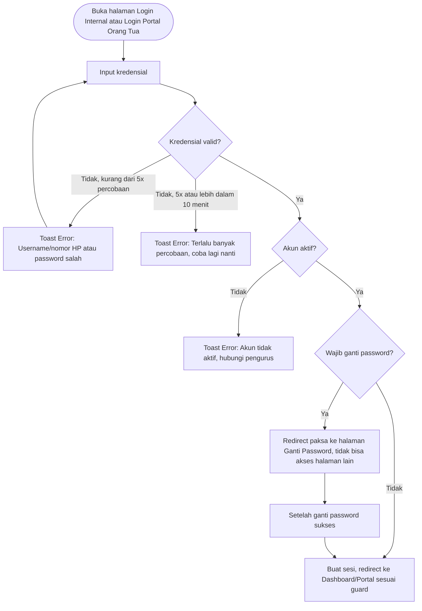

### F-02 — Ganti Password (Wajib & Sukarela)

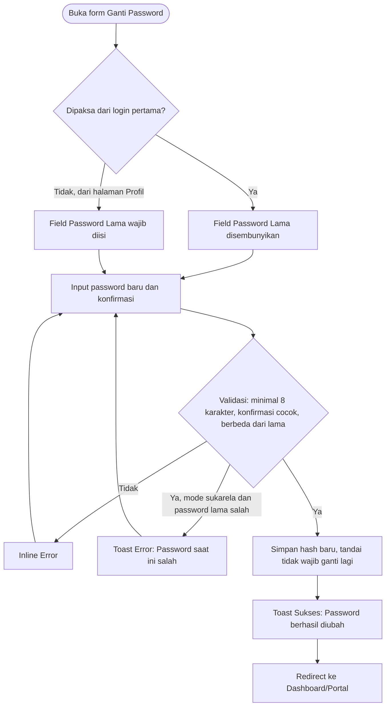

### F-03 — Reset Password oleh Admin

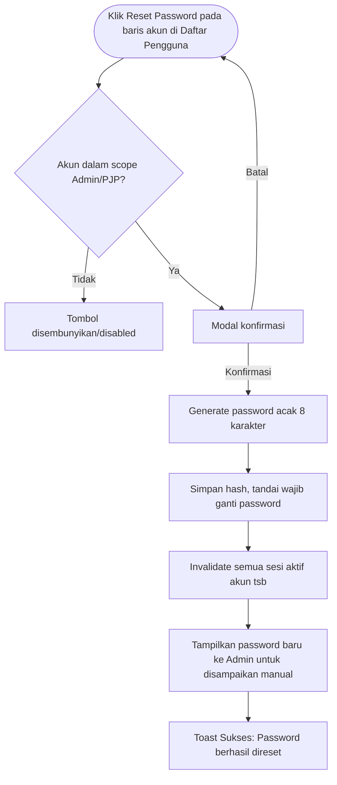

### F-04 — Tambah & Edit Data Generus (termasuk Status Domisili)

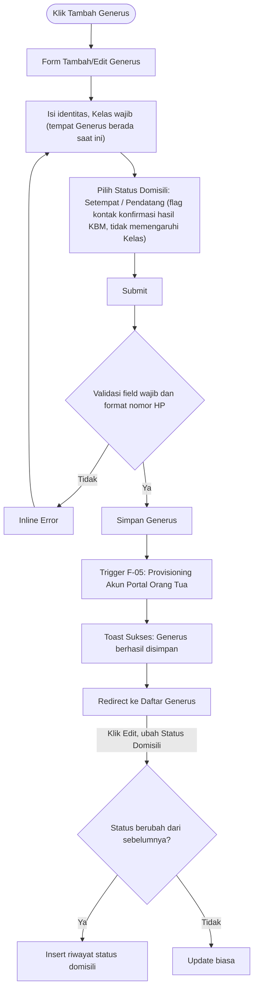

### F-05 — Provisioning Otomatis Akun Portal Orang Tua

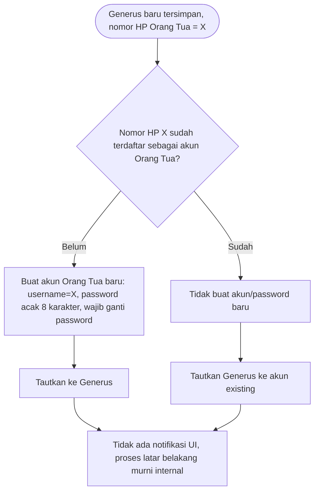

*Catatan untuk desainer: proses ini tidak punya layar sendiri — terjadi otomatis di balik layar setelah F-04. Tidak perlu dibuat mockup terpisah, cukup dipahami sebagai konteks kenapa Portal Orang Tua "sudah langsung ada" tanpa proses pendaftaran.*

### F-06 — Kelola Akun Internal

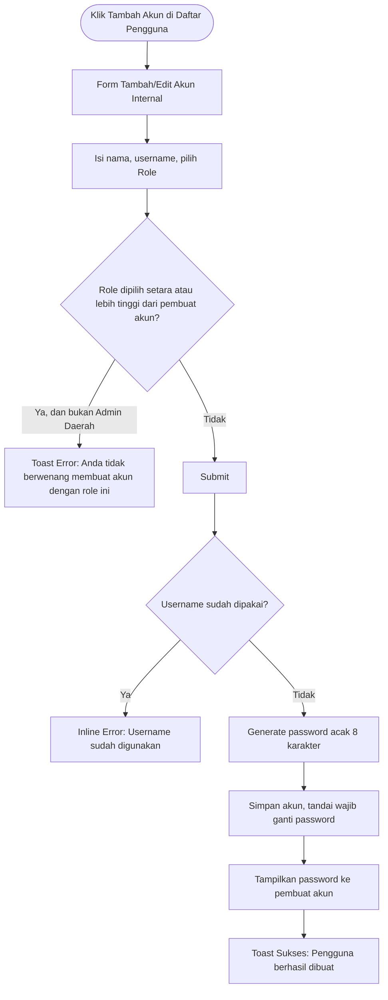

### F-07 — Impor Massal Data Awal

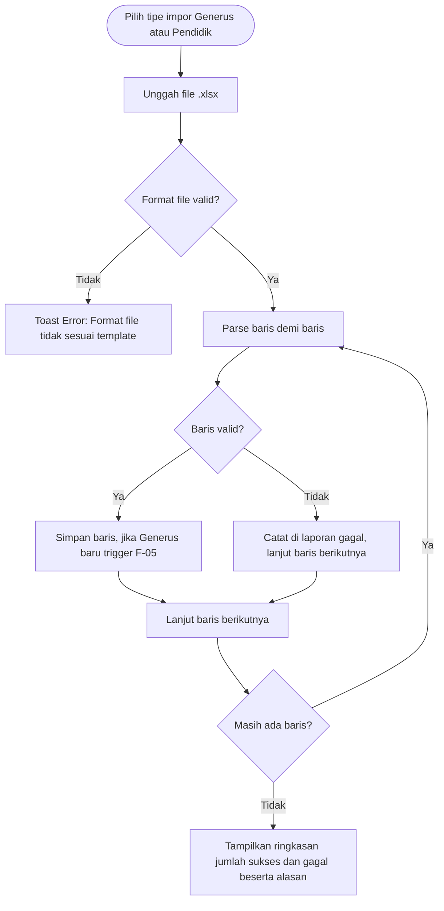

### F-08 — Konfirmasi Realisasi Materi & Input Jurnal Harian

> **Digantikan pasca-konvergensi** — alur ini kini menyatu dengan F-17 (Input Presensi Kegiatan) untuk kejadian `Kegiatan` ber-`kurikulum_kalender_id`. Dipertahankan sebagai catatan historis.

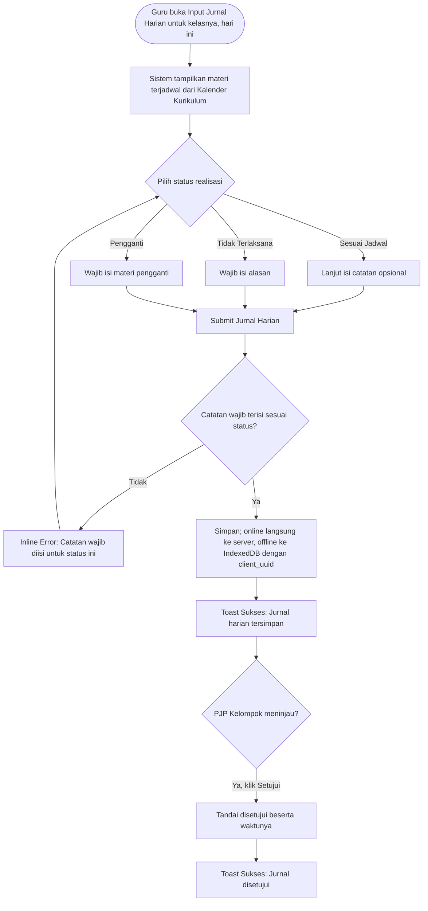

### F-09 — Input Presensi Harian (Online)

> **Digantikan pasca-konvergensi** — presensi KBM reguler kini lewat F-17 (Input Presensi Kegiatan) atas kejadian `Kegiatan` ber-`kurikulum_kalender_id`. Dipertahankan sebagai catatan historis.

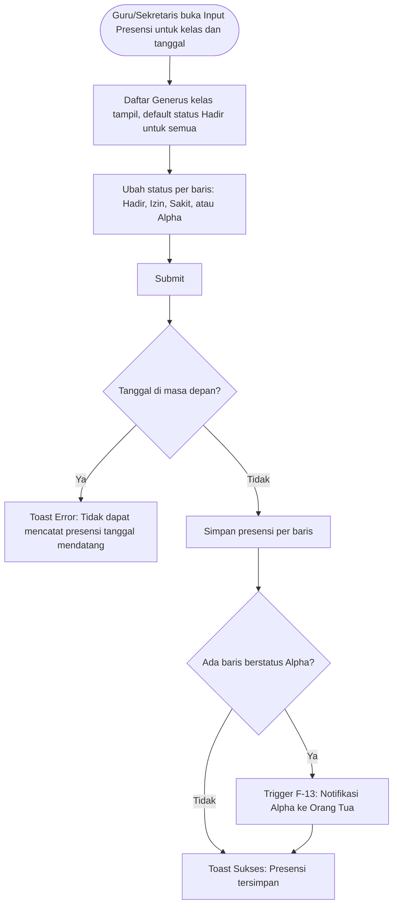

### F-10 — Sinkronisasi Offline

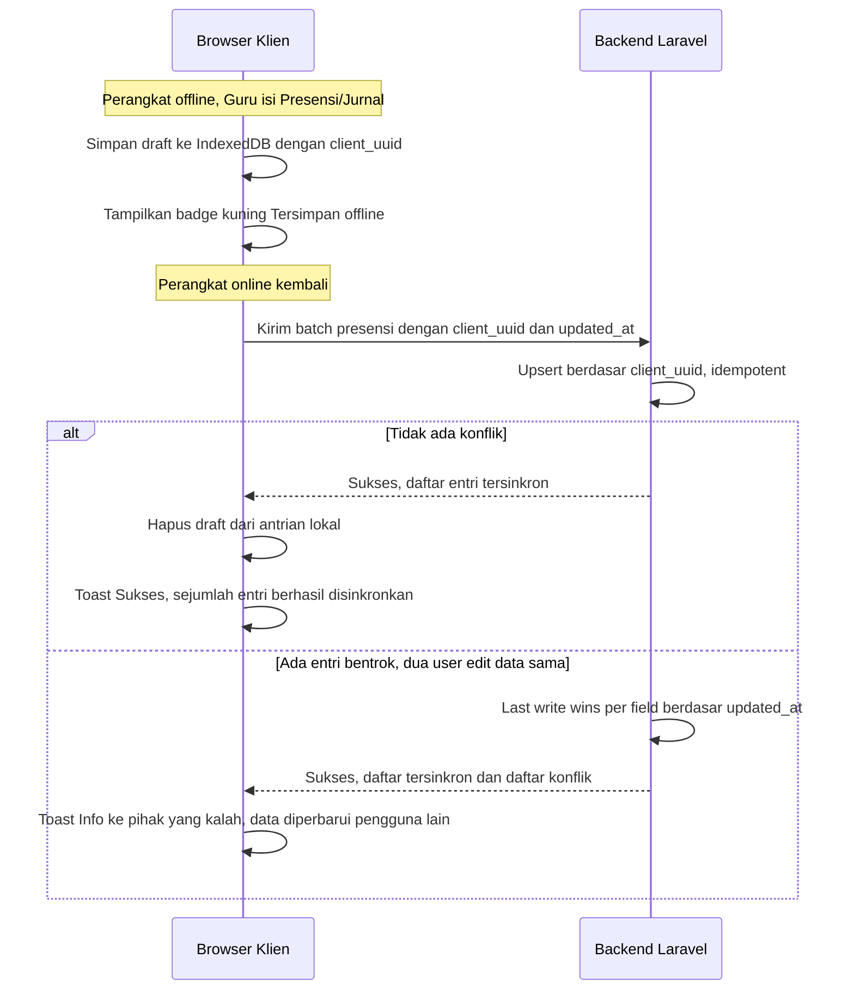

### F-11 — Kelola Musyawaroh & Notulen

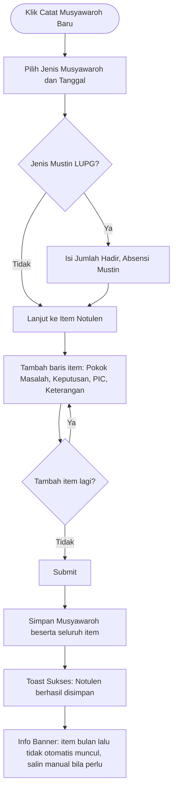

### F-12 — Login & Lihat Data Anak (Portal Orang Tua)

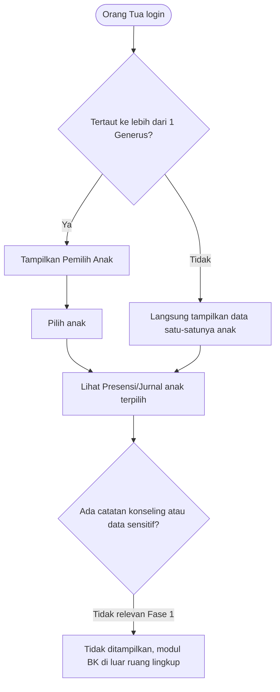

### F-13 — Notifikasi Alpha

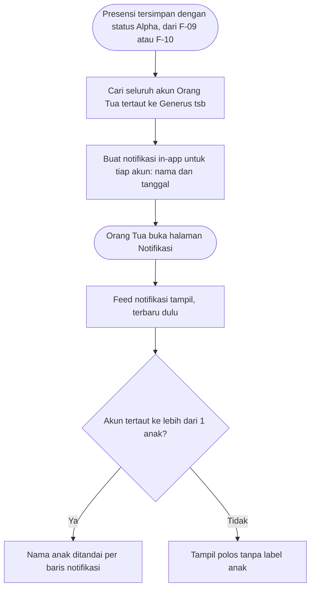

### F-14 — Ekspor Cetak (Print-CSS)

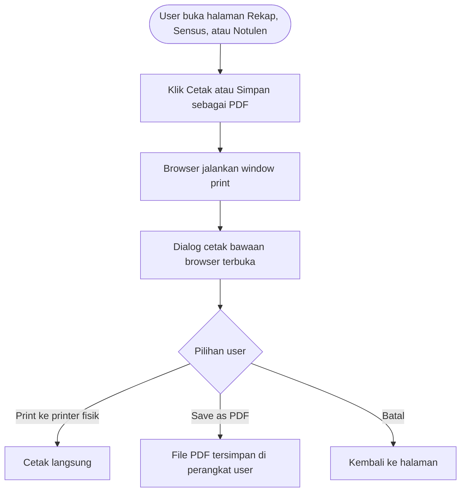

### F-15 — Navigasi & Kontrol Akses Berbasis Role (Ringkasan Lintas Halaman)

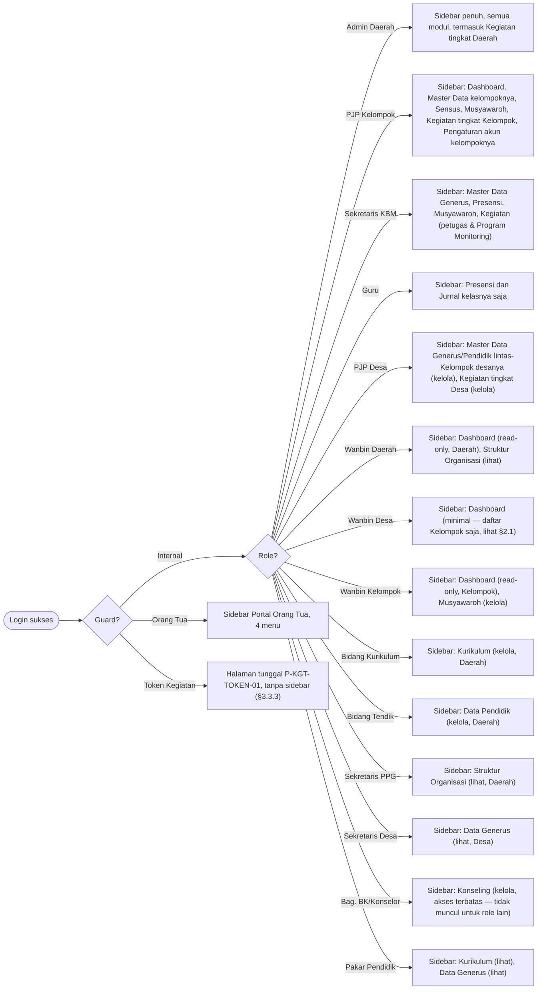

### F-16 — Kelola Kegiatan & Tunjuk Petugas Presensi

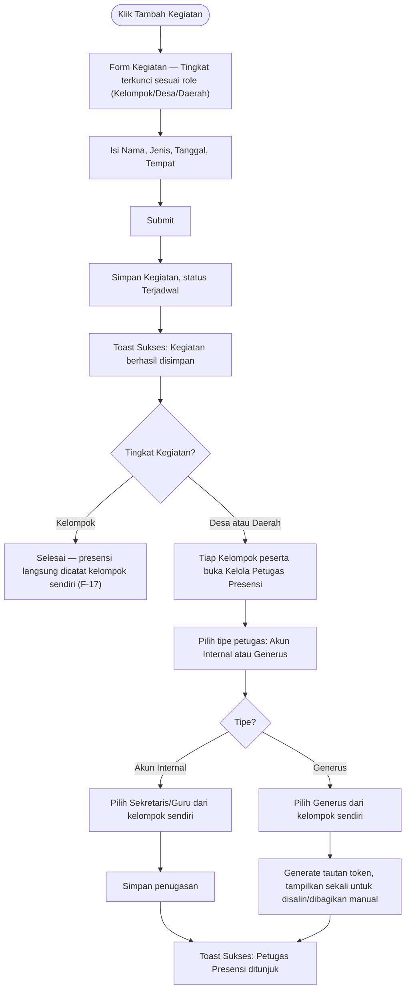

### F-17 — Input Presensi Kegiatan (Sesi Internal & Token Generus)

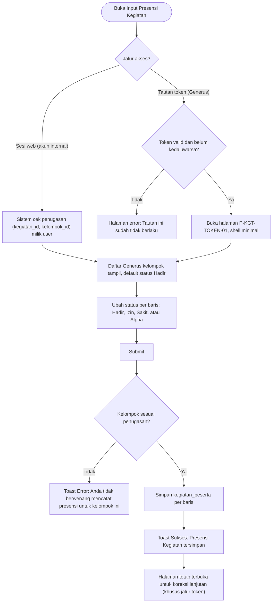

### F-18 — Kelola Program Monitoring

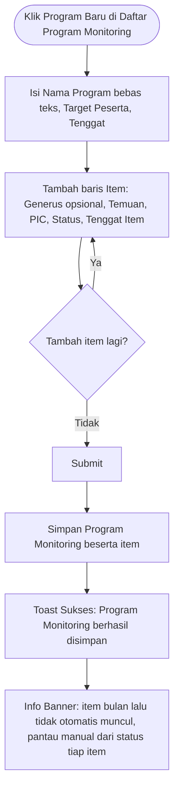

### F-32 — Kelola Catatan Konseling (Bag. BK/Konselor)

> **Penomoran:** melompat dari F-18 ke F-32 karena F-19–F-31 sudah dipakai [UIUX-Reference-Fase-2.md](UIUX-Reference-Fase-2.md#4-flow-aplikasi-mermaid) — ID flow bersifat unik lintas kedua dokumen, bukan per-dokumen (lihat konvensi di [UIUX-Reference-Fase-2 §1](UIUX-Reference-Fase-2.md#1-tujuan--cara-menggunakan-dokumen)).

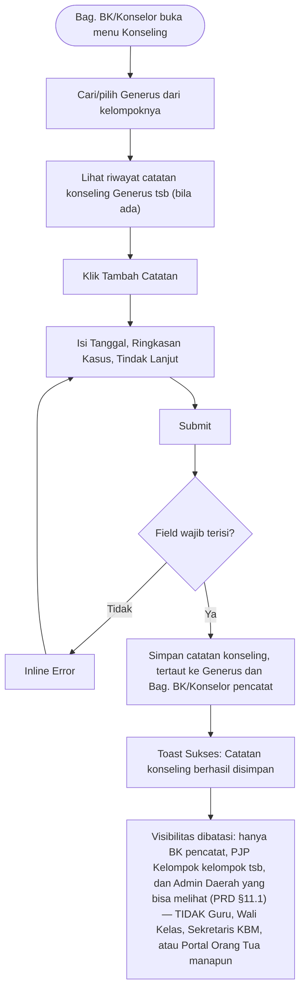

---

## 5. Spesifikasi Field per Halaman

> Tipe input pada kolom **Widget** adalah rekomendasi komponen UI; field detail non-visual (enkripsi, FK, dsb.) ada di SRS — tautan disediakan per bagian.

### P-AUTH-01 — Login Internal

| Field | Widget | Wajib | Catatan |
|-------|--------|:---:|---------|
| Username | Text input | Ya | |
| Password | Password input (toggle show/hide) | Ya | Min 8 karakter |
| — | Teks "Lupa password? Hubungi pengurus Kelompok Anda." | — | **Bukan link** — tidak ada alur self-service (SRS §1.1) |
| — | Tombol "Masuk" | — | Loading state saat submit |

### P-AUTH-02 — Login Portal Orang Tua

| Field | Widget | Wajib | Catatan |
|-------|--------|:---:|---------|
| Nomor HP | Text input (format nomor HP) | Ya | Dipakai sebagai username (SRS §9.18) |
| Password | Password input | Ya | |
| — | Teks "Lupa password? Hubungi Guru/Sekretaris KBM." | — | Sama seperti P-AUTH-01, bukan link |

### P-AUTH-03 / P-PROF-01 — Ganti Password

| Field | Widget | Wajib | Catatan |
|-------|--------|:---:|---------|
| Password Lama | Password input | Kondisional | Disembunyikan bila dipaksa dari login pertama |
| Password Baru | Password input + indikator kekuatan | Ya | Min 8 karakter |
| Konfirmasi Password | Password input | Ya | Harus sama dengan Password Baru |

### P-DASH-01 — Dashboard Kelompok (SRS §14)

| Elemen | Widget | Catatan |
|--------|--------|---------|
| Kartu Ringkasan Kehadiran | Stat card | % kehadiran bulan berjalan |
| Kartu Sensus Terbaru | Stat card + breakdown per kategori | Dari snapshot bulan berjalan (SRS §7) |
| Status Musyawaroh Bulan Ini | Badge per jenis (Sudah/Belum ada notulen) | 4 jenis: Pengurus KBM, 5 Unsur, Pertemuan 5 Unsur, Mustin |
| Reminder Presensi Belum Diisi | List kelas + tombol cepat ke P-PRES-01 | Kelas tanpa entri presensi hari ini |
| Kegiatan Mendatang | List Kegiatan (Kelompok/Desa/Daerah yang diikuti) + status penugasan Petugas Presensi | Tombol cepat ke P-KGT-03 bila Kegiatan Desa/Daerah belum ada petugas ditunjuk |

*Tidak ada widget Sarpras (modul sumbernya masih Fase 2, SRS §14). Widget Kegiatan sudah tersedia sejak Fase 1.*

**Reuse untuk role baru (§2.1):**
- **Wanbin Daerah** — halaman & scope sama seperti Admin Daerah (Daerah penuh), seluruh widget read-only (tombol/aksi kelola apa pun tetap disembunyikan karena Wanbin Daerah tidak punya permission modul lain).
- **Wanbin Kelompok** — halaman & scope sama seperti PJP Kelompok (Kelompok miliknya), read-only.
- **Wanbin Desa** — **bukan** reuse penuh, hanya reuse rute `/dashboard`: kontennya dipangkas jadi satu elemen saja — **Daftar Kelompok di Desa** (nama Kelompok, tanpa kartu statistik apa pun) — sama teks/pola dengan info banner "Dashboard, PJP Desa" yang sudah ada di §6.4. Lihat catatan §2.1 untuk alasan (belum ada modul Desa-scope yang sungguhan tersedia untuknya di Fase 1).

### P-MDATA-01 — Kelola Struktur Organisasi

| Elemen | Widget | Catatan |
|--------|--------|---------|
| Tab Desa / Kelompok / Jenjang / Kelas | Tab navigation | Tab **Jenjang** = katalog global 16 opsi (PAUD_A..GPN_B), tidak terikat Kelompok. Tab **Kelas** = Kelas sungguhan per Kelompok (`rombongan_belajar`), bisa menggabungkan >1 Jenjang |
| Tabel per tab | Data table + tombol Tambah/Edit/Hapus | Hapus Kelas ditolak jika masih ada Generus di Kelas itu (UCIC UC-04) |
| Form Jenjang | Modal — Kode, Label, Urutan, Kategori Usia | Tanpa tombol Hapus (soft-reference, bukan FK — lihat halaman Referensi) |
| Form Kelas | Modal — Nama (bebas, mis. "Kelas ACR A"), Kelompok, Jenjang (checkbox multi-select, min. 1) | |

**Reuse untuk role baru (§2.1):** **Wanbin Daerah** dan **Sekretaris PPG** mendapat akses **lihat saja** di tab Desa/Kelompok/Kelas (Daerah penuh, sama scope Admin Daerah) — sama pola dengan PJP Desa yang sudah lebih dulu lihat-saja di halaman ini; tombol Tambah/Edit/Hapus disembunyikan untuk ketiganya. **Tab Jenjang beda gerbang** — permission `referensi.manage` (Admin Daerah/Sysadmin saja), bukan `struktur-organisasi.*`, jadi PJP Desa/Wanbin Daerah/Sekretaris PPG melihat pesan tidak-ada-akses di tab ini meski punya akses lihat di 3 tab lainnya.

### P-MDATA-02 — Daftar Generus

| Elemen | Widget | Catatan |
|--------|--------|---------|
| Search | Search input (debounce) | Cari nama |
| Filter Status Domisili | Chip filter | Setempat / Pendatang |
| Filter Jenjang | Select | Opsi label Jenjang, sumbernya tabel `kelas` internal (tidak berubah) |
| Tabel | Data table + pagination | Kolom: Nama, Jenjang, Kelompok, Status Domisili (badge), Nama Orang Tua, Nomor HP Orang Tua |
| Tombol "Tambah Generus" | Button | Disembunyikan untuk Guru |
| Klik baris | Navigasi | → P-MDATA-03 (mode edit) |

**Reuse untuk role baru (§2.1):** **Sekretaris Desa** mendapat akses **lihat saja**, scope Desa (lintas-Kelompok di desanya) — reuse persis tampilan multi-Kelompok yang sudah dipakai PJP Desa, minus tombol Tambah/Edit/Hapus. **Pakar Pendidik** mendapat akses **lihat saja**, scope **Daerah** (lintas-Desa/Kelompok, lebih luas dari Sekretaris Desa — lihat catatan §2.1).

### P-MDATA-03 — Form Tambah/Edit Generus

| Field | Widget | Wajib | Catatan |
|-------|--------|:---:|---------|
| Nama | Text | Ya | |
| Tanggal Lahir | Date picker | Ya | |
| Jenis Kelamin | Radio group | Ya | Laki-laki / Perempuan |
| Desa | Select | Kondisional | Khusus Admin Daerah — filter opsi Kelompok di bawah |
| Kelompok | Select | Kondisional | Wajib untuk Admin Daerah & PJP Desa (memfilter opsi Jenjang di bawah ke yang aktif di Kelompok itu); tersembunyi & otomatis untuk PJP Kelompok/Sekretaris KBM |
| Jenjang | Select | Ya | Jenjang Generus saat ini — `kelas_id` di-derive otomatis dari (Kelompok, Jenjang), tidak dipilih manual; terkunci ke Kelompok user bila bukan Admin Daerah/PJP Desa; kosong sampai Kelompok dipilih |
| **Status Domisili** | Toggle/Radio | Ya | Setempat / Pendatang — flag klasifikasi kontak konfirmasi hasil KBM, tidak memengaruhi field Kelas di atas — lihat F-04 |
| Nama Orang Tua | Text | Ya | |
| Nomor HP Orang Tua | Text (format nomor HP) | Ya | Memicu F-05 saat Generus baru |
| Status Aktif | Toggle | Ya | Default aktif |

> **Info banner saat Status Domisili = Pendatang:** "Orang tua tetap bisa memantau dari jarak jauh lewat Portal Orang Tua, atau kontak konfirmasi hasil KBM dapat diwakilkan ke PJP/Guru di Kelompok ini."

### P-MDATA-04 — Daftar Pendidik

| Elemen | Widget | Catatan |
|--------|--------|---------|
| Tabel | Data table | Kolom: Nama, Status (MT/MS badge), Kelompok, Desa, Kelas yang Diampu (chip list) |
| Tombol "Tambah Pendidik" | Button | |

**Reuse untuk role baru (§2.1):** **Bidang Tendik** mendapat akses **kelola penuh**, scope Daerah (sama seperti Admin Daerah tapi hanya modul ini) — satu-satunya modul yang writable untuk role ini.

### P-MDATA-05 — Form Tambah/Edit Pendidik

| Field | Widget | Wajib | Catatan |
|-------|--------|:---:|---------|
| Nama | Text | Ya | |
| Jenis | Radio group | Ya | MT / MS |
| Desa | Select | Kondisional | Khusus Admin Daerah — filter opsi Kelompok di bawah |
| Kelompok | Select | Kondisional | Wajib untuk Admin Daerah & PJP Desa (memfilter opsi Kelas yang Diampu); tersembunyi & otomatis untuk PJP Kelompok |
| Kelas yang Diampu | Multi-select checkbox | Tidak | Bisa lebih dari satu; opsi kosong sampai Kelompok dipilih (Admin Daerah/PJP Desa) |

### P-MDATA-06 — Impor Massal Data Awal

| Field | Widget | Wajib | Catatan |
|-------|--------|:---:|---------|
| Tipe Impor | Radio group | Ya | Generus / Pendidik |
| File | File upload (drag-and-drop) | Ya | .xlsx, max 5 MB |
| — | Tombol "Unduh Template" | — | Membantu user menyiapkan file sesuai format |
| Hasil Impor | Ringkasan card + tabel baris gagal | — | Jumlah sukses/gagal + alasan per baris (lihat F-07) |

### P-SENSUS-01 — Sensus Generus & Pendidik (SRS §7)

| Elemen | Widget | Catatan |
|--------|--------|---------|
| Filter Periode | Month picker | Default bulan berjalan |
| Kartu Ringkasan | Stat card per kategori usia (PAUD-A/PAUD-B/ACR/APR/AR/GPN-A/GPN-B) | Pecahan Setempat vs Pendatang per kartu |
| Rasio Pendidik:Generus | Stat besar | |
| Grafik Tren | Bar/line chart | Bandingkan periode ini vs bulan lalu |
| Tombol "Cetak / Simpan sebagai PDF" | Button | Print-CSS, lihat F-14 |

### P-KUR-01 — Kelola Kalender Kurikulum

> **Digantikan pasca-konvergensi** (lihat [Visi-Konvergensi-Kurikulum-Kegiatan-Presensi.md](Visi-Konvergensi-Kurikulum-Kegiatan-Presensi.md)) — halaman kini `Kurikulum\KelolaKurikulum`: CRUD baris (Jenjang, Tanggal Mulai, Tanggal Selesai, Jenis Materi/Munaqosah, Item Materi, Keterangan) + impor massal dengan template kolom eksplisit, menggantikan upload "10 sheet Bulan" di bawah ini. Mockup di bawah dipertahankan sebagai catatan historis.

| Field | Widget | Wajib | Catatan |
|-------|--------|:---:|---------|
| Jenjang | Select | Ya | 16 opsi (PAUD-A s.d. GPN-B) |
| File | File upload | Ya | .xlsx sesuai struktur 10 sheet "Bulan" |
| — | Info banner | — | "Import ulang jenjang yang sama akan MENGGANTIKAN data lama" |
| Preview Kalender (read-only, semua role termasuk Guru) | Tabel per bulan/hari | — | Untuk Guru: referensi materi terjadwal |

**Reuse untuk role baru (§2.1):** **Bidang Kurikulum** mendapat akses **kelola penuh** (upload/impor kalender), scope Daerah — sama persis dengan Admin Daerah di halaman ini, hanya dibatasi tidak dapat modul lain. **Pakar Pendidik** mendapat akses **lihat saja**, sama seperti Guru saat ini.

### P-PRES-01 — Input Presensi Harian

> **Digantikan pasca-konvergensi** — presensi KBM reguler kini bagian dari `Kegiatan\InputPresensiKegiatan` (kejadian `Kegiatan` ber-`kurikulum_kalender_id`, lihat P-KGT-04), bukan halaman tersendiri. Mockup di bawah dipertahankan sebagai catatan historis.

| Elemen | Widget | Catatan |
|--------|--------|---------|
| Pilih Kelas | Select (terkunci ke kelas diampu untuk Guru) | |
| Tanggal | Date picker | Default hari ini; tidak bisa masa depan |
| Grid Presensi | Tabel: Nama Generus × Status (radio/segmented control Hadir/Izin/Sakit/Alpha per baris) | Default semua Hadir |
| Indikator Offline | Badge — lihat §3.3.2 | |
| Tombol "Simpan" | Button | |

### P-JUR-01 — Input Jurnal Harian Mengajar

> **Digantikan pasca-konvergensi** — realisasi materi (card Materi Terjadwal + Status Realisasi + Catatan) kini bagian dari form yang sama dengan P-KGT-04 (`Kegiatan\InputPresensiKegiatan`) untuk kejadian ber-`kurikulum_kalender_id`, tanpa approval terpisah PJP Kelompok. Mockup di bawah dipertahankan sebagai catatan historis.

| Field | Widget | Wajib | Catatan |
|-------|--------|:---:|---------|
| Materi Terjadwal | Read-only card (dari Kalender Kurikulum) | — | |
| Status Realisasi | Radio group | Ya | Sesuai Jadwal / Tidak Terlaksana / Pengganti |
| Catatan Realisasi | Textarea | Kondisional | Wajib jika Tidak Terlaksana/Pengganti |
| Catatan Guru | Textarea | Tidak | |
| — | Badge "Disetujui oleh {nama PJP}" jika sudah di-approve | — | Read-only, muncul setelah UC-13 approval |
| Indikator Offline | Badge — lihat §3.3.2 | |

### P-PRES-02 — Rekap Presensi & Jurnal Bulanan (Cetak)

| Elemen | Widget | Catatan |
|--------|--------|---------|
| Filter Kelas & Bulan | Select + month picker | |
| Tabel Rekap Presensi | Data table: Nama Generus × Hadir/Izin/Sakit/Alpha (jumlah) × % Kehadiran | |
| Tabel Rekap Jurnal | Data table: Tanggal, Realisasi, Catatan | |
| Tombol "Cetak / Simpan sebagai PDF" | Button | Print-CSS, F-14 |

### P-MUSY-01 — Daftar Musyawaroh

| Elemen | Widget | Catatan |
|--------|--------|---------|
| Filter Tingkat | Chip filter | **Kelompok / Desa / Daerah** — default sesuai scope role (Sekretaris KBM/Wanbin Kelompok→Kelompok, Sekretaris Desa/Wanbin Desa→Desa, Sekretaris PPG/Wanbin Daerah→Daerah), pola sama seperti P-KGT-01 (UCIC-Fase-1 UC-15 diperluas, field `tingkat`) |
| Filter Jenis | Chip filter | 6 jenis (SRS §11) — 4 jenis lama (Kelompok) + **Musyawarah PPD-PPK** (Desa) + **Musyawarah PPG-PPD** (Daerah), baru |
| Tabel | Data table | Kolom: Tanggal, Tingkat (badge), Jenis (badge), Jumlah Item, Jumlah Hadir (khusus Mustin), **Status Pengesahan** (badge — khusus notulen Daerah, lihat P-MUSY-02) |
| Tombol "Catat Musyawaroh Baru" | Button | |

**Reuse untuk role baru (§2.1):** **Wanbin Kelompok** mendapat akses **kelola penuh**, scope Kelompok — sama persis dengan PJP Kelompok/Sekretaris KBM, sesuai perannya memimpin Musyawarah Pengurus KBM/Mustin LUPG. **Wanbin Desa** mendapat akses **kelola penuh**, scope Desa (Musyawarah PPD-PPK) — beda dari PJP Desa yang tidak punya `musyawaroh.manage` sama sekali di Fase 1. **Sekretaris Desa** mendapat akses **kelola penuh** scope Desa juga (notulis, bukan pemimpin). **Wanbin Daerah** & **Sekretaris PPG** mendapat akses **kelola penuh** scope Daerah (Musyawarah PPG-PPD).

### P-MUSY-02 — Form Notulen Musyawaroh (Cetak)

| Field | Widget | Wajib | Catatan |
|-------|--------|:---:|---------|
| Tingkat | Select, terkunci sesuai role | Ya | Kelompok / Desa / Daerah — non-editable, sama pola dengan field Tingkat di P-KGT-02 (F-16) |
| Jenis Musyawaroh | Select, opsi tergantung Tingkat | Ya | Kelompok: Pengurus KBM / 5 Unsur / Pertemuan 5 Unsur / Mustin LUPG. Desa: **Musyawarah PPD-PPK** (baru). Daerah: **Musyawarah PPG-PPD** (baru) |
| Tanggal | Date picker | Ya | |
| Jumlah Hadir | Number input | Kondisional | Khusus Mustin LUPG (Absensi Mustin) |
| Item Notulen (repeatable) | Tabel form dinamis: Pokok Masalah, Keputusan, PIC, Keterangan | Ya (min 1 baris) | Tombol Tambah/Hapus baris |
| — | Info banner | — | "Item bulan lalu tidak otomatis muncul — salin manual bila perlu (fitur carry-over otomatis baru Fase 2)" |
| Tombol "Sahkan" | Button, **hanya tampil untuk Wanbin Daerah** pada notulen Tingkat=Daerah | — | Baru — action `sahkan()` (UCIC-Fase-1 UC-15 diperluas): mengisi `disahkan_oleh`/`disahkan_pada`, mengunci notulen dari edit lebih lanjut, mengubah badge Status Pengesahan di P-MUSY-01 jadi "Disahkan". Mencerminkan kewenangan riil Kyai/Wakil Kyai mengeluarkan keputusan (`Struktur-Organisasi-dan-Role.md` §D), bukan cuma mencatat |
| Tombol "Cetak / Simpan sebagai PDF" | Button | — | Muncul setelah tersimpan; F-14 |

### P-KGT-01 — Daftar Kegiatan

| Elemen | Widget | Catatan |
|--------|--------|---------|
| Filter Tingkat | Chip filter | Kelompok / Desa / Daerah — default sesuai role (PJK→Kelompok, PJD→Desa, AD→semua) |
| Filter Status | Chip filter | Terjadwal / Terlaksana / Tidak Terlaksana |
| Tabel | Data table | Kolom: Nama, Tingkat (badge), Jenis, Tanggal, Tempat, Status (badge) |
| Tombol "Tambah Kegiatan" | Button | Tingkat pada form berikutnya otomatis terkunci sesuai role (F-16) |
| Klik baris | Navigasi | → P-KGT-02 (edit) atau P-KGT-05 (rekap) tergantung status |

### P-KGT-02 — Form Tambah/Edit Kegiatan

| Field | Widget | Wajib | Catatan |
|-------|--------|:---:|---------|
| Nama | Text | Ya | |
| Tingkat | Badge read-only (bukan select) | — | Terkunci sesuai role pembuat — PJK=Kelompok, PJD=Desa, AD=Daerah (UCIC UC-21) |
| Jenis | Select | Ya | Tambahan / Penguatan / Program Khusus / Ekstrakurikuler |
| Tanggal | Date picker | Ya | |
| Tempat | Text | Tidak | |
| Status | Radio group (muncul setelah tersimpan) | — | Terjadwal / Terlaksana / Tidak Terlaksana |

> **Info banner saat Tingkat = Desa/Daerah:** "Setelah Kegiatan disimpan, tiap Kelompok peserta perlu menunjuk Petugas Presensi sendiri — lihat halaman Kelola Petugas Presensi."

### P-KGT-03 — Kelola Petugas Presensi Kegiatan

| Elemen | Widget | Catatan |
|--------|--------|---------|
| Info Kegiatan | Read-only card | Nama, Tingkat, Tanggal |
| Tabel Petugas Ditunjuk | Data table | Kolom: Nama, Tipe (Akun Internal/Generus badge), Status Token (khusus Generus: Aktif/Kedaluwarsa), Aksi Cabut |
| Tombol "Tunjuk Petugas" | Button | Disembunyikan bila Kegiatan bertingkat Kelompok (UCIC UC-22) |
| Form Tunjuk Petugas | Modal — Radio Tipe Petugas (Akun Internal/Generus), Select nama (dibatasi ke kelompok user) | |
| Tautan Token (setelah tunjuk Generus) | Card dengan tombol "Salin Tautan" | Ditampilkan **sekali** — info banner: "Salin dan sampaikan tautan ini secara manual, tidak dapat dilihat ulang" |

### P-KGT-04 — Input Presensi Kegiatan

| Elemen | Widget | Catatan |
|--------|--------|---------|
| Info Kegiatan & Kelompok | Read-only card | Nama Kegiatan, tanggal, nama Kelompok penugasan |
| Grid Presensi | Sama komponen dengan P-PRES-01 (§7.5) | Daftar generus dari kelompok penugasan (lintas kelas), default semua Hadir |
| Tombol "Simpan" | Button | |

*Diakses lewat dua jalur (F-17): sesi web biasa (menu Kegiatan) untuk petugas akun internal, atau P-KGT-TOKEN-01 (§3.3.3) untuk petugas Generus — isi form identik, hanya shell pembungkusnya berbeda.*

### P-KGT-05 — Rekap Kegiatan (Cetak)

| Elemen | Widget | Catatan |
|--------|--------|---------|
| Info Kegiatan | Read-only card | Nama, Tingkat, Tanggal, Tempat |
| Tabel Rekap per Kelompok | Data table: Nama Kelompok × Hadir/Izin/Sakit/Alpha (jumlah) × % Kehadiran | Hanya muncul untuk Kegiatan tingkat Desa/Daerah (lebih dari satu Kelompok peserta) |
| Tabel Rekap Generus | Data table: Nama Generus (dikelompokkan per Kelompok), Status | |
| Tombol "Cetak / Simpan sebagai PDF" | Button | Print-CSS, pola sama F-14 |

### P-PM-01 — Daftar & Kelola Program Monitoring

| Elemen | Widget | Catatan |
|--------|--------|---------|
| Tabel Program | Data table | Kolom: Nama Program (bebas teks), Tenggat, Status (badge), Jumlah Item |
| Tombol "Program Baru" | Button | |
| Form Program (modal/halaman) | Nama Program (text bebas), Target Peserta (textarea), Tenggat (date) | |
| Tabel Item Notulen dinamis | Nama Generus (opsional, select), Temuan (textarea), PIC (text), Status Item (select Belum/Proses/Selesai), Tenggat Item (date) | Tombol Tambah/Hapus baris, sama pola dengan P-MUSY-02 |

### P-KGT-TOKEN-01 — Presensi Kegiatan via Tautan Token

Lihat §3.3.3 untuk tata letak & aturan lengkap. Field form identik dengan P-KGT-04 (Grid Presensi), tanpa app-shell.

### P-KONSEL-01 — Catatan Konseling / Rekam Kasus (Akses Terbatas)

> **Halaman baru** — satu-satunya wireframe benar-benar baru yang ditambahkan untuk role revisi ini (`bk-kbm`, permission `konseling.manage`, PRD §11.1, Fase 1-2 "fitur catatan sederhana"). Lihat F-32 untuk alur lengkap.

| Elemen | Widget | Catatan |
|--------|--------|---------|
| Cari/Pilih Generus | Search input + select | Dibatasi ke Generus di Kelompok milik Bag. BK/Konselor yang login |
| Riwayat Catatan | Data table/List, terbaru dulu | Kolom: Tanggal, Ringkasan singkat, Dicatat oleh |
| Tombol "Tambah Catatan" | Button | |
| Form Catatan | Tanggal (date picker, default hari ini, wajib), Ringkasan Kasus (textarea, wajib), Tindak Lanjut (textarea, wajib) | |
| — | Info banner akses | "Catatan ini hanya terlihat oleh Bag. BK/Konselor, PJP Kelompok, dan Admin Daerah — tidak ditampilkan ke Guru, Wali Kelas, Sekretaris KBM, atau Portal Orang Tua mana pun (PRD §11.1)." |

**Catatan privasi & akses (penting — mohon dikonfirmasi tim produk):**
- Menu **"Konseling" hanya muncul di sidebar untuk role `bk-kbm`, `pjp-kelompok`, dan `admin-daerah`** — disembunyikan total (bukan sekadar disabled) dari role lain, termasuk Guru/Wali Kelas/Sekretaris KBM di Kelompok yang sama, mengikuti prinsip §7.1 (menu tidak relevan disembunyikan sepenuhnya per role).
- Matrix role (`Struktur-Organisasi-dan-Role.md` Catatan Implementasi #2) hanya mendefinisikan permission `konseling.manage` untuk `bk-kbm`. Akses lihat oleh `pjp-kelompok` dan `admin-daerah` di halaman ini berasal dari ketentuan visibilitas PRD §11.1, **bukan** dari daftar permission eksplisit di matrix untuk kedua role tsb — perlu keputusan teknis eksplisit apakah ini diimplementasikan sebagai permission tambahan (mis. `konseling.view`) untuk `pjp-kelompok`/`admin-daerah`, atau sebagai logic akses khusus di luar pola RBAC standar yang dipakai modul lain.
- Tombol Tambah/Edit tetap disembunyikan untuk PJP Kelompok/Admin Daerah bila mereka dimaksudkan hanya **lihat** (bukan `.manage`) — konsisten dengan pola Permission-aware Button §7.5.

### P-USER-01 — Daftar Pengguna

| Elemen | Widget | Catatan |
|--------|--------|---------|
| Tab Akun Internal / Akun Portal Orang Tua | Tab navigation | |
| Tabel Akun Internal | Data table | Kolom: Nama, Username, Role (badge), Kelompok/Desa, Status Aktif (toggle) |
| Tabel Akun Portal Orang Tua | Data table | Kolom: Nomor HP, Jumlah Anak Tertaut, Status Aktif |
| Tombol "Reset Password" per baris | Button (kedua tabel) | Modal konfirmasi — F-03 |
| Tombol "Tambah Akun" | Button | Hanya di tab Akun Internal |

### P-USER-02 — Form Tambah/Edit Akun Internal

| Field | Widget | Wajib | Catatan |
|-------|--------|:---:|---------|
| Nama Lengkap | Text | Ya | |
| Username | Text | Ya | Unik |
| Role | Select | Ya | Dibatasi ke role yang boleh dibuat pembuatnya (F-06) |
| Kelompok | Select | Kondisional | Wajib kecuali role Admin Daerah |
| Desa | Select | Kondisional | Wajib jika role PJP Desa |

### P-USER-03 — Matriks Role & Permission

| Elemen | Widget | Catatan |
|--------|--------|---------|
| Tabel Matriks | Data table (baris = permission, kolom = role) | Sel berisi ikon centang (punya akses) atau strip "—" (tidak) — dibaca langsung dari database, bukan hardcode, lihat UCIC UC-26 |

*Read-only sepenuhnya — tidak ada tombol Tambah/Edit/Hapus, form, atau modal di halaman ini.*

### P-PORTAL-01 — Dashboard / Pemilih Anak

| Elemen | Widget | Catatan |
|--------|--------|---------|
| Pemilih Anak | Lihat §3.3.1 | Disembunyikan jika hanya 1 anak |
| Ringkasan Kehadiran Anak Bulan Ini | Stat card | |
| Ringkasan Materi Terakhir | Card | Materi terjadwal hari ini/terakhir |

### P-PORTAL-02 — Lihat Presensi Anak

| Elemen | Widget | Catatan |
|--------|--------|---------|
| Filter Bulan | Month picker | |
| Tabel Presensi | Data table: Tanggal, Status (badge warna) | Read-only |

### P-PORTAL-03 — Lihat Jurnal Anak

| Elemen | Widget | Catatan |
|--------|--------|---------|
| Filter Bulan | Month picker | |
| Tabel Jurnal | Data table: Tanggal, Materi/Realisasi, Catatan Guru | Read-only |

### P-PORTAL-04 — Notifikasi (Alpha)

| Elemen | Widget | Catatan |
|--------|--------|---------|
| Feed Notifikasi | List, terbaru dulu | Nama anak ditandai per baris jika akun tertaut >1 anak (§3.3.1) |
| Tombol "Tandai Dibaca" | Icon button per baris | |

---

## 6. Notifikasi (Sukses, Gagal, Informasi)

### 6.1 Prinsip Umum

- **Toast Sukses** (hijau, auto-dismiss ±4 detik): konfirmasi aksi berhasil.
- **Toast Gagal** (merah, auto-dismiss atau manual close): error dari backend, mengikuti tabel Kondisi Gagal di UCIC per use case.
- **Info Banner** (biru, persisten dalam konteks halaman/form): penjelasan kondisi yang bukan error.
- **Modal Konfirmasi** (untuk aksi destruktif/tidak reversibel): hapus data, reset password, nonaktifkan akun.
- **Inline Field Error** (merah, di bawah input): kesalahan validasi spesifik per field.
- **Badge Status Sinkronisasi** (khusus P-PRES-01/P-JUR-01): lihat §3.3.2 — bukan toast, tapi indikator persisten.

### 6.2 Katalog Notifikasi Sukses

| Aksi | Pesan |
|------|-------|
| Login berhasil | *(langsung redirect, tanpa toast)* |
| Password berhasil diubah | "Password berhasil diubah." |
| Password berhasil direset (oleh admin) | "Password berhasil direset. Sesi pengguna tersebut telah berakhir." |
| Generus berhasil ditambahkan | "Generus berhasil disimpan." |
| Generus berhasil diedit | "Perubahan data Generus berhasil disimpan." |
| Pendidik berhasil disimpan | "Data Pendidik berhasil disimpan." |
| Akun internal berhasil dibuat | "Pengguna berhasil dibuat." |
| Impor massal selesai | "Impor selesai: {x} baris berhasil, {y} baris gagal." |
| Kalender Kurikulum berhasil diimpor | "Kalender kurikulum {jenjang} berhasil diperbarui." |
| Presensi tersimpan (online) | "Presensi berhasil disimpan." |
| Presensi tersimpan (offline) | *(tanpa toast — badge kuning §3.3.2)* |
| Sinkronisasi offline selesai | "{n} entri berhasil disinkronkan." |
| Jurnal harian tersimpan | "Jurnal harian berhasil disimpan." |
| Jurnal harian disetujui | "Jurnal harian disetujui." |
| Notulen musyawaroh tersimpan | "Notulen berhasil disimpan." |
| Notifikasi ditandai dibaca | *(tanpa toast — perubahan visual langsung)* |
| Kegiatan berhasil disimpan | "Kegiatan berhasil disimpan." |
| Petugas Presensi ditunjuk (akun internal) | "Petugas Presensi berhasil ditunjuk." |
| Petugas Presensi ditunjuk (Generus) | "Petugas Presensi ditunjuk. Salin dan sampaikan tautan berikut secara manual." |
| Penugasan Petugas Presensi dicabut | "Penugasan Petugas Presensi berhasil dicabut." |
| Presensi Kegiatan tersimpan | "Presensi Kegiatan berhasil disimpan." |
| Program Monitoring tersimpan | "Program Monitoring berhasil disimpan." |
| Catatan konseling tersimpan | "Catatan konseling berhasil disimpan." |

### 6.3 Katalog Notifikasi Gagal (dipetakan dari UCIC §Kondisi Gagal tiap UC)

| Konteks | Pesan UI |
|---------|----------|
| Login — kredensial salah | "Username/nomor HP atau password salah." |
| Login — akun tidak aktif | "Akun tidak aktif, hubungi pengurus." |
| Login — rate limit | "Terlalu banyak percobaan, coba lagi nanti." |
| Ganti password — konfirmasi tidak cocok | "Konfirmasi password tidak sama." |
| Ganti password — sama dengan lama | "Password baru harus berbeda dari password lama." |
| Ganti password — password lama salah | "Password saat ini salah." |
| Reset password — di luar scope | "Anda tidak berwenang mereset akun ini." |
| Generus — nomor HP format salah | "Format nomor HP tidak valid." |
| Generus — di luar scope kelompok | "Anda tidak berwenang mengelola Generus ini." |
| Hapus Kelas yang masih dipakai | "Tidak dapat menghapus — masih ada Generus aktif di kelas ini." |
| Akun internal — username dipakai | "Username sudah digunakan." |
| Akun internal — role di luar wewenang | "Anda tidak berwenang membuat akun dengan role ini." |
| Impor — file format salah | "Format file tidak sesuai template." |
| Kalender — struktur sheet salah | "Format file tidak sesuai template kalender kurikulum." |
| Presensi — tanggal masa depan | "Tidak dapat mencatat presensi untuk tanggal yang akan datang." |
| Presensi/Jurnal — di luar scope kelas | "Anda tidak berwenang mengisi data kelas ini." |
| Jurnal — catatan wajib kosong | "Catatan wajib diisi untuk status ini." |
| Jurnal — approval oleh bukan PJP | "Anda tidak berwenang menyetujui jurnal ini." |
| Kegiatan — tingkat di luar wewenang role | "Anda hanya dapat membuat Kegiatan tingkat {Kelompok/Desa} Anda sendiri." |
| Petugas Presensi — Kegiatan tingkat Kelompok | "Kegiatan tingkat Kelompok tidak memerlukan penunjukan Petugas Presensi terpisah." |
| Petugas Presensi — generus/akun di luar kelompok | "Anda hanya dapat menunjuk petugas dari kelompok Anda sendiri." |
| Presensi Kegiatan — tautan token kedaluwarsa | "Tautan ini sudah tidak berlaku. Hubungi pengurus Kelompok Anda." |
| Presensi Kegiatan — kelompok di luar penugasan | "Anda tidak berwenang mencatat presensi untuk kelompok ini." |
| Konseling — di luar wewenang/scope | "Anda tidak berwenang mengakses catatan konseling ini." |
| Umum (server error) | "Terjadi kesalahan pada server. Coba lagi beberapa saat lagi." |

### 6.4 Info Banner Kontekstual

| Konteks | Pesan |
|---------|-------|
| Form Generus, Status Domisili = Pendatang | "Orang tua tetap bisa memantau dari jarak jauh lewat Portal Orang Tua, atau kontak konfirmasi hasil KBM dapat diwakilkan ke PJP/Guru di Kelompok ini." |
| Form Notulen Musyawaroh | "Item bulan lalu tidak otomatis muncul di sini — salin manual bila perlu; fitur carry-over otomatis baru tersedia Fase 2." |
| Login (kedua guard), tanpa link lupa password | "Lupa password? Hubungi pengurus Kelompok Anda." |
| P-PRES-01/P-JUR-01, mode offline | "Anda sedang offline — data tetap tersimpan di perangkat ini dan akan disinkronkan otomatis saat online kembali." |
| Dashboard, PJP Desa | "Fitur ringkasan tingkat Desa akan tersedia pada Fase 2 — saat ini hanya menampilkan daftar Kelompok." |
| P-USER-01, kolom Password | "Password baru ditampilkan sekali saat dibuat/direset — sampaikan langsung ke pengguna, sistem tidak menyimpan salinan yang bisa dilihat ulang." |
| P-KGT-02, Tingkat = Desa/Daerah | "Setelah Kegiatan disimpan, tiap Kelompok peserta perlu menunjuk Petugas Presensi sendiri — lihat halaman Kelola Petugas Presensi." |
| P-KGT-03, setelah tunjuk petugas Generus | "Salin dan sampaikan tautan ini secara manual, tidak dapat dilihat ulang." |
| P-KGT-TOKEN-01, tautan kedaluwarsa | "Tautan ini sudah tidak berlaku. Hubungi pengurus Kelompok Anda untuk tautan baru." |
| P-PM-01, form Program Monitoring | "Item bulan lalu tidak otomatis muncul di sini — pantau manual dari status tiap item; fitur carry-over otomatis baru tersedia Fase 2." |
| P-KONSEL-01, info akses | "Catatan ini hanya terlihat oleh Bag. BK/Konselor, PJP Kelompok, dan Admin Daerah — tidak ditampilkan ke Guru, Wali Kelas, Sekretaris KBM, atau Portal Orang Tua mana pun (PRD §11.1)." |
| Dashboard, Wanbin Desa | "Fitur ringkasan tingkat Desa akan tersedia pada Fase 2 — saat ini hanya menampilkan daftar Kelompok." *(reuse teks banner Dashboard PJP Desa di atas)* |

---

## 7. Elemen Visual (Design System)

### 7.1 Layout & Navigasi

- **App Shell (Aplikasi Internal)**: Sidebar kiri (collapsible) berisi menu sesuai §2.1, Topbar dengan nama user, badge Role, dan dropdown Profil. Menu yang tidak relevan untuk role yang login **disembunyikan**, bukan sekadar disabled, agar sidebar tetap ringkas per role (berbeda dari pola tombol aksi di dalam halaman yang tetap tampil ter-disable — lihat §2.1). Menu **Konseling** (P-KONSEL-01) menerapkan aturan ini paling ketat: bukan sekadar "tidak relevan", tapi sengaja disembunyikan sebagai kontrol privasi data sensitif (PRD §11.1) — pastikan mockup tidak membocorkan keberadaan menu ini (mis. lewat state disabled/abu-abu) ke role di luar `bk-kbm`/`pjp-kelompok`/`admin-daerah`.
- **App Shell (Portal Orang Tua)**: Shell terpisah & lebih sederhana — bottom navigation (mobile-first) atau sidebar tipis dengan 4 menu (§3.2), tanpa badge Role (hanya satu jenis akun).
- **Breadcrumb**: di halaman form (mis. Master Data > Generus > Edit).
- **Page Header**: judul halaman + tombol aksi utama rata kanan.
- **Tab Navigation**: dipakai di P-MDATA-01 (Desa/Kelompok/Kelas) dan P-USER-01 (Akun Internal/Portal Orang Tua).

### 7.2 Komponen Data

- **Data Table**: sortable header, pagination, search bar, empty-state ilustrasi ("Belum ada data"), loading skeleton row.
- **Status Badge**:
  - Presensi: `HADIR` → hijau, `IZIN`/`SAKIT` → kuning/amber, `ALPHA` → merah.
  - Status Domisili: `SETEMPAT` → biru, `PENDATANG` → ungu.
  - Jenis Pendidik: `MT` vs `MS` → warna berbeda untuk pembeda cepat.
  - Role akun: warna berbeda per role (Admin Daerah/PJP Desa/PJP Kelompok/Sekretaris/Guru) di P-USER-01.
  - Tingkat Kegiatan: `KELOMPOK`/`DESA`/`DAERAH` → tiga warna berbeda, dipakai di P-KGT-01/P-KGT-02/P-KGT-05 agar cakupan peserta langsung terbaca tanpa buka detail.
  - Status Kegiatan: `TERJADWAL` → abu-abu/biru, `TERLAKSANA` → hijau, `TIDAK_TERLAKSANA` → merah.
  - Status Item Program Monitoring: `BELUM` → abu-abu, `PROSES` → kuning/amber, `SELESAI` → hijau.
- **Grid Presensi**: komponen khusus (lihat §7.5) — tabel dengan kontrol status per baris, bukan data table biasa.
- **Empty State**: ilustrasi + teks + CTA (mis. "Belum ada Generus — Tambah Sekarang").

### 7.3 Komponen Form

- **Text/Textarea/Password Input** (toggle show/hide + indikator kekuatan untuk password baru).
- **Select**: untuk field referensi (Kelompok, Kelas, Jenjang, Role).
- **Toggle/Radio Group**: Status Domisili (Setempat/Pendatang), Status Realisasi Materi, Jenis Kelamin, Status Aktif.
- **Date Picker / Month Picker**: tanggal presensi/jurnal, filter periode sensus & rekap.
- **File Upload**: drag-and-drop + browse, untuk impor massal & kalender kurikulum (.xlsx), progress bar upload, validasi format/ukuran real-time.
- **Repeatable Form Group**: baris dinamis untuk Item Notulen Musyawaroh (P-MUSY-02).
- **Multi-select Checkbox**: Kelas yang Diampu (Pendidik).

### 7.4 Feedback & Overlay

- **Toast Notification**: 4 varian (sukses/gagal/info/warning), posisi top-right, auto-dismiss dengan opsi manual close.
- **Modal Konfirmasi**: aksi destruktif (hapus, reset password, nonaktifkan akun) — selalu ada tombol Batal + tombol aksi (merah untuk destruktif).
- **Inline Validation Error**: teks merah kecil di bawah field.
- **Loading State**: skeleton loader untuk tabel/kartu, spinner untuk tombol submit.
- **Badge Status Sinkronisasi**: lihat §3.3.2 — khusus komponen offline, persisten (bukan auto-dismiss seperti toast biasa).

### 7.5 Komponen Khusus Domain

- **Grid Presensi**: tabel Nama Generus × kontrol status (segmented button/radio Hadir-Izin-Sakit-Alpha) per baris, dengan opsi "Set semua Hadir" di header kolom untuk mempercepat pengisian (mayoritas anak biasanya hadir).
- **Kartu Materi Terjadwal**: read-only card menampilkan daftar item materi hari itu dari Kalender Kurikulum, dipakai di P-JUR-01.
- **Pemilih Anak (Portal Orang Tua)**: lihat §3.3.1 — dropdown/tab switcher, disembunyikan otomatis jika hanya 1 anak.
- **Badge Status Sinkronisasi Offline**: lihat §3.3.2.
- **Permission-aware Button**: tombol yang otomatis disembunyikan/disabled berdasarkan role & scope (dipakai di hampir semua halaman internal — lihat F-15).
- **Print-Ready Layout**: kelas CSS `@media print` diterapkan pada P-SENSUS-01, P-PRES-02, P-MUSY-02, **P-KGT-05** — `@page { size: landscape; }`, `page-break-after: always` per bagian (SRS §15, F-14). Mockup untuk keempat halaman ini sebaiknya menyediakan dua varian: tampilan layar (dengan navigasi/tombol) dan tampilan cetak (bersih, tanpa elemen UI interaktif).
- **Halaman Akses Token (P-KGT-TOKEN-01)**: bukan komponen re-use, melainkan shell terpisah sendiri — lihat §3.3.3. Tidak memakai app-shell internal maupun Portal Orang Tua, dan tidak boleh menampilkan elemen navigasi apa pun di luar konten presensi Kegiatan itu sendiri.

### 7.6 Ikonografi Modul (untuk Sidebar)

| Modul | Saran Ikon |
|-------|-----------|
| Dashboard | grid/chart |
| Master Data | database/folder |
| Sensus | bar-chart |
| Kurikulum | calendar/book |
| Presensi & Jurnal | clipboard-check |
| Musyawaroh | users/message-square |
| Kegiatan | calendar-heart/party-popper |
| Program Monitoring | list-checks/target |
| Pengaturan | settings/shield |
| Profil | user-circle |
| Portal — Dashboard | home |
| Portal — Presensi | calendar-check |
| Portal — Jurnal | book-open |
| Portal — Notifikasi | bell |
| Konseling | lock/shield-heart |

### 7.7 Responsivitas

Prioritas **mobile-first** — presensi & jurnal harian sering diisi lewat HP di lokasi/masjid dengan konektivitas terbatas (SRS §11.2 PRD, §2 SRS). Prioritaskan:
- Grid Presensi tetap satu kolom & mudah disentuh di layar sempit (bukan tabel lebar yang perlu di-scroll horizontal).
- Data table lain (Generus, Pendidik, Musyawaroh) collapse menjadi card-list di layar sempit.
- Halaman cetak (§7.5) tetap landscape khusus saat benar-benar dicetak, tapi tampilan layar normalnya tetap portrait-friendly di HP.
- Aplikasi harus bisa dipasang sebagai PWA (§18 SRS) — sertakan mockup ikon & splash screen sederhana.
- Portal Orang Tua **wajib** nyaman diakses dari HP — ini adalah kanal akses utama orang tua, bukan sekunder.
- P-KGT-TOKEN-01 (§3.3.3) **wajib** nyaman diakses dari HP tanpa perlu instal PWA — penerimanya (Generus) membuka tautan langsung dari pesan WhatsApp/chat, seringkali sekali pakai, jadi harus ringan dan tidak memaksa instalasi apa pun.

---

*Dokumen ini adalah turunan referensi UI/UX dari [SRS-Fase-1.md](SRS-Fase-1.md) dan [UCIC-Fase-1.md](UCIC-Fase-1.md). Setiap perubahan pada kedua dokumen tersebut (field, alur, atau modul baru) perlu disinkronkan kembali ke sini sebelum tim UI/UX memperbarui mockup.*

**Riwayat Revisi:**

| Versi | Tanggal | Perubahan |
|-------|---------|-----------|
| 1.0 | 29 Juli 2026 | Dokumen awal — Sitemap detail (23 halaman/state), 15 flow Mermaid, spesifikasi field per halaman, katalog notifikasi (sukses/gagal/info), dan inventaris elemen visual/design system, diturunkan dari SRS-Fase-1.md & UCIC-Fase-1.md |
| 1.1 | 30 Juli 2026 | Update jumlah opsi Jenjang (18→15 opsi, P-MDATA-01 & P-KUR-01) sesuai restrukturisasi Menengah 7-9/Lanjutan 10-12; ganti legenda & label role Koordinator PPD/PPK (KPD/KPK)→PJP Desa/PJP Kelompok (PJD/PJK) |
| 1.2 | 30 Juli 2026 | Sederhanakan F-04 & P-MDATA-03 — gabung field "Kelompok Asal"+"Kelas Aktif" jadi satu field "Kelas" (wajib); hapus pesan error/banner yang bergantung pada logika Kelompok Asal, ganti dengan penjelasan peran Status Domisili sebagai flag kontak konfirmasi hasil KBM |
| 1.3 | 30 Juli 2026 | **Modul Kegiatan (SRS §18, UCIC UC-21–UC-25) dipindahkan ke Fase 1** — tambah 6 halaman baru (P-KGT-01–05, P-PM-01) + 1 halaman akses token tanpa akun (P-KGT-TOKEN-01, §3.3.3); tambah kolom Kegiatan & baris PJP Desa aktif di tabel Role (§2.1); tambah F-16–F-18; tambah field spec, katalog notifikasi, badge, dan ikon terkait; total halaman/state naik dari 23 ke 30 |
| 1.4 | 31 Juli 2026 | Update jumlah opsi Jenjang (15→16 opsi, P-MDATA-01 & P-KUR-01) — `PAUD` pecah jadi `PAUD-A`/`PAUD-B`; tambah kartu ringkasan PAUD-A/PAUD-B terpisah di P-SENSUS-01 |
| 1.5 | 31 Juli 2026 | Ganti istilah "Perantauan" → "Pendatang" di seluruh referensi UI (F-04, P-MDATA-01/03, P-SENSUS-01, info banner, legenda badge) |
| 1.6 | 31 Juli 2026 | **PJP Desa dapat akses Master Data (bukan cuma Fase 2)** — update tabel Role §2.1 (kolom Master Data ✅ untuk PJP Desa), sitemap P-MDATA-02/03/04/05 tambah aktor PJD; P-MDATA-03/05 tambah field Desa/Kelompok kondisional untuk Admin Daerah & PJP Desa; P-MDATA-02 & P-MDATA-04 tambah kolom Kelompok/Desa di tabel; update flow F-03 & catatan sidebar PJP Desa |
| 1.7 | 31 Juli 2026 | Jenjang usia kini master data sendiri (teknis backend, tidak mengubah tampilan) — dropdown Jenjang di P-MDATA-01/03/05 & P-KUR-01 tetap 16 opsi yang sama, sumbernya kini tabel `jenjang`, bukan daftar hardcode |
| 1.8 | 31 Juli 2026 | Rename P-MDATA-01 "Kelola Struktur Wilayah" → "Kelola Struktur Organisasi", URL `/master-data/wilayah`→`/master-data/struktur-organisasi`, label sidebar & sitemap ikut berubah; tambah PJP Desa (read-only) ke tag aktor P-MDATA-01 |
| 1.9 | 1 Agustus 2026 | PJP Desa dipastikan mendarat di P-MDATA-01 (bukan Dashboard) setelah login/ganti password — catatan §2.1 diperjelas. **Tambah P-USER-03 — Matriks Role & Permission** (Admin Daerah, read-only) ke sitemap PENGATURAN & spesifikasi field §5 |
| 1.10 | 2 Agustus 2026 | **Tambah UI 9 role baru berstatus Fase 1** hasil revisi model-role (`Struktur-Organisasi-dan-Role.md`, PRD v1.9 §6/§14): `wanbin-daerah`, `wanbin-desa`, `wanbin-kelompok`, `bidang-kurikulum`, `bidang-tendik`, `sekretaris-ppg` (sebagian), `sekretaris-desa` (sebagian), `bk-kbm`, `pakar-pendidik` — landing page & sidebar per role (§2.1, F-15), reuse actor baru di P-DASH-01/P-MDATA-01/P-MDATA-02/P-MDATA-04/P-MDATA-05/P-KUR-01/P-MUSY-01/P-MUSY-02. **Tambah halaman baru P-KONSEL-01 — Catatan Konseling/Rekam Kasus** (`bk-kbm`, akses terbatas sesuai PRD §11.1, tidak terlihat Guru/Sekretaris KBM) beserta flow F-32 dan notifikasi terkait; total halaman naik dari 30 ke 31. 5 role existing (Admin Daerah, PJP Desa, PJP Kelompok, Sekretaris KBM, Guru) tidak diubah. Catatan: Wanbin Desa mendapat Dashboard minimal (bukan agregasi sungguhan) dan `musyawaroh.manage` scope Desa/Daerah (Wanbin Desa/Daerah, Sekretaris PPG/Desa) belum punya UI karena skema `musyawaroh` (SRS-Fase-1 §17.5) masih `kelompok_id`-only — ditandai sebagai gap untuk konfirmasi lanjutan, bukan diselesaikan di revisi ini |
| 1.11 | 2 Agustus 2026 | **Rekonsiliasi lintas-dokumen pasca-integrasi role baru** (menyusul revisi paralel di SRS-Fase-1/2.md, UCIC-Fase-1/2.md): (1) **Gap Musyawaroh Desa/Daerah dari v1.10 sekarang terselesaikan** — UCIC-Fase-1 UC-15 sudah diperluas dengan field `tingkat` + action `sahkan()`, jadi P-MUSY-01/02 diperbarui: filter/field Tingkat (Kelompok/Desa/Daerah), 2 jenis notulen baru (Musyawarah PPD-PPK, Musyawarah PPG-PPD), tombol "Sahkan" khusus Wanbin Daerah; kolom Musyawaroh untuk Wanbin Daerah/Desa & Sekretaris PPG/Desa di tabel §2.1 berubah dari ❌ (gap) jadi ✅. (2) **Scope Pakar Pendidik dikoreksi dari asumsi Kelompok jadi Daerah** (dikonfirmasi via `Struktur-Organisasi-dan-Role.md` §D & konsisten dengan SRS-Fase-1/UCIC-Fase-1) — P-MDATA-02 kini direuse dengan filter Daerah-wide (lintas-Desa), bukan per-Desa. (3) Perbaiki referensi silang basi "UCIC-Fase-2 UC-34" → **UC-36** (§2.1, Dashboard Desa) mengikuti renumbering UCIC-Fase-2.md v1.4 |
| 1.12 | 4 Agustus 2026 | **Tandai P-KUR-01, P-PRES-01, P-JUR-01, F-08, F-09 digantikan** oleh Konvergensi Kurikulum-Kegiatan-Presensi (lihat [Visi-Konvergensi-Kurikulum-Kegiatan-Presensi.md](Visi-Konvergensi-Kurikulum-Kegiatan-Presensi.md), UCIC-Fase-1.md v1.13) — Kelola Kalender Kurikulum kini CRUD rentang tanggal (bukan upload "10 sheet Bulan"); Input Presensi Harian & Jurnal Harian Mengajar tidak lagi halaman terpisah, menyatu ke P-KGT-04/F-17 (Input Presensi Kegiatan) untuk kejadian ber-`kurikulum_kalender_id`. Mockup/flow lama dipertahankan sebagai catatan historis, bukan dihapus atau didesain ulang detail — desain wireframe baru untuk halaman pengganti menyusul terpisah bila dibutuhkan |
| 1.13 | 6 Agustus 2026 | **P-MDATA-01 tambah tab Jenjang, tab Kelas berubah isi jadi CRUD `rombongan_belajar`** (SRS-Fase-1.md v2.1, UCIC-Fase-1.md v1.14) — sitemap jadi "Desa/Kelompok/Jenjang/Kelas" (4 tab); tab **Jenjang** = katalog global (form Kode/Label/Urutan/Kategori Usia, tanpa Hapus), gerbangnya `referensi.manage` beda dari 3 tab lain (`struktur-organisasi.*`) sehingga PJP Desa/Wanbin Daerah/Sekretaris PPG kehilangan akses lihat khusus di tab ini; tab **Kelas** form-nya berubah dari "Nama, Jenjang (select tunggal), Kelompok" jadi "Nama, Kelompok, Jenjang (checkbox multi-select, min. 1)" — satu Kelas kini bisa menggabungkan >1 Jenjang. **P-MDATA-02/03** field/kolom "Kelas" diganti **"Jenjang"** — form Tambah/Edit Generus kini pilih Jenjang langsung (bukan Kelas), `kelas_id` di-derive otomatis di backend. Tidak mengubah P-KGT-04/F-17 (Input Presensi Kegiatan) — tetap per-Jenjang lewat tabel `kelas` lama, tidak terpengaruh Kelas gabungan |
