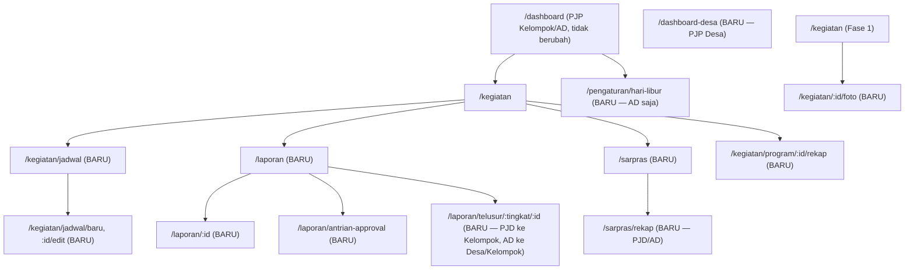
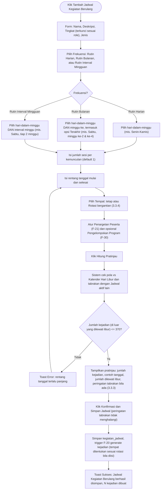
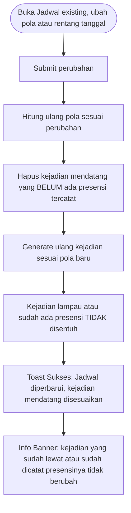
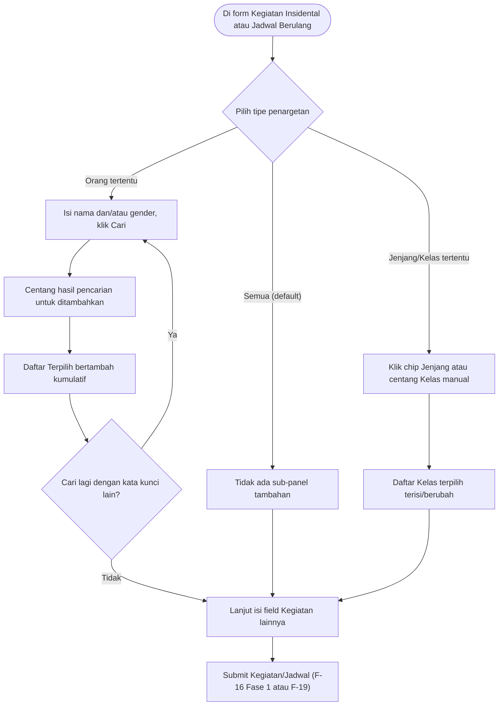
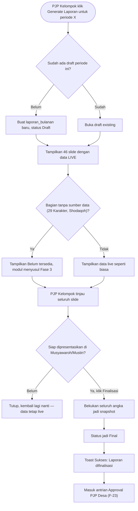
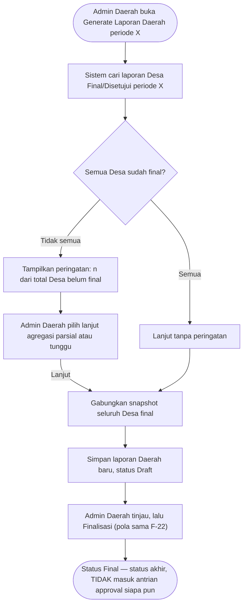
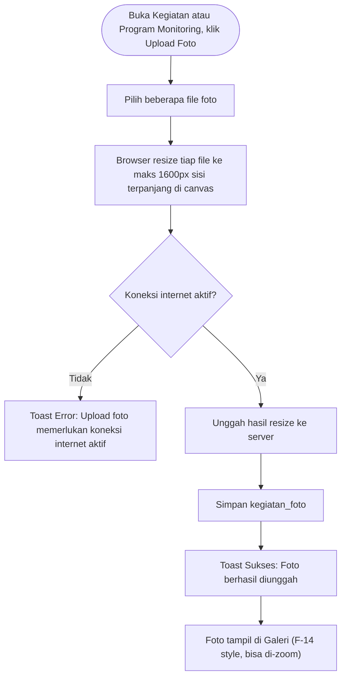
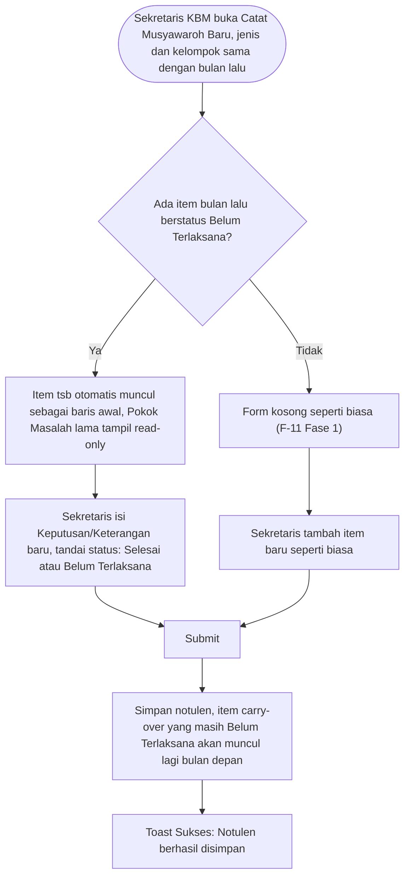
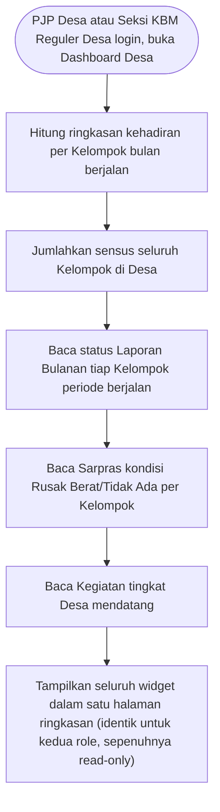
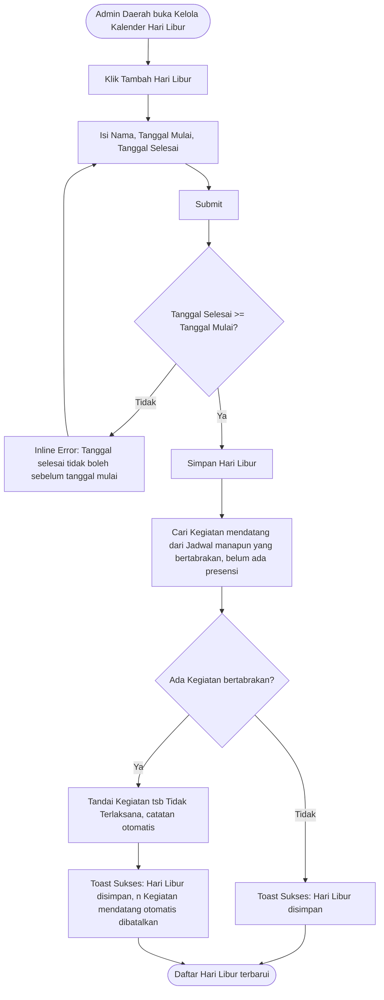

# Referensi UI/UX — SI-PPG Fase 2

**Nama Sistem:** SI-PPG — Sistem Informasi Pembinaan Generus
**Versi Dokumen:** 1.6
**Tanggal:** 12 Agustus 2026
**Status:** Draft
**Klasifikasi:** Internal — Terbatas
**Dokumen Sumber:** [SRS-Fase-2.md](SRS-Fase-2.md), [UCIC-Fase-2.md](UCIC-Fase-2.md)
**Dokumen Terkait:** [UIUX-Reference-Fase-1.md](UIUX-Reference-Fase-1.md)
**Audiens:** Tim UI/UX (pembuatan wireframe & mockup)

---

## Daftar Isi

1. [Tujuan & Cara Menggunakan Dokumen](#1-tujuan--cara-menggunakan-dokumen)
2. [Ringkasan Role & Akses (Perluasan)](#2-ringkasan-role--akses-perluasan)
3. [Sitemap Detail (Halaman Baru)](#3-sitemap-detail-halaman-baru)
4. [Flow Aplikasi (Mermaid)](#4-flow-aplikasi-mermaid)
5. [Spesifikasi Field per Halaman](#5-spesifikasi-field-per-halaman)
6. [Notifikasi (Tambahan Fase 2)](#6-notifikasi-tambahan-fase-2)
7. [Elemen Visual (Tambahan Fase 2)](#7-elemen-visual-tambahan-fase-2)

---

## 1. Tujuan & Cara Menggunakan Dokumen

Dokumen ini **melengkapi** [UIUX-Reference-Fase-1.md](UIUX-Reference-Fase-1.md) — dipakai bersamaan, bukan pengganti. Konvensi ID halaman (`P-<MODUL>-<urutan>`) dan ID flow (`F-<urutan>`) mengikuti pola yang sama; ID baru Fase 2 melanjutkan urutan yang belum dipakai (mis. `F-19` dan seterusnya, karena Fase 1 berakhir di `F-18`) atau membuka prefiks modul baru (`P-LAP-*`, `P-SARPRAS-*`, `P-FOTO-*`) yang belum ada di Fase 1. Dua halaman Fase 1 (`P-KGT-02`, `P-MUSY-02`) mendapat **field tambahan** di Fase 2 — dicatat di §5 sebagai perluasan, bukan halaman baru.

Diturunkan dari [SRS-Fase-2.md](SRS-Fase-2.md) (kebutuhan fungsional & data) dan [UCIC-Fase-2.md](UCIC-Fase-2.md) (kontrak Livewire & aturan bisnis).

---

## 2. Ringkasan Role & Akses (Perluasan)

Tabel ini melengkapi [UIUX-Reference-Fase-1 §2.1](UIUX-Reference-Fase-1.md#21-aplikasi-internal-guard-web) — hanya kolom baru/berubah yang ditampilkan.

| Role | Dashboard Desa | Jadwal Kegiatan Berulang | Laporan Bulanan | Sarpras | Foto Kegiatan | Kalender Hari Libur |
|------|:---:|:---:|:---:|:---:|:---:|:---:|
| Admin Daerah | ❌ *(bukan Desa)* | ✅ (kelola tingkat Daerah) | ✅ (agregasi Daerah; review Laporan Desa; telusuri Laporan Desa/Kelompok individual **— baru**) | ✅ (lihat se-Daerah, kelola master item) | ❌ | ✅ (satu-satunya role yang bisa kelola) |
| PJP Desa | ✅ **(baru — Fase 2)** | ✅ (kelola tingkat Desa) | ✅ (agregasi Desa; review Laporan Kelompok; telusuri Laporan Kelompok individual **— baru**) | ✅ (lihat se-Desa) | ❌ | ❌ *(lihat saja, embedded di F-19/F-20)* |
| PJP Kelompok | ❌ *(tetap Dashboard Kelompok)* | ✅ (kelola tingkat Kelompok) | ✅ (generate & finalisasi Kelompok) | ✅ (kelola kelompoknya) | ✅ | ❌ *(lihat saja)* |
| Sekretaris KBM | ❌ | ❌ *(hanya penargetan di Kegiatan Insidental, bukan Jadwal)* | ❌ | ❌ | ✅ | ❌ |
| Guru | ❌ | ❌ | ❌ | ❌ | ❌ | ❌ |

> **Role baru (revisi model-role, lihat `Struktur-Organisasi-dan-Role.md`):** 3 role baru bertanda Fase 2 di matrix, seluruhnya reuse halaman yang sudah ada di tabel di atas — tidak ada halaman baru yang dibutuhkan.

| Role | Dashboard Desa | Jadwal Kegiatan Berulang | Laporan Bulanan | Sarpras | Foto Kegiatan | Kalender Hari Libur |
|------|:---:|:---:|:---:|:---:|:---:|:---:|
| Bidang Sarpras Daerah (`bidang-sarpras-daerah`) | ❌ | ❌ | ❌ | ✅ (lihat rekap se-Daerah, read-only — akses sama Admin Daerah di P-SARPRAS-02) | ❌ | ❌ |
| Bag. Pembantu Umum (`pembantu-umum-kbm`) | ❌ | ❌ | ❌ | ✅ (kelola per Kelompok — akses sama PJP Kelompok di P-SARPRAS-01) | ❌ | ❌ |
| Seksi KBM Reguler Desa (`seksi-kbm-reguler-desa`) | ✅ *(lihat saja — permission `dashboard-desa.view`, bukan `.manage`)* | ❌ | ❌ | ❌ | ❌ | ❌ |

**Catatan desain penting (role baru):**
- **Seksi KBM Reguler Desa** hanya mendapat `dashboard-desa.view` (bukan `.manage`) — dalam praktik ini tidak mengubah tampilan P-DASH-02 sama sekali, karena halaman itu **sudah 100% read-only** untuk siapa pun (termasuk PJP Desa) sejak awal desainnya. Bedanya murni di scope permission: role ini tidak mendapat `kegiatan.manage`/`kbm-reguler.view` sehingga tombol cepat ke halaman lain di widget Dashboard Desa (mis. ke P-KGT-03 Fase 1) tetap bisa diklik untuk **melihat**, tapi mendarat di halaman yang aksinya ter-disable/hidden sesuai permission aslinya. Cakupan permission `kbm-reguler.view` (monitoring kepatuhan standar KBM se-desa) **sengaja tidak dirancang di revisi ini** — di luar ruang lingkup pembaruan ini, menyusul terpisah.
- **Bidang Sarpras Daerah & Bag. Pembantu Umum** tidak dibatasi lokasi tunggal sesuai kolom Multi-user/lokasi masing-masing di matrix (Bidang Sarpras Daerah: "Tidak" berarti satu akun scope Daerah penuh; Bag. Pembantu Umum: "Ya" berarti bisa lebih dari satu akun aktif per Kelompok, sejalan dengan sifat tugas hariannya yang sering dibagi ke lebih dari satu orang).

**Catatan desain penting (existing, tidak berubah):**
- **PJP Desa kini punya menu Dashboard sendiri** (P-DASH-02) — baris `❌ (fitur Fase 2)` di tabel Role Fase 1 (UIUX-Reference-Fase-1 §2.1) resmi berubah jadi `✅` mulai dokumen ini. Perbarui sidebar mockup PJP Desa (lihat F-15 di Fase 1, kini bertambah item menu Dashboard).
- **Kegiatan Insidental (P-KGT-02, Fase 1) mendapat empat field baru** (Deskripsi, Penargetan Peserta, Pengelompokan Program, peringatan Hari Libur non-blocking) — lihat §5, bukan perubahan akses/role.
- **Petugas Presensi Kegiatan (SRS-Fase-1 §18.2) tidak terpengaruh Fase 2** — grid presensinya kini hanya menampilkan daftar peserta yang sudah dipersempit sesuai penargetan (bila ada), tapi hak akses & alur token tidak berubah sama sekali.
- **Kalender Hari Libur (P-LIBUR-01) hanya dikelola Admin Daerah** — PJP Kelompok/Desa melihat pengaruhnya secara pasif lewat pratinjau generate (F-19) dan pesan pembatalan otomatis (F-29), tidak ada halaman kelola terpisah untuk mereka.

---

## 3. Sitemap Detail (Halaman Baru)

### 3.1 Diagram Navigasi Tambahan



### 3.2 Struktur Halaman Baru (dengan ID & Akses Role)

Melengkapi [UIUX-Reference-Fase-1 §3.2](UIUX-Reference-Fase-1.md#32-struktur-halaman-lengkap-dengan-id--akses-role) — legenda akses sama (**AD**/**PJD**/**PJK**/**SEK**/**GR**/**OT**), ditambah 3 role baru dari revisi model-role: **BSD**=Bidang Sarpras Daerah, **PU**=Bag. Pembantu Umum KBM, **SKR**=Seksi KBM Reguler Desa.

```
📊 DASHBOARD
└── P-DASH-02  Dashboard Desa (Agregasi)                [PJD, SKR (lihat saja)]

🎉 KEGIATAN & PROGRAM MONITORING (tambahan)
├── P-KGT-06   Daftar Jadwal Kegiatan Berulang          [PJK, PJD, AD]
├── P-KGT-07   Form Jadwal Kegiatan Berulang (+pratinjau) [PJK (Kelompok), PJD (Desa), AD (Daerah)]
├── P-KGT-08   Rekap Program Kegiatan (gabungan lintas-tingkat) [PJK, PJD, AD]
└── P-FOTO-01  Upload & Galeri Foto Kegiatan             [PJK, SEK]

📄 LAPORAN BULANAN (baru)
├── P-LAP-01   Daftar/Riwayat Laporan Bulanan            [PJK (Kelompok), PJD (Desa), AD (Daerah — baru)]
├── P-LAP-02   Viewer Laporan Slide 16:9 Interaktif      [PJK, PJD, AD — sesuai tingkat laporan]
├── P-LAP-03   Antrian Approval Laporan                  [PJD (review Kelompok), AD (review Desa)]
└── P-LAP-04   Telusur Laporan Individual Berjenjang (baru) [PJD (ke tiap Kelompok di desanya), AD (ke tiap Desa/Kelompok di daerahnya)]

🛠️ SARANA & PRASARANA (baru)
├── P-SARPRAS-01 Kelola Sarpras (Kelompok)               [PJK, PU]
└── P-SARPRAS-02 Rekap Sarpras (read-only)                [PJD, AD, BSD]

📆 PENGATURAN (tambahan)
└── P-LIBUR-01 Kelola Kalender Hari Libur                [AD]
```

**Halaman Fase 1 dengan field tambahan (bukan ID baru):** `P-KGT-02` (Form Kegiatan — tambah Deskripsi, Penargetan Peserta, Pengelompokan Program, peringatan Hari Libur), `P-MUSY-02` (Form Notulen — tambah tampilan item carry-over), lihat §5.

**Total Fase 2: 11 halaman/state baru + 2 halaman Fase 1 diperluas.**

### 3.3 Pola UI Baru Lintas Halaman

#### 3.3.1 Widget Penargetan Peserta (Jenjang/Kelas & Individu)

Muncul di **P-KGT-02** (Kegiatan Insidental, diperluas) dan **P-KGT-07** (Form Jadwal Kegiatan Berulang) — komponen yang sama persis di kedua tempat (UCIC-Fase-2 UC-29).

```
┌───────────────────────────────────────────────────┐
│ Peserta Kegiatan                                    │
│ ○ Semua generus dalam cakupan (default)             │
│ ○ Jenjang/Kelas tertentu                             │
│ ○ Orang tertentu                                     │
├───────────────────────────────────────────────────┤
│  [jika "Jenjang/Kelas tertentu" dipilih]             │
│  Jalan pintas Jenjang:  [PAUD-A] [PAUD-B] [ACR] ...  │  ← chip multi-select
│  Kelas terpilih (bisa disunting manual):             │
│  ☑ Kelas Dasar 1   ☑ Kelas Dasar 2   ☐ Kelas GPN-A   │
├───────────────────────────────────────────────────┤
│  [jika "Orang tertentu" dipilih]                     │
│  Cari:  [____nama____]  Gender: [Semua ▾]  [Cari]    │
│  Hasil pencarian → centang untuk tambah ke daftar    │
│  Terpilih (12): Ahmad ✕  Fatimah ✕  ...  [+ cari lagi]│
└───────────────────────────────────────────────────┘
```

**Aturan tampilan:**
- Default terpilih "Semua generus dalam cakupan" — dua opsi lain baru menampilkan sub-panel masing-masing setelah dipilih.
- Chip Jenjang bersifat jalan pintas (menambah centang massal ke daftar Kelas), bukan pilihan tersendiri yang disimpan terpisah — setelah diklik, checkbox Kelas di bawahnya langsung tercentang dan bisa disunting manual (dicentang/dihapus satu-satu) sebelum submit.
- Pencarian Individu bersifat kumulatif — mencari lagi dengan kata kunci berbeda **menambah**, bukan mengganti, daftar Terpilih. Setiap orang di daftar Terpilih punya tombol ✕ untuk menghapus dari pilihan.

#### 3.3.2 Badge Status Laporan Bulanan

Muncul di **P-LAP-01, P-LAP-02, P-LAP-03**, dan widget ringkasan di **P-DASH-02**:

| Status | Warna | Makna |
|--------|-------|-------|
| `DRAFT` | Abu-abu | Data masih live, belum difinalisasi |
| `FINAL` | Biru | Sudah dibekukan, menunggu review berjenjang |
| `DISETUJUI` | Hijau | Disetujui approver (PJP Desa untuk laporan Kelompok; Admin Daerah untuk laporan Desa) |
| `REVISI_DIMINTA` | Merah/amber | Ditolak, ada `catatan_revisi` — pembuat perlu merevisi & finalisasi ulang |

#### 3.3.3 Pratinjau Generasi Jadwal Kegiatan Berulang

Muncul di **P-KGT-07** sebelum tombol simpan final (UCIC-Fase-2 UC-28 `hitungPratinjau()`):

```
┌───────────────────────────────────────────┐
│ Pratinjau: pola ini akan menghasilkan       │
│  ✅ 68 Kegiatan                             │
│  dari 3 Agustus 2026 s.d. 12 Desember 2026  │
│  Contoh tanggal: 3, 5, 10, 12, 17 Agu ...    │
│  ⓘ 4 tanggal dilewati karena Hari Libur      │  ← muncul hanya bila jumlah_dilewati_libur > 0
│  ⚠ Ada Jadwal lain dengan pola serupa di     │  ← muncul hanya bila peringatan_tabrakan terisi
│    Kelompok ini pada hari yang sama          │     (non-blocking, tetap bisa lanjut simpan)
├───────────────────────────────────────────┤
│         [ Konfirmasi & Simpan Jadwal ]      │
└───────────────────────────────────────────┘
```

Bila jumlah melebihi 370 (SRS-Fase-2 §2.3), area ini berubah jadi pesan error merah dan tombol konfirmasi disembunyikan — lihat §6. Baris "dilewati karena Hari Libur" dan peringatan tabrakan tidak saling meniadakan — keduanya bisa tampil bersamaan bila relevan.

#### 3.3.4 Builder Rotasi Tempat

Muncul di **P-KGT-07**, sebagai alternatif field Tempat statis (UCIC-Fase-2 UC-28, SRS-Fase-2 §2.7):

```
┌───────────────────────────────────────────┐
│ Tempat                                      │
│ ○ Tempat tetap:  [____________________]     │
│ ○ Rotasi bergantian:                        │
│    1. [ KBM Melati    ] ✕                   │
│    2. [ KBM Kenanga   ] ✕                   │
│    3. [ KBM Mawar     ] ✕                   │
│    [+ Tambah tempat]                        │
│    ⓘ Kejadian berurutan akan memakai tempat  │
│      di atas secara bergantian, berulang     │
│      dari awal setelah daftar habis          │
└───────────────────────────────────────────┘
```

Default terpilih "Tempat tetap". Beralih ke "Rotasi bergantian" menyembunyikan field Tempat tunggal dan menampilkan daftar dinamis (minimal 2 tempat agar rotasi bermakna — divalidasi saat submit).

---

## 4. Flow Aplikasi (Mermaid)

Melanjutkan penomoran dari [UIUX-Reference-Fase-1 §4](UIUX-Reference-Fase-1.md#4-flow-aplikasi-mermaid) (berakhir di F-18).

### F-19 — Kelola Jadwal Kegiatan Berulang & Pratinjau Generate



### F-20 — Regenerasi Jadwal Setelah Diedit



### F-21 — Penargetan Peserta Kegiatan (Jenjang/Kelas & Individu)



### F-22 — Generator Laporan Bulanan (Draft → Final)



### F-23 — Agregasi & Approval Laporan Berjenjang

```mermaid
flowchart TD
    A(["PJP Desa buka Generate Laporan Desa periode X"]) --> B["Sistem cari laporan Kelompok Final/Disetujui periode X di Desa ini"]
    B --> C{"Semua Kelompok sudah final?"}
    C -->|"Tidak semua"| D["Tampilkan peringatan: n dari total Kelompok belum final"]
    C -->|"Semua"| E["Lanjut tanpa peringatan"]
    D --> F["PJP Desa pilih lanjut agregasi parsial atau tunggu"]
    F -->|"Lanjut"| G["Gabungkan snapshot seluruh Kelompok final"]
    E --> G
    G --> H["Simpan laporan Desa baru, status Draft"]
    H --> I["PJP Desa tinjau, lalu Finalisasi (pola sama F-22)"]
    I --> J["Status Final, masuk antrian Approval Admin Daerah"]
    J --> K(["Approver buka Antrian Approval P-LAP-03"))
    K --> L{"Setuju atau Tolak?"}
    L -->|"Setuju"| M["Status jadi Disetujui"]
    L -->|"Tolak"| N["Wajib isi Catatan Revisi"]
    N --> O["Status jadi Revisi Diminta"]
    O --> P["Pembuat merevisi data sumber, finalisasi ulang sebagai versi baru"]
    P --> J
```

**Lanjutan — Agregasi Laporan Daerah (baru, SRS-Fase-2 §3.5):** setelah cukup Desa berstatus Final/Disetujui, Admin Daerah mengagregasi satu tingkat lebih tinggi. Berbeda dari agregasi Desa, siklusnya **berhenti di Final** — tidak ada approver di atas Daerah.



**Penelusuran laporan individual (baru, P-LAP-04, SRS-Fase-2 §3.6):** independen dari alur generate/approval di atas — PJP Desa/Admin Daerah bisa membuka daftar laporan individual jenjang di bawahnya kapan saja (bukan cuma yang berstatus Final menunggu review), navigasi ke P-LAP-02 dalam mode read-only.

### F-24 — Kelola Sarpras

```mermaid
flowchart TD
    A(["PJP Kelompok atau Bag. Pembantu Umum buka Kelola Sarpras"]) --> B["14+ baris item baku tampil, kondisi default Tidak Ada bila belum diisi"]
    B --> C["Pilih baris, ubah Kondisi dan Catatan"]
    C --> D["Simpan per baris (autosave atau tombol Simpan)"]
    D --> E["Toast Sukses: Kondisi Sarpras diperbarui"]
    E --> F(["PJP Desa/Bidang Sarpras Daerah/Admin Daerah buka Rekap Sarpras"))
    F --> G["Lihat agregat Rusak Berat/Tidak Ada per Kelompok se-Desa/Daerah"]
```

### F-25 — Upload Foto Kegiatan



### F-26 — Carry-over Musyawaroh Otomatis



### F-27 — Notifikasi Jadwal Kegiatan ke Portal Orang Tua

```mermaid
flowchart TD
    A(["Job harian berjalan, mis. pukul 18:00"]) --> B["Cari seluruh Kegiatan bertanggal besok, status Terjadwal"]
    B --> C["Untuk tiap Kegiatan: resolusi daftar generus target (Semua/Jenjang-Kelas/Individu)"]
    C --> D["Untuk tiap generus target: cari akun Orang Tua tertaut"]
    D --> E["Buat notifikasi in-app per akun: nama Kegiatan, nama anak, tanggal"]
    E --> F(["Orang Tua buka Notifikasi (P-PORTAL-04, Fase 1)"))
    F --> G["Feed gabungan: Alpha dan Jadwal Kegiatan tampil bersama, terbaru dulu"]
```

### F-28 — Dashboard Desa (Agregasi)



### F-29 — Kelola Kalender Hari Libur & Pembatalan Kegiatan Otomatis (Manual, Admin Daerah)



### F-30 — Rekap Program Kegiatan (Gabungan Lintas-Tingkat)

```mermaid
flowchart TD
    A(["Saat membuat/edit Kegiatan Insidental atau Jadwal Berulang"]) --> B{"Tandai dengan Program?"}
    B -->|"Tidak"| C["Lanjut tanpa Program (default)"]
    B -->|"Ya, Program baru"| D["Isi Nama Program dan Tingkat Tertinggi"]
    B -->|"Ya, Program existing"| E["Pilih dari daftar Program yang sudah ada"]
    D --> F["Kegiatan/Jadwal tertaut ke Program"]
    E --> F
    C --> G["Submit Kegiatan/Jadwal seperti biasa"]
    F --> G
    G --> H(["Kapan saja: buka Rekap Program Kegiatan, pilih Program dan periode"))
    H --> I["Kumpulkan seluruh Kegiatan berbagi Program tsb, lintas Jadwal maupun Insidental"]
    I --> J["Tampilkan agregat kehadiran, dikelompokkan per tingkat/penyelenggara asal"]
```

### F-31 — Sinkronisasi Kalender Hari Libur dari Google Calendar

```mermaid
flowchart TD
    A(["Job bulanan berjalan otomatis (tanpa aksi user)"]) --> B{"API key Google Calendar sudah dikonfigurasi?"}
    B -->|"Tidak"| C["Berhenti tanpa efek — Kalender Hari Libur tetap manual sepenuhnya"]
    B -->|"Ya"| D["Ambil daftar libur nasional dari Google Calendar untuk tahun berjalan dan tahun depan"]
    D --> E{"Untuk tiap event: sudah pernah tersinkron sebelumnya?"}
    E -->|"Belum"| F["Buat baris Hari Libur baru, badge Sumber = Google Calendar"]
    E -->|"Sudah, dan belum pernah disunting manual"| G{"Data berubah dari sisi Google?"}
    G -->|"Ya"| H["Perbarui Nama/Tanggal baris tsb"]
    G -->|"Tidak"| I["Lewati, tidak ada perubahan"]
    E -->|"Sudah, tapi pernah disunting manual atau sudah dihapus Admin"| J["Lewati sepenuhnya — perubahan Admin tidak pernah ditimpa"]
    F --> K["Baris baru/berubah memicu pengecekan Kegiatan mendatang yang bertabrakan (F-29)"]
    H --> K
    K --> L(["Admin Daerah membuka P-LIBUR-01 kapan saja"))
    L --> M["Melihat baris baru dengan badge Sumber = Google Calendar, bisa diedit atau dihapus seperti biasa"]
```

---

## 5. Spesifikasi Field per Halaman

### P-DASH-02 — Dashboard Desa (Agregasi)

| Elemen | Widget | Catatan |
|--------|--------|---------|
| Kartu Ringkasan Kehadiran per Kelompok | Stat card list/grid | Satu kartu kecil per Kelompok, klik untuk drill-down ke Dashboard Kelompok Kelompok tsb |
| Kartu Sensus se-Desa | Stat card + breakdown per kategori | Jumlah seluruh Kelompok di Desa |
| Status Laporan Bulanan per Kelompok | Data table: Kelompok × Status (badge §3.3.2) | Tombol cepat ke P-LAP-03 bila ada yang Final menunggu review |
| Sarpras Kritis per Kelompok | Data table: Kelompok × jumlah item Rusak Berat/Tidak Ada | Tombol cepat ke P-SARPRAS-02 |
| Kegiatan Desa Mendatang | List Kegiatan tingkat Desa + tanggal | Tombol cepat ke P-KGT-03 (Fase 1) bila belum ada Petugas Presensi ditunjuk |

**Reuse untuk role baru (§2):** **Seksi KBM Reguler Desa** mengakses halaman yang sama persis (`dashboard-desa.view`), tanpa perbedaan tampilan — seluruh widget di atas sudah read-only untuk siapa pun. Tombol cepat ke P-LAP-03/P-SARPRAS-02/P-KGT-03 tetap tampil tapi mendarat di halaman yang aksinya ter-disable/hidden sesuai permission role ini (tidak punya `kegiatan.manage`, `sarpras.*`, atau approval laporan).

### P-KGT-06 — Daftar Jadwal Kegiatan Berulang

| Elemen | Widget | Catatan |
|--------|--------|---------|
| Filter Tingkat | Chip filter | Kelompok/Desa/Daerah, default sesuai role |
| Filter Status | Chip filter | Aktif/Nonaktif |
| Tabel | Data table | Kolom: Nama, Frekuensi (badge Harian/Bulanan/Interval Mingguan), Pola (ringkas: "Sen-Kam", "Sabtu mgg ke-2,4", atau "tiap 2 minggu, Sabtu"), Rentang Tanggal, Program (bila ditandai), Status, Jumlah Kejadian |
| Tombol "Tambah Jadwal" | Button | → P-KGT-07 |
| Klik baris | Navigasi | → P-KGT-07 (edit) |
| Tombol "Nonaktifkan" per baris | Button + modal konfirmasi | Tidak menghapus kejadian yang sudah ter-generate |

### P-KGT-07 — Form Jadwal Kegiatan Berulang

| Field | Widget | Wajib | Catatan |
|-------|--------|:---:|---------|
| Nama | Text | Ya | |
| Deskripsi | Textarea | Tidak | |
| Tingkat | Badge read-only | — | Terkunci sesuai role pembuat, sama pola P-KGT-02 |
| Jenis | Select | Ya | Tambahan/Penguatan/Program Khusus/Ekstrakurikuler |
| Frekuensi Tipe | Radio group | Ya | Rutin Harian / Rutin Bulanan / Rutin Interval Mingguan |
| Hari dalam Minggu | Chip multi-select | Ya (min 1) | Senin..Minggu |
| Minggu ke dalam Bulan | Chip multi-select (1-5 + "Terakhir") | Kondisional | Muncul hanya jika Frekuensi = Rutin Bulanan; opsi "Terakhir" terpisah dari angka 1-5 |
| Interval Minggu | Number stepper (min 2) | Kondisional | Muncul hanya jika Frekuensi = Rutin Interval Mingguan, mis. "tiap [2] minggu sekali" |
| Jumlah Sesi per Kemunculan | Number stepper | Tidak | Default 1 |
| Tanggal Mulai / Selesai | Date picker (dua field) | Ya | Selesai harus > Mulai |
| Tempat | Widget §3.3.4 | Tidak | Tempat tetap atau Rotasi bergantian |
| Penargetan Peserta | Widget §3.3.1 | Tidak | Default Semua |
| Pengelompokan Program | Select (Program existing) + tombol "Buat Program Baru" | Tidak | Lihat F-30 |
| Tombol "Hitung Pratinjau" | Button | — | Menampilkan §3.3.3 (termasuk jumlah dilewati Hari Libur & peringatan tabrakan) |
| Pratinjau Hasil | Card (§3.3.3) | — | Muncul setelah klik Hitung Pratinjau |
| Tombol "Konfirmasi & Simpan Jadwal" | Button | — | Disabled sampai pratinjau valid (≤370 kejadian); peringatan tabrakan tidak menonaktifkan tombol ini (non-blocking) |

### P-KGT-02 — Form Tambah/Edit Kegiatan (Perluasan Fase 1)

Field baru ditambahkan ke [UIUX-Reference-Fase-1 P-KGT-02](UIUX-Reference-Fase-1.md#p-kgt-02--form-tambahedit-kegiatan) — field lain (Nama, Tingkat, Jenis, Tanggal, Tempat, Status) tidak berubah:

| Field Baru | Widget | Wajib | Catatan |
|-------|--------|:---:|---------|
| Deskripsi | Textarea | Tidak | Ditempatkan tepat di bawah Nama |
| Penargetan Peserta | Widget §3.3.1 | Tidak | Default Semua — ditempatkan setelah Tempat, sebelum Status |
| Pengelompokan Program | Select (Program existing) + tombol "Buat Program Baru" | Tidak | Sama widget dengan P-KGT-07 |
| Peringatan Hari Libur | Info banner non-blocking, muncul kondisional | — | Tampil bila Tanggal yang diisi termasuk rentang Hari Libur — lihat §6.3 |

### P-KGT-08 — Rekap Program Kegiatan (Gabungan Lintas-Tingkat)

| Elemen | Widget | Catatan |
|--------|--------|---------|
| Filter Program | Select | Daftar Program yang pernah dibuat dalam scope user |
| Filter Periode | Month/range picker | |
| Ringkasan Total | Stat card | Total kehadiran gabungan seluruh Kegiatan bertanda Program ini dalam periode |
| Tabel Rincian | Data table, dikelompokkan per tingkat/penyelenggara asal (subtotal per Kelompok/Desa) | Kolom: Nama Kegiatan, Tanggal, Tingkat, Hadir/Izin/Sakit/Alpha, % Kehadiran |
| Tombol "Cetak / Simpan sebagai PDF" | Button | Print-CSS, pola sama F-14 (Fase 1) |

### P-LIBUR-01 — Kelola Kalender Hari Libur

| Elemen | Widget | Catatan |
|--------|--------|---------|
| Tabel | Data table | Kolom: Nama, Tanggal Mulai, Tanggal Selesai, Sumber (badge Manual/Google Calendar), Aksi (Edit/Hapus) |
| Tombol "Tambah Hari Libur" | Button | Modal/halaman form — hasilnya selalu bersumber Manual |
| Form | Nama (text), Tanggal Mulai (date picker), Tanggal Selesai (date picker) | Selesai boleh sama dengan Mulai (libur satu hari); sama untuk tambah baru maupun edit baris bersumber Google Calendar |
| Info banner saat simpan | — | "{n} Kegiatan mendatang yang bertabrakan otomatis ditandai Tidak Terlaksana" — muncul hanya bila n > 0 |
| Info banner saat edit baris bersumber Google Calendar | — | "Perubahan ini akan dipertahankan — sinkronisasi berikutnya tidak akan menimpanya." |
| Info banner saat hapus baris bersumber Google Calendar | — | "Baris ini disembunyikan dan tidak akan muncul lagi otomatis dari sinkronisasi berikutnya." (soft-delete, beda pesan dari hapus baris Manual yang langsung hilang) |
| Info strip (footer tabel) | Teks kecil, non-intrusive | "Hari libur nasional bisa tersinkron otomatis dari Google Calendar tiap bulan (lihat F-31) — libur internal organisasi tetap perlu ditambahkan manual." |

### P-LAP-01 — Daftar/Riwayat Laporan Bulanan

Untuk PJP Kelompok & PJP Desa, halaman ini menampilkan laporan level mereka sendiri (Kelompok/Desa). **Admin Daerah kini juga mengakses halaman ini (baru)** untuk laporan tingkat Daerah — pola akses sama seperti filter Kelompok di P-SARPRAS-02.

| Elemen | Widget | Catatan |
|--------|--------|---------|
| Filter Periode | Month picker | Default bulan berjalan |
| Tabel | Data table | Kolom: Periode, Versi, Status (badge §3.3.2), Difinalisasi Pada, Aksi |
| Tombol "Generate Laporan" (periode belum ada draft) | Button | → P-LAP-02. Untuk Admin Daerah, men-generate Laporan **Daerah** (agregasi Desa, SRS-Fase-2 §3.5) |
| Klik baris | Navigasi | → P-LAP-02 |
| Riwayat versi (bila > 1) | Expand row / link "Lihat versi sebelumnya" | Menampilkan seluruh `versi` untuk periode yang sama |

### P-LAP-04 — Telusur Laporan Individual Berjenjang (baru)

PJP Desa & Admin Daerah menelusuri (drill-down, read-only) laporan individual jenjang di bawah scope mereka — berbeda dari P-LAP-03 yang hanya menampilkan laporan `FINAL` menunggu review, halaman ini menampilkan **seluruh** laporan individual apapun statusnya (SRS-Fase-2 §3.6).

| Elemen | Widget | Catatan |
|--------|--------|---------|
| Selector entitas | Select/tree: daftar Kelompok (PJP Desa, otomatis ter-scope ke desanya) atau Desa **dan** Kelompok (Admin Daerah, scope Daerah penuh — dua tab/dropdown terpisah) | Pola sama filter Kelompok di P-SARPRAS-02 |
| Tabel riwayat laporan entitas terpilih | Data table | Sama kolom seperti P-LAP-01 (Periode, Versi, Status, Difinalisasi Pada), tanpa tombol "Generate Laporan" — murni read-only |
| Klik baris | Navigasi | → P-LAP-02 (viewer read-only; tombol Setuju/Tolak/Finalisasi disembunyikan kecuali aktor juga berwenang lewat P-LAP-03/generate untuk laporan tsb) |
| Akses masuk | Tombol/link dari P-LAP-01 (mis. "Lihat laporan Kelompok di desa ini") | Bukan item menu sidebar terpisah — dijangkau dari konteks laporan level sendiri |

### P-LAP-02 — Viewer Laporan Slide 16:9 Interaktif

| Elemen | Widget | Catatan |
|--------|--------|---------|
| Navigasi Slide | Panah kiri/kanan + indikator nomor slide (mis. "12/46") | Gaya presentasi, bisa dipresentasikan langsung dari browser (PRD §9.16) |
| Slide Cover | Static | Nama Kelompok/Desa/Daerah, Periode |
| Slide Sensus | Data table + drill-down klik ke profil Generus | |
| Slide Grafik Kehadiran | Chart.js/ApexCharts | Hover untuk detail, filter rentang bulan, toggle kategori |
| Slide 29 Karakter / Shodaqoh | Empty state "Belum tersedia — modul menyusul Fase 3" | Bukan tabel kosong |
| Slide Kegiatan | Data table: Nama, Tanggal, % Kehadiran | Sumber §2 (SRS-Fase-2), termasuk hasil Jadwal Berulang |
| Slide Evaluasi/Resume Musyawaroh | Tabel dengan status carry-over yang bisa diklik untuk lihat rantai histori | Sumber §4 (SRS-Fase-2) |
| Slide Galeri Foto | Grid foto, klik untuk zoom | Sumber §6 (SRS-Fase-2) |
| Badge Status Laporan | Badge §3.3.2 | Pojok atas viewer |
| Tombol "Finalisasi" | Button + modal konfirmasi | Hanya muncul saat status Draft, hanya untuk pembuat laporan. Untuk laporan tingkat Daerah, modal konfirmasi menyebutkan eksplisit "Setelah difinalisasi, laporan ini langsung final — tidak ada tahap review lanjutan" (beda dari Kelompok/Desa yang lanjut ke antrian approval) |
| Tombol "Cetak / Simpan sebagai PDF" | Button | Print-CSS, pola sama F-14 (Fase 1) — tiap slide jadi satu halaman cetak |

### P-LAP-03 — Antrian Approval Laporan

| Elemen | Widget | Catatan |
|--------|--------|---------|
| Tabel Antrian | Data table | Kolom: Kelompok/Desa, Periode, Difinalisasi Pada, Tombol Tinjau |
| Klik "Tinjau" | Navigasi | → P-LAP-02 dengan tombol Setuju/Tolak tambahan di viewer |
| Tombol "Setuju" | Button + modal konfirmasi | |
| Tombol "Tolak / Minta Revisi" | Button + modal dengan Textarea Catatan Revisi (wajib) | |

### P-SARPRAS-01 — Kelola Sarpras (Kelompok)

| Elemen | Widget | Catatan |
|--------|--------|---------|
| Tabel Checklist | Data table, 14+ baris | Kolom: Nama Item, Kondisi (select inline: Baik/Rusak Ringan/Rusak Berat/Tidak Ada), Catatan (text inline), Terakhir Diperbarui |
| Badge Kondisi | Warna per status | Baik=hijau, Rusak Ringan=kuning, Rusak Berat=merah, Tidak Ada=abu-abu |

**Reuse untuk role baru (§2):** **Bag. Pembantu Umum** mendapat akses **kelola penuh**, sama persis dengan PJP Kelompok di halaman ini — sejalan dengan tugas hariannya menjaga sarana pembelajaran & kondisi sarpras kelompok (`Struktur-Organisasi-dan-Role.md` §C). Bisa lebih dari satu akun aktif per Kelompok (multi-user); semua akun yang mengedit baris yang sama mengikuti aturan audit trail standar (PRD §11 poin 5 — siapa & kapan mengubah).

### P-SARPRAS-02 — Rekap Sarpras (Read-only)

| Elemen | Widget | Catatan |
|--------|--------|---------|
| Filter Kelompok (khusus Admin Daerah) | Select | PJP Desa otomatis ter-scope ke desanya |
| Tabel Rekap | Data table: Kelompok × jumlah item per Kondisi | Highlight baris dengan Rusak Berat/Tidak Ada > 0 |

**Reuse untuk role baru (§2):** **Bidang Sarpras Daerah** mendapat akses **lihat saja**, scope Daerah penuh — sama persis dengan tampilan yang dipakai Admin Daerah di halaman ini (termasuk filter Kelompok), sesuai tugasnya merekap ketersediaan sarpras se-Daerah untuk perencanaan pengadaan (PRD §6).

### P-FOTO-01 — Upload & Galeri Foto Kegiatan

| Elemen | Widget | Catatan |
|--------|--------|---------|
| Info Kegiatan/Program Monitoring | Read-only card | Nama, tanggal (bila Kegiatan) |
| Upload | File upload multi-select (drag-and-drop) | Resize otomatis sisi klien sebelum submit (indikator progress per file) |
| Galeri | Grid thumbnail, klik untuk zoom (lightbox) | |

### P-MUSY-02 — Form Notulen Musyawaroh (Perluasan Fase 1)

Field baru ditambahkan ke [UIUX-Reference-Fase-1 P-MUSY-02](UIUX-Reference-Fase-1.md#p-musy-02--form-notulen-musyawaroh-cetak):

| Field Baru | Widget | Wajib | Catatan |
|-------|--------|:---:|---------|
| Item Carry-over (baris awal otomatis) | Card khusus per baris — Pokok Masalah & Keputusan LAMA read-only (abu-abu), field Keputusan/Keterangan BARU editable | — | Muncul otomatis di atas baris kosong biasa, bila ada item Belum Terlaksana bulan lalu |
| Status Tindak Lanjut (per item, termasuk carry-over) | Radio: Selesai / Belum Terlaksana | Ya | Menggantikan field Keterangan bebas teks Fase 1 sebagai penentu carry-over |

> **Info banner diganti** (sebelumnya "fitur carry-over otomatis baru Fase 2" di Fase 1) menjadi: "Item berstatus Belum Terlaksana akan otomatis muncul lagi di notulen bulan depan."

---

## 6. Notifikasi (Tambahan Fase 2)

Melengkapi [UIUX-Reference-Fase-1 §6](UIUX-Reference-Fase-1.md#6-notifikasi-sukses-gagal-informasi).

### 6.1 Katalog Notifikasi Sukses (Tambahan)

| Aksi | Pesan |
|------|-------|
| Jadwal Kegiatan Berulang berhasil disimpan | "Jadwal berhasil disimpan, {n} Kegiatan dibuat." |
| Jadwal Kegiatan Berulang diperbarui | "Jadwal diperbarui, kejadian mendatang telah disesuaikan." |
| Jadwal dinonaktifkan | "Jadwal Kegiatan Berulang dinonaktifkan." |
| Laporan berhasil digenerate (draft) | *(langsung buka viewer, tanpa toast)* |
| Laporan berhasil difinalisasi (Kelompok/Desa) | "Laporan berhasil difinalisasi dan dikirim untuk ditinjau." |
| Laporan Daerah berhasil difinalisasi | "Laporan berhasil difinalisasi." *(tanpa "dikirim untuk ditinjau" — tidak ada approval lanjutan untuk tingkat Daerah)* |
| Laporan disetujui | "Laporan telah disetujui." |
| Laporan ditolak/revisi diminta | "Laporan dikembalikan untuk direvisi." |
| Kondisi Sarpras diperbarui | "Kondisi Sarpras berhasil diperbarui." |
| Foto Kegiatan berhasil diunggah | "{n} foto berhasil diunggah." |
| Notulen dengan item carry-over tersimpan | "Notulen berhasil disimpan." *(sama seperti Fase 1, tanpa pesan tambahan)* |
| Hari Libur berhasil disimpan, tanpa Kegiatan terdampak | "Hari Libur berhasil disimpan." |
| Hari Libur berhasil disimpan, ada Kegiatan terdampak | "Hari Libur berhasil disimpan, {n} Kegiatan mendatang otomatis ditandai Tidak Terlaksana." |
| Program Kegiatan baru dibuat | "Program berhasil dibuat dan Kegiatan/Jadwal ini ditandai ke Program tsb." |
| Hari Libur bersumber Google Calendar diedit manual | "Perubahan disimpan. Sinkronisasi berikutnya tidak akan menimpa baris ini." |

### 6.2 Katalog Notifikasi Gagal (Tambahan)

| Konteks | Pesan UI |
|---------|----------|
| Jadwal — tingkat di luar wewenang role | "Anda hanya dapat membuat Jadwal Kegiatan tingkat {Kelompok/Desa} Anda sendiri." |
| Jadwal — tanggal selesai sebelum/sama dengan mulai | "Tanggal selesai harus setelah tanggal mulai." |
| Jadwal — Rutin Bulanan tanpa minggu-ke dipilih | "Pilih minimal satu minggu-ke (atau Minggu Terakhir) untuk pola Rutin Bulanan." |
| Jadwal — Rutin Interval Mingguan tanpa interval diisi/kurang dari 2 | "Isi interval minggu (minimal 2) untuk pola Rutin Interval Mingguan." |
| Jadwal — hasil pratinjau melebihi batas | "Rentang tanggal terlalu panjang — mohon persempit rentang atau buat Jadwal terpisah per periode." |
| Jadwal — Rotasi Tempat kurang dari 2 tempat | "Isi minimal 2 tempat untuk mode Rotasi bergantian, atau gunakan Tempat tetap." |
| Penargetan — Kelas/Individu di luar cakupan | "Kelas/Generus ini berada di luar cakupan Kegiatan." |
| Penargetan — tipe dipilih tapi daftar kosong | "Pilih minimal satu Kelas/Jenjang." / "Pilih minimal satu Generus." |
| Laporan — finalisasi laporan yang sudah final | "Laporan ini sudah difinalisasi — buat revisi untuk mengubahnya." |
| Laporan — setuju/tolak laporan yang belum final | "Laporan ini belum difinalisasi oleh pembuatnya." |
| Laporan — tolak tanpa catatan | "Catatan revisi wajib diisi." |
| Laporan — setuju/tolak laporan tingkat Daerah | "Laporan tingkat Daerah tidak melalui approval — sudah final begitu difinalisasi pembuatnya." |
| Laporan — telusur (P-LAP-04) Kelompok di luar Desa milik PJP Desa | "Anda tidak berwenang melihat laporan Kelompok ini." |
| Sarpras — ubah data Kelompok lain | "Anda tidak berwenang mengubah data Sarpras kelompok ini." |
| Foto — upload tanpa koneksi | "Upload foto memerlukan koneksi internet aktif." |
| Hari Libur — tanggal selesai sebelum mulai | "Tanggal selesai tidak boleh sebelum tanggal mulai." |
| Hari Libur — bukan Admin Daerah | "Anda tidak berwenang mengelola Kalender Hari Libur." |

### 6.3 Info Banner Kontekstual (Tambahan)

| Konteks | Pesan |
|---------|-------|
| P-KGT-07, sebelum Hitung Pratinjau | "Isi pola dan rentang tanggal, lalu klik Hitung Pratinjau untuk melihat jumlah Kegiatan yang akan dibuat sebelum menyimpan." |
| P-KGT-07/P-KGT-02, Penargetan = Jenjang/Kelas | "Menambah Kelas baru berjenjang sama setelah ini disimpan tidak otomatis ikut tertarget — perlu ditambahkan manual." |
| P-KGT-07, pratinjau ada tanggal dilewati Hari Libur | "{n} tanggal yang cocok pola dilewati karena termasuk Hari Libur." |
| P-KGT-07, pratinjau ada peringatan tabrakan | "Sudah ada Jadwal lain dengan pola serupa di sini pada hari yang sama — Anda tetap bisa melanjutkan bila ini memang disengaja." |
| P-KGT-02, tanggal Kegiatan Insidental termasuk Hari Libur | "Tanggal ini termasuk Hari Libur: {nama}. Anda tetap bisa melanjutkan bila kegiatan ini memang sengaja diadakan saat libur." |
| P-LAP-02, status Draft | "Data pada laporan ini masih live dan akan berubah mengikuti data terbaru sampai Anda menekan Finalisasi." |
| P-LAP-02, slide tanpa sumber data (29 Karakter/Shodaqoh) | "Belum tersedia — modul ini menyusul di Fase 3." |
| P-LAP-01/P-DASH-02, agregasi Desa dengan Kelompok belum final | "{n} dari {total} Kelompok di Desa ini belum finalisasi laporan periode ini." |
| P-LAP-01, agregasi Daerah dengan Desa belum final | "{n} dari {total} Desa belum finalisasi laporan periode ini." |
| P-MUSY-02, item carry-over | "Item ini dibawa dari notulen bulan lalu karena masih berstatus Belum Terlaksana." |
| P-FOTO-01 | "Foto akan dikompres otomatis sebelum diunggah — pastikan koneksi internet aktif." |
| P-LIBUR-01, menghapus Hari Libur yang sudah pernah membatalkan Kegiatan | "Menghapus Hari Libur ini tidak mengembalikan Kegiatan yang sebelumnya sudah otomatis dibatalkan." |
| P-LIBUR-01, footer tabel | "Hari libur nasional bisa tersinkron otomatis dari Google Calendar tiap bulan (lihat F-31) — libur internal organisasi tetap perlu ditambahkan manual." |
| P-LIBUR-01, menghapus baris bersumber Google Calendar | "Baris ini disembunyikan dan tidak akan muncul lagi otomatis dari sinkronisasi berikutnya." |

---

## 7. Elemen Visual (Tambahan Fase 2)

Melengkapi [UIUX-Reference-Fase-1 §7](UIUX-Reference-Fase-1.md#7-elemen-visual-design-system) — konvensi dasar (App Shell, Data Table, Toast, dsb.) tidak berubah.

### 7.1 Status Badge (Tambahan)

- **Status Laporan Bulanan**: `DRAFT` → abu-abu, `FINAL` → biru, `DISETUJUI` → hijau, `REVISI_DIMINTA` → merah/amber (§3.3.2).
- **Kondisi Sarpras**: `BAIK` → hijau, `RUSAK_RINGAN` → kuning, `RUSAK_BERAT` → merah, `TIDAK_ADA` → abu-abu.
- **Frekuensi Jadwal Kegiatan**: `HARIAN` vs `BULANAN` vs `MINGGUAN_INTERVAL` → tiga warna berbeda, dipakai di P-KGT-06.
- **Status Jadwal**: `AKTIF` → hijau, `NONAKTIF` → abu-abu.
- **Status Carry-over Item Musyawaroh**: `SELESAI` → hijau, `BELUM_TERLAKSANA` → kuning/amber (dipakai di P-MUSY-02 dan slide Evaluasi/Resume di P-LAP-02).
- **Status Kegiatan hasil pembatalan otomatis**: `TIDAK_TERLAKSANA` akibat Hari Libur tetap memakai badge merah standar (SRS-Fase-1/UIUX-Fase-1 §7.2) — bedanya cukup terlihat dari `catatan_status` yang tampil saat hover/klik baris, bukan warna badge terpisah.
- **Sumber Hari Libur**: `MANUAL` → abu-abu netral, `OTOMATIS_GOOGLE` → biru dengan ikon kalender kecil (dipakai di P-LIBUR-01) — sekadar penanda asal data, tidak memengaruhi kemampuan edit/hapus (keduanya tetap bisa diubah Admin Daerah).

### 7.2 Komponen Khusus Domain (Tambahan)

- **Widget Penargetan Peserta**: lihat §3.3.1 — dipakai P-KGT-02 & P-KGT-07, satu komponen re-use.
- **Kartu Pratinjau Generasi Jadwal**: lihat §3.3.3 — khusus P-KGT-07, kini juga menampilkan jumlah dilewati Hari Libur & peringatan tabrakan.
- **Builder Rotasi Tempat**: lihat §3.3.4 — khusus P-KGT-07.
- **Viewer Slide 16:9**: navigasi ala presentasi (panah/klik nomor), dipakai P-LAP-02 — beda dari Data Table/Card biasa, perlu direncanakan sebagai komponen tersendiri oleh tim UI/UX (bukan reuse layout halaman lain).
- **Print-Ready Layout (tambahan)**: P-LAP-02 kini juga memakai `@media print` dengan `page-break-after: always` **per slide** (46 halaman cetak), bukan per bagian rekap seperti Fase 1 (SRS-Fase-1 §15) — beri perhatian khusus ke performa render saat mockup diuji cetak (46 slide grafik interaktif sekaligus). Rekap Program (P-KGT-08) memakai print-CSS yang sama seperti rekap lain (F-14 Fase 1).
- **Galeri Foto dengan Zoom**: grid thumbnail + lightbox, dipakai P-FOTO-01 dan slide Galeri Foto di P-LAP-02.

### 7.3 Ikonografi Modul (Tambahan)

| Modul | Saran Ikon |
|-------|-----------|
| Dashboard Desa | building/map-pin |
| Jadwal Kegiatan Berulang | repeat/calendar-sync |
| Laporan Bulanan | file-bar-chart/presentation |
| Sarana & Prasarana | wrench/box |
| Foto Kegiatan | image/camera |
| Kalender Hari Libur | calendar-x/palm-tree |
| Program Kegiatan (Rekap Gabungan) | layers/git-merge |

### 7.4 Responsivitas (Tambahan)

- **P-LAP-02 (Viewer Slide 16:9)** adalah satu-satunya halaman Fase 2 yang secara desain **landscape-first** bahkan di layar — beda dari prinsip mobile-first Fase 1 (UIUX-Reference-Fase-1 §7.7) — karena tujuannya memang dipresentasikan (mis. dari laptop/proyektor saat Mustin). Tetap sediakan mode scroll/zoom per slide untuk dibuka dari HP (mis. PJP Desa meninjau cepat dari perjalanan), tapi tata letak utama dioptimalkan landscape.
- **Widget Penargetan Peserta (§3.3.1)** dengan daftar Terpilih yang panjang (individu) harus collapse jadi list scrollable di layar sempit, bukan memperpanjang halaman form tanpa batas.

---

*Dokumen ini adalah turunan referensi UI/UX dari [SRS-Fase-2.md](SRS-Fase-2.md) dan [UCIC-Fase-2.md](UCIC-Fase-2.md), melengkapi [UIUX-Reference-Fase-1.md](UIUX-Reference-Fase-1.md). Setiap perubahan pada kedua dokumen Fase 2 tersebut perlu disinkronkan kembali ke sini sebelum tim UI/UX memperbarui mockup.*

**Riwayat Revisi:**

| Versi | Tanggal | Perubahan |
|-------|---------|-----------|
| 1.0 | 1 Agustus 2026 | Dokumen awal — 9 halaman/state baru (P-DASH-02, P-KGT-06/07, P-LAP-01/02/03, P-SARPRAS-01/02, P-FOTO-01) + 2 halaman Fase 1 diperluas (P-KGT-02, P-MUSY-02), 10 flow Mermaid baru (F-19–F-28), spesifikasi field, katalog notifikasi, dan elemen visual tambahan, diturunkan dari SRS-Fase-2.md & UCIC-Fase-2.md |
| 1.1 | 1 Agustus 2026 | Tambah 2 halaman baru (P-KGT-08 Rekap Program Kegiatan, P-LIBUR-01 Kelola Kalender Hari Libur) + 2 flow baru (F-29, F-30), sesuai SRS-Fase-2.md v1.1/UCIC-Fase-2.md v1.1 (UC-37–UC-39); perluas P-KGT-06/07 (Frekuensi Rutin Interval Mingguan, opsi "Minggu Terakhir", Builder Rotasi Tempat §3.3.4, Pengelompokan Program) dan P-KGT-02 (Pengelompokan Program, peringatan Hari Libur); perluas Kartu Pratinjau Generasi Jadwal §3.3.3 (jumlah dilewati libur, peringatan tabrakan non-blocking); tambah baris Admin Daerah/Kalender Hari Libur ke tabel Role §2; update katalog notifikasi §6 & ikonografi §7.3; total halaman naik dari 9 ke 11 |
| 1.2 | 1 Agustus 2026 | Tambah flow F-31 (Sinkronisasi Kalender Hari Libur dari Google Calendar) sesuai SRS-Fase-2.md v1.2/UCIC-Fase-2.md v1.2 (UC-40); perluas P-LIBUR-01 (kolom Sumber, info banner edit/hapus baris bersumber Google Calendar, footer info sinkronisasi); tambah badge Sumber Hari Libur ke §7.1; update katalog notifikasi §6 |
| 1.3 | 1 Agustus 2026 | Sinkronkan referensi UC-26–UC-39 → UC-27–UC-40 mengikuti renumbering UCIC-Fase-2.md v1.3 (UCIC-Fase-1.md menambah UC-26 Kelola Matriks Role & Permission) — perubahan murni referensi, tidak ada perubahan tampilan/flow |
| 1.4 | 2 Agustus 2026 | **Tambah UI 3 role baru berstatus Fase 2** hasil revisi model-role (`Struktur-Organisasi-dan-Role.md`, PRD v1.9 §6/§14): `bidang-sarpras-daerah` (lihat saja di P-SARPRAS-02, sama akses Admin Daerah), `pembantu-umum-kbm` (kelola penuh di P-SARPRAS-01, sama akses PJP Kelompok), `seksi-kbm-reguler-desa` (lihat saja di P-DASH-02 lewat `dashboard-desa.view`, sama tampilan PJP Desa). Tidak ada halaman baru — seluruhnya reuse P-DASH-02/P-SARPRAS-01/P-SARPRAS-02 yang sudah ada; update §2 (tabel Role Perluasan), §3.2 (legenda & actor tag), §5 (catatan reuse per halaman), F-24 & F-28 (aktor tambahan). Cakupan `kbm-reguler.view` milik `seksi-kbm-reguler-desa` sengaja tidak didesain di revisi ini (di luar ruang lingkup) |
| 1.5 | 2 Agustus 2026 | Perbaiki 3 referensi silang basi ke UCIC-Fase-2 (§3.3.2/§3.3.4 Rotasi Tempat & Penargetan Peserta) yang masih memakai nomor UC lama — UC-27→28, UC-28→29 — mengikuti renumbering UCIC-Fase-2.md v1.4 (dipicu penambahan UC-27 baru di UCIC-Fase-1.md untuk `bk-kbm`); ditulis paralel dengan revisi role Fase 2 di v1.4 sehingga belum tersinkron saat itu, sekarang disamakan — perubahan murni referensi, tidak ada perubahan tampilan/flow |
| 1.6 | 12 Agustus 2026 | **Tambah halaman P-LAP-04 Telusur Laporan Individual Berjenjang (baru)** dan perluas P-LAP-01 untuk Admin Daerah — permintaan fitur baru, dimajukan dari rencana awal Fase 4 (PRD v1.12 §14, SRS-Fase-2.md v1.7 §3.5/§3.6, UCIC-Fase-2.md v1.5 UC-32): Admin Daerah kini men-generate Laporan Daerah (agregasi Desa) lewat P-LAP-01, dengan siklus Finalisasi yang **berhenti di Final** (tidak ada approval lanjutan, beda dari Kelompok/Desa); PJP Desa & Admin Daerah menelusuri (read-only) laporan individual Kelompok/Desa di scope-nya lewat P-LAP-04 tanpa dibatasi status antrian approval. Update §2 (tabel Role, kolom Laporan Bulanan), §3.1/§3.2 (sitemap, struktur halaman), §4/F-23 (flowchart agregasi Daerah + penelusuran), §5 (P-LAP-01/02/04), §6 (notifikasi sukses/gagal baru) |
